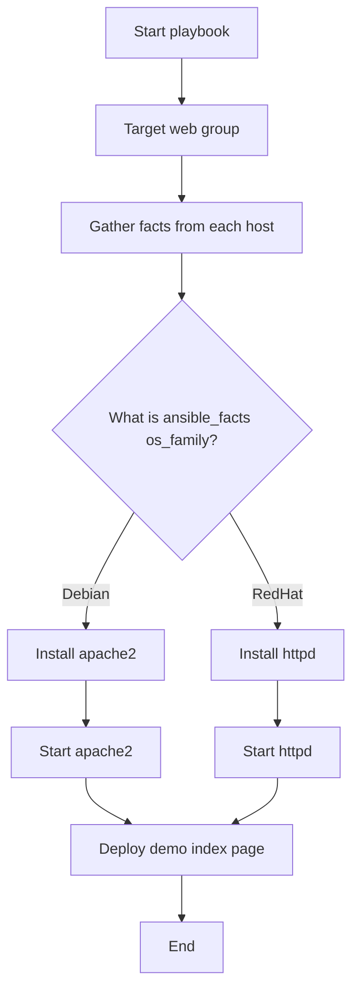

# Bonus Lab: Conditions with Ansible Facts

> This bonus lesson teaches how to use Ansible facts with `when` conditions.
> It also explains the common issues we hit in the lab and how to avoid them.

---

## Goal

In this lab, we want Ansible to make decisions based on the operating system family.

The same playbook targets both Ubuntu-based and Rocky/RHEL-based hosts.

Ansible should do this:

```text
Ubuntu/Debian hosts -> install and start apache2
Rocky/RHEL hosts    -> install and start httpd
```

The playbook uses Ansible facts to decide which task should run.

---

## Definition

A **condition** tells Ansible:

```text
Run this task only if this statement is true.
```

In Ansible, conditions usually use the `when` keyword.

Example:

```yaml
when: ansible_facts['os_family'] == "Debian"
```

This means:

```text
Run this task only when the host belongs to the Debian OS family.
```

---

## Important Concept: Facts

Ansible facts are system details gathered from the managed host.

Examples:

```text
ansible_facts['os_family']
ansible_facts['distribution']
ansible_facts['hostname']
ansible_facts['memtotal_mb']
```

In this lab:

```text
Ubuntu containers report OS family as Debian.
Rocky/RHEL containers report OS family as RedHat.
```

That is why the playbook checks for:

```yaml
when: ansible_facts['os_family'] == "Debian"
```

and:

```yaml
when: ansible_facts['os_family'] == "RedHat"
```

---

## Workflow Diagram



---

## Diagram Explanation

The playbook starts by targeting the `web` group.

The `web` group includes both:

```text
ubuntu_web
rhel_web
```

Then Ansible gathers facts from every host.

Once facts are collected, Ansible checks the value of:

```yaml
ansible_facts['os_family']
```

If the value is `Debian`, Ansible runs the Ubuntu/Debian tasks.

If the value is `RedHat`, Ansible runs the Rocky/RHEL tasks.

Tasks that do not match the condition are skipped.

This is expected behavior.

---

## Lab Inventory Reminder

The lab inventory should include groups like this:

```text
ubuntu_web
  container1
  container2
  container3

rhel_web
  rhel1
  rhel2
  rhel3

web
  ubuntu_web
  rhel_web
```

The `conditions.yml` playbook targets:

```yaml
hosts: web
```

So Ansible must be able to find the `web` group in the inventory.

---

## Very Important: Run from the Correct Directory

Run this lab from:

```bash
cd ~/bootcamp/lab
```

Then run:

```bash
ansible-playbook playbooks/conditions.yml
```

Do **not** run it from:

```text
~/bootcamp
```

Do **not** run it from:

```text
~/bootcamp/lab/playbooks
```

Why?

Because `ansible.cfg` is located here:

```text
~/bootcamp/lab/ansible.cfg
```

Ansible automatically loads `ansible.cfg` from the current directory.

If you run from the wrong folder, you may see this error:

```text
[WARNING]: No inventory was parsed, only implicit localhost is available
[WARNING]: Could not match supplied host pattern, ignoring: web
skipping: no hosts matched
```

That means Ansible did not find the inventory file.

---

## Correct Commands

From the lab directory:

```bash
cd ~/bootcamp/lab
```

Confirm Ansible sees the inventory:

```bash
ansible-inventory --graph
```

You should see groups like:

```text
web
ubuntu_web
rhel_web
linux
```

Run the conditions playbook:

```bash
ansible-playbook playbooks/conditions.yml
```

Run against one host first if you want a smaller test:

```bash
ansible-playbook playbooks/conditions.yml --limit container1
```

Run against only Ubuntu/Debian hosts:

```bash
ansible-playbook playbooks/conditions.yml --limit ubuntu_web
```

Run against only Rocky/RHEL hosts:

```bash
ansible-playbook playbooks/conditions.yml --limit rhel_web
```

---

## Playbook Used in This Lab

File:

```text
lab/playbooks/conditions.yml
```

```yaml
---
# Bonus Lab: OS family condition example
#
# This playbook teaches Ansible conditions using facts.
#
# The main idea:
# Ansible gathers facts from each managed host.
# Then we can use those facts to decide which task should run.
#
# Example:
# - Ubuntu/Debian hosts should install apache2.
# - Rocky/RHEL hosts should install httpd.

- name: Bonus - install web server based on OS family
  hosts: web
  become: true
  gather_facts: true

  tasks:
    # Show the OS family that Ansible detected.
    # This helps students understand where the condition value comes from.
    - name: Show detected OS family
      ansible.builtin.debug:
        msg: "{{ inventory_hostname }} OS family is {{ ansible_facts['os_family'] }}"

    # This task runs only on Debian-family systems.
    # Ubuntu belongs to the Debian OS family in Ansible facts.
    - name: Install Apache on Ubuntu/Debian hosts
      ansible.builtin.apt:
        name: apache2
        state: present
      when: ansible_facts['os_family'] == "Debian"

    # This task runs only on RedHat-family systems.
    # Rocky Linux, RHEL, and CentOS belong to the RedHat OS family.
    - name: Install Apache/httpd on Rocky/RHEL hosts
      ansible.builtin.dnf:
        name: httpd
        state: present
      when: ansible_facts['os_family'] == "RedHat"

    # Start Apache on Ubuntu/Debian hosts.
    - name: Start Apache service on Ubuntu/Debian hosts
      ansible.builtin.service:
        name: apache2
        state: started
        enabled: true
      when: ansible_facts['os_family'] == "Debian"

    # Start httpd on Rocky/RHEL hosts.
    - name: Start httpd service on Rocky/RHEL hosts
      ansible.builtin.service:
        name: httpd
        state: started
        enabled: true
      when: ansible_facts['os_family'] == "RedHat"

    # Deploy a simple page on all hosts.
    # This task has no condition because /var/www/html works for both groups in this lab.
    - name: Deploy OS condition demo page
      ansible.builtin.copy:
        dest: /var/www/html/index.html
        content: |
          Created by Ansible condition demo.
          Host: {{ inventory_hostname }}
          OS Family: {{ ansible_facts['os_family'] }}
          Distribution: {{ ansible_facts['distribution'] }}
        owner: root
        group: root
        mode: "0644"
```

---

## Expected Output

For Ubuntu/Debian hosts, you should see:

```text
container1 OS family is Debian
container2 OS family is Debian
container3 OS family is Debian
```

For Rocky/RHEL hosts, you should see:

```text
rhel1 OS family is RedHat
rhel2 OS family is RedHat
rhel3 OS family is RedHat
```

When the playbook reaches the Ubuntu task, RedHat hosts should be skipped:

```text
skipping: [rhel1]
skipping: [rhel2]
skipping: [rhel3]
```

When the playbook reaches the RedHat task, Ubuntu hosts should be skipped:

```text
skipping: [container1]
skipping: [container2]
skipping: [container3]
```

That means the condition is working.

---

## How to Show Facts Manually

Show the OS family for all web hosts:

```bash
ansible web -m setup -a "filter=ansible_os_family"
```

Show distribution facts:

```bash
ansible web -m setup -a "filter=ansible_distribution*"
```

Show all facts for one host:

```bash
ansible container1 -m setup
```

---

## How to Verify Packages

Ubuntu/Debian hosts use `dpkg`.

```bash
ansible ubuntu_web -m shell -a 'dpkg -s apache2 | grep -E "Package|Status|Version"' --become
```

Rocky/RHEL hosts use `rpm`.

```bash
ansible rhel_web -m shell -a 'rpm -q httpd' --become
```

One command for both OS families:

```bash
ansible web -m shell -a 'if command -v dpkg >/dev/null 2>&1; then echo "Debian family detected"; dpkg -s apache2 | grep -E "Package|Status|Version"; elif command -v rpm >/dev/null 2>&1; then echo "RedHat family detected"; rpm -q httpd; fi' --become
```

---

## How to Verify the Web Page

For web labs, the best test is usually HTTP.

Run:

```bash
ansible web -m shell -a 'curl -s http://localhost'
```

You should see output similar to:

```text
Created by Ansible condition demo.
Host: container1
OS Family: Debian
Distribution: Ubuntu
```

or:

```text
Created by Ansible condition demo.
Host: rhel1
OS Family: RedHat
Distribution: Rocky
```

---

## Common Issue 1: No Inventory Was Parsed

Error:

```text
[WARNING]: No inventory was parsed, only implicit localhost is available
[WARNING]: Could not match supplied host pattern, ignoring: web
skipping: no hosts matched
```

Cause:

```text
You ran the command from the wrong directory.
```

Fix:

```bash
cd ~/bootcamp/lab
ansible-playbook playbooks/conditions.yml
```

Alternative fix from repo root:

```bash
cd ~/bootcamp
ansible-playbook -i lab/inventories/inventory.ini lab/playbooks/conditions.yml
```

---

## Common Issue 2: systemctl Fails in Ubuntu Containers

You may see:

```text
System has not been booted with systemd as init system.
Failed to connect to bus: Host is down
```

This happens because the Ubuntu containers in this lab may not be running full systemd as PID 1.

That does not mean Apache failed.

It means this command is not valid for those containers:

```bash
systemctl status apache2
```

Use this instead:

```bash
ansible ubuntu_web -m shell -a 'service apache2 status || pgrep -a apache2' --become
```

Or use the best functional test:

```bash
ansible ubuntu_web -m shell -a 'curl -s http://localhost'
```

---

## Common Issue 3: apt Cache Slowness

If the Ubuntu task hangs for a long time, avoid using:

```yaml
update_cache: true
```

For this lab, keep the task simple:

```yaml
ansible.builtin.apt:
  name: apache2
  state: present
```

This avoids spending time refreshing apt cache during class.

---

## Hands-On Walkthrough

### Step 1: Move to the lab folder

```bash
cd ~/bootcamp/lab
```

### Step 2: Confirm inventory

```bash
ansible-inventory --graph
```

### Step 3: Show OS facts

```bash
ansible web -m setup -a "filter=ansible_os_family"
```

### Step 4: Run the playbook on one Ubuntu host

```bash
ansible-playbook playbooks/conditions.yml --limit container1
```

### Step 5: Run the playbook on one Rocky/RHEL host

```bash
ansible-playbook playbooks/conditions.yml --limit rhel1
```

### Step 6: Run the playbook on all web hosts

```bash
ansible-playbook playbooks/conditions.yml
```

### Step 7: Verify the web page

```bash
ansible web -m shell -a 'curl -s http://localhost'
```

---

## Hands-On Lab

### Task

Run the conditions playbook and prove that:

```text
Ubuntu/Debian hosts ran only the Debian tasks.
Rocky/RHEL hosts ran only the RedHat tasks.
```

### Commands

```bash
cd ~/bootcamp/lab
ansible-playbook playbooks/conditions.yml
```

Then verify packages:

```bash
ansible ubuntu_web -m shell -a 'dpkg -s apache2 | grep -E "Package|Status|Version"' --become
ansible rhel_web -m shell -a 'rpm -q httpd' --become
```

Then verify HTTP:

```bash
ansible web -m shell -a 'curl -s http://localhost'
```

### Expected Result

Ubuntu/Debian hosts should show Apache package information for `apache2`.

Rocky/RHEL hosts should show package information for `httpd`.

All hosts should return the demo page from `curl`.

---

## Quiz

1. What keyword does Ansible use for conditions?

   * A. `if`
   * B. `when`
   * C. `condition`
   * D. `match`

2. What OS family does Ubuntu usually report in Ansible facts?

   * A. Ubuntu
   * B. Linux
   * C. Debian
   * D. RedHat

3. What OS family does Rocky Linux usually report in Ansible facts?

   * A. Rocky
   * B. RedHat
   * C. CentOSOnly
   * D. RPM

4. Why did `systemctl status apache2` fail in the Ubuntu containers?

   * A. Apache was not installed
   * B. The inventory was missing
   * C. The containers were not running systemd as PID 1
   * D. Ansible cannot manage services

5. What is the safest folder to run lab commands from?

   * A. `~/bootcamp`
   * B. `~/bootcamp/lab`
   * C. `~/bootcamp/lab/playbooks`
   * D. `~/bootcamp/images`

---

<details>
<summary>Instructor answer key</summary>

1. **B** — `when`
2. **C** — Debian
3. **B** — RedHat
4. **C** — The containers were not running systemd as PID 1
5. **B** — `~/bootcamp/lab`

</details>

---

## Key Takeaways

```text
Conditions let Ansible make decisions.
Facts provide the data used in those decisions.
Ubuntu usually maps to the Debian OS family.
Rocky/RHEL usually maps to the RedHat OS family.
Skipped tasks are expected when conditions do not match.
Always run lab commands from bootcamp/lab.
Do not rely on systemctl inside every container.
Use curl as the best functional test for web service labs.
```
