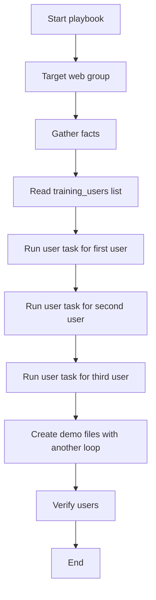

# Bonus Lab: Loops in Ansible

> This bonus lesson teaches how to use loops in Ansible so one task can repeat across multiple items.

---

## Goal

The goal of this lab is to understand why loops are useful.

Without loops, if you want to create three users, you may write three separate tasks.

With loops, you write one task and give Ansible a list.

Example:

```text
Create loop_jerry
Create loop_kramer
Create loop_elaine
```

Instead of writing three tasks, Ansible can do this:

```text
One task -> loop over three users
```

---

## Definition

A **loop** repeats the same task for each item in a list.

In Ansible, a loop commonly looks like this:

```yaml
loop: "{{ training_users }}"
```

Inside the task, the current value is referenced as:

```yaml
{{ item }}
```

If the list contains dictionaries, you can access fields like this:

```yaml
{{ item.username }}
{{ item.full_name }}
```

---

## Why Loops Matter

Loops help avoid repeated code.

Without a loop:

```yaml
- name: Create Jerry
  ansible.builtin.user:
    name: loop_jerry
    state: present

- name: Create Kramer
  ansible.builtin.user:
    name: loop_kramer
    state: present

- name: Create Elaine
  ansible.builtin.user:
    name: loop_elaine
    state: present
```

With a loop:

```yaml
- name: Create users using a loop
  ansible.builtin.user:
    name: "{{ item.username }}"
    comment: "{{ item.full_name }}"
    state: present
  loop:
    - username: loop_jerry
      full_name: "Jerry Loop Demo"
    - username: loop_kramer
      full_name: "Kramer Loop Demo"
    - username: loop_elaine
      full_name: "Elaine Loop Demo"
```

The loop version is cleaner, shorter, and easier to maintain.

---

## Workflow Diagram



---

## Diagram Explanation

The playbook starts by targeting the `web` group.

The `web` group includes both Ubuntu-based and Rocky/RHEL-based hosts.

Then Ansible reads the list called:

```yaml
training_users
```

That list contains three users:

```text
loop_jerry
loop_kramer
loop_elaine
```

Ansible runs the same `user` task once for each user.

Each time the loop runs, Ansible changes the value of `item`.

Example:

```text
First loop run  -> item.username = loop_jerry
Second loop run -> item.username = loop_kramer
Third loop run  -> item.username = loop_elaine
```

---

## Important: Run from the Correct Directory

Run this lab from:

```bash
cd ~/bootcamp/lab
```

Then run:

```bash
ansible-playbook playbooks/loops.yml
```

Do **not** run from:

```text
~/bootcamp
```

Do **not** run from:

```text
~/bootcamp/lab/playbooks
```

Why?

Because `ansible.cfg` is located here:

```text
~/bootcamp/lab/ansible.cfg
```

If you run from the wrong folder, Ansible may not find the inventory.

You may see:

```text
[WARNING]: No inventory was parsed, only implicit localhost is available
[WARNING]: Could not match supplied host pattern, ignoring: web
skipping: no hosts matched
```

Fix:

```bash
cd ~/bootcamp/lab
ansible-playbook playbooks/loops.yml
```

---

## Lab Playbook

File:

```text
lab/playbooks/loops.yml
```

This playbook demonstrates loops with:

* Users
* Files
* Optional packages
* Verification output

---

## Hands-On Walkthrough

### Step 1: Move to the lab directory

```bash
cd ~/bootcamp/lab
```

### Step 2: Confirm inventory

```bash
ansible-inventory --graph
```

You should see groups like:

```text
web
ubuntu_web
rhel_web
linux
```

### Step 3: Run the loop playbook on one host first

```bash
ansible-playbook playbooks/loops.yml --limit container1
```

This is safer for learning because you can see the output on one host first.

### Step 4: Verify the users on one host

```bash
ansible container1 -m shell -a 'for u in loop_jerry loop_kramer loop_elaine; do getent passwd $u; done' --become
```

Expected result:

```text
loop_jerry:x:...
loop_kramer:x:...
loop_elaine:x:...
```

### Step 5: Run against all web hosts

```bash
ansible-playbook playbooks/loops.yml
```

### Step 6: Verify users on all web hosts

```bash
ansible web -m shell -a 'for u in loop_jerry loop_kramer loop_elaine; do getent passwd $u; done' --become
```

### Step 7: Verify demo files

```bash
ansible web -m shell -a 'ls -l /tmp/ansible-loop-demo-*.txt && cat /tmp/ansible-loop-demo-1.txt' --become
```

---

## Optional Package Loop

By default, the package loop is disabled to keep the lab fast.

To enable it:

```bash
ansible-playbook playbooks/loops.yml -e "install_loop_packages=true"
```

This installs packages from:

```text
common_packages
```

That variable comes from group variables:

```text
inventories/group_vars/ubuntu_web.yml
inventories/group_vars/rhel_web.yml
```

This shows that loops can work with OS-specific variables too.

---

## Cleanup

To remove the demo users and files:

```bash
ansible-playbook playbooks/loops.yml -e "loop_user_state=absent"
```

Then verify:

```bash
ansible web -m shell -a 'for u in loop_jerry loop_kramer loop_elaine; do getent passwd $u || echo "$u removed"; done' --become
```

---

## Common Issue 1: Confusing `item`

`item` means the current value in the loop.

Example list:

```yaml
training_users:
  - username: loop_jerry
    full_name: "Jerry Loop Demo"
  - username: loop_kramer
    full_name: "Kramer Loop Demo"
```

Task:

```yaml
name: "{{ item.username }}"
comment: "{{ item.full_name }}"
```

During the first loop run:

```text
item.username = loop_jerry
item.full_name = Jerry Loop Demo
```

During the second loop run:

```text
item.username = loop_kramer
item.full_name = Kramer Loop Demo
```

---

## Common Issue 2: `loop` vs `with_items`

Older Ansible examples may show:

```yaml
with_items:
  - loop_jerry
  - loop_kramer
  - loop_elaine
```

Modern Ansible usually uses:

```yaml
loop:
  - loop_jerry
  - loop_kramer
  - loop_elaine
```

For this bootcamp, use:

```yaml
loop
```

---

## Common Issue 3: Running from the Wrong Folder

If you see:

```text
No inventory was parsed
Could not match supplied host pattern: web
```

Run:

```bash
cd ~/bootcamp/lab
```

Then run the playbook again:

```bash
ansible-playbook playbooks/loops.yml
```

---

## Hands-On Lab

### Task

Create three demo users across the `web` group using a loop.

### Users

```text
loop_jerry
loop_kramer
loop_elaine
```

### Commands

```bash
cd ~/bootcamp/lab
ansible-playbook playbooks/loops.yml
```

### Verify

```bash
ansible web -m shell -a 'for u in loop_jerry loop_kramer loop_elaine; do getent passwd $u; done' --become
```

### Cleanup

```bash
ansible-playbook playbooks/loops.yml -e "loop_user_state=absent"
```

---

## Quiz

1. What does a loop do in Ansible?

   * A. Runs a task one time only
   * B. Repeats a task for each item in a list
   * C. Deletes the inventory
   * D. Starts AAP

2. What variable usually represents the current loop value?

   * A. `host`
   * B. `current`
   * C. `item`
   * D. `loop_value`

3. Why are loops useful?

   * A. They avoid repeated tasks
   * B. They remove the need for inventory
   * C. They disable facts
   * D. They only work on localhost

4. Which keyword should we use in this bootcamp?

   * A. `repeat`
   * B. `foreach`
   * C. `loop`
   * D. `again`

5. What command removes the demo users in this lab?

   * A. `ansible-playbook playbooks/loops.yml -e "loop_user_state=absent"`
   * B. `ansible all delete users`
   * C. `ansible-loop remove`
   * D. `rm -rf users`

---

<details>
<summary>Instructor answer key</summary>

1. **B** — Repeats a task for each item in a list
2. **C** — `item`
3. **A** — They avoid repeated tasks
4. **C** — `loop`
5. **A** — `ansible-playbook playbooks/loops.yml -e "loop_user_state=absent"`

</details>

---

## Key Takeaways

```text
Loops reduce repeated code.
The current loop value is usually called item.
Lists can contain simple values or dictionaries.
loop is the modern keyword to use.
Use loop_control.label to make output easier to read.
Always run lab commands from bootcamp/lab.
```