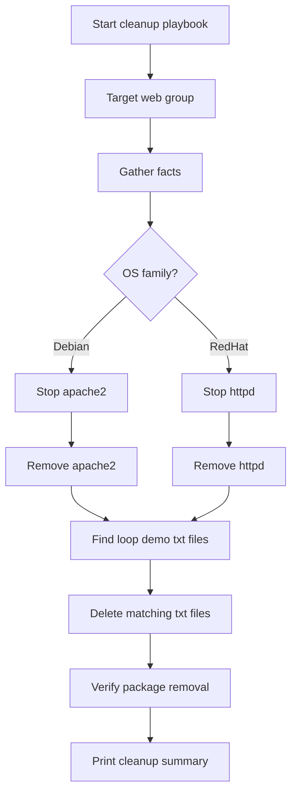

# Bonus Lab: Cleanup Web Packages and Demo Text Files

> This bonus cleanup lab removes Apache/httpd packages and deletes demo `.txt` files created during the loops and web service labs.

---

## Goal

The goal of this playbook is to reset the lab containers after running web service, condition, and loop demos.

The cleanup playbook removes:

```text
Ubuntu/Debian hosts -> apache2
Rocky/RHEL hosts    -> httpd
All web hosts       -> /tmp/ansible-loop-demo-*.txt
```

This helps return the lab to a clean state before rerunning modules.

---

## Playbook File

The cleanup playbook is located here:

```text
lab/playbooks/cleanup.yaml
```

---

## What This Playbook Cleans

| Target       | Cleanup Action                              |
| ------------ | ------------------------------------------- |
| `ubuntu_web` | Stop and remove `apache2`                   |
| `rhel_web`   | Stop and remove `httpd`                     |
| `web`        | Delete `/tmp/ansible-loop-demo-*.txt` files |

---

## Workflow Diagram



---

## Diagram Explanation

The playbook starts by targeting the `web` group.

The `web` group includes:

```text
ubuntu_web
rhel_web
```

Ansible gathers facts from each host.

Then it checks the OS family:

```yaml
ansible_facts['os_family']
```

If the host is Debian-based, the playbook removes `apache2`.

If the host is RedHat-based, the playbook removes `httpd`.

Then it searches `/tmp` for files matching:

```text
ansible-loop-demo-*.txt
```

Any matching files are deleted.

---

## Important: Run from the Correct Directory

The safest way to run this lab is from:

```bash
cd ~/bootcamp/lab
```

Then run:

```bash
ansible-playbook playbooks/cleanup.yaml
```

Why?

Because `ansible.cfg` lives here:

```text
~/bootcamp/lab/ansible.cfg
```

That config file points Ansible to the inventory:

```text
inventories/inventory.ini
```

If you run from the wrong folder, Ansible may not find the inventory.

---

## Common Mistake: Running from `playbooks/`

If you are inside this directory:

```text
~/bootcamp/lab/playbooks
```

and you run:

```bash
ansible-playbook cleanup.yaml
```

you may see:

```text
[WARNING]: No inventory was parsed, only implicit localhost is available
[WARNING]: Could not match supplied host pattern, ignoring: web
skipping: no hosts matched
```

That means Ansible did not find the inventory, so it did not run against the containers.

---

## Correct Commands

### Best Option

Run from the `lab/` folder:

```bash
cd ~/bootcamp/lab
ansible-playbook playbooks/cleanup.yaml
```

### Alternative Option

If you are already inside `lab/playbooks/`, pass the inventory manually:

```bash
ansible-playbook -i ../inventories/inventory.ini cleanup.yaml
```

---

## Syntax Check

From `lab/`:

```bash
cd ~/bootcamp/lab
ansible-playbook --syntax-check playbooks/cleanup.yaml
```

From `lab/playbooks/`:

```bash
ansible-playbook -i ../inventories/inventory.ini --syntax-check cleanup.yaml
```

---

## Cleanup Playbook

```yaml
---
# Cleanup Lab: Remove apache2/httpd and delete demo .txt files
#
# Purpose:
# This playbook cleans up the lab containers after the web, conditions, and loops demos.
#
# It removes:
# - apache2 from Ubuntu/Debian hosts
# - httpd from Rocky/RHEL hosts
# - demo text files created by the loops lab
#
# Safe note:
# This only deletes files matching:
# /tmp/ansible-loop-demo-*.txt
#
# It does NOT delete every .txt file on the system.

- name: Cleanup - remove web packages and demo text files
  hosts: web
  become: true
  gather_facts: true

  vars:
    # This is the file pattern created by the loops lab.
    demo_txt_pattern: "ansible-loop-demo-*.txt"

  tasks:
    # Show which host is being cleaned up.
    - name: Show cleanup target
      ansible.builtin.debug:
        msg: "Cleaning {{ inventory_hostname }} - OS family is {{ ansible_facts['os_family'] }}"

    # Stop apache2 on Ubuntu/Debian hosts before removing the package.
    #
    # failed_when: false is used because some containers may not run systemd,
    # or the service may already be stopped/missing.
    - name: Stop apache2 on Ubuntu/Debian hosts
      ansible.builtin.service:
        name: apache2
        state: stopped
        enabled: false
      when: ansible_facts['os_family'] == "Debian"
      failed_when: false

    # Remove apache2 from Ubuntu/Debian hosts.
    - name: Remove apache2 from Ubuntu/Debian hosts
      ansible.builtin.apt:
        name: apache2
        state: absent
        purge: true
      when: ansible_facts['os_family'] == "Debian"

    # Stop httpd on Rocky/RHEL hosts before removing the package.
    #
    # failed_when: false protects the playbook if the service is already gone.
    - name: Stop httpd on Rocky/RHEL hosts
      ansible.builtin.service:
        name: httpd
        state: stopped
        enabled: false
      when: ansible_facts['os_family'] == "RedHat"
      failed_when: false

    # Remove httpd from Rocky/RHEL hosts.
    - name: Remove httpd from Rocky/RHEL hosts
      ansible.builtin.dnf:
        name: httpd
        state: absent
      when: ansible_facts['os_family'] == "RedHat"

    # Find the demo text files created by the loops lab.
    - name: Find loop demo text files
      ansible.builtin.find:
        paths: /tmp
        patterns: "{{ demo_txt_pattern }}"
        file_type: file
      register: demo_txt_files

    # Delete the demo text files.
    - name: Delete loop demo text files
      ansible.builtin.file:
        path: "{{ item.path }}"
        state: absent
      loop: "{{ demo_txt_files.files }}"
      loop_control:
        label: "{{ item.path }}"

    # Verify apache2 is removed from Ubuntu/Debian hosts.
    - name: Verify apache2 package is removed
      ansible.builtin.command:
        cmd: dpkg -s apache2
      register: apache2_check
      changed_when: false
      failed_when: false
      when: ansible_facts['os_family'] == "Debian"

    # Verify httpd is removed from Rocky/RHEL hosts.
    - name: Verify httpd package is removed
      ansible.builtin.command:
        cmd: rpm -q httpd
      register: httpd_check
      changed_when: false
      failed_when: false
      when: ansible_facts['os_family'] == "RedHat"

    # Show cleanup summary.
    - name: Cleanup summary
      ansible.builtin.debug:
        msg:
          host: "{{ inventory_hostname }}"
          os_family: "{{ ansible_facts['os_family'] }}"
          deleted_txt_files: "{{ demo_txt_files.matched }}"
          apache2_removed_check: "{{ apache2_check.rc | default('not Debian host') }}"
          httpd_removed_check: "{{ httpd_check.rc | default('not RedHat host') }}"
```

---

## How to Run the Cleanup

From the lab folder:

```bash
cd ~/bootcamp/lab
ansible-playbook playbooks/cleanup.yaml
```

If you want to test one host first:

```bash
ansible-playbook playbooks/cleanup.yaml --limit container1
```

If you are inside `lab/playbooks/`:

```bash
ansible-playbook -i ../inventories/inventory.ini cleanup.yaml
```

---

## Verification Commands

### Verify Ubuntu/Debian Hosts

```bash
ansible ubuntu_web -m shell -a 'dpkg-query -W -f="${Package} ${Status}\n" apache2 2>/dev/null || echo "apache2 removed"' --become
```

Expected result:

```text
apache2 removed
```

### Verify Rocky/RHEL Hosts

```bash
ansible rhel_web -m shell -a 'rpm -q httpd || echo "httpd removed"' --become
```

Expected result:

```text
httpd removed
```

### Verify Demo Text Files Are Removed

```bash
ansible web -m shell -a 'ls /tmp/ansible-loop-demo-*.txt 2>/dev/null || echo "demo txt files removed"' --become
```

Expected result:

```text
demo txt files removed
```

---

## Verification Commands from `lab/playbooks/`

If you are inside `lab/playbooks/`, use `-i ../inventories/inventory.ini`.

```bash
ansible -i ../inventories/inventory.ini ubuntu_web -m shell -a 'dpkg-query -W -f="${Package} ${Status}\n" apache2 2>/dev/null || echo "apache2 removed"' --become

ansible -i ../inventories/inventory.ini rhel_web -m shell -a 'rpm -q httpd || echo "httpd removed"' --become

ansible -i ../inventories/inventory.ini web -m shell -a 'ls /tmp/ansible-loop-demo-*.txt 2>/dev/null || echo "demo txt files removed"' --become
```

---

## Understanding the Verification Return Codes

For Ubuntu/Debian:

```bash
dpkg -s apache2
```

If Apache is installed, the command returns:

```text
rc=0
```

If Apache is removed, the command returns:

```text
rc=1
```

In this cleanup lab, `rc=1` means success because the package is no longer installed.

For Rocky/RHEL:

```bash
rpm -q httpd
```

If httpd is installed, the command returns:

```text
rc=0
```

If httpd is removed, the command returns:

```text
rc=1
```

In this cleanup lab, `rc=1` means success because the package is no longer installed.

---

## Common Issue 1: No Inventory Was Parsed

Problem:

```text
[WARNING]: No inventory was parsed, only implicit localhost is available
[WARNING]: Could not match supplied host pattern, ignoring: web
skipping: no hosts matched
```

Cause:

```text
Ansible did not find the inventory file.
```

Most common reason:

```text
You ran the playbook from lab/playbooks/ without passing -i.
```

Fix:

```bash
cd ~/bootcamp/lab
ansible-playbook playbooks/cleanup.yaml
```

Or:

```bash
cd ~/bootcamp/lab/playbooks
ansible-playbook -i ../inventories/inventory.ini cleanup.yaml
```

---

## Common Issue 2: Apache Still Exists on Some Hosts

If verification shows `apache2` still exists on `container2` or `container3`, it usually means cleanup only ran against one host or did not run against the full inventory.

Fix:

```bash
cd ~/bootcamp/lab
ansible-playbook playbooks/cleanup.yaml
```

Then verify again:

```bash
ansible ubuntu_web -m shell -a 'dpkg-query -W -f="${Package} ${Status}\n" apache2 2>/dev/null || echo "apache2 removed"' --become
```

---

## Common Issue 3: Demo `.txt` Files Still Exist

If this command shows files:

```bash
ansible web -m shell -a 'ls /tmp/ansible-loop-demo-*.txt 2>/dev/null || echo "demo txt files removed"' --become
```

then cleanup did not run against all hosts.

Run cleanup again from the correct directory:

```bash
cd ~/bootcamp/lab
ansible-playbook playbooks/cleanup.yaml
```

---

## Common Issue 4: systemd or Service Warnings in Containers

Some containers do not run full systemd.

You may see warnings such as:

```text
could not determine current runlevel
policy-rc.d denied execution
```

This is common in containers.

The important verification is package removal and file deletion.

Use:

```bash
ansible ubuntu_web -m shell -a 'dpkg-query -W apache2 2>/dev/null || echo "apache2 removed"' --become
ansible rhel_web -m shell -a 'rpm -q httpd || echo "httpd removed"' --become
```

---

## Hands-On Walkthrough

### Step 1: Go to the lab folder

```bash
cd ~/bootcamp/lab
```

### Step 2: Confirm inventory is loaded

```bash
ansible-inventory --graph
```

You should see:

```text
web
ubuntu_web
rhel_web
linux
```

### Step 3: Run syntax check

```bash
ansible-playbook --syntax-check playbooks/cleanup.yaml
```

### Step 4: Run cleanup on one host first

```bash
ansible-playbook playbooks/cleanup.yaml --limit container1
```

### Step 5: Run cleanup on all web hosts

```bash
ansible-playbook playbooks/cleanup.yaml
```

### Step 6: Verify packages and files are gone

```bash
ansible ubuntu_web -m shell -a 'dpkg-query -W -f="${Package} ${Status}\n" apache2 2>/dev/null || echo "apache2 removed"' --become

ansible rhel_web -m shell -a 'rpm -q httpd || echo "httpd removed"' --become

ansible web -m shell -a 'ls /tmp/ansible-loop-demo-*.txt 2>/dev/null || echo "demo txt files removed"' --become
```

---

## Hands-On Lab

### Task

Clean all web lab containers.

You must remove:

```text
apache2 from Ubuntu/Debian containers
httpd from Rocky/RHEL containers
/tmp/ansible-loop-demo-*.txt from all web containers
```

### Required Command

```bash
cd ~/bootcamp/lab
ansible-playbook playbooks/cleanup.yaml
```

### Required Verification

```bash
ansible ubuntu_web -m shell -a 'dpkg-query -W -f="${Package} ${Status}\n" apache2 2>/dev/null || echo "apache2 removed"' --become

ansible rhel_web -m shell -a 'rpm -q httpd || echo "httpd removed"' --become

ansible web -m shell -a 'ls /tmp/ansible-loop-demo-*.txt 2>/dev/null || echo "demo txt files removed"' --become
```

---

## Quiz

1. Why should you run the cleanup playbook from `~/bootcamp/lab`?

   * A. Because the images folder is there
   * B. Because `ansible.cfg` is there
   * C. Because Git only works there
   * D. Because YAML only works there

2. What package does the cleanup remove from Ubuntu/Debian hosts?

   * A. `httpd`
   * B. `apache2`
   * C. `nginx`
   * D. `podman`

3. What package does the cleanup remove from Rocky/RHEL hosts?

   * A. `httpd`
   * B. `apache2`
   * C. `apt`
   * D. `dpkg`

4. What files does the cleanup delete?

   * A. Every `.txt` file on the system
   * B. Only `/tmp/ansible-loop-demo-*.txt`
   * C. Everything in `/tmp`
   * D. All Ansible files

5. What does `rc=1` mean when checking `dpkg -s apache2` after cleanup?

   * A. The cleanup failed
   * B. Apache is still installed
   * C. Apache is not installed
   * D. Inventory is broken

---

<details>
<summary>Instructor answer key</summary>

1. **B** — Because `ansible.cfg` is there
2. **B** — `apache2`
3. **A** — `httpd`
4. **B** — Only `/tmp/ansible-loop-demo-*.txt`
5. **C** — Apache is not installed

</details>

---

## Key Takeaways

```text
Cleanup playbooks are useful in training labs.
Always run from bootcamp/lab unless you pass -i manually.
Debian-family hosts use apache2.
RedHat-family hosts use httpd.
The cleanup only deletes the specific demo .txt files.
rc=1 can be expected when verifying that a package is removed.
```