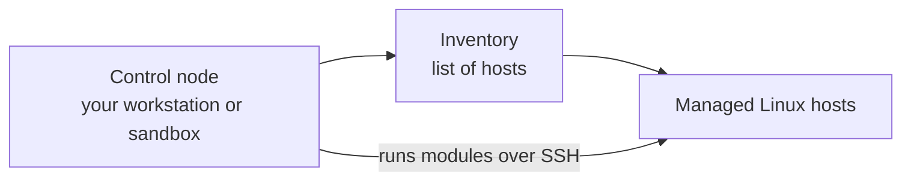
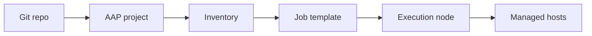

<p align="right">
  <a href="https://github.com/Ansible-workshop-ch/bootcamp/blob/main/module02/inventory-and-idempotency.md" target="_blank">
    
  </a>
</p>

<p align="left">
  <a href="https://github.com/Ansible-workshop-ch" target="_blank">
    
  </a>
</p>

# Module 1: Ansible Introduction and Architecture

> Lab commands run from [`bootcamp/lab/`](../lab/) - `cd bootcamp/lab` first. Diagrams render automatically on GitHub.

**Day 1 - Foundations** - Goal: understand what Ansible is, how it works, and how it connects to managed systems.

---

## Definition

Ansible is an automation tool. It helps us run the same task on one system or many systems without logging in to every server and repeating the work manually.

For Linux systems, Ansible normally connects over **SSH**. It does not need a permanent Ansible agent installed on every managed node. Ansible reads the **inventory**, connects to the selected systems, and runs a **module** to complete the task.

A simple example is checking the hostname on ten servers. Without Ansible, we may connect to every server and run the same command ten times. With Ansible, we run one command and receive the results from all ten servers.

Key terms:

| Term             | Meaning                                                                 |
| ---------------- | ----------------------------------------------------------------------- |
| **Control node** | The Linux system where Ansible commands and playbooks are started       |
| **Managed node** | A system that Ansible connects to and manages                           |
| **Inventory**    | The list of systems and groups that Ansible can target                  |
| **Module**       | A reusable tool that performs one type of work                          |
| **Task**         | One action that Ansible performs                                        |
| **Playbook**     | A YAML file containing one or more automation tasks                     |
| **AAP**          | Ansible Automation Platform, used to manage and run Ansible at scale    |

The control node starts the work. The managed nodes receive the work. The inventory connects these two parts by telling Ansible which systems are available.

---

## Windows Users - Access and Command Differences

The Ansible concepts are the same for everyone, but Windows and Linux users may enter the lab in different ways.

The commands in this course use **Linux and Unix shell syntax**. Students using a Windows workstation should first connect to the provided Linux sandbox or control node. After connecting, they should run the same Linux commands shown in the course.

Windows Terminal, PowerShell, PuTTY, or MobaXterm can be used to open the connection. They are not the main Ansible control environment for this bootcamp. The actual Ansible commands should run from the Linux sandbox or from an approved WSL environment.

| Task                              | Windows workstation option                     | Linux sandbox / course command                | Notes                                                            |
| --------------------------------- | ---------------------------------------------- | --------------------------------------------- | ---------------------------------------------------------------- |
| Open a terminal                   | Windows Terminal, PowerShell, PuTTY, MobaXterm | Terminal shell                                | Windows is mainly used to connect into the Linux lab environment |
| SSH into the sandbox/control node | `ssh user@sandbox-host`                        | `ssh user@sandbox-host`                       | PuTTY or MobaXterm can also be used                              |
| Show current directory            | `pwd` or `Get-Location`                        | `pwd`                                         | Once inside Linux, use the Linux command                         |
| List files                        | `dir` or `Get-ChildItem`                       | `ls`                                          | Course examples use `ls`                                         |
| Change directory                  | `cd .\bootcamp\lab`                            | `cd ~/bootcamp/lab`                           | Linux paths use `/`, not `\`                                     |
| Home directory                    | `C:\Users\username`                            | `/home/username` or `~`                       | `~` means the current user's home directory in Linux             |
| SSH key location                  | `C:\Users\username\.ssh\id_rsa`                | `~/.ssh/id_rsa`                               | Key paths differ between Windows and Linux                       |
| Fix SSH key permissions           | Usually handled differently on Windows         | `chmod 600 ~/.ssh/id_rsa`                     | Run this inside Linux if needed                                  |
| Edit a file                       | VS Code, Notepad++, MobaXterm editor           | `vi`, `vim`, `nano`, or VS Code Remote SSH    | Use whichever editor the lab allows                              |
| Run Ansible commands              | From Linux sandbox or approved WSL setup       | `ansible all -m ping`                         | Course examples assume Linux shell                               |
| Run a playbook                    | From Linux sandbox or approved WSL setup       | `ansible-playbook playbooks/module1_ping.yml` | Same playbook logic, different access method                     |

Important rule for this bootcamp:

```text
Windows users connect into the Linux sandbox/control node.
Ansible commands are then run from the Linux environment.
```

The student workstation is only the starting point. Once the student connects to the Linux control node, everyone follows the same commands and the same lab steps.

---

## Diagram / Workflow

How a command flows today using CLI:



The **control node** is where we type the Ansible command. In this course, it may be the Linux sandbox, a jump box, or another approved Linux system.

The **inventory** tells Ansible which systems exist and how they are grouped. Ansible reads the inventory before it starts the work.

The **managed Linux hosts** are the servers that we want to check, configure, patch, or update.

The arrow labeled **runs modules over SSH** shows the connection from the control node to the managed hosts. Ansible connects using SSH, transfers the work that is needed, runs the module, and returns the result.

No permanent Ansible agent is required on the Linux managed nodes. Ansible connects when work needs to run and then closes the connection when the task is complete.

So the flow is:

```text
You tell Ansible what to do -> Ansible reads the inventory -> Ansible connects over SSH -> Ansible runs the task
```

For example, when we run a hostname command, Ansible first finds the target systems in the inventory. It then connects to those systems, runs the command module, and shows the hostname returned by each system.

Where AAP fits later:



The basic Ansible workflow stays the same when we use Ansible Automation Platform. AAP adds a managed platform around the command-line workflow.

The **Git repo** stores the automation code. This can include playbooks, roles, variables, templates, and other project files.

The **AAP project** connects AAP to the Git repository and pulls the automation content into the platform.

The **inventory** still contains the target systems. The difference is that the inventory is now managed and shared through AAP.

The **job template** brings the main settings together. It tells AAP which playbook to run, which inventory to use, and which credentials or options are required.

The **execution node** runs the automation job. This means the work does not depend on one person's laptop or terminal session.

The **managed hosts** are still the systems that receive the automation.

Both diagrams finish at the same place: the managed hosts. The first diagram shows one person running Ansible from the command line. The second diagram shows AAP managing the same process with Git integration, shared inventories, protected credentials, job templates, execution nodes, and saved job output.

Day 1 focuses on the command-line workflow. Later in the course, we will connect the same ideas to AAP.

---

## Hands-On Walkthrough

The instructor runs each command and explains what Ansible is doing at every step.

```bash
# What version am I running?
ansible --version

# Make sure you are in the right directory
cd ~/bootcamp/lab

# Let's see what we have in our inventory
ansible-inventory -i inventories/inventory.ini --graph

# Can I reach every host in the inventory?
ansible all -i inventories/inventory.ini -m ping

# Run a single command using the command module on all hosts
ansible all -i inventories/inventory.ini -m command -a "hostname"
```

Start with `ansible --version`. This confirms that Ansible is installed and shows which version, configuration file, Python version, and module paths are being used. When troubleshooting, this is one of the first commands to check.

Next, move into `~/bootcamp/lab`. Running commands from the correct directory matters because the inventory, configuration, and playbook paths are based on the lab folder.

The `ansible-inventory` command displays the inventory as a graph. This makes it easier to see the groups and the hosts inside each group before we run automation against them.

The `ping` module checks whether Ansible can connect to the managed hosts and run a simple module. This is not the same as a normal network ICMP ping. A successful result means the basic Ansible connection is working.

The last command uses the `command` module to run `hostname` on every selected host. Instead of connecting to each server manually, Ansible sends the same request to all hosts and returns the result for each one.

Command breakdown:

| Command part                   | Meaning                                        |
| ------------------------------ | ---------------------------------------------- |
| `ansible`                      | Runs an Ansible ad hoc command                 |
| `all`                          | Targets all hosts from the selected inventory  |
| `-i inventories/inventory.ini` | Tells Ansible which inventory file to use      |
| `-m ping`                      | Uses the Ansible `ping` module                 |
| `-m command`                   | Uses the Ansible `command` module              |
| `-a "hostname"`                | Passes `hostname` as an argument to the module |

The target systems come from the inventory. The word `all` means every host available in the selected inventory. We can later replace `all` with a group name or one host name when we want a smaller target.

These commands are called **ad hoc commands**. They are useful for quick checks and simple one-time actions. For repeatable automation with several steps, we normally place the tasks inside a playbook.

There is also a ready-made playbook version:

```bash
ansible-playbook playbooks/module1_ping.yml
```

This playbook performs the same kind of connectivity test, but the automation is saved in a YAML file. Because it is saved, it can be reviewed, reused, stored in Git, and later launched from AAP.

---

## Quiz

1. What does Ansible use to know which hosts to target?

   * A. Playbook only
   * B. Inventory
   * C. Handler
   * D. Template

2. What is a **managed node**?

   * A. The machine running the Ansible command
   * B. The system being automated
   * C. The Git repo
   * D. The AAP UI

3. Why is Ansible useful compared to running commands manually?

   * A. It only works on one server
   * B. It gives repeatable, readable automation across systems
   * C. It replaces Linux
   * D. It requires an agent everywhere

---

## Hands-On Lab - First Ansible commands

In this lab, students will use the inventory, confirm connectivity, and run simple commands across the managed hosts.

**You will:**

1. Clone the training repo if not already done.
2. Open `inventories/inventory.ini` and identify your lab host.
3. Run a ping test against your host.
4. Run `hostname` against your host.
5. Run `uptime` against your host.

```bash
ansible all -m ping
ansible all -m command -a "hostname"
ansible all -m command -a "uptime"
```

Run the ping command first. Do not continue until the host returns a successful result. If it fails, check the inventory entry, the SSH connection, and the login information.

The hostname command confirms which system returned each result. The uptime command shows how long each system has been running and gives another example of using one Ansible command across multiple systems.

The goal is not only to make the commands work. Students should understand where the target hosts came from, which module was used, and why the same action can be repeated across several systems.

**Success check:**

* [ ] You ran an ad hoc command successfully.
* [ ] You can point to **where the target host came from**: the inventory.
* [ ] You can explain the difference between the control node and a managed node.
* [ ] You understand that the Ansible `ping` module is not a normal network ping.

<details>
<summary>Instructor answer key</summary>

1. **B** - Inventory
2. **B** - The system being automated
3. **B** - Repeatable, readable automation across systems

</details>

<p align="right">
  <a href="https://github.com/Ansible-workshop-ch/bootcamp/blob/main/module02/inventory-and-idempotency.md" target="_blank">
    
  </a>
</p>

<p align="left">
  <a href="https://github.com/Ansible-workshop-ch" target="_blank">
    
  </a>
</p>