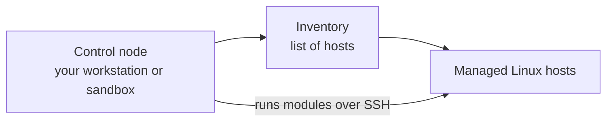
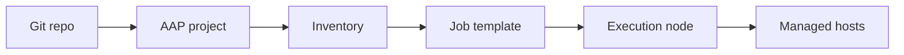

<p align="right">
  <a href="https://github.com/Ansible-workshop-ch/bootcamp/blob/main/module02/inventory-and-idempotency.md" target="_blank">
    
  </a>
</p>

<p align="left">
  <a href="https://github.com/Ansible-workshop-ch" target="_blank">
    
  </a>
</p>

# Module 1: Ansible Introduction and Architecture

> Lab commands run from [`bootcamp/lab/`](../lab/) - `cd bootcamp/lab` first. Diagrams render automatically on GitHub.

**Day 1 - Foundations** - Goal: understand how Ansible thinks and how it talks to systems. Keep it simple.

---

## Definition

Ansible is an automation tool used to run tasks across one or many systems. It does **not** require an agent on the managed Linux nodes. It usually connects over **SSH**, reads an **inventory**, and runs **modules** to make changes or collect information.

Key terms:

| Term             | Meaning                                                   |
| ---------------- | --------------------------------------------------------- |
| **Control node** | Where Ansible commands are launched from                  |
| **Managed node** | The system being automated                                |
| **Inventory**    | List of target systems                                    |
| **Module**       | Reusable unit of work, for example `package` or `service` |
| **Task**         | One action in Ansible                                     |
| **Playbook**     | YAML file containing automation steps                     |
| **AAP**          | Enterprise platform to run and manage Ansible             |

---

## Windows Users - Access and Command Differences

The Ansible concepts are the same, but the way users access the lab can differ between Windows and Linux.

For this course, the standard command examples will use **Linux/Unix shell syntax**. If you are using Windows, you should connect to the Linux sandbox/control node first, then run the Ansible commands from there.

Do **not** treat normal Windows CMD or PowerShell as the main Ansible control environment for this bootcamp. Use the provided Linux sandbox/control node, or WSL only if your team has approved and configured it.

| Task                              | Windows workstation option                     | Linux sandbox / course command                | Notes                                                            |
| --------------------------------- | ---------------------------------------------- | --------------------------------------------- | ---------------------------------------------------------------- |
| Open a terminal                   | Windows Terminal, PowerShell, PuTTY, MobaXterm | Terminal shell                                | Windows is mainly used to connect into the Linux lab environment |
| SSH into the sandbox/control node | `ssh user@sandbox-host`                        | `ssh user@sandbox-host`                       | PuTTY or MobaXterm can also be used                              |
| Show current directory            | `pwd` or `Get-Location`                        | `pwd`                                         | Once inside Linux, use the Linux command                         |
| List files                        | `dir` or `Get-ChildItem`                       | `ls`                                          | Course examples use `ls`                                         |
| Change directory                  | `cd .\bootcamp\lab`                            | `cd ~/bootcamp/lab`                           | Linux paths use `/`, not `\`                                     |
| Home directory                    | `C:\Users\username`                            | `/home/username` or `~`                       | `~` means the current user's home directory in Linux             |
| SSH key location                  | `C:\Users\username\.ssh\id_rsa`                | `~/.ssh/id_rsa`                               | Key paths differ between Windows and Linux                       |
| Fix SSH key permissions           | Usually handled differently on Windows         | `chmod 600 ~/.ssh/id_rsa`                     | Run this inside Linux if needed                                  |
| Edit a file                       | VS Code, Notepad++, MobaXterm editor           | `vi`, `vim`, `nano`, or VS Code Remote SSH    | Use whichever editor the lab allows                              |
| Run Ansible commands              | From Linux sandbox or approved WSL setup       | `ansible all -m ping`                         | Course examples assume Linux shell                               |
| Run a playbook                    | From Linux sandbox or approved WSL setup       | `ansible-playbook playbooks/module1_ping.yml` | Same playbook logic, different access method                     |

Important rule for this bootcamp:

```text
Windows users connect into the Linux sandbox/control node.
Ansible commands are then run from the Linux environment.
```

---

## Diagram / Workflow

How a command flows today using CLI:



> This is Ansible working the way your team will use it on Day 1: from the command line, no AAP yet. The control node is the machine where the Ansible command runs. That may be your workstation, a Linux sandbox, or a jump box.

> Inventory is the list of systems Ansible can target. Before Ansible can do anything, it reads the inventory to know which machines it should act on.

> Managed Linux hosts are the actual servers you want to check, configure, or change.

---

> The important part is the bottom arrow labeled "runs modules over SSH." Once Ansible knows the targets, it connects to them over SSH and runs the work there. There is no agent installed on those servers. Ansible logs in like a user would and performs the task.

So the flow is:

```text
You tell Ansible what to do -> Ansible reads the inventory -> Ansible connects over SSH -> Ansible runs the task
```

Where AAP fits later:



> This is a sneak peek of how the same idea works once you move into Ansible Automation Platform.

> Git repo is where your code lives, including playbooks, roles, variables, and templates.

> AAP project connects AAP to that Git repo and pulls the automation content into the platform.

> Inventory is still the list of target hosts, but now it is managed inside AAP.

> Job template is the run button. It bundles together which playbook to run, which inventory to use, and which credentials are needed.

> Execution node is the worker machine AAP uses to run the playbook instead of your laptop doing it.

> Managed hosts are the real servers receiving the automation.

---

> The connection between the two diagrams is simple: both end with managed hosts getting checked or changed. The top diagram is one person running Ansible from the command line. The bottom diagram wraps the same Ansible workflow inside AAP, which adds Git integration, shared inventories, job templates, logged output, credentials, and dedicated execution nodes.

Day 1 teaches the CLI workflow. Day 3 connects that workflow to AAP.

---

## Hands-On Walkthrough

The instructor demonstrates, students watch:

```bash
# What version am I running?
ansible --version

# Make sure you are in the right directory
cd ~/bootcamp/lab

# Let's see what we have in our inventory
ansible-inventory -i inventories/inventory.ini --graph

# Can I reach every host in the inventory?
ansible all -i inventories/inventory.ini -m ping

# Run a single command using the command module on all hosts
ansible all -i inventories/inventory.ini -m command -a "hostname"
```

Notes:

| Command part                   | Meaning                                        |
| ------------------------------ | ---------------------------------------------- |
| `ansible`                      | Runs an Ansible ad hoc command                 |
| `all`                          | Targets all hosts from the selected inventory  |
| `-i inventories/inventory.ini` | Tells Ansible which inventory file to use      |
| `-m ping`                      | Uses the Ansible `ping` module                 |
| `-m command`                   | Uses the Ansible `command` module              |
| `-a "hostname"`                | Passes `hostname` as an argument to the module |

Talking points:

* The **target host comes from the inventory**, not from the command itself.
* `ping` here is an Ansible module that checks SSH and Python, not an ICMP network ping.
* Running through Ansible gives **repeatable, readable** results across many hosts at once instead of typing the same command on each box by hand.

There is also a ready-made playbook version:

```bash
ansible-playbook playbooks/module1_ping.yml
```

---

## Quiz

1. What does Ansible use to know which hosts to target?

   * A. Playbook only
   * B. Inventory
   * C. Handler
   * D. Template

2. What is a **managed node**?

   * A. The machine running the Ansible command
   * B. The system being automated
   * C. The Git repo
   * D. The AAP UI

3. Why is Ansible useful compared to running commands manually?

   * A. It only works on one server
   * B. It gives repeatable, readable automation across systems
   * C. It replaces Linux
   * D. It requires an agent everywhere

---

## Hands-On Lab - First Ansible commands

**You will:**

1. Clone the training repo if not already done.
2. Open `inventories/inventory.ini` and identify your lab host.
3. Run a ping test against your host.
4. Run `hostname` against your host.
5. Run `uptime` against your host.

```bash
ansible all -m ping
ansible all -m command -a "hostname"
ansible all -m command -a "uptime"
```

**Success check:**

* [ ] You ran an ad hoc command successfully.
* [ ] You can point to **where the target host came from**: the inventory.

<details>
<summary>Instructor answer key</summary>

1. **B** - Inventory
2. **B** - The system being automated
3. **B** - Repeatable, readable automation across systems

</details>

<p align="right">
  <a href="https://github.com/Ansible-workshop-ch/bootcamp/blob/main/module02/inventory-and-idempotency.md" target="_blank">
    
  </a>
</p>

<p align="left">
  <a href="https://github.com/Ansible-workshop-ch" target="_blank">
    
  </a>
</p>
