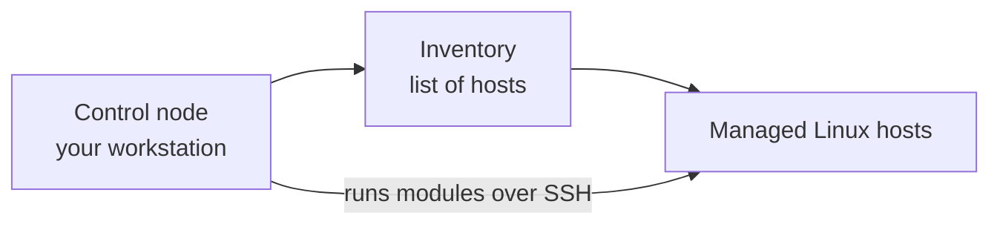
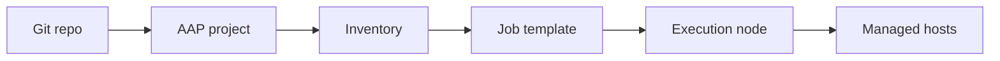

# Module 1: Ansible Introduction and Architecture

> 🧪 Lab commands run from [`bootcamp/lab/`](../lab/) — `cd bootcamp/lab` first. Diagrams render automatically on GitHub.

**Day 1 · Foundations** — Goal: understand how Ansible *thinks* and how it talks to systems. Keep it simple.

---

## Definition

Ansible is an automation tool used to run tasks across one or many systems. It does **not** require an agent on the managed Linux nodes. It usually connects over **SSH**, reads an **inventory**, and runs **modules** to make changes or collect information.

Key terms:

| Term | Meaning |
|------|---------|
| **Control node** | Where Ansible commands are launched from |
| **Managed node** | The system being automated |
| **Inventory** | List of target systems |
| **Module** | Reusable unit of work (e.g. `package`, `service`) |
| **Task** | One action in Ansible |
| **Playbook** | YAML file containing automation steps |
| **AAP** | Enterprise platform to run and manage Ansible |

---

## Diagram / Workflow

How a command flows today (CLI):



> This is Ansible working the way your team will use it on Day 1: from the command line, no AAP yet. Control node (your workstation) this is you, sitting at your laptop or a jump box, typing the Ansible command. It's the machine that does the bossing around. 

> Inventory (list of hosts) before Ansible can do anything, it has to know which machines to act on. The inventory is just that list. The arrow from your workstation to the inventory means "first, Ansible reads the list to find out who the targets are."

> Managed Linux hosts the actual servers you want to change or check. These are the machines getting the work done to them.
---
> The important part is the bottom arrow labeled "runs modules over SSH." That straight line from your workstation directly to the managed hosts is the key idea: once Ansible knows the targets, it connects to them over SSH and runs its work there. Notice there's nothing installed on those servers no agent. Ansible just logs in like a person would and does the task. So the flow reads: you tell Ansible what to do → it checks the list of hosts → it SSHes into those hosts and runs the work.

Where AAP fits later:



> This is a sneak peek of how the same thing happens once you move into Ansible Automation Platform. It's a straight pipeline, left to right, and each box hands off to the next: 

> Git repo your code (playbooks, roles) lives in Git, the single source of truth. 

> AAP project AAP connects to that Git repo and pulls the code in. A "project" is basically AAP's link to your repo.

> Inventory same concept as before: the list of target hosts, but now managed inside AAP. 

> Job template the "run button." It bundles together which playbook to run, which inventory to run it against, and how to log in. This is what an operator actually launches. 

> Execution node the worker machine AAP uses to actually run the playbook (instead of your laptop doing it). 

> Managed hosts same endpoint as the top diagram: the real servers getting the work done.
---

> The connection between the two: they end at the same place  managed hosts getting changed. The top diagram is one person driving from their laptop. The bottom diagram wraps that same Ansible run inside AAP, which adds the things a team needs: code stored in Git, shared inventories, a launch button, logged output, and a dedicated machine to run it. Day 1 teaches the top picture; Day 3 connects it to the bottom one.

---

## Hands-On Walkthrough

The instructor demonstrates, students watch:

```bash
# What version am I running?
ansible --version

# Make sure your in the right dirctory 
cd lab

# Can I reach every host in the inventory?
ansible all -i inventories/inventory.ini -m ping

# Run a single command (the command module) on all hosts
ansible all -i inventories/inventory.ini -m command -a "hostname"
```
> Notes: 
>> all -> Runs an Ansible ad-hoc command
>> -i targets all hosts in the inventory 
>> -m ping/command - uses the Ansible module 
>> -a -> passes the argument to the module.

Talking points:
- The **target host came from the inventory**, not from the command.
- `ping` here is an Ansible module that checks SSH + Python, *not* ICMP ping.
- Running through Ansible gives **repeatable, readable** results across many hosts at once, versus typing the same command on each box by hand.

There is also a ready-made playbook version:

```bash
ansible-playbook playbooks/module1_ping.yml
```

---

## Quiz

1. What does Ansible use to know which hosts to target?
   - A. Playbook only
   - B. Inventory
   - C. Handler
   - D. Template

2. What is a **managed node**?
   - A. The machine running the Ansible command
   - B. The system being automated
   - C. The Git repo
   - D. The AAP UI

3. Why is Ansible useful compared to running commands manually?
   - A. It only works on one server
   - B. It gives repeatable, readable automation across systems
   - C. It replaces Linux
   - D. It requires an agent everywhere

---

## Hands-On Lab — *First Ansible commands*

**You will:**
1. Clone the training repo (if not already done).
2. Open `inventories/inventory.ini` and identify your lab host.
3. Run a ping test against your host.
4. Run `hostname` against your host.
5. Run `uptime` against your host.

```bash
ansible all -m ping
ansible all -m command -a "hostname"
ansible all -m command -a "uptime"
```

**Success check:**
- [ ] You ran an ad hoc command successfully.
- [ ] You can point to **where the target host came from** (the inventory).

<details>
<summary>Instructor answer key</summary>

1. **B** — Inventory
2. **B** — The system being automated
3. **B** — Repeatable, readable automation across systems
</details>


<p align="right">
  <a href="https://github.com/Ansible-workshop-ch/bootcamp/blob/main/module02/inventory-and-idempotency.md" target="_blank">
    
  </a>
</p>