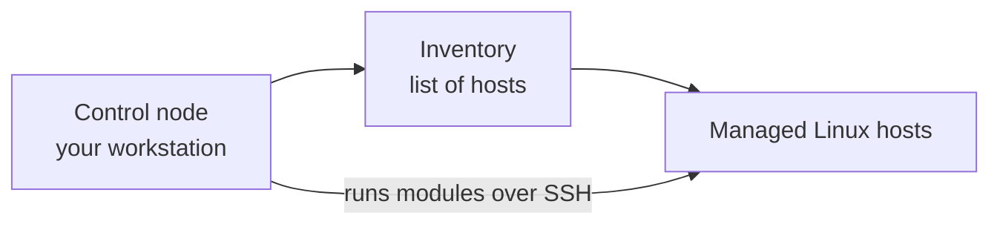
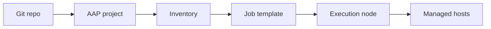

# Module 1: Ansible Introduction and Architecture

> 🧪 Lab commands run from [`bootcamp/lab/`](../lab/) — `cd bootcamp/lab` first. Diagrams render automatically on GitHub.

**Day 1 · Foundations** — Goal: understand how Ansible *thinks* and how it talks to systems. Keep it simple.

---

## Definition

Ansible is an automation tool used to run tasks across one or many systems. It does **not** require an agent on the managed Linux nodes. It usually connects over **SSH**, reads an **inventory**, and runs **modules** to make changes or collect information.

Key terms:

| Term | Meaning |
|------|---------|
| **Control node** | Where Ansible commands are launched from |
| **Managed node** | The system being automated |
| **Inventory** | List of target systems |
| **Module** | Reusable unit of work (e.g. `package`, `service`) |
| **Task** | One action in Ansible |
| **Playbook** | YAML file containing automation steps |
| **AAP** | Enterprise platform to run and manage Ansible |

---

## Diagram / Workflow

How a command flows today (CLI):



Where AAP fits later (preview of Day 3):



---

## Hands-On Walkthrough

The instructor demonstrates, students watch:

```bash
# What version am I running?
ansible --version

# Can I reach every host in the inventory?
ansible all -i inventories/inventory.ini -m ping

# Run a single command (the command module) on all hosts
ansible all -i inventories/inventory.ini -m command -a "hostname"
```

Talking points:
- The **target host came from the inventory**, not from the command.
- `ping` here is an Ansible module that checks SSH + Python, *not* ICMP ping.
- Running through Ansible gives **repeatable, readable** results across many hosts at once, versus typing the same command on each box by hand.

There is also a ready-made playbook version:

```bash
ansible-playbook playbooks/module1_ping.yml
```

---

## Quiz

1. What does Ansible use to know which hosts to target?
   - A. Playbook only
   - B. Inventory
   - C. Handler
   - D. Template

2. What is a **managed node**?
   - A. The machine running the Ansible command
   - B. The system being automated
   - C. The Git repo
   - D. The AAP UI

3. Why is Ansible useful compared to running commands manually?
   - A. It only works on one server
   - B. It gives repeatable, readable automation across systems
   - C. It replaces Linux
   - D. It requires an agent everywhere

---

## Hands-On Lab — *First Ansible commands*

**You will:**
1. Clone the training repo (if not already done).
2. Open `inventories/inventory.ini` and identify your lab host.
3. Run a ping test against your host.
4. Run `hostname` against your host.
5. Run `uptime` against your host.

```bash
ansible all -m ping
ansible all -m command -a "hostname"
ansible all -m command -a "uptime"
```

**Success check:**
- [ ] You ran an ad hoc command successfully.
- [ ] You can point to **where the target host came from** (the inventory).

<details>
<summary>Instructor answer key</summary>

1. **B** — Inventory
2. **B** — The system being automated
3. **B** — Repeatable, readable automation across systems
</details>
