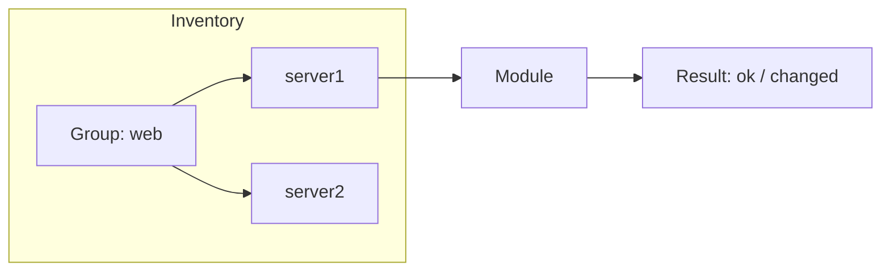
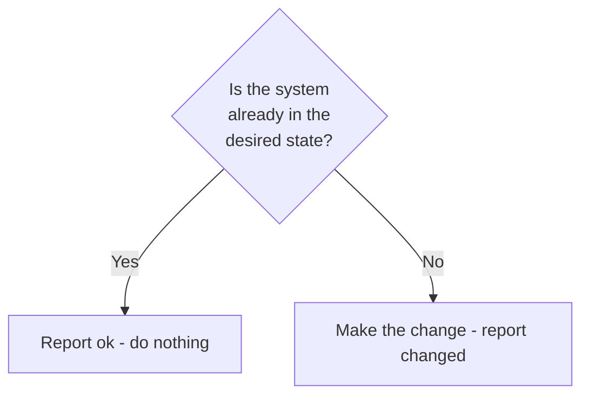

<p align="right">
  <a href="https://github.com/Ansible-workshop-ch/bootcamp/blob/main/module03/playbook-basics.md" target="_blank">
    
  </a>
</p>

<p align="left">
  <a href="https://github.com/Ansible-workshop-ch/bootcamp/blob/main/module01/introduction.md" target="_blank">
    
  </a>
</p>

# Module 2: Inventory, Ad Hoc Commands, and Idempotency

> 🧪 Lab commands run from [`bootcamp/lab/`](../lab/) — `cd bootcamp/lab` first. Diagrams render automatically on GitHub.

**Day 1 · Foundations**

---

## Definition

An **inventory** defines the systems Ansible manages. It can start simple — an INI or YAML file — and later come from **dynamic sources** such as NetBox.

**Ad hoc commands** are one-line Ansible commands used for quick tasks or testing.

**Idempotency** means Ansible tries to bring a system to the *desired state* without repeating unnecessary changes. The same run twice should not keep "changing" things that are already correct.

> Bash may run `yum install httpd` every time. The Ansible `package` module first checks whether `httpd` is already installed and only acts if needed.

---

## Diagram / Workflow

The diagram below shows the basic Ansible flow.

Ansible starts with an **inventory**. The inventory is where we define the hosts that Ansible can manage.

Inside the inventory, hosts can be organized into groups. In this example, the group is called `web`.

The `web` group contains two hosts:

* `server1`
* `server2`

When we run Ansible against the `web` group, Ansible targets the hosts inside that group. Then Ansible runs a **module** against those hosts.

A module is the action Ansible performs. For example, a module can test connectivity, install a package, copy a file, start a service, or create a user.

After the module runs, Ansible reports the result. The result tells us whether the task was already correct, changed something, failed, or could not reach the host.



In simple terms:

```text
Inventory tells Ansible where to run.
Module tells Ansible what to do.
Result tells us what happened.
```

Common results include:

* `ok`: the host was already in the correct state
* `changed`: Ansible made a change on the host
* `failed`: the task failed
* `unreachable`: Ansible could not connect to the host

---

## Idempotency, visually:

The diagram below explains how Ansible decides whether a change is needed.

Before Ansible changes anything, it checks the current state of the system.

It asks:

```text
Is the system already in the desired state?
```

If the answer is **Yes**, Ansible does nothing and reports `ok`.

That means the system was already configured correctly.

If the answer is **No**, Ansible makes the required change and reports `changed`.

That means Ansible updated the system to match the desired state.



In simple terms:

```text
If the system is already correct, Ansible reports ok.
If the system needs to be fixed, Ansible makes the change and reports changed.
```

This is why Ansible is safe to run multiple times. If nothing needs to change, Ansible will not keep changing the system again and again.

---

## Hands-On Walkthrough

```bash
# Target just the 'web' group
ansible web -m command -a "hostname"

# Use the package module (state-aware) with privilege escalation
ansible web -m package -a "name=httpd state=present" --become

# Make sure the service is started
ansible web -m service -a "name=httpd state=started" --become
```
> Note: 
>> we are using apache2 and we can use states like "started, stopped, restarted & reloaded"


Talking points:

* Target **one group** (`web`) or **one host** (`server1`) by name.
* `command`, `shell`, `package`, `service` are common modules.
* Prefer **modules over raw shell** when a module exists: modules are structured and state-aware, shell is not.

---

## Quiz

1. What is an ad hoc command?

   * A. A quick one-line Ansible command
   * B. A full AAP workflow
   * C. A Git branch
   * D. A role

2. What does idempotency mean?

   * A. The task always changes something
   * B. The task tries to reach the desired state without unnecessary changes
   * C. The task only works in AAP
   * D. The task only runs on Windows

3. Why prefer Ansible modules over raw shell when possible?

   * A. Modules are more structured and state-aware
   * B. Shell is not supported
   * C. Modules do not need inventory
   * D. Shell cannot run commands

---

## Hands-On Lab — *Install and start a service*

**You will:**

1. Target the `rhel_web` group.
2. Install `httpd` or `apache2` using the `package` module.
3. Start `httpd` or `apache2` using the `service` module.
4. Run the **same install command again**.
5. Observe `changed` vs `ok` in the output.

```bash
ansible rhel_web -m package -a "name=httpd state=restarted" --become
ansible rhel_web -m service -a "name=httpd state=started" --become
# run the install again and watch the result flip to "ok"
ansible rhel_web -m package -a "name=httpd state=stopped" --become
```

**Success check:**

* [ ] You can explain why the second run shows `ok` instead of `changed`.
* [ ] You can explain the value of idempotency in your own words.

<details>
<summary>Instructor answer key</summary>

1. **A** — A quick one-line Ansible command
2. **B** — Reach desired state without unnecessary changes
3. **A** — Modules are structured and state-aware

</details>

<p align="right">
  <a href="https://github.com/Ansible-workshop-ch/bootcamp/blob/main/module03/playbook-basics.md" target="_blank">
    
  </a>
</p>

<p align="left">
  <a href="https://github.com/Ansible-workshop-ch" target="_blank">
    
  </a>
</p>