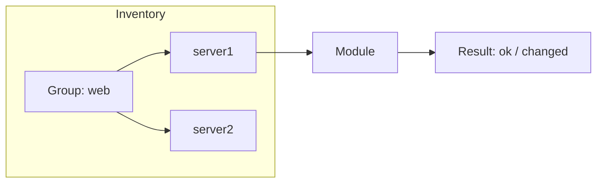
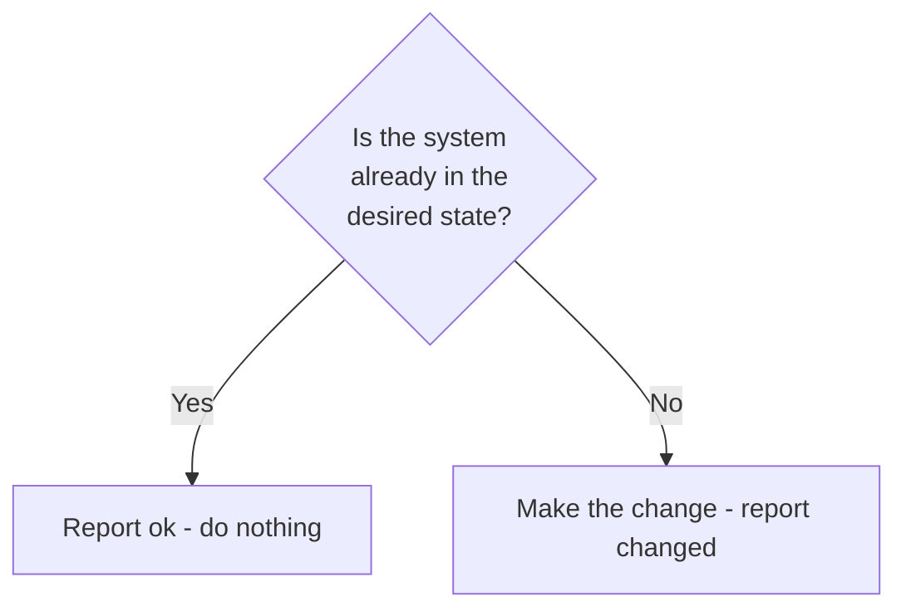

# Module 2: Inventory, Ad Hoc Commands, and Idempotency

> 🧪 Lab commands run from [`bootcamp/lab/`](../lab/) — `cd bootcamp/lab` first. Diagrams render automatically on GitHub.

**Day 1 · Foundations**

---

## Definition

An **inventory** defines the systems Ansible manages. It can start simple — an INI or YAML file — and later come from **dynamic sources** such as NetBox.

**Ad hoc commands** are one-line Ansible commands used for quick tasks or testing.

**Idempotency** means Ansible tries to bring a system to the *desired state* without repeating unnecessary changes. The same run twice should not keep "changing" things that are already correct.

> Bash may run `yum install httpd` every time. The Ansible `package` module first checks whether `httpd` is already installed and only acts if needed.

---

## Diagram / Workflow



Idempotency, visually:



---

## Hands-On Walkthrough

```bash
# Target just the 'web' group
ansible web -m command -a "hostname"

# Use the package module (state-aware) with privilege escalation
ansible web -m package -a "name=httpd state=present" --become

# Make sure the service is started
ansible web -m service -a "name=httpd state=started" --become
```

Talking points:
- Target **one group** (`web`) or **one host** (`server1`) by name.
- `command`, `shell`, `package`, `service` are common modules.
- Prefer **modules over raw shell** when a module exists: modules are structured and state-aware, shell is not.

---

## Quiz

1. What is an ad hoc command?
   - A. A quick one-line Ansible command
   - B. A full AAP workflow
   - C. A Git branch
   - D. A role

2. What does idempotency mean?
   - A. The task always changes something
   - B. The task tries to reach the desired state without unnecessary changes
   - C. The task only works in AAP
   - D. The task only runs on Windows

3. Why prefer Ansible modules over raw shell when possible?
   - A. Modules are more structured and state-aware
   - B. Shell is not supported
   - C. Modules do not need inventory
   - D. Shell cannot run commands

---

## Hands-On Lab — *Install and start a service*

**You will:**
1. Target the `web` group.
2. Install `httpd` using the `package` module.
3. Start `httpd` using the `service` module.
4. Run the **same install command again**.
5. Observe `changed` vs `ok` in the output.

```bash
ansible web -m package -a "name=httpd state=present" --become
ansible web -m service -a "name=httpd state=started" --become
# run the install again and watch the result flip to "ok"
ansible web -m package -a "name=httpd state=present" --become
```

**Success check:**
- [ ] You can explain why the second run shows `ok` instead of `changed`.
- [ ] You can explain the value of idempotency in your own words.

<details>
<summary>Instructor answer key</summary>

1. **A** — A quick one-line Ansible command
2. **B** — Reach desired state without unnecessary changes
3. **A** — Modules are structured and state-aware
</details>
