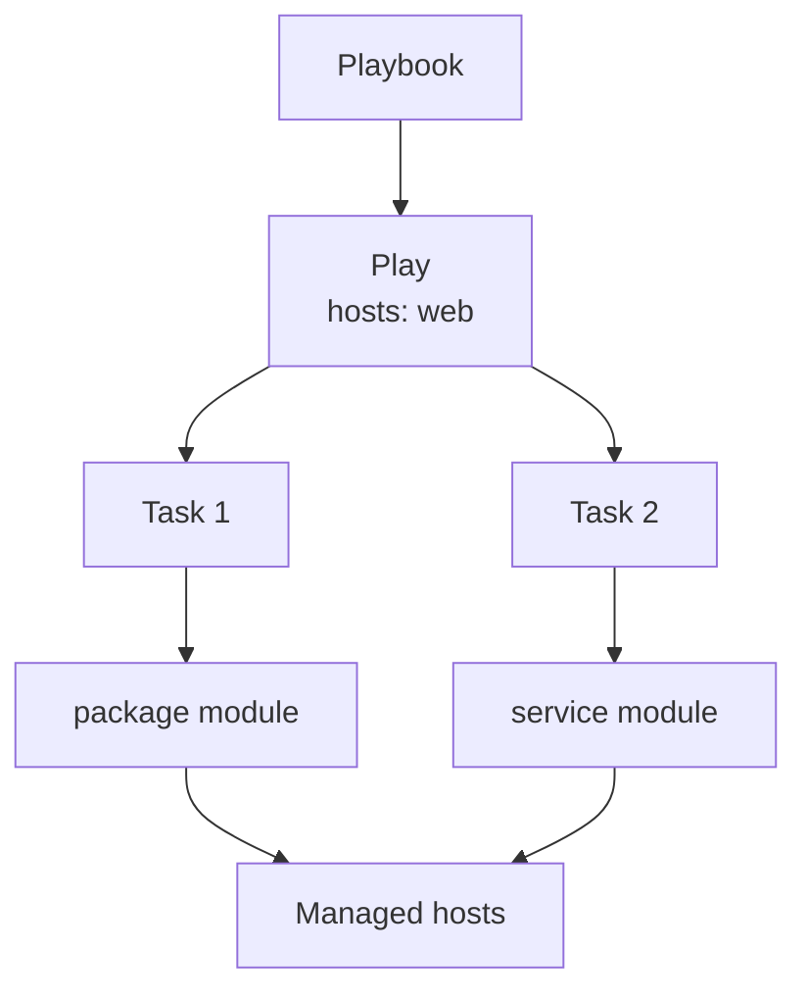

# Module 3: Playbook Basics

> 🧪 Lab commands run from [`bootcamp/lab/`](../lab/) — `cd bootcamp/lab` first. Diagrams render automatically on GitHub.

**Day 1 · Foundations**

---

## Definition

A **playbook** is a YAML file that describes automation in a repeatable way. Instead of typing one command at a time, a playbook defines the desired steps and runs them consistently, in order.

Basic parts of a playbook:

- **Name** — human-readable description of the play
- **Hosts** — which inventory group/host to target
- **Become** — whether to escalate privilege (sudo)
- **Tasks** — the ordered list of actions
- **Modules** — what each task actually uses
- **State** — the desired end condition (e.g. `present`, `started`)

---

## Diagram / Workflow



---

## Hands-On Walkthrough

The instructor builds this live (`playbooks/module3_webserver.yml`):

```yaml
---
- name: Basic web server setup
  hosts: web
  become: true

  tasks:
    - name: Install httpd
      ansible.builtin.package:
        name: httpd
        state: present

    - name: Start and enable httpd
      ansible.builtin.service:
        name: httpd
        state: started
        enabled: true
```

Run it:

```bash
ansible-playbook playbooks/module3_webserver.yml
```

Talking points:
- **Indentation matters** — YAML uses spaces, never tabs.
- Tasks run **top to bottom, in order**.
- `ansible-playbook` is the command that runs a playbook.
- Read the play recap at the end: `ok`, `changed`, `failed`.

---

## Quiz

1. What command runs a playbook?
   - A. `ansible-playbook`
   - B. `ansible-role`
   - C. `ansible-template`
   - D. `ansible-vault` only

2. What does `hosts: web` mean?
   - A. Run against the inventory group named `web`
   - B. Create a web server automatically
   - C. Run only in AAP
   - D. Ignore inventory

3. What does `become: true` usually mean?
   - A. Run with privilege escalation
   - B. Run without inventory
   - C. Convert Bash to Ansible
   - D. Create a role

---

## Hands-On Lab — *Write the first playbook*

**You will:**
1. Create a new playbook (or copy `module3_webserver.yml`).
2. Install a package.
3. Start a service.
4. Run the playbook.
5. **Re-run** the playbook.
6. Review the output both times.

```bash
ansible-playbook playbooks/module3_webserver.yml
ansible-playbook playbooks/module3_webserver.yml   # second run
```

**Success check:**
- [ ] You can explain each line of the playbook.
- [ ] You can run and safely re-run the playbook (idempotent result).

<details>
<summary>Instructor answer key</summary>

1. **A** — `ansible-playbook`
2. **A** — Run against the inventory group named `web`
3. **A** — Run with privilege escalation
</details>
