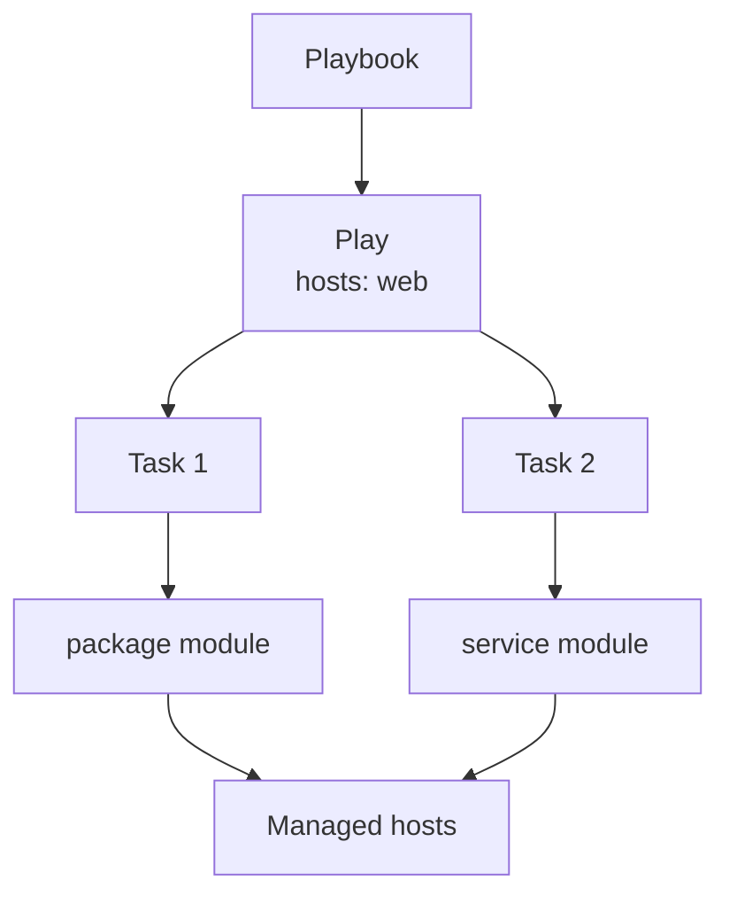

<p align="left">
  <a href="https://github.com/Ansible-workshop-ch/bootcamp/blob/main/module02/inventory-and-idempotency.md" target="_blank">
    
  </a>
</p>

<p align="right">
  <a href="https://github.com/Ansible-workshop-ch/bootcamp/blob/main/module04/variables-and-facts.md" target="_blank">
    
  </a>
</p>

# Module 3: Playbook Basics

> 🧪 Lab commands run from [`bootcamp/lab/`](../lab/) — `cd bootcamp/lab` first. Diagrams render automatically on GitHub.

**Day 1 · Foundations**

---

## Definition

A **playbook** is a YAML file that describes automation in a repeatable way.

Instead of typing one Ansible command at a time, a playbook lets us define multiple steps in one file and run them consistently.

A playbook helps us move from quick ad hoc commands into reusable automation.

Basic parts of a playbook:

* **Name** — human-readable description of the play
* **Hosts** — which inventory group/host to target
* **Become** — whether to escalate privilege, similar to `sudo`
* **Tasks** — the ordered list of actions
* **Modules** — what each task actually uses
* **State** — the desired end condition, such as `present` or `started`

In this lab, the managed containers are Ubuntu-based, so we use:

* Package: `apache2`
* Service: `apache2`

On Red Hat, RHEL, CentOS, or Rocky Linux, the package and service are usually called `httpd`.

---

## Diagram / Workflow

The diagram below shows how a playbook is structured and how Ansible executes it.

A **playbook** is the full YAML automation file.

Inside the playbook, we define a **play**. The play tells Ansible which hosts to target. In this example, the play targets the `web` group from the inventory.

Inside the play, we define multiple **tasks**. Tasks run from top to bottom, in order.

Each task uses an Ansible **module**. A module is the tool Ansible uses to perform the work.

In this example:

* Task 1 uses the `package` module to install Apache
* Task 2 uses the `service` module to start Apache
* Both tasks run against the managed hosts in the `web` group



### Diagram Explanation

The diagram starts with the **Playbook** box.

That represents the YAML file we run with the `ansible-playbook` command.

The playbook points to a **Play**. The play contains `hosts: web`, which means Ansible will run this automation against the `web` group in the inventory.

From that play, Ansible runs the tasks.

Task 1 runs first. It uses the `package` module. In this lab, that task installs the `apache2` package.

Task 2 runs next. It uses the `service` module. In this lab, that task starts the `apache2` service.

Both modules act on the **managed hosts**. These are the systems Ansible is configuring.

In simple terms:

```text
Playbook = the automation file
Play = which hosts to target
Tasks = the steps to run
Modules = the tools Ansible uses to perform each step
Managed hosts = the systems being configured
```

This is the main difference between an ad hoc command and a playbook:

```text
Ad hoc command = one quick task from the terminal
Playbook = multiple tasks saved in a YAML file and reused
```

---

## Hands-On Walkthrough

The instructor builds this live:

```text
playbooks/module3_webserver.yml
```

```yaml
---
- name: Basic web server setup
  hosts: web
  become: true

  tasks:
    - name: Install Apache
      ansible.builtin.package:
        name: apache2
        state: present

    - name: Start Apache
      ansible.builtin.service:
        name: apache2
        state: started
```

Run it:

```bash
ansible-playbook playbooks/module3_webserver.yml
```

Talking points:

* **Indentation matters** — YAML uses spaces, never tabs.
* Tasks run **top to bottom, in order**.
* `ansible-playbook` is the command that runs a playbook.
* `hosts: web` means the playbook targets the `web` group from the inventory.
* `become: true` means Ansible will use privilege escalation when needed.
* The `package` module manages installed software.
* The `service` module manages running services.
* Read the play recap at the end: `ok`, `changed`, `failed`, and `unreachable`.

---

## Quiz

1. What command runs a playbook?

   * A. `ansible-playbook`
   * B. `ansible-role`
   * C. `ansible-template`
   * D. `ansible-vault` only

2. What does `hosts: web` mean?

   * A. Run against the inventory group named `web`
   * B. Create a web server automatically
   * C. Run only in AAP
   * D. Ignore inventory

3. What does `become: true` usually mean?

   * A. Run with privilege escalation
   * B. Run without inventory
   * C. Convert Bash to Ansible
   * D. Create a role

---

## Hands-On Lab — *Write the first playbook*

**You will:**

1. Create a new playbook or copy `module3_webserver.yml`.
2. Install a package.
3. Start a service.
4. Run the playbook.
5. **Re-run** the playbook.
6. Review the output both times.

```bash
ansible-playbook playbooks/module3_webserver.yml
ansible-playbook playbooks/module3_webserver.yml   # second run
```

**Success check:**

* [ ] You can explain each line of the playbook.
* [ ] You can explain what `hosts: web` means.
* [ ] You can explain why `become: true` is needed.
* [ ] You can explain the difference between the `package` module and the `service` module.
* [ ] You can run and safely re-run the playbook.
* [ ] You can explain why the second run should show more `ok` results and fewer `changed` results.

<details>
<summary>Instructor answer key</summary>

1. **A** — `ansible-playbook`
2. **A** — Run against the inventory group named `web`
3. **A** — Run with privilege escalation

</details>

---

<p align="right">
  <a href="https://github.com/Ansible-workshop-ch/bootcamp/blob/main/module02/inventory-and-idempotency.md" target="_blank">
    
  </a>
</p>

<p align="left">
  <a href="https://github.com/Ansible-workshop-ch/bootcamp/blob/main/module02/inventory-and-idempotency.md" target="_blank">
    
  </a>
</p>
