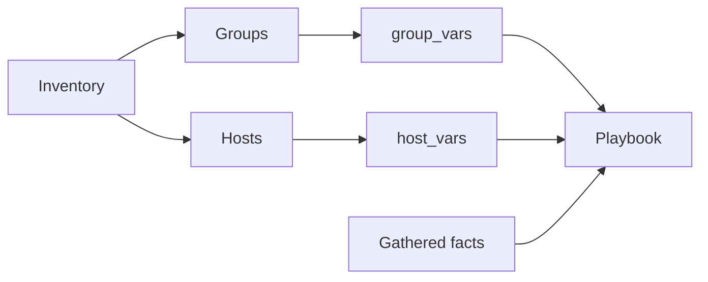
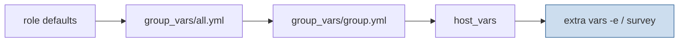

<p align="left">
  <a href="https://github.com/Ansible-workshop-ch/bootcamp/blob/main/module03/playbook-basics.md" target="_blank">
    
  </a>
</p>

<p align="right">
  <a href="https://github.com/Ansible-workshop-ch/bootcamp/blob/main/module05/conditions-loops-handlers-templates.md" target="_blank">
    
  </a>
</p>

# Module 4: Variables, Facts, group_vars, and host_vars

> 🧪 Lab commands run from [`bootcamp/lab/`](../lab/) — `cd bootcamp/lab` first. Diagrams render automatically on GitHub.

**Day 2 · Core Skills** — the heaviest technical day. This module matters a lot for Charter: teams spend real time managing inventory variables and host-specific configuration.

---

## Definition

**Variables** make playbooks flexible. Instead of hardcoding values, Ansible reads them from different sources.

A variable is a name that stores a value.

For example, instead of writing `httpd` directly inside every task, we create a variable:

```yaml
package_name: httpd
```

The playbook can then use:

```yaml
name: "{{ package_name }}"
```

This allows us to change the package name in one place without editing every task.

Common variable sources:

* Playbook variables
* Inventory variables
* `group_vars/` — values shared by a group of hosts
* `host_vars/` — values for one specific host
* **Facts** — system information collected from managed hosts
* **Extra variables** — values passed at runtime (`-e`) or through an AAP survey

A simple way to understand these sources:

| Variable source    | Simple meaning                                 |
| ------------------ | ---------------------------------------------- |
| Playbook variable  | A value written directly inside the playbook   |
| Inventory variable | A value connected to a host or group           |
| `group_vars`       | Shared values for multiple hosts               |
| `host_vars`        | Values for one specific host                   |
| Facts              | Information discovered from the managed system |
| Extra variables    | Values provided when launching the playbook    |

**Facts** are collected automatically unless fact gathering is disabled.

Examples of facts:

* Operating system family
* Hostname
* IP addresses
* CPU information
* Memory information
* Network interfaces

Example:

```yaml
ansible_facts['os_family']
```

Ansible collects facts from the managed hosts when the playbook starts. We normally do not define these values ourselves.

---

## Diagram / Workflow

Where values come from:



### Understanding the diagram

The inventory is the starting point.

The inventory defines:

* Which hosts exist
* Which groups they belong to

Example:

```ini
[web]
server1
server2
```

The inventory creates a group called `web` containing two hosts.

Ansible then looks for matching variable files.

The repository structure is:

```text
inventories/
├── inventory.ini
└── group_vars
    ├── all.yml
    ├── rhel_web.yml
    ├── ubuntu_web.yml
    └── web.yml
```

### Understanding this structure

`inventory.ini` defines the hosts and groups.

Example:

```ini
[web]
server1
server2
```

The `group_vars` directory stores variables connected to inventory groups.

The files are loaded based on their names:

```text
group_vars/all.yml
```

Applies to every host in the inventory.

```text
group_vars/web.yml
```

Applies to every host in the `web` group.

```text
group_vars/rhel_web.yml
```

Applies to hosts in the `rhel_web` group.

```text
group_vars/ubuntu_web.yml
```

Applies to hosts in the `ubuntu_web` group.

The important relationship is:

```text
Inventory group name
        |
        v
Matching group_vars file
```

Example:

```text
[web]
server1
server2
```

loads:

```text
group_vars/web.yml
```

---

Variable precedence (lowest priority first, highest priority last):



### Understanding variable precedence

The same variable can exist in multiple places.

For example:

```text
group_vars/all.yml
group_vars/web.yml
host_vars/server1.yml
```

Ansible must decide which value to use.

This is called **variable precedence**.

The more specific value wins.

Example:

```yaml
# group_vars/all.yml
company: Charter
```

```yaml
# group_vars/web.yml
web_message: "Hello web servers"
```

```yaml
# host_vars/server1.yml
web_message: "Hello server1"
```

Result:

```text
server1 -> Hello server1
server2 -> Hello web servers
```

`server1` receives the host-specific value.

`server2` receives the group value.

Extra variables have the highest priority:

```bash
ansible-playbook playbooks/module4_variables.yml -e "web_message=Runtime message"
```

AAP surveys also provide extra variables and override lower-priority values.

---

## Hands-On Walkthrough

Repo layout used here:

```text
inventories/
├── inventory.ini
└── group_vars
    ├── all.yml
    ├── rhel_web.yml
    ├── ubuntu_web.yml
    └── web.yml

playbooks/
└── module4_variables.yml
```

### Files used in this module

| File                                    | Purpose                           |
| --------------------------------------- | --------------------------------- |
| `inventories/inventory.ini`             | Defines hosts and groups          |
| `inventories/group_vars/all.yml`        | Variables shared by every host    |
| `inventories/group_vars/web.yml`        | Variables shared by web hosts     |
| `inventories/group_vars/rhel_web.yml`   | Variables for RHEL web hosts      |
| `inventories/group_vars/ubuntu_web.yml` | Variables for Ubuntu web hosts    |
| `playbooks/module4_variables.yml`       | Uses variables and displays facts |

---

### File 1: `inventory.ini`

Example:

```ini
[web]
server1
server2

[rhel_web]
server1

[ubuntu_web]
server2
```

This inventory creates three groups:

```text
web
rhel_web
ubuntu_web
```

Ansible uses these names to find matching variable files.

---

### File 2: `group_vars/all.yml`

Example:

```yaml
company: Charter
environment_name: Training
```

This file applies to every host.

Any host in the inventory can use these variables.

---

### File 3: `group_vars/web.yml`

Example:

```yaml
package_name: httpd
service_name: httpd
web_message: "Hello from Ansible - {{ company }} {{ environment_name }}"
```

This file applies only to hosts in the `web` group.

The variables are shared by all web servers.

---

### File 4: `group_vars/rhel_web.yml`

Example:

```yaml
package_name: httpd
service_name: httpd
```

This file contains values specific to RHEL web servers.

---

### File 5: `group_vars/ubuntu_web.yml`

Example:

```yaml
package_name: apache2
service_name: apache2
```

This file contains values specific to Ubuntu web servers.

---

### File 6: `playbooks/module4_variables.yml`

The playbook uses variables loaded from the inventory structure.

Example:

```yaml
- name: Show package name
  ansible.builtin.debug:
    var: package_name
```

Ansible finds the correct value based on the host groups.

For example:

```text
RHEL host:
package_name = httpd

Ubuntu host:
package_name = apache2
```

The playbook does not need separate logic for each operating system.

---

Run it:

```bash
ansible-playbook -i inventories/inventory.ini playbooks/module4_variables.yml
```

### What happens when the command runs

Ansible performs these steps:

```text
1. Read the inventory.
2. Identify hosts and groups.
3. Load matching group_vars files.
4. Connect to managed hosts.
5. Gather facts.
6. Resolve variable precedence.
7. Run playbook tasks.
8. Display results.
```

Students should compare output from different hosts.

A RHEL web server receives:

```text
group_vars/all.yml
group_vars/web.yml
group_vars/rhel_web.yml
```

An Ubuntu web server receives:

```text
group_vars/all.yml
group_vars/web.yml
group_vars/ubuntu_web.yml
```

The most specific matching value is used.

---

### Understanding `debug`

The `debug` module displays information without changing the managed system.

Useful for:

* Checking variable values
* Checking facts
* Troubleshooting
* Confirming precedence behavior

Example:

```yaml
- name: Print package variable
  ansible.builtin.debug:
    var: package_name
```

Example:

```yaml
- name: Print operating system family
  ansible.builtin.debug:
    var: ansible_facts['os_family']
```

---

## Quiz

1. What is the purpose of `group_vars`?

   * A. Store variables for inventory groups
   * B. Store passwords only
   * C. Store playbook output
   * D. Replace inventory completely

2. What are Ansible facts?

   * A. Details collected from managed systems
   * B. Git branches
   * C. AAP job templates
   * D. Encrypted files only

3. Why are variables important?

   * A. They make automation flexible and reusable
   * B. They remove the need for YAML
   * C. They only work with Windows
   * D. They only work in AAP

---

## Hands-On Lab — *Make a playbook flexible with variables*

**You will:**

1. Review the inventory structure.
2. Edit a value in `group_vars/web.yml`.
3. Add or modify values in OS-specific variable files.
4. Use variables inside a playbook.
5. Print facts using `debug`.
6. Re-run the playbook and compare results.

Run:

```bash
ansible-playbook -i inventories/inventory.ini playbooks/module4_variables.yml
```

Edit:

```text
inventories/group_vars/web.yml
```

Change:

```yaml
web_message: "New training message"
```

Run again:

```bash
ansible-playbook -i inventories/inventory.ini playbooks/module4_variables.yml
```

Observe how the playbook behavior changes without changing the tasks.

### Lab file flow

```text
inventory.ini
      |
      v
inventory groups
      |
      +--> group_vars/all.yml
      |
      +--> group_vars/web.yml
      |
      +--> group_vars/rhel_web.yml
      |
      +--> group_vars/ubuntu_web.yml
      |
      v
playbook/module4_variables.yml
      |
      v
managed hosts
```

The key lesson:

```text
Change the data without rewriting the automation.
```

**Success check:**

* [ ] You understand how Ansible loads variables from inventory structure.
* [ ] You can explain the difference between all.yml and group-specific variables.
* [ ] You understand why variable precedence matters.

<details>
<summary>Instructor answer key</summary>

1. **A** — Store variables for inventory groups
2. **A** — Details collected from managed systems
3. **A** — Flexible and reusable automation

</details>

<p align="left">
  <a href="https://github.com/Ansible-workshop-ch/bootcamp/blob/main/module03/playbook-basics.md" target="_blank">
    
  </a>
</p>

<p align="right">
  <a href="https://github.com/Ansible-workshop-ch/bootcamp/blob/main/module05/conditions-loops-handlers-templates.md" target="_blank">
    
  </a>
</p>
