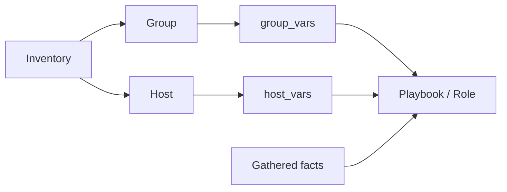
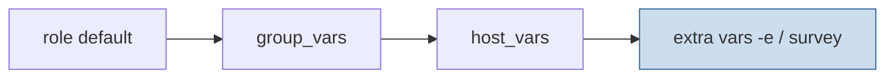

<p align="left">
  <a href="https://github.com/Ansible-workshop-ch/bootcamp/blob/main/module03/playbook-basics.md" target="_blank">
    
  </a>
</p>

<p align="right">
  <a href="https://github.com/Ansible-workshop-ch/bootcamp/blob/main/module05/conditions-loops-handlers-templates.md" target="_blank">
    
  </a>
</p>


# Module 4: Variables, Facts, group_vars, and host_vars

> 🧪 Lab commands run from [`bootcamp/lab/`](../lab/) — `cd bootcamp/lab` first. Diagrams render automatically on GitHub.

**Day 2 · Core Skills** — the heaviest technical day. This module matters a lot for Charter: teams spend real time in group and host variables.

---

## Definition

**Variables** make playbooks flexible. Instead of hardcoding values, Ansible reads them from several places.

Common variable sources:
- Playbook variables
- Inventory variables
- `group_vars/` — values for a **group** of hosts
- `host_vars/` — values for **one specific** host
- **Facts** — system details collected from managed hosts (OS family, IP, hostname, memory, CPU, network)
- **Extra variables** — passed at run time (`-e`) or via an AAP survey

**Facts** are gathered automatically (unless disabled) and can drive logic.

---

## Diagram / Workflow

Where values come from:



Variable precedence (lowest wins first, highest wins last):



> `host_vars` beats `group_vars`. Extra vars beat almost everything. In this repo, `host_vars/server1.yml` overrides `web_message` from `group_vars/web.yml` — only on `server1`.

---

## Hands-On Walkthrough

Repo layout used here:

```text
group_vars/web.yml          # package_name, service_name, web_message
host_vars/server1.yml       # web_message override for server1 only
playbooks/module4_variables.yml
```

`group_vars/web.yml`:

```yaml
package_name: httpd
service_name: httpd
web_message: "Hello from Ansible - {{ company }} {{ environment_name }}"
```

Run it and watch the values and facts print:

```bash
ansible-playbook playbooks/module4_variables.yml
```

Talking points:
- Use `debug` to print a variable or fact.
- `server1` shows a **different** `web_message` than `server2` — that's `host_vars` winning.
- Facts like `ansible_facts['os_family']` can drive conditions (next module).

---

## Quiz

1. What is the purpose of `group_vars`?
   - A. Store variables for a group of hosts
   - B. Store passwords only
   - C. Store playbook output
   - D. Replace inventory completely

2. What are Ansible facts?
   - A. Details collected from managed systems
   - B. Git branches
   - C. AAP job templates
   - D. Encrypted files only

3. Why are variables important?
   - A. They make automation flexible and reusable
   - B. They remove the need for YAML
   - C. They only work with Windows
   - D. They only work in AAP

---

## Hands-On Lab — *Make a playbook flexible with variables*

**You will:**
1. Add or edit a variable in `group_vars/web.yml`.
2. Add a host-specific value in `host_vars/server1.yml`.
3. Use those variables inside a playbook.
4. Print a fact using `debug`.
5. Change a variable and re-run.

```bash
ansible-playbook playbooks/module4_variables.yml
# edit group_vars/web.yml -> change web_message, run again, observe the change
```

**Success check:**
- [ ] You understand how a playbook gets values from variables.
- [ ] You can explain why `group_vars` and `host_vars` matter in Charter repos.

<details>
<summary>Instructor answer key</summary>

1. **A** — Store variables for a group of hosts
2. **A** — Details collected from managed systems
3. **A** — Flexible and reusable automation
</details>

<p align="left">
  <a href="https://github.com/Ansible-workshop-ch/bootcamp/blob/main/module03/playbook-basics.md" target="_blank">
    
  </a>
</p>

<p align="right">
  <a href="https://github.com/Ansible-workshop-ch/bootcamp/blob/main/module05/conditions-loops-handlers-templates.md" target="_blank">
    
  </a>
</p>