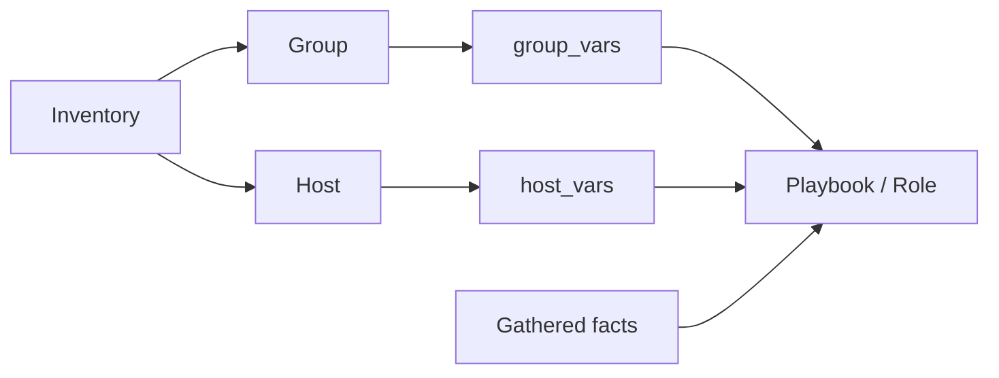

<p align="left">
  <a href="https://github.com/Ansible-workshop-ch/bootcamp/blob/main/module03/playbook-basics.md" target="_blank">
    
  </a>
</p>

<p align="right">
  <a href="https://github.com/Ansible-workshop-ch/bootcamp/blob/main/module05/conditions-loops-handlers-templates.md" target="_blank">
    
  </a>
</p>

# Module 4: Variables, Facts, group_vars, and host_vars

> 🧪 Lab commands run from [`bootcamp/lab/`](../lab/) — `cd bootcamp/lab` first. Diagrams render automatically on GitHub.

**Day 2 · Core Skills** — the heaviest technical day. This module matters a lot for Charter: teams spend real time in group and host variables.

---

## Definition

**Variables** make playbooks flexible. Instead of hardcoding values, Ansible reads them from several places.

A variable is a name that stores a value.

For example, instead of writing `httpd` directly inside every task, we can create a variable called `package_name`.

```yaml
package_name: httpd
```

The playbook can then use:

```yaml
name: "{{ package_name }}"
```

This means we can change the package name in one place instead of editing every task in the playbook.

Common variable sources:

* Playbook variables
* Inventory variables
* `group_vars/` — values for a **group** of hosts
* `host_vars/` — values for **one specific** host
* **Facts** — system details collected from managed hosts (OS family, IP, hostname, memory, CPU, network)
* **Extra variables** — passed at run time (`-e`) or via an AAP survey

A simple way to understand these sources:

| Variable source    | Simple meaning                                        |
| ------------------ | ----------------------------------------------------- |
| Playbook variable  | A value written directly inside the playbook          |
| Inventory variable | A value connected to a host or group in the inventory |
| `group_vars`       | A shared value used by every host in a group          |
| `host_vars`        | A value used by only one specific host                |
| Facts              | Information Ansible discovers from the managed system |
| Extra variables    | Values provided when the playbook starts              |

**Facts** are gathered automatically (unless disabled) and can drive logic.

For example, Ansible can discover whether a system belongs to the Red Hat or Debian operating system family. A playbook can later use that information to select the correct package or service name.

```yaml
ansible_facts['os_family']
```

We do not normally enter facts manually. Ansible collects them from the managed hosts when the playbook starts.

---

## Diagram / Workflow

Where values come from:



### Understanding the diagram

The diagram shows the different places where a playbook can receive information.

The process starts with the **inventory**. The inventory contains groups and individual hosts.

```text
Inventory
├── Group
│   └── group_vars
└── Host
    └── host_vars
```

The **group** represents several systems that share the same purpose or configuration.

For example, the `web` group may contain:

```text
server1
server2
```

The `group_vars/web.yml` file contains values that should be available to every host in the `web` group.

```text
group_vars/web.yml
        |
        +--> server1
        +--> server2
```

The **host** represents one specific managed system.

The `host_vars/server1.yml` file contains values that should only be used by `server1`.

```text
host_vars/server1.yml
        |
        +--> server1 only
```

Both `group_vars` and `host_vars` send their values to the playbook.

Ansible also gathers **facts** from each managed system. These facts include information such as:

* Operating system
* Hostname
* IP addresses
* CPU information
* Memory information
* Network interfaces

The playbook can use all these values while it runs.

The important idea is:

```text
Inventory identifies the systems.
group_vars provides shared values.
host_vars provides host-specific values.
Facts provide information discovered from the systems.
The playbook uses all of them.
```

---

Variable precedence (lowest wins first, highest wins last):


### Understanding variable precedence

Sometimes the same variable is defined in more than one place.

For example, `web_message` may exist in both files:

```text
group_vars/web.yml
host_vars/server1.yml
```

Ansible must decide which value to use. This decision is called **variable precedence**.

The diagram moves from lower priority on the left to higher priority on the right.

```text
Lower priority                                      Higher priority
role default -> group_vars -> host_vars -> extra variables
```

A **role default** is normally a basic fallback value. Ansible uses it when no higher-priority source provides another value.

A value in `group_vars` applies to all hosts in the matching group.

A value in `host_vars` is more specific because it belongs to one host. It overrides the group value for that host.

An **extra variable** is passed when the playbook starts.

For example:

```bash
ansible-playbook playbooks/module4_variables.yml -e "web_message=Runtime message"
```

An AAP survey can also provide an extra variable. Extra variables have very high precedence and override most other variable sources.

This diagram is a simplified version of Ansible variable precedence. Ansible supports additional variable sources, but these are the main sources students will use in this lab.

> `host_vars` beats `group_vars`. Extra vars beat almost everything. In this repo, `host_vars/server1.yml` overrides `web_message` from `group_vars/web.yml` — only on `server1`.

Example:

```yaml
# group_vars/web.yml
web_message: "Hello to every web server"
```

```yaml
# host_vars/server1.yml
web_message: "Hello specifically from server1"
```

The result will be:

```text
server1 -> Hello specifically from server1
server2 -> Hello to every web server
```

The group value is still used by `server2`. Only `server1` receives the host-specific override.

---

## Hands-On Walkthrough

Repo layout used here:

```text
group_vars/web.yml          # package_name, service_name, web_message
host_vars/server1.yml       # web_message override for server1 only
playbooks/module4_variables.yml
```

### Files used in this module

This module uses three main files:

| File                              | Purpose                                                         |
| --------------------------------- | --------------------------------------------------------------- |
| `group_vars/web.yml`              | Stores values shared by every host in the `web` inventory group |
| `host_vars/server1.yml`           | Stores values used only by `server1`                            |
| `playbooks/module4_variables.yml` | Runs the tasks and displays the variables and facts             |

The folder and file names matter.

Ansible connects the `web.yml` file to the inventory group named `web`.

```text
Inventory group name: web
Variable file: group_vars/web.yml
```

Ansible connects the `server1.yml` file to the inventory host named `server1`.

```text
Inventory host name: server1
Variable file: host_vars/server1.yml
```

The names must match the names used in the inventory.

For example:

```ini
[web]
server1
server2
```

Ansible automatically looks for:

```text
group_vars/web.yml
host_vars/server1.yml
host_vars/server2.yml
```

We do not need to manually import these files into the playbook. Ansible loads them when it finds matching group and host names.

---

### File 1: `group_vars/web.yml`

`group_vars/web.yml`:

```yaml
package_name: httpd
service_name: httpd
web_message: "Hello from Ansible - {{ company }} {{ environment_name }}"
```

This file stores shared values for the `web` group.

```yaml
package_name: httpd
```

This creates a variable called `package_name`. Its value is `httpd`.

A playbook can use it like this:

```yaml
name: "{{ package_name }}"
```

```yaml
service_name: httpd
```

This creates a variable called `service_name`. The playbook can use it when managing the web service.

```yaml
web_message: "Hello from Ansible - {{ company }} {{ environment_name }}"
```

This variable contains two other variables:

```text
{{ company }}
{{ environment_name }}
```

The double curly brackets tell Ansible to replace the variable names with their actual values.

For example, when:

```yaml
company: Charter
environment_name: Training
```

The final message becomes:

```text
Hello from Ansible - Charter Training
```

Every host in the `web` group can use these values unless a more specific value overrides them.

---

### File 2: `host_vars/server1.yml`

This file stores values that belong only to `server1`.

For example:

```yaml
web_message: "Special message from server1"
```

The same variable, `web_message`, already exists in `group_vars/web.yml`.

Because `host_vars` is more specific than `group_vars`, Ansible uses the value from `host_vars/server1.yml` when running against `server1`.

It does not change the value for `server2`.

```text
server1 uses host_vars/server1.yml
server2 continues using group_vars/web.yml
```

This is useful when most systems share the same configuration but one system needs a different value.

Examples include:

* A different IP address
* A different application port
* A different environment name
* A different message
* A host-specific storage path
* A host-specific maintenance window

---

### File 3: `playbooks/module4_variables.yml`

This is the playbook that uses the variables and facts.

The playbook does not need to contain every value directly. It can reference values loaded from `group_vars` and `host_vars`.

For example:

```yaml
- name: Show the package name
  ansible.builtin.debug:
    var: package_name
```

The playbook asks Ansible to print `package_name`. Ansible finds the value in `group_vars/web.yml`.

To display the host-specific message:

```yaml
- name: Show the web message
  ansible.builtin.debug:
    var: web_message
```

For `server1`, Ansible uses the value from `host_vars/server1.yml`.

For another host in the `web` group, Ansible uses the value from `group_vars/web.yml`.

The playbook can also display a gathered fact:

```yaml
- name: Show the operating system family
  ansible.builtin.debug:
    var: ansible_facts['os_family']
```

The fact does not come from `group_vars` or `host_vars`. Ansible collects it from the managed system.

---

Run it and watch the values and facts print:

```bash
ansible-playbook playbooks/module4_variables.yml
```

### What happens when the command runs

When this command starts, Ansible performs these steps:

```text
1. Read the playbook.
2. Read the inventory.
3. Find the targeted hosts.
4. Load matching group_vars files.
5. Load matching host_vars files.
6. Connect to the managed hosts.
7. Gather system facts.
8. Resolve variable precedence.
9. Run the playbook tasks.
10. Display the results.
```

Students should compare the output from `server1` and `server2`.

If both systems belong to the `web` group, both systems receive the shared variables from:

```text
group_vars/web.yml
```

However, `server1` also receives its host-specific variables from:

```text
host_vars/server1.yml
```

When both files define `web_message`, the host-specific value wins only for `server1`.

Talking points:

* Use `debug` to print a variable or fact.
* `server1` shows a **different** `web_message` than `server2` — that's `host_vars` winning.
* Facts like `ansible_facts['os_family']` can drive conditions (next module).

### Understanding `debug`

The `debug` module displays information without changing the managed system.

It is useful for:

* Checking a variable value
* Checking a gathered fact
* Troubleshooting unexpected values
* Confirming which variable source won
* Understanding what a playbook sees while it runs

Examples:

```yaml
- name: Print one variable
  ansible.builtin.debug:
    var: web_message
```

```yaml
- name: Print a custom message
  ansible.builtin.debug:
    msg: "The current package is {{ package_name }}"
```

The first example prints the variable and its value.

The second example places the variable inside a sentence.

---

## Quiz

1. What is the purpose of `group_vars`?

   * A. Store variables for a group of hosts
   * B. Store passwords only
   * C. Store playbook output
   * D. Replace inventory completely

2. What are Ansible facts?

   * A. Details collected from managed systems
   * B. Git branches
   * C. AAP job templates
   * D. Encrypted files only

3. Why are variables important?

   * A. They make automation flexible and reusable
   * B. They remove the need for YAML
   * C. They only work with Windows
   * D. They only work in AAP

---

## Hands-On Lab — *Make a playbook flexible with variables*

**You will:**

1. Add or edit a variable in `group_vars/web.yml`.
2. Add a host-specific value in `host_vars/server1.yml`.
3. Use those variables inside a playbook.
4. Print a fact using `debug`.
5. Change a variable and re-run.

```bash
ansible-playbook playbooks/module4_variables.yml
# edit group_vars/web.yml -> change web_message, run again, observe the change
```

### Lab file flow

During the lab, the files work together like this:

```text
group_vars/web.yml
        |
        | shared values
        v
playbooks/module4_variables.yml
        |
        | runs against
        v
server1 and server2
```

For `server1`, Ansible also loads:

```text
host_vars/server1.yml
        |
        | server1-specific value
        v
server1
```

The final variable value is selected before the task runs.

Students should first run the playbook without changing anything and record the original output.

Next, edit:

```text
group_vars/web.yml
```

Change the value of `web_message`.

Run the playbook again:

```bash
ansible-playbook playbooks/module4_variables.yml
```

The hosts using the group value should display the new message.

If `server1` still displays its original host-specific message, that is correct. Its `host_vars` value has higher precedence than the value in `group_vars`.

This proves that the playbook logic stayed the same while the data changed.

That is one of the main benefits of variables:

```text
Change the data without rewriting the automation.
```

**Success check:**

* [ ] You understand how a playbook gets values from variables.
* [ ] You can explain why `group_vars` and `host_vars` matter in Charter repos.

<details>
<summary>Instructor answer key</summary>

1. **A** — Store variables for a group of hosts
2. **A** — Details collected from managed systems
3. **A** — Flexible and reusable automation

</details>

<p align="left">
  <a href="https://github.com/Ansible-workshop-ch/bootcamp/blob/main/module03/playbook-basics.md" target="_blank">
    
  </a>
</p>

<p align="right">
  <a href="https://github.com/Ansible-workshop-ch/bootcamp/blob/main/module05/conditions-loops-handlers-templates.md" target="_blank">
    
  </a>
</p>
