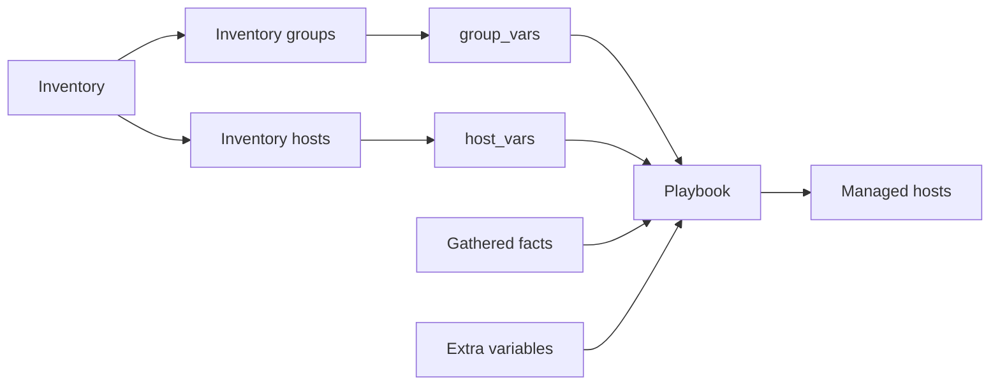
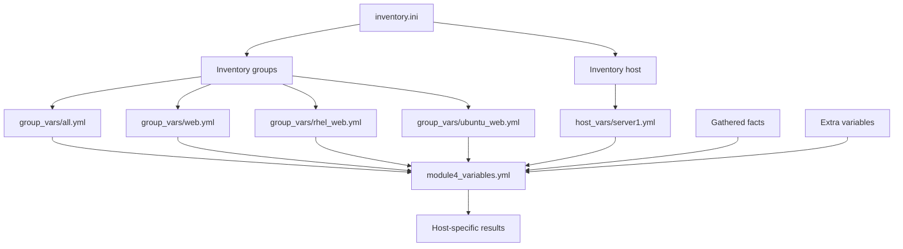

<p align="left">
  <a href="https://github.com/Ansible-workshop-ch/bootcamp/blob/main/module03/playbook-basics.md" target="_blank">
    
  </a>
</p>

<p align="right">
  <a href="https://github.com/Ansible-workshop-ch/bootcamp/blob/main/module05/conditions-loops-handlers-templates.md" target="_blank">
    
  </a>
</p>

# Module 4: Variables, Facts, group_vars, and host_vars

> 🧪 Lab commands run from [`bootcamp/lab/`](../lab/) - run `cd bootcamp/lab` first. Diagrams render automatically on GitHub.

**Day 2 - Core Skills** - This module explains how Ansible stores, loads, and overrides configuration values.

---

## Definition

### Learning objectives

By the end of this module, you should be able to:

* Explain why Ansible variables are useful.
* Use `group_vars` for values shared by a group.
* Use `host_vars` for values assigned to one host.
* Read system information from Ansible facts.
* Explain which value wins when a variable is defined more than once.
* Override variables when launching a playbook.

---

### Variables

A variable is a name that stores a value.

Variables prevent us from hardcoding the same value throughout a playbook.

Instead of writing the package name directly:

```yaml
name: httpd
```

Define it as a variable:

```yaml
package_name: httpd
```

Then reference the variable:

```yaml
name: "{{ package_name }}"
```

The value can now change without rewriting the task.

Variables make playbooks:

* Flexible
* Reusable
* Easier to maintain
* Easier to use across different operating systems
* Easier to use across different environments

---

### Common variable sources

| Variable source | Purpose | Example |
| --- | --- | --- |
| Playbook variables | Values defined inside a playbook | `vars:` |
| Inventory variables | Values attached to inventory hosts or groups | `server1 web_port=8080` |
| `group_vars` | Values shared by an inventory group | `group_vars/rhel_web.yml` |
| `host_vars` | Values assigned to one inventory host | `host_vars/server1.yml` |
| Facts | Information collected from a managed host | `ansible_facts['os_family']` |
| Extra variables | Values supplied when launching a playbook | `-e "web_message=Hello"` |

---

### group_vars

The `group_vars` directory stores variables for inventory groups.

For example, this inventory defines a group named `rhel_web`:

```ini
[rhel_web]
server1
```

Ansible automatically looks for:

```text
inventories/group_vars/rhel_web.yml
```

Variables inside that file apply to hosts in the `rhel_web` group.

Example:

```yaml
package_name: httpd
service_name: httpd
```

Common `group_vars` files include:

```text
group_vars/all.yml
group_vars/web.yml
group_vars/rhel_web.yml
group_vars/ubuntu_web.yml
```

Their purposes are:

| File | Applies to |
| --- | --- |
| `group_vars/all.yml` | Every host in the inventory |
| `group_vars/web.yml` | Hosts in the `web` group |
| `group_vars/rhel_web.yml` | Hosts in the `rhel_web` group |
| `group_vars/ubuntu_web.yml` | Hosts in the `ubuntu_web` group |

---

### host_vars

The `host_vars` directory stores variables for one specific inventory host.

For example, this inventory contains a host named `server1`:

```ini
[rhel_web]
server1
```

Ansible automatically looks for:

```text
inventories/host_vars/server1.yml
```

Example:

```yaml
web_message: "Hello specifically from server1"
```

This value applies only to `server1`.

The filename must match the inventory hostname:

```text
Inventory host:
server1

Matching variable file:
host_vars/server1.yml
```

---

### Facts

Facts are system details collected from managed hosts.

Ansible normally gathers facts automatically when a play starts.

Common facts include:

* Hostname
* Operating system family
* Distribution name
* IP addresses
* CPU count
* Memory
* Network interfaces
* System architecture

Examples:

```yaml
ansible_facts['hostname']
ansible_facts['os_family']
ansible_facts['distribution']
ansible_facts['default_ipv4']['address']
ansible_facts['memtotal_mb']
```

Fact gathering is enabled by default.

It can be disabled with:

```yaml
gather_facts: false
```

A playbook that needs facts should use:

```yaml
gather_facts: true
```

---

### Variable loading workflow



Ansible follows this general process:

```text
1. Read the inventory.
2. Identify the hosts and groups.
3. Load matching group_vars files.
4. Load matching host_vars files.
5. Connect to the managed hosts.
6. Gather facts.
7. Resolve variable values.
8. Run the playbook tasks.
```

---

### Variable precedence

A variable can be defined in more than one location.

Ansible must decide which value to use.

This is called **variable precedence**.

For this lab, use this simplified order from lower priority to higher priority:

```text
group_vars/all.yml
        |
        v
group_vars/<group_name>.yml
        |
        v
host_vars/<host_name>.yml
        |
        v
extra variables: -e or AAP survey
```

Example group value:

```yaml
# group_vars/web.yml
web_message: "Hello web servers"
```

Example host value:

```yaml
# host_vars/server1.yml
web_message: "Hello server1"
```

Result:

```text
server1 -> Hello server1
server2 -> Hello web servers
```

The host-specific value overrides the group value for `server1`.

An extra variable overrides both values:

```bash
ansible-playbook playbooks/module4_variables.yml \
  -e "web_message=Runtime message"
```

AAP surveys also provide extra variables.

---

## Hands-On Walkthrough

### Repository structure

This module uses the following structure:

```text
lab/
|-- ansible.cfg
|-- inventories/
|   |-- inventory.ini
|   |-- group_vars/
|   |   |-- all.yml
|   |   |-- web.yml
|   |   |-- rhel_web.yml
|   |   `-- ubuntu_web.yml
|   `-- host_vars/
|       `-- server1.yml
`-- playbooks/
    `-- module4_variables.yml
```

---

### Step 1: Review the inventory

Open:

```text
inventories/inventory.ini
```

Example:

```ini
[web]
server1
server2

[rhel_web]
server1

[ubuntu_web]
server2
```

The hosts belong to these groups:

| Host | Inventory groups |
| --- | --- |
| `server1` | `web` and `rhel_web` |
| `server2` | `web` and `ubuntu_web` |

The group names connect the inventory to matching `group_vars` files.

---

### Step 2: Create variables for every host

Create:

```text
inventories/group_vars/all.yml
```

Add:

```yaml
---
company: Charter
environment_name: Training
```

These values are available to every host in the inventory.

---

### Step 3: Create variables for the web group

Create:

```text
inventories/group_vars/web.yml
```

Add:

```yaml
---
web_message: "Hello from {{ company }} {{ environment_name }}"
```

This value is available to every host in the `web` group.

Because the value contains other variables, Ansible resolves:

```yaml
"{{ company }}"
```

and:

```yaml
"{{ environment_name }}"
```

Expected result:

```text
Hello from Charter Training
```

---

### Step 4: Create variables for RHEL web hosts

Create:

```text
inventories/group_vars/rhel_web.yml
```

Add:

```yaml
---
package_name: httpd
service_name: httpd
```

These values apply to hosts in the `rhel_web` group.

---

### Step 5: Create variables for Ubuntu web hosts

Create:

```text
inventories/group_vars/ubuntu_web.yml
```

Add:

```yaml
---
package_name: apache2
service_name: apache2
```

These values apply to hosts in the `ubuntu_web` group.

The playbook can now use the same variable names for both operating systems:

```yaml
package_name
service_name
```

The values change based on inventory group membership.

---

### Step 6: Create a host-specific override

Create the directory if it does not exist:

```bash
mkdir -p inventories/host_vars
```

Create:

```text
inventories/host_vars/server1.yml
```

Add:

```yaml
---
web_message: "Hello specifically from server1"
```

This value overrides the value from:

```text
inventories/group_vars/web.yml
```

The override applies only to `server1`.

Expected messages:

```text
server1 -> Hello specifically from server1
server2 -> Hello from Charter Training
```

---

### Step 7: Create the playbook

Create:

```text
playbooks/module4_variables.yml
```

Add:

```yaml
---
- name: Demonstrate variables and facts
  hosts: web
  gather_facts: true

  tasks:
    - name: Display resolved variables
      ansible.builtin.debug:
        msg:
          - "Inventory host: {{ inventory_hostname }}"
          - "Package: {{ package_name }}"
          - "Service: {{ service_name }}"
          - "Message: {{ web_message }}"

    - name: Display selected facts
      ansible.builtin.debug:
        msg:
          - "Hostname: {{ ansible_facts['hostname'] }}"
          - "Operating system family: {{ ansible_facts['os_family'] }}"
          - "Distribution: {{ ansible_facts['distribution'] }}"
          - "Memory in MB: {{ ansible_facts['memtotal_mb'] }}"
```

---

### Understanding the playbook

The play targets:

```yaml
hosts: web
```

This means the play runs against hosts in the `web` group.

Fact gathering is enabled:

```yaml
gather_facts: true
```

The first task displays resolved variables:

```yaml
- name: Display resolved variables
  ansible.builtin.debug:
```

The second task displays facts collected from each managed host:

```yaml
- name: Display selected facts
  ansible.builtin.debug:
```

The `debug` module displays information without changing the managed system.

It is useful for:

* Checking variable values
* Viewing facts
* Troubleshooting playbooks
* Confirming variable precedence
* Testing Jinja2 expressions

---

### Step 8: Validate the inventory

Display the inventory graph:

```bash
ansible-inventory -i inventories/inventory.ini --graph
```

Expected structure:

```text
@all:
  |--@ungrouped:
  |--@web:
  |  |--server1
  |  |--server2
  |--@rhel_web:
  |  |--server1
  |--@ubuntu_web:
     |--server2
```

---

### Step 9: Display variables for one host

Display the variables resolved for `server1`:

```bash
ansible-inventory -i inventories/inventory.ini \
  --host server1
```

Look for values such as:

```json
{
  "company": "Charter",
  "environment_name": "Training",
  "package_name": "httpd",
  "service_name": "httpd",
  "web_message": "Hello specifically from server1"
}
```

---

### Step 10: Check the playbook syntax

Run:

```bash
ansible-playbook -i inventories/inventory.ini \
  playbooks/module4_variables.yml \
  --syntax-check
```

Expected result:

```text
playbook: playbooks/module4_variables.yml
```

A syntax check validates the YAML and playbook structure without running the tasks.

---

### Step 11: Run the playbook

Run:

```bash
ansible-playbook -i inventories/inventory.ini \
  playbooks/module4_variables.yml
```

Expected variable behavior:

| Host | Package | Service | Message source |
| --- | --- | --- | --- |
| `server1` | `httpd` | `httpd` | `host_vars/server1.yml` |
| `server2` | `apache2` | `apache2` | `group_vars/web.yml` |

Students should compare the output returned by each host.

---

### Step 12: Test an extra variable

Run:

```bash
ansible-playbook -i inventories/inventory.ini \
  playbooks/module4_variables.yml \
  -e "web_message=Runtime message"
```

Expected result:

```text
server1 -> Runtime message
server2 -> Runtime message
```

The extra variable overrides both:

```text
group_vars/web.yml
host_vars/server1.yml
```

---

## Quiz

1. What is the purpose of `group_vars`?

   * A. Store variables for inventory groups
   * B. Store playbook output
   * C. Replace the inventory
   * D. Store only encrypted passwords

2. Which file applies variables to every host in the inventory?

   * A. `group_vars/all.yml`
   * B. `host_vars/all.yml`
   * C. `inventory/all.yml`
   * D. `playbooks/all.yml`

3. What is the purpose of `host_vars`?

   * A. Store variables for one inventory host
   * B. Store variables for every host
   * C. Replace the playbook
   * D. Store Ansible logs

4. What are Ansible facts?

   * A. System details collected from managed hosts
   * B. Git branch information
   * C. AAP job templates
   * D. Values that must always be entered manually

5. Which setting enables fact gathering?

   * A. `gather_facts: true`
   * B. `facts: start`
   * C. `collect_system: yes`
   * D. `ansible_facts: enabled`

6. Which source has the highest priority in this module's simplified precedence order?

   * A. `group_vars/all.yml`
   * B. Group variables
   * C. Host variables
   * D. Extra variables passed with `-e` or an AAP survey

7. Which module displays variables and facts without changing a managed host?

   * A. `ansible.builtin.copy`
   * B. `ansible.builtin.debug`
   * C. `ansible.builtin.package`
   * D. `ansible.builtin.service`

8. Which command displays the resolved inventory variables for `server1`?

   * A. `ansible-inventory -i inventories/inventory.ini --host server1`
   * B. `ansible server1 --variables`
   * C. `ansible-playbook --host server1`
   * D. `ansible-inventory --delete server1`

---

## Hands-On Lab - *Make a playbook flexible with variables and facts*

### Goal

Use `group_vars`, `host_vars`, facts, and extra variables to make one playbook behave differently across multiple hosts.

---

### You will

1. Review the inventory groups.
2. Create shared variables in `group_vars`.
3. Create an override in `host_vars`.
4. Display resolved variables.
5. Display gathered facts.
6. Test variable precedence.
7. Override values at runtime.

---

### Task 1: Verify the inventory

Run:

```bash
ansible-inventory -i inventories/inventory.ini --graph
```

Confirm that the inventory contains:

```text
web
rhel_web
ubuntu_web
```

Confirm that:

```text
server1 belongs to web and rhel_web
server2 belongs to web and ubuntu_web
```

---

### Task 2: Review the shared variables

Review:

```text
inventories/group_vars/all.yml
inventories/group_vars/web.yml
inventories/group_vars/rhel_web.yml
inventories/group_vars/ubuntu_web.yml
```

Confirm that:

```text
all.yml contains shared organization values
web.yml contains the shared web message
rhel_web.yml contains RHEL package and service names
ubuntu_web.yml contains Ubuntu package and service names
```

---

### Task 3: Create a host-specific variable

Create:

```text
inventories/host_vars/server1.yml
```

Add:

```yaml
---
web_message: "This message comes from host_vars"
```

---

### Task 4: Display the resolved values

Run:

```bash
ansible-inventory -i inventories/inventory.ini \
  --host server1
```

Find:

```text
web_message
package_name
service_name
company
environment_name
```

Run the same command for `server2`:

```bash
ansible-inventory -i inventories/inventory.ini \
  --host server2
```

Compare the values returned for both hosts.

---

### Task 5: Add another fact to the playbook

Add this task to:

```text
playbooks/module4_variables.yml
```

Task:

```yaml
- name: Display processor information
  ansible.builtin.debug:
    msg:
      - "Processor count: {{ ansible_facts['processor_count'] }}"
      - "Processor cores: {{ ansible_facts['processor_cores'] }}"
```

---

### Task 6: Run the playbook

Run:

```bash
ansible-playbook -i inventories/inventory.ini \
  playbooks/module4_variables.yml
```

Confirm that:

* `server1` uses `httpd`.
* `server2` uses `apache2`.
* `server1` receives the value from `host_vars/server1.yml`.
* `server2` receives the value from `group_vars/web.yml`.
* Facts are displayed for both hosts.

---

### Task 7: Change a group variable

Edit:

```text
inventories/group_vars/web.yml
```

Change:

```yaml
web_message: "New message from group_vars"
```

Run the playbook again:

```bash
ansible-playbook -i inventories/inventory.ini \
  playbooks/module4_variables.yml
```

Expected behavior:

```text
server1 -> Still uses its host_vars value
server2 -> Uses the new group_vars value
```

---

### Task 8: Override the message at runtime

Run:

```bash
ansible-playbook -i inventories/inventory.ini \
  playbooks/module4_variables.yml \
  -e "web_message=Message from extra variables"
```

Expected behavior:

```text
server1 -> Message from extra variables
server2 -> Message from extra variables
```

The extra variable has a higher priority than both `group_vars` and `host_vars`.

---

### Task 9: Query all gathered facts

Run:

```bash
ansible web -i inventories/inventory.ini \
  -m ansible.builtin.setup
```

To filter the output, run:

```bash
ansible web -i inventories/inventory.ini \
  -m ansible.builtin.setup \
  -a "filter=ansible_distribution*"
```

To display memory facts:

```bash
ansible web -i inventories/inventory.ini \
  -m ansible.builtin.setup \
  -a "filter=ansible_memtotal_mb"
```

---

### Lab workflow



---

### Success check

* [ ] I can explain why variables are useful.
* [ ] I can explain the difference between `group_vars` and `host_vars`.
* [ ] I understand how Ansible matches variable files to inventory names.
* [ ] I can display variables with `ansible.builtin.debug`.
* [ ] I can display gathered facts.
* [ ] I can identify which variable value wins and explain why.
* [ ] I can override a variable with `-e`.
* [ ] I can change playbook behavior without rewriting its tasks.

---

### Key lesson

```text
Keep automation logic in the playbook and keep changing data in variable files.
```

---

<details>
<summary>Instructor answer key</summary>

1. **A** - Store variables for inventory groups
2. **A** - `group_vars/all.yml`
3. **A** - Store variables for one inventory host
4. **A** - System details collected from managed hosts
5. **A** - `gather_facts: true`
6. **D** - Extra variables passed with `-e` or an AAP survey
7. **B** - `ansible.builtin.debug`
8. **A** - `ansible-inventory -i inventories/inventory.ini --host server1`

</details>

<p align="left">
  <a href="https://github.com/Ansible-workshop-ch/bootcamp/blob/main/module03/playbook-basics.md" target="_blank">
    
  </a>
</p>

<p align="right">
  <a href="https://github.com/Ansible-workshop-ch/bootcamp/blob/main/module05/conditions-loops-handlers-templates.md" target="_blank">
    
  </a>
</p>