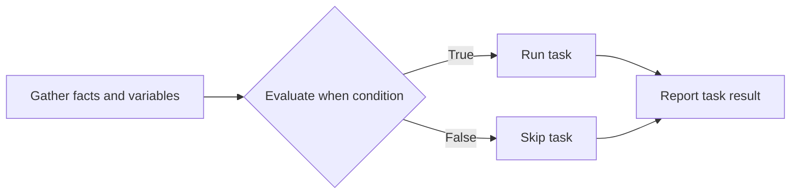
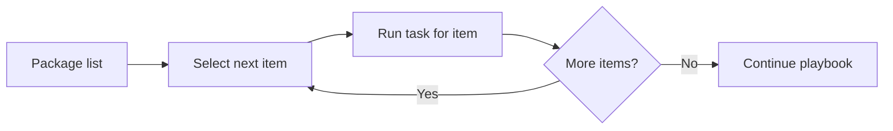
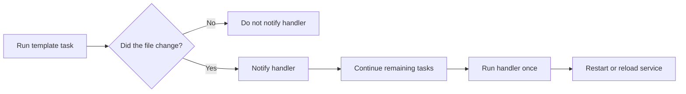
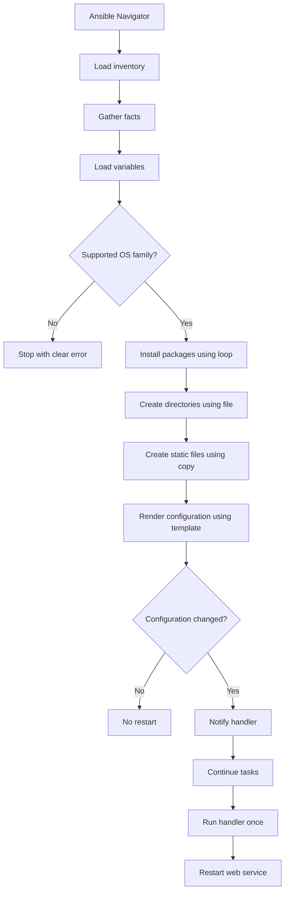
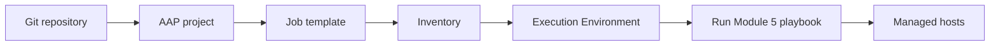

<p align="left">
  <a href="https://github.com/Ansible-workshop-ch/bootcamp/blob/main/module04/variables-and-facts.md" target="_blank">
    
  </a>
</p>

<p align="right">
  <a href="https://github.com/Ansible-workshop-ch/bootcamp/blob/main/module06/roles-and-code-first.md" target="_blank">
    
  </a>
</p>

# Module 5: Conditions, Loops, Handlers, Files, and Templates

> 🧪 Lab commands run from [`bootcamp/lab/`](../lab/)
> Run `cd bootcamp/lab` before beginning.

**Day 2 · Core Skills**

In this module, playbooks become dynamic. Instead of running every task against every host, Ansible can make decisions, process lists, generate configuration files, and restart services only when necessary.

---

## Learning Objectives

By the end of this module, you will be able to:

* Control task execution with `when`.
* Repeat tasks using `loop`.
* Manage directories and static files.
* Generate dynamic files with Jinja2 templates.
* Notify handlers when configuration changes.
* Avoid unnecessary service restarts.
* Validate idempotency by running automation multiple times.
* Run and inspect playbooks using Ansible Navigator.

---

## Ansible Navigator First

Confirm that Ansible Navigator is available:

```bash
ansible-navigator --version
```

Inspect the inventory before running the playbook:

```bash
ansible-navigator inventory \
  -i inventories/inventory.ini \
  --graph \
  --mode stdout
```

Run the module playbook:

```bash
ansible-navigator run \
  playbooks/module5_template_deploy.yml \
  -i inventories/inventory.ini \
  --mode stdout
```

If the training workstation is using locally installed Ansible instead of an Execution Environment, append:

```bash
--ee false
```

Example:

```bash
ansible-navigator run \
  playbooks/module5_template_deploy.yml \
  -i inventories/inventory.ini \
  --mode stdout \
  --ee false
```

---

# 1. Conditions

## Definition

A **condition** controls whether Ansible runs or skips a task.

Conditions use the `when` keyword and can evaluate:

* Ansible facts
* Inventory variables
* Registered task results
* Boolean values
* Loop items
* Host or group information

A condition is evaluated separately for every managed host.

---

## Condition Workflow



---

## Basic Condition

Run a task only on Red Hat systems:

```yaml
- name: Display Red Hat message
  ansible.builtin.debug:
    msg: "This host belongs to the Red Hat OS family."
  when: ansible_facts['os_family'] == "RedHat"
```

Run a task only on Debian systems:

```yaml
- name: Display Debian message
  ansible.builtin.debug:
    msg: "This host belongs to the Debian OS family."
  when: ansible_facts['os_family'] == "Debian"
```

Do not place `{{ }}` around a variable inside a basic `when` expression.

Correct:

```yaml
when: ansible_facts['os_family'] == "RedHat"
```

Incorrect:

```yaml
when: "{{ ansible_facts['os_family'] == 'RedHat' }}"
```

---

# 2. Loops

## Definition

A **loop** repeats the same task for multiple items.

Instead of writing three separate package tasks, one task can process a list.

---

## Without a Loop

```yaml
- name: Install vim
  ansible.builtin.package:
    name: vim
    state: present

- name: Install git
  ansible.builtin.package:
    name: git
    state: present

- name: Install curl
  ansible.builtin.package:
    name: curl
    state: present
```

This works, but it repeats the same task structure.

---

## With a Loop

```yaml
- name: Install common packages
  ansible.builtin.package:
    name: "{{ item }}"
    state: present
  loop:
    - vim
    - git
    - curl
```

During each loop iteration, the current value is available through:

```yaml
{{ item }}
```

---

## Loop Using a Variable

```yaml
common_packages:
  - vim
  - git
  - curl
```

The task can then use the variable:

```yaml
- name: Install common packages
  ansible.builtin.package:
    name: "{{ item }}"
    state: present
  loop: "{{ common_packages }}"
```

---

## Loop Workflow



---

# 3. Managing Files

Ansible provides several modules for managing files.

## `ansible.builtin.file`

The `file` module manages filesystem objects and their properties.

It can:

* Create directories
* Create symbolic links
* Create empty files
* Set ownership
* Set permissions
* Remove files or directories

Example:

```yaml
- name: Create Charter training directory
  ansible.builtin.file:
    path: /etc/charter
    state: directory
    owner: root
    group: root
    mode: "0755"
```

---

## `ansible.builtin.copy`

The `copy` module transfers static content or creates a file with fixed content.

Example:

```yaml
- name: Create a static training file
  ansible.builtin.copy:
    dest: /etc/charter/module5.txt
    content: |
      Managed by Ansible
      Module: 5
    owner: root
    group: root
    mode: "0644"
```

Use `copy` when the file content is the same for every applicable host.

---

## `ansible.builtin.template`

The `template` module generates a file from variables.

Use `template` when file content changes based on:

* Hostname
* Operating system
* Environment
* Inventory group
* Application settings
* User-defined variables

---

## File Module Comparison

| Module     | Main purpose              | Typical example                       |
| ---------- | ------------------------- | ------------------------------------- |
| `file`     | Manage filesystem objects | Create a directory or symbolic link   |
| `copy`     | Deploy static content     | Copy a fixed configuration file       |
| `template` | Generate dynamic content  | Build a configuration using variables |

---

# 4. Templates and Jinja2

## Definition

A **template** is a text file containing Jinja2 expressions.

Template files normally use the `.j2` extension.

Example:

```text
templates/index.html.j2
```

Jinja2 inserts variable values while Ansible renders the destination file.

---

## Basic Template

```jinja2
<h1>{{ web_message }}</h1>
<p>Host: {{ inventory_hostname }}</p>
<p>Environment: {{ web_environment }}</p>
```

For the following variables:

```yaml
web_message: "Charter Ansible Training"
web_environment: "training"
```

Ansible could generate:

```html
<h1>Charter Ansible Training</h1>
<p>Host: container1</p>
<p>Environment: training</p>
```

Each managed host can receive different content from the same template.

---

## Jinja2 Loop

A template can loop over a list:

```jinja2
<ul>

  <li>{{ package }}</li>

</ul>
```

---

## Jinja2 Condition

A template can also make decisions:

```jinja2

<p>Platform family: Red Hat</p>

<p>Platform family: Debian</p>

<p>Platform family: Other</p>

```

Do not place too much automation logic inside templates. Tasks and variables should control most of the playbook behavior.

---

# 5. Handlers

## Definition

A **handler** is a special task that runs only when another task notifies it.

Handlers are commonly used to:

* Restart services
* Reload services
* Regenerate caches
* Apply configuration changes
* Restart applications

---

## Handler Workflow



---

## Notification

A task notifies a handler using `notify`:

```yaml
- name: Deploy Apache configuration
  ansible.builtin.template:
    src: apache-hardening.conf.j2
    dest: /etc/httpd/conf.d/charter-module5.conf
    owner: root
    group: root
    mode: "0644"
  notify: Restart web service
```

---

## Handler Definition

```yaml
handlers:
  - name: Restart web service
    ansible.builtin.service:
      name: httpd
      state: restarted
```

The name used by `notify` must match the handler name:

```yaml
notify: Restart web service
```

---

## Important Handler Behavior

* A handler runs only when notified by a task that reports `changed`.
* A handler normally runs near the end of the play.
* Multiple tasks can notify the same handler.
* A handler normally runs only once, even if several tasks notify it.
* A second unchanged playbook run should not trigger the handler.

This prevents unnecessary service interruptions.

---

# 6. Combined Workflow



---

# 7. Hands-On Walkthrough

## Lab File Structure

Create or verify the following files:

```text
lab/
├── group_vars/
│   └── web.yml
├── inventories/
│   └── inventory.ini
├── playbooks/
│   └── module5_template_deploy.yml
└── templates/
    ├── apache-hardening.conf.j2
    └── index.html.j2
```

---

## Step 1: Create the Variables File

Create:

```text
group_vars/web.yml
```

Add:

```yaml
---
web_message: "Charter Ansible Module 5"
web_environment: "training"
web_owner: "Platform Engineering"

common_packages:
  - vim
  - git
  - curl
```

---

## Step 2: Create the Apache Configuration Template

Create:

```text
templates/apache-hardening.conf.j2
```

Add:

```jinja2
# Managed by Ansible
# Host: {{ inventory_hostname }}
# Environment: {{ web_environment }}

ServerTokens Prod
ServerSignature Off
AddDefaultCharset UTF-8
```

This file contains settings understood by Apache on both Debian and Red Hat systems.

---

## Step 3: Create the HTML Template

Create:

```text
templates/index.html.j2
```

Add:

```jinja2
<!DOCTYPE html>
<html lang="en">
<head>
  <meta charset="UTF-8">
  <title>{{ web_message }}</title>
</head>
<body>
  <h1>{{ web_message }}</h1>

  <p><strong>Managed host:</strong> {{ inventory_hostname }}</p>
  <p><strong>Environment:</strong> {{ web_environment }}</p>
  <p><strong>Owner:</strong> {{ web_owner }}</p>
  <p><strong>Operating system:</strong> {{ ansible_facts['distribution'] }}</p>
  <p><strong>OS family:</strong> {{ ansible_facts['os_family'] }}</p>

  
  <p>This host uses the Red Hat package and service structure.</p>
  
  <p>This host uses the Debian package and service structure.</p>
  
  <p>This host uses another operating system family.</p>
  

  <h2>Installed Training Packages</h2>

  <ul>
  
    <li>{{ package }}</li>
  
  </ul>

  <p>This page was generated from one Jinja2 template.</p>
</body>
</html>
```

---

## Step 4: Create the Playbook

Create:

```text
playbooks/module5_template_deploy.yml
```

Add:

```yaml
---
- name: Module 5 - Conditions, loops, files, templates, and handlers
  hosts: web
  become: true
  gather_facts: true

  vars:
    web_package_map:
      Debian: apache2
      RedHat: httpd

    web_service_map:
      Debian: apache2
      RedHat: httpd

    web_config_path_map:
      Debian: /etc/apache2/conf-available/charter-module5.conf
      RedHat: /etc/httpd/conf.d/charter-module5.conf

  tasks:
    - name: Verify that the operating system is supported
      ansible.builtin.assert:
        that:
          - ansible_facts['os_family'] in web_package_map
        fail_msg: >-
          Unsupported operating system family:
          {{ ansible_facts['os_family'] }}
        success_msg: >-
          Supported operating system family:
          {{ ansible_facts['os_family'] }}

    - name: Display message for Red Hat systems
      ansible.builtin.debug:
        msg: >-
          {{ inventory_hostname }} will use the httpd package
          and service.
      when: ansible_facts['os_family'] == "RedHat"

    - name: Display message for Debian systems
      ansible.builtin.debug:
        msg: >-
          {{ inventory_hostname }} will use the apache2 package
          and service.
      when: ansible_facts['os_family'] == "Debian"

    - name: Install common packages using a loop
      ansible.builtin.package:
        name: "{{ item }}"
        state: present
      loop: "{{ common_packages }}"

    - name: Install the web server package
      ansible.builtin.package:
        name: "{{ web_package_map[ansible_facts['os_family']] }}"
        state: present

    - name: Create the Charter configuration directory
      ansible.builtin.file:
        path: /etc/charter
        state: directory
        owner: root
        group: root
        mode: "0755"

    - name: Create a static module information file
      ansible.builtin.copy:
        dest: /etc/charter/module5.txt
        content: |
          Managed by Ansible
          Module: 5
          Host: {{ inventory_hostname }}
          Operating system family: {{ ansible_facts['os_family'] }}
        owner: root
        group: root
        mode: "0644"

    - name: Deploy the Apache configuration template
      ansible.builtin.template:
        src: ../templates/apache-hardening.conf.j2
        dest: "{{ web_config_path_map[ansible_facts['os_family']] }}"
        owner: root
        group: root
        mode: "0644"
      notify: Restart web service

    - name: Enable the Apache configuration on Debian systems
      ansible.builtin.file:
        src: /etc/apache2/conf-available/charter-module5.conf
        dest: /etc/apache2/conf-enabled/charter-module5.conf
        state: link
      when: ansible_facts['os_family'] == "Debian"
      notify: Restart web service

    - name: Deploy the dynamic website
      ansible.builtin.template:
        src: ../templates/index.html.j2
        dest: /var/www/html/index.html
        owner: root
        group: root
        mode: "0644"

    - name: Ensure the web service is started
      ansible.builtin.service:
        name: "{{ web_service_map[ansible_facts['os_family']] }}"
        state: started
        enabled: true

  handlers:
    - name: Restart web service
      ansible.builtin.service:
        name: "{{ web_service_map[ansible_facts['os_family']] }}"
        state: restarted
```

---

## Template Search Path Note

The playbook above uses:

```yaml
src: ../templates/index.html.j2
```

This matches the existing course structure where `templates/` and `playbooks/` are both directly under `lab/`.

In a standard role, templates normally live inside:

```text
roles/<role_name>/templates/
```

Roles are covered in Module 6.

---

## Step 5: Run a Syntax Check

```bash
ansible-navigator run \
  playbooks/module5_template_deploy.yml \
  -i inventories/inventory.ini \
  --mode stdout \
  --syntax-check
```

For local execution:

```bash
ansible-navigator run \
  playbooks/module5_template_deploy.yml \
  -i inventories/inventory.ini \
  --mode stdout \
  --syntax-check \
  --ee false
```

Expected result:

```text
playbook: playbooks/module5_template_deploy.yml
```

A syntax check confirms that Ansible can parse the playbook. It does not guarantee that every package, service, path, or variable is correct.

---

## Step 6: Perform the First Run

```bash
ansible-navigator run \
  playbooks/module5_template_deploy.yml \
  -i inventories/inventory.ini \
  --mode stdout
```

The first run should:

1. Gather facts.
2. Identify each host's operating system family.
3. Run the appropriate conditional tasks.
4. Install packages using a loop.
5. Create `/etc/charter`.
6. Create the static information file.
7. Render the Apache configuration.
8. Create the Debian configuration link where required.
9. Render the HTML page.
10. Start the web service.
11. Run the restart handler if the configuration changed.

---

## Step 7: Perform the Second Run

Run the same command again without editing anything:

```bash
ansible-navigator run \
  playbooks/module5_template_deploy.yml \
  -i inventories/inventory.ini \
  --mode stdout
```

Expected behavior:

* Most tasks report `ok`.
* Conditional tasks continue to run or skip based on each host.
* Files remain unchanged.
* The configuration template reports `ok`.
* The restart handler does not run.

This confirms idempotency.

---

## Step 8: Trigger the Handler

Edit:

```text
templates/apache-hardening.conf.j2
```

Add:

```apache
TraceEnable Off
```

Run the playbook again:

```bash
ansible-navigator run \
  playbooks/module5_template_deploy.yml \
  -i inventories/inventory.ini \
  --mode stdout
```

Expected behavior:

1. The Apache configuration task reports `changed`.
2. The task notifies `Restart web service`.
3. Ansible continues through the remaining tasks.
4. The handler runs once near the end of the play.
5. The web service restarts.

---

## Step 9: Confirm Idempotency Again

Run the playbook a fourth time without making another change:

```bash
ansible-navigator run \
  playbooks/module5_template_deploy.yml \
  -i inventories/inventory.ini \
  --mode stdout
```

The handler should remain quiet because the configuration is already correct.

---

# 8. Optional Check Mode

Preview possible changes without applying them:

```bash
ansible-navigator run \
  playbooks/module5_template_deploy.yml \
  -i inventories/inventory.ini \
  --mode stdout \
  --check
```

Display file differences where supported:

```bash
ansible-navigator run \
  playbooks/module5_template_deploy.yml \
  -i inventories/inventory.ini \
  --mode stdout \
  --check \
  --diff
```

Check mode is a prediction. Not every module can perfectly simulate a real run.

---

# 9. Troubleshooting

## Error: No hosts matched

Check the inventory:

```bash
ansible-navigator inventory \
  -i inventories/inventory.ini \
  --graph \
  --mode stdout
```

Confirm that the inventory contains a group named:

```ini
[web]
```

If the actual inventory group is named `linux`, change:

```yaml
hosts: web
```

To:

```yaml
hosts: linux
```

---

## Error: Variable is undefined

Confirm that this file exists:

```text
group_vars/web.yml
```

The filename must match the inventory group name.

For a group named `linux`, use:

```text
group_vars/linux.yml
```

---

## Error: Template not found

Confirm the template paths:

```text
lab/templates/apache-hardening.conf.j2
lab/templates/index.html.j2
```

Confirm that the playbook uses:

```yaml
src: ../templates/apache-hardening.conf.j2
```

And:

```yaml
src: ../templates/index.html.j2
```

---

## Error: Service could not be found

Check the detected operating system:

```bash
ansible-navigator run \
  playbooks/module4_facts.yml \
  -i inventories/inventory.ini \
  --mode stdout
```

Confirm the service names:

| OS family | Package   | Service   |
| --------- | --------- | --------- |
| Debian    | `apache2` | `apache2` |
| Red Hat   | `httpd`   | `httpd`   |

---

## Handler Runs Every Time

A handler running on every execution usually means its notifying task reports `changed` every time.

Investigate:

* Commands or shell scripts without proper change detection
* Templates containing changing timestamps
* Randomly generated values
* Incorrect file permissions
* Tasks that are not idempotent

---

# 10. Talking Points

* Conditions allow one playbook to support different systems.
* Conditions are evaluated separately for each host.
* Loops remove repeated task definitions.
* `item` represents the current loop value.
* `file` manages filesystem objects and metadata.
* `copy` is best for static content.
* `template` generates dynamic content from variables.
* A handler runs only when notified by a changed task.
* Several tasks can notify the same handler.
* The same handler normally runs only once during the handler phase.
* Static HTML changes do not normally require an Apache restart.
* Apache configuration changes do require a restart or reload.
* Re-running the playbook is part of the lab, not an optional extra.
* Idempotency must be demonstrated, not merely explained.

---

# 11. Quiz

## Question 1

What does the `when` keyword do?

* A. Repeats a task
* B. Controls whether a task runs
* C. Creates an inventory
* D. Starts Ansible Automation Platform

---

## Question 2

What does `item` represent inside a basic loop?

* A. The current managed host
* B. The playbook filename
* C. The current value being processed
* D. The inventory password

---

## Question 3

Which module is best for generating a configuration file from variables?

* A. `ansible.builtin.command`
* B. `ansible.builtin.file`
* C. `ansible.builtin.template`
* D. `ansible.builtin.debug`

---

## Question 4

When does a notified handler normally run?

* A. Every time the playbook starts
* B. Only when the notifying task reports a change
* C. Before facts are gathered
* D. Only inside Ansible Automation Platform

---

## Question 5

What should happen during a second playbook run when nothing has changed?

* A. Every task should report changed
* B. Every service should restart
* C. Most tasks should report ok and the handler should not run
* D. The inventory should be deleted

---

# 12. Hands-On Lab

## Lab Goal

Deploy and manage a web server safely using:

* Facts
* Variables
* Conditions
* Loops
* File management
* Static content
* Jinja2 templates
* Handler notifications
* Idempotent service management
* Ansible Navigator

---

## Required Tasks

1. Inspect the inventory with Ansible Navigator.
2. Create `group_vars/web.yml`.
3. Define a list of common packages.
4. Install the packages using a loop.
5. Detect Debian and Red Hat systems using facts.
6. Run OS-specific tasks using `when`.
7. Create `/etc/charter` using the `file` module.
8. Create a static information file using `copy`.
9. Generate an Apache configuration using `template`.
10. Generate a host-specific HTML page.
11. Notify a handler when the Apache configuration changes.
12. Restart the service using the handler.
13. Run the playbook again without changes.
14. Confirm that the handler does not run.
15. Change the Apache template.
16. Confirm that the handler runs once.
17. Run the playbook one final time and confirm idempotency.

---

## Success Checklist

* [ ] I can explain how `when` controls task execution.
* [ ] I can explain what `item` means inside a loop.
* [ ] I can use the `file` module to create a directory or link.
* [ ] I understand the difference between `copy` and `template`.
* [ ] I can use variables inside a Jinja2 template.
* [ ] I can notify a handler.
* [ ] I understand why handlers normally run near the end.
* [ ] I can prove that the playbook is idempotent.
* [ ] I can run the playbook through Ansible Navigator.
* [ ] I understand how this code can later move into an AAP project.

---

<details>
<summary>Instructor Answer Key</summary>

1. **B** - Controls whether a task runs.
2. **C** - The current value being processed.
3. **C** - `ansible.builtin.template`.
4. **B** - Only when the notifying task reports a change.
5. **C** - Most tasks report `ok` and the handler does not run.

</details>

---

# 13. Connection to Ansible Automation Platform

The same automation content can later be stored in Git and synchronized into Ansible Automation Platform.



The execution method changes, but the core content remains the same:

* Inventory
* Variables
* Facts
* Conditions
* Loops
* Templates
* Handlers
* Playbooks

This is why the course teaches the code-first workflow before introducing the AAP interface.

---

<p align="left">
  <a href="https://github.com/Ansible-workshop-ch/bootcamp/blob/main/module04/variables-and-facts.md" target="_blank">
    
  </a>
</p>

<p align="right">
  <a href="https://github.com/Ansible-workshop-ch/bootcamp/blob/main/module06/roles-and-code-first.md" target="_blank">
    
  </a>
</p>
