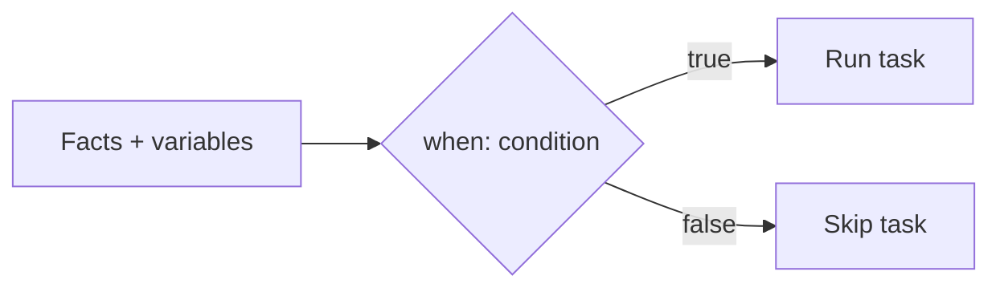
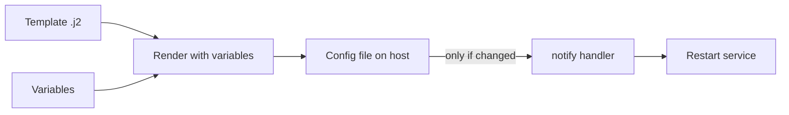

<p align="left">
  <a href="https://github.com/Ansible-workshop-ch/bootcamp/blob/main/module04/variables-and-facts.md" target="_blank">
    
  </a>
</p>

<p align="right">
  <a href="https://github.com/Ansible-workshop-ch/bootcamp/blob/main/module06/roles-and-code-first.md" target="_blank">
    
  </a>
</p>

# Module 5: Conditions, Loops, Handlers, Files, and Templates

> 🧪 Lab commands run from [`bootcamp/lab/`](../lab/) — `cd bootcamp/lab` first. Diagrams render automatically on GitHub.

**Day 2 · Core Skills** — this is where playbooks get *smart*.

---

## Definition

- **Conditions** (`when:`) let Ansible decide whether to run a task.
- **Loops** (`loop:`) let Ansible repeat a task over a list.
- **Handlers** run only when **notified** — typically after a change. Classic example: restart a service only when its config file actually changed.
- **Templates** use **Jinja2** to generate files dynamically from variables, instead of copying a static file.

---

## Diagram / Workflow

Condition flow:



Template + handler flow:



---

## Hands-On Walkthrough

Condition:

```yaml
when: ansible_facts['os_family'] == "RedHat"
```

Loop:

```yaml
loop:
  - vim
  - git
  - curl
```

Handler notification:

```yaml
notify: Restart web service
```

Template (`templates/index.html.j2`):

```jinja2
<h1>{{ web_message }}</h1>
<p>Host: {{ inventory_hostname }}</p>
```

Run the combined playbook:

```bash
ansible-playbook playbooks/module5_template_deploy.yml
ansible-playbook playbooks/module5_template_deploy.yml   # second run: handler does NOT fire
```

Talking points:
- The handler runs **once**, at the end, and **only if a task notified it**.
- On the second run, the template output is unchanged, so the service is **not** restarted — that's the point.
- Templates beat copying static files because one template + variables serves many hosts.

---

## Quiz

1. What does a handler usually do?
   - A. Runs when notified by a changed task
   - B. Runs before every playbook
   - C. Replaces inventory
   - D. Creates AAP users

2. Why use a template?
   - A. To generate files using variables
   - B. To delete YAML
   - C. To avoid Git
   - D. To run only in AAP

3. What does a condition do?
   - A. Controls whether a task should run
   - B. Creates a host
   - C. Installs AAP
   - D. Replaces SSH

---

## Hands-On Lab — *Deploy a config file safely*

**You will:**
1. Install a package.
2. Create a config file from a template.
3. Use variables inside the template.
4. Notify a handler.
5. Restart the service **only when the file changes**.
6. Re-run and confirm idempotency (handler does not fire).

```bash
ansible-playbook playbooks/module5_template_deploy.yml
# edit web_message in group_vars/web.yml, run again -> file changes -> handler fires
# run a third time with no change -> handler stays quiet
```

**Success check:**
- [ ] You can explain the relationship between template → variables → task → handler.
- [ ] You understand why Ansible avoids unnecessary restarts.

<details>
<summary>Instructor answer key</summary>

1. **A** — Runs when notified by a changed task
2. **A** — Generate files using variables
3. **A** — Controls whether a task should run
</details>

<p align="left">
  <a href="https://github.com/Ansible-workshop-ch/bootcamp/blob/main/module04/variables-and-facts.md" target="_blank">
    
  </a>
</p>

<p align="right">
  <a href="https://github.com/Ansible-workshop-ch/bootcamp/blob/main/module06/roles-and-code-first.md" target="_blank">
    
  </a>
</p>
