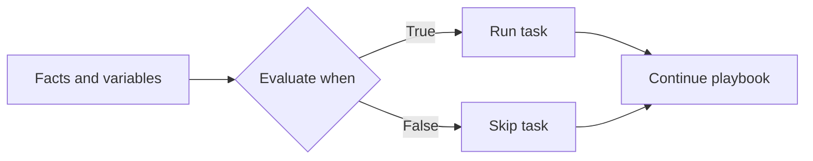
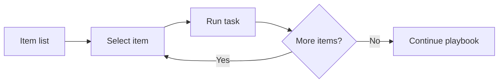
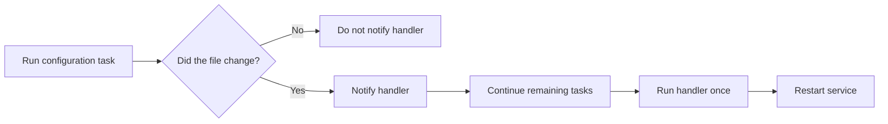
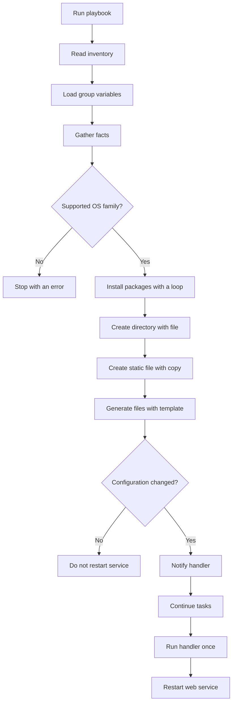

<p align="left">
  <a href="https://github.com/Ansible-workshop-ch/bootcamp/blob/main/module04/variables-and-facts.md" target="_blank">
    
  </a>
</p>

<p align="right">
  <a href="https://github.com/Ansible-workshop-ch/bootcamp/blob/main/module06/roles-and-code-first.md" target="_blank">
    
  </a>
</p>

# Module 5: Conditions, Loops, Handlers, Files, and Templates

> Lab commands run from [`bootcamp/lab/`](../lab/). Run `cd bootcamp/lab` before beginning.

**Day 2 - Core Skills**

This module makes playbooks more intelligent. Tasks will make decisions, process lists, manage files, generate configuration files, and restart services only when required.

---

## Definition

### Learning objectives

By the end of this module, you should be able to:

* Control task execution with `when`.
* Repeat a task with `loop`.
* Use `file` to manage directories and links.
* Use `copy` to deploy static content.
* Use `template` to generate dynamic content.
* Use Jinja2 variables, conditions, and loops.
* Notify handlers when configuration changes.
* Explain why handlers prevent unnecessary restarts.
* Confirm that a playbook is idempotent.

---

### Conditions

A condition controls whether Ansible runs or skips a task.

Conditions use the `when` keyword.

Example:

```yaml
- name: Display a message on Red Hat systems
  ansible.builtin.debug:
    msg: "This host belongs to the Red Hat operating system family."
  when: ansible_facts['os_family'] == "RedHat"
```

The condition is evaluated separately for every managed host.

A task can therefore run on one host and be skipped on another.

Conditions can evaluate:

* Ansible facts
* Inventory variables
* Boolean values
* Registered task results
* Loop items
* Host and group membership

Do not place `{{ }}` around a normal `when` expression.

Correct:

```yaml
when: ansible_facts['os_family'] == "RedHat"
```

Incorrect:

```yaml
when: "{{ ansible_facts['os_family'] == 'RedHat' }}"
```

Condition workflow:



---

### Loops

A loop repeats one task for multiple values.

Without a loop:

```yaml
- name: Install vim
  ansible.builtin.package:
    name: vim
    state: present

- name: Install git
  ansible.builtin.package:
    name: git
    state: present

- name: Install curl
  ansible.builtin.package:
    name: curl
    state: present
```

This works, but the same task structure is repeated.

With a loop:

```yaml
- name: Install common packages
  ansible.builtin.package:
    name: "{{ item }}"
    state: present
  loop:
    - vim
    - git
    - curl
```

During each iteration, `item` contains the current value.

The first iteration uses:

```text
item = vim
```

The second iteration uses:

```text
item = git
```

The third iteration uses:

```text
item = curl
```

A loop can also use a variable:

```yaml
common_packages:
  - vim
  - git
  - curl
```

Task:

```yaml
- name: Install common packages
  ansible.builtin.package:
    name: "{{ item }}"
    state: present
  loop: "{{ common_packages }}"
```

Loop workflow:



---

### Managing files

Ansible provides different modules for different types of file management.

| Module | Main purpose | Example |
| --- | --- | --- |
| `ansible.builtin.file` | Manage filesystem objects | Create directories or symbolic links |
| `ansible.builtin.copy` | Deploy static content | Create a fixed information file |
| `ansible.builtin.template` | Generate dynamic content | Create configuration files using variables |

---

### The file module

The `file` module manages filesystem objects.

It can:

* Create directories
* Create empty files
* Create symbolic links
* Set ownership
* Set permissions
* Remove files or directories

Example:

```yaml
- name: Create the Charter configuration directory
  ansible.builtin.file:
    path: /etc/charter
    state: directory
    owner: root
    group: root
    mode: "0755"
```

---

### The copy module

The `copy` module deploys static files or fixed content.

Example:

```yaml
- name: Create a static module information file
  ansible.builtin.copy:
    dest: /etc/charter/module5.txt
    content: |
      Managed by Ansible
      Module: 5
    owner: root
    group: root
    mode: "0644"
```

Use `copy` when most of the content remains the same across managed hosts.

---

### Templates and Jinja2

The `template` module generates files from Jinja2 templates.

Template files normally use the `.j2` extension.

Example:

```text
templates/index.html.j2
```

A template can contain variables:

```jinja2
<h1>{{ web_message }}</h1>
<p>Host: {{ inventory_hostname }}</p>
<p>Environment: {{ environment_name }}</p>
```

Ansible replaces each expression with the value resolved for the current host.

Templates can also use conditions:

```jinja2

<p>Platform family: Red Hat</p>

<p>Platform family: Debian</p>

<p>Platform family: Other</p>

```

Templates can use loops:

```jinja2
<ul>

  <li>{{ package }}</li>

</ul>
```

Keep most automation logic inside playbook tasks and variables. Do not place excessive logic inside templates.

---

### Handlers

A handler is a special task that runs only when another task notifies it.

Handlers are commonly used to:

* Restart services
* Reload services
* Restart applications
* Regenerate caches
* Apply configuration changes

A task sends a notification with `notify`:

```yaml
- name: Deploy the Apache configuration
  ansible.builtin.template:
    src: ../templates/apache-hardening.conf.j2
    dest: /etc/httpd/conf.d/charter-module5.conf
    owner: root
    group: root
    mode: "0644"
  notify: Restart web service
```

The handler is defined under `handlers`:

```yaml
handlers:
  - name: Restart web service
    ansible.builtin.service:
      name: "{{ service_name }}"
      state: restarted
```

The notification name must exactly match the handler name:

```yaml
notify: Restart web service
```

Important handler behavior:

* A handler runs only when a notifying task reports `changed`.
* A handler normally runs near the end of the play.
* Multiple tasks can notify the same handler.
* The handler normally runs only once per host.
* An unchanged second run should not trigger the handler.

Handler workflow:



---

### Idempotency

An idempotent playbook can run repeatedly without creating unnecessary changes.

During the first run, tasks may report:

```text
changed
```

During a second run without any edits, most tasks should report:

```text
ok
```

The second run should not:

* Reinstall existing packages
* Recreate correct directories
* Rewrite unchanged files
* Restart services unnecessarily

Running a playbook twice is one of the easiest ways to test idempotency.

---

### Module workflow



---

## Hands-On Walkthrough

### Repository structure

This module reuses the variable files created in Module 4.

```text
lab/
|-- inventories/
|   |-- inventory.ini
|   `-- group_vars/
|       |-- all.yml
|       |-- web.yml
|       |-- rhel_web.yml
|       `-- ubuntu_web.yml
|-- playbooks/
|   `-- module5_template_deploy.yml
`-- templates/
    |-- apache-hardening.conf.j2
    `-- index.html.j2
```

You do not need to create a separate:

```text
group_vars/linux.yml
```

The playbook targets the existing `web` inventory group and uses the existing operating-system-specific variables.

---

### Step 1: Verify the existing variables

Verify:

```text
inventories/group_vars/all.yml
```

```yaml
---
company: "Charter"
environment_name: "training"
```

Verify:

```text
inventories/group_vars/web.yml
```

```yaml
---
web_port: 80
web_message: "Hello from Ansible - {{ company }} {{ environment_name }}"
```

Verify:

```text
inventories/group_vars/rhel_web.yml
```

```yaml
---
package_name: httpd
service_name: httpd

common_packages:
  - vim
  - git
  - curl-minimal
  - httpd
```

Verify:

```text
inventories/group_vars/ubuntu_web.yml
```

```yaml
---
package_name: apache2
service_name: apache2

common_packages:
  - vim
  - git
  - curl
  - apache2
```

The variables resolve differently based on group membership.

| Group | Package | Service |
| --- | --- | --- |
| `rhel_web` | `httpd` | `httpd` |
| `ubuntu_web` | `apache2` | `apache2` |

---

### Step 2: Verify inventory group membership

Run:

```bash
ansible-inventory -i inventories/inventory.ini --graph
```

Confirm that the RHEL and Ubuntu hosts also belong to the `web` group.

Example:

```text
@all:
  |--@web:
  |  |--server1
  |  |--server2
  |--@rhel_web:
  |  |--server1
  |--@ubuntu_web:
     |--server2
```

The playbook will use:

```yaml
hosts: web
```

---

### Step 3: Create the Apache configuration template

Create:

```text
templates/apache-hardening.conf.j2
```

Add:

```jinja2
# Managed by Ansible
# Host: {{ inventory_hostname }}
# Company: {{ company }}
# Environment: {{ environment_name }}

ServerTokens Prod
ServerSignature Off
TraceEnable Off
AddDefaultCharset UTF-8
```

The same template will be deployed to different paths depending on the operating system.

Red Hat destination:

```text
/etc/httpd/conf.d/charter-module5.conf
```

Ubuntu destination:

```text
/etc/apache2/conf-available/charter-module5.conf
```

---

### Step 4: Create the HTML template

Create:

```text
templates/index.html.j2
```

Add:

```jinja2
<!DOCTYPE html>
<html lang="en">
<head>
  <meta charset="UTF-8">
  <title>{{ web_message }}</title>
</head>
<body>
  <h1>{{ web_message }}</h1>

  <p><strong>Managed host:</strong> {{ inventory_hostname }}</p>
  <p><strong>Company:</strong> {{ company }}</p>
  <p><strong>Environment:</strong> {{ environment_name }}</p>
  <p><strong>Operating system:</strong> {{ ansible_facts['distribution'] }}</p>
  <p><strong>OS family:</strong> {{ ansible_facts['os_family'] }}</p>
  <p><strong>Package:</strong> {{ package_name }}</p>
  <p><strong>Service:</strong> {{ service_name }}</p>
  <p><strong>Web port:</strong> {{ web_port }}</p>

  
  <p>This host uses the Red Hat Apache package and service structure.</p>
  
  <p>This host uses the Debian Apache package and service structure.</p>
  
  <p>This operating system family is not supported by this module.</p>
  

  <h2>Managed Packages</h2>

  <ul>
  
    <li>{{ package }}</li>
  
  </ul>

  <p>This page was generated from a Jinja2 template.</p>
</body>
</html>
```

This template demonstrates:

* Variables
* Gathered facts
* A Jinja2 condition
* A Jinja2 loop

---

### Step 5: Create the playbook

Create:

```text
playbooks/module5_template_deploy.yml
```

Add:

```yaml
---
- name: Module 5 - Conditions, loops, files, templates, and handlers
  hosts: web
  become: true
  gather_facts: true

  tasks:
    - name: Verify required variables
      ansible.builtin.assert:
        that:
          - package_name is defined
          - service_name is defined
          - common_packages is defined
          - web_message is defined
          - web_port is defined
          - company is defined
          - environment_name is defined
        fail_msg: >-
          One or more required variables are missing for
          {{ inventory_hostname }}.
        success_msg: >-
          All required variables were loaded for
          {{ inventory_hostname }}.

    - name: Verify that the operating system is supported
      ansible.builtin.assert:
        that:
          - ansible_facts['os_family'] in ['RedHat', 'Debian']
        fail_msg: >-
          Unsupported operating system family:
          {{ ansible_facts['os_family'] }}
        success_msg: >-
          Supported operating system family:
          {{ ansible_facts['os_family'] }}

    - name: Display the Red Hat package information
      ansible.builtin.debug:
        msg: >-
          {{ inventory_hostname }} will use the
          {{ package_name }} package and
          {{ service_name }} service.
      when: ansible_facts['os_family'] == "RedHat"

    - name: Display the Debian package information
      ansible.builtin.debug:
        msg: >-
          {{ inventory_hostname }} will use the
          {{ package_name }} package and
          {{ service_name }} service.
      when: ansible_facts['os_family'] == "Debian"

    - name: Install packages using a loop
      ansible.builtin.package:
        name: "{{ item }}"
        state: present
      loop: "{{ common_packages }}"

    - name: Create the Charter configuration directory
      ansible.builtin.file:
        path: /etc/charter
        state: directory
        owner: root
        group: root
        mode: "0755"

    - name: Create a static module information file
      ansible.builtin.copy:
        dest: /etc/charter/module5.txt
        content: |
          Managed by Ansible
          Module: 5
          Company: {{ company }}
          Environment: {{ environment_name }}
          Host: {{ inventory_hostname }}
          Operating system: {{ ansible_facts['distribution'] }}
          Operating system family: {{ ansible_facts['os_family'] }}
          Package: {{ package_name }}
          Service: {{ service_name }}
          Web port: {{ web_port }}
        owner: root
        group: root
        mode: "0644"

    - name: Deploy Apache configuration on Red Hat systems
      ansible.builtin.template:
        src: ../templates/apache-hardening.conf.j2
        dest: /etc/httpd/conf.d/charter-module5.conf
        owner: root
        group: root
        mode: "0644"
      when: ansible_facts['os_family'] == "RedHat"
      notify: Restart web service

    - name: Deploy Apache configuration on Debian systems
      ansible.builtin.template:
        src: ../templates/apache-hardening.conf.j2
        dest: /etc/apache2/conf-available/charter-module5.conf
        owner: root
        group: root
        mode: "0644"
      when: ansible_facts['os_family'] == "Debian"
      notify: Restart web service

    - name: Enable the Apache configuration on Debian systems
      ansible.builtin.file:
        src: /etc/apache2/conf-available/charter-module5.conf
        dest: /etc/apache2/conf-enabled/charter-module5.conf
        state: link
      when: ansible_facts['os_family'] == "Debian"
      notify: Restart web service

    - name: Deploy the dynamic website
      ansible.builtin.template:
        src: ../templates/index.html.j2
        dest: /var/www/html/index.html
        owner: root
        group: root
        mode: "0644"

    - name: Ensure the web service is enabled and started
      ansible.builtin.service:
        name: "{{ service_name }}"
        state: started
        enabled: true

    - name: Verify the website responds
      ansible.builtin.uri:
        url: "http://localhost:{{ web_port }}"
        status_code: 200
        return_content: false

  handlers:
    - name: Restart web service
      ansible.builtin.service:
        name: "{{ service_name }}"
        state: restarted
```

---

### Understanding the playbook

The playbook targets the existing web group:

```yaml
hosts: web
```

Privilege escalation is enabled because package, file, and service management require administrative access:

```yaml
become: true
```

Facts are collected because conditions and templates use operating system information:

```yaml
gather_facts: true
```

The first assertion verifies required variables:

```yaml
- name: Verify required variables
  ansible.builtin.assert:
```

The second assertion stops the play for unsupported operating systems:

```yaml
- name: Verify that the operating system is supported
  ansible.builtin.assert:
```

The conditional tasks use:

```yaml
when: ansible_facts['os_family'] == "RedHat"
```

and:

```yaml
when: ansible_facts['os_family'] == "Debian"
```

The package task processes each value in `common_packages`:

```yaml
loop: "{{ common_packages }}"
```

The static information file uses `copy`.

The Apache configuration and website use `template`.

Only Apache configuration changes notify the handler:

```yaml
notify: Restart web service
```

Changing the HTML page does not require an Apache restart.

---

### Step 6: Check the resolved variables

Check a RHEL host:

```bash
ansible-inventory -i inventories/inventory.ini \
  --host server1
```

Expected values include:

```json
{
  "company": "Charter",
  "environment_name": "training",
  "package_name": "httpd",
  "service_name": "httpd",
  "web_port": 80
}
```

Check an Ubuntu host:

```bash
ansible-inventory -i inventories/inventory.ini \
  --host server2
```

Expected values include:

```json
{
  "company": "Charter",
  "environment_name": "training",
  "package_name": "apache2",
  "service_name": "apache2",
  "web_port": 80
}
```

Use the real inventory hostnames if they are different from `server1` and `server2`.

---

### Step 7: Run a syntax check

Run:

```bash
ansible-playbook \
  -i inventories/inventory.ini \
  playbooks/module5_template_deploy.yml \
  --syntax-check
```

Expected result:

```text
playbook: playbooks/module5_template_deploy.yml
```

A syntax check confirms that Ansible can parse the YAML and playbook structure.

It does not confirm that packages, services, variables, or destination paths are correct.

---

### Step 8: Perform the first run

Run:

```bash
ansible-playbook \
  -i inventories/inventory.ini \
  playbooks/module5_template_deploy.yml
```

The first run should:

1. Gather facts.
2. Load the group variables.
3. Verify required variables.
4. Verify the operating system family.
5. Run or skip conditional tasks.
6. Install packages with a loop.
7. Create `/etc/charter`.
8. Create `/etc/charter/module5.txt`.
9. Generate the Apache configuration.
10. Enable the configuration on Debian systems.
11. Generate the HTML page.
12. Start and enable the web service.
13. Verify that the website responds.
14. Restart the web service if configuration changed.

Some tasks should report:

```text
changed
```

---

### Step 9: Perform the second run

Run the same command again without changing anything:

```bash
ansible-playbook \
  -i inventories/inventory.ini \
  playbooks/module5_template_deploy.yml
```

Expected behavior:

* Most tasks report `ok`.
* Conditions still run or skip based on the host.
* Files remain unchanged.
* Packages remain installed.
* The Apache configuration reports `ok`.
* The handler does not run.
* The website still returns status code 200.

This confirms idempotency.

---

### Step 10: Trigger the handler

Edit:

```text
templates/apache-hardening.conf.j2
```

Add this comment:

```jinja2
# Module 5 handler test
```

Run the playbook again:

```bash
ansible-playbook \
  -i inventories/inventory.ini \
  playbooks/module5_template_deploy.yml
```

Expected behavior:

1. The Apache configuration task reports `changed`.
2. The task notifies `Restart web service`.
3. Ansible continues through the remaining tasks.
4. The handler runs once near the end.
5. The correct service restarts on each host.

Run the playbook one more time without another edit.

The handler should not run again.

---

### Step 11: Validate the results

Check the static information file:

```bash
ansible web \
  -i inventories/inventory.ini \
  -b \
  -m ansible.builtin.command \
  -a "cat /etc/charter/module5.txt"
```

Check the generated website:

```bash
ansible web \
  -i inventories/inventory.ini \
  -b \
  -m ansible.builtin.command \
  -a "cat /var/www/html/index.html"
```

Check the service state:

```bash
ansible web \
  -i inventories/inventory.ini \
  -b \
  -m ansible.builtin.command \
  -a "systemctl is-active {{ service_name }}"
```

Check whether the service is enabled:

```bash
ansible web \
  -i inventories/inventory.ini \
  -b \
  -m ansible.builtin.command \
  -a "systemctl is-enabled {{ service_name }}"
```

Test the website from each managed host:

```bash
ansible web \
  -i inventories/inventory.ini \
  -m ansible.builtin.uri \
  -a "url=http://localhost:{{ web_port }} status_code=200"
```

---

### Step 12: Use check mode

Preview possible changes without applying them:

```bash
ansible-playbook \
  -i inventories/inventory.ini \
  playbooks/module5_template_deploy.yml \
  --check
```

Display file differences where supported:

```bash
ansible-playbook \
  -i inventories/inventory.ini \
  playbooks/module5_template_deploy.yml \
  --check \
  --diff
```

Check mode is a prediction. Some modules cannot perfectly simulate every change.

---

### Common problems

| Problem | Likely cause | Check |
| --- | --- | --- |
| No hosts matched | The `web` group is missing | `ansible-inventory --graph` |
| Variable is undefined | Host is missing an OS-specific group | Check `rhel_web` or `ubuntu_web` membership |
| Template not found | Template path or filename is wrong | Check `lab/templates/` |
| Service not found | `service_name` has the wrong value | Check resolved host variables |
| Package not found | Package name is wrong for that OS | Check `common_packages` |
| Handler runs every time | A notifying task always reports changed | Check templates and file permissions |
| Website check fails | Service is stopped or port is wrong | Check service state and `web_port` |

---

## Quiz

1. What does the `when` keyword do?

   * A. Repeats a task
   * B. Controls whether a task runs
   * C. Creates an inventory
   * D. Restarts every service

2. What does `item` represent inside a loop?

   * A. The current managed host
   * B. The playbook filename
   * C. The current value being processed
   * D. The inventory password

3. Which module should create a directory?

   * A. `ansible.builtin.file`
   * B. `ansible.builtin.debug`
   * C. `ansible.builtin.uri`
   * D. `ansible.builtin.setup`

4. Which module is best for fixed static content?

   * A. `ansible.builtin.service`
   * B. `ansible.builtin.copy`
   * C. `ansible.builtin.template`
   * D. `ansible.builtin.package`

5. Which module generates a file from variables?

   * A. `ansible.builtin.command`
   * B. `ansible.builtin.file`
   * C. `ansible.builtin.template`
   * D. `ansible.builtin.debug`

6. When does a notified handler run?

   * A. Every time the playbook starts
   * B. When a notifying task reports a change
   * C. Before facts are gathered
   * D. Only in Ansible Automation Platform

7. If three changed tasks notify the same handler, how many times does the handler normally run for that host?

   * A. Zero times
   * B. One time
   * C. Three times
   * D. Continuously

8. What should happen during a second playbook run when nothing changed?

   * A. Every task reports changed
   * B. Every service restarts
   * C. Most tasks report ok and the handler does not run
   * D. The inventory is deleted

9. Why does the playbook use `gather_facts: true`?

   * A. Conditions and templates use operating system facts
   * B. It creates Git branches
   * C. It encrypts variables
   * D. It installs Ansible Automation Platform

10. Why does the HTML template task not notify the restart handler?

    * A. HTML files cannot be managed
    * B. Changing website content does not normally require Apache to restart
    * C. Handlers cannot work with templates
    * D. The website must remain unchanged

---

## Hands-On Lab - Build an intelligent web server playbook

### Goal

Use conditions, loops, files, templates, handlers, and idempotency to configure RHEL and Ubuntu web servers from one playbook.

---

### You will

1. Reuse the variables from Module 4.
2. Install operating-system-specific packages.
3. Use conditions based on gathered facts.
4. Process package lists with a loop.
5. Create a managed directory.
6. Create a static information file.
7. Generate an Apache configuration.
8. Generate a host-specific website.
9. Notify a restart handler.
10. Prove that the playbook is idempotent.

---

### Task 1: Verify the inventory

Run:

```bash
ansible-inventory -i inventories/inventory.ini --graph
```

Confirm that:

```text
RHEL hosts belong to rhel_web and web
Ubuntu hosts belong to ubuntu_web and web
```

---

### Task 2: Verify resolved variables

Choose one RHEL host:

```bash
ansible-inventory -i inventories/inventory.ini \
  --host server1
```

Confirm that it receives:

```text
package_name: httpd
service_name: httpd
web_port: 80
```

Choose one Ubuntu host:

```bash
ansible-inventory -i inventories/inventory.ini \
  --host server2
```

Confirm that it receives:

```text
package_name: apache2
service_name: apache2
web_port: 80
```

Replace `server1` and `server2` with your real inventory hostnames where necessary.

---

### Task 3: Add another package

Edit:

```text
inventories/group_vars/rhel_web.yml
```

Add one valid RHEL package to `common_packages`.

Edit:

```text
inventories/group_vars/ubuntu_web.yml
```

Add the matching Ubuntu package where available.

Do not create another package installation task.

The existing loop must process the new values.

---

### Task 4: Add an operating-system marker

Add these tasks to the playbook.

RHEL marker:

```yaml
- name: Create a Red Hat marker file
  ansible.builtin.copy:
    dest: /etc/charter/redhat-system
    content: "This host belongs to the Red Hat OS family.\n"
    owner: root
    group: root
    mode: "0644"
  when: ansible_facts['os_family'] == "RedHat"
```

Ubuntu marker:

```yaml
- name: Create a Debian marker file
  ansible.builtin.copy:
    dest: /etc/charter/debian-system
    content: "This host belongs to the Debian OS family.\n"
    owner: root
    group: root
    mode: "0644"
  when: ansible_facts['os_family'] == "Debian"
```

Only the correct marker should be created on each host.

---

### Task 5: Add another value to the website

Edit:

```text
templates/index.html.j2
```

Add:

```jinja2
<p><strong>System architecture:</strong> {{ ansible_facts['architecture'] }}</p>
```

The generated page should display the architecture of each managed host.

---

### Task 6: Check the syntax

Run:

```bash
ansible-playbook \
  -i inventories/inventory.ini \
  playbooks/module5_template_deploy.yml \
  --syntax-check
```

Fix all syntax errors before continuing.

---

### Task 7: Run the playbook

Run:

```bash
ansible-playbook \
  -i inventories/inventory.ini \
  playbooks/module5_template_deploy.yml
```

Confirm that:

* Packages install through the loop.
* RHEL tasks run only on RHEL hosts.
* Debian tasks run only on Ubuntu hosts.
* `/etc/charter` exists.
* The static file exists.
* The correct marker file exists.
* The Apache configuration exists.
* The website exists.
* The service is running.
* The website returns status code 200.

---

### Task 8: Confirm idempotency

Run the same playbook again without changing anything:

```bash
ansible-playbook \
  -i inventories/inventory.ini \
  playbooks/module5_template_deploy.yml
```

Confirm that:

* Most tasks report `ok`.
* Package tasks do not reinstall packages.
* Templates remain unchanged.
* The handler does not run.
* The service remains active.

---

### Task 9: Trigger the handler

Edit:

```text
templates/apache-hardening.conf.j2
```

Add:

```jinja2
# Handler verification change
```

Run the playbook again:

```bash
ansible-playbook \
  -i inventories/inventory.ini \
  playbooks/module5_template_deploy.yml
```

Confirm that:

* The Apache configuration reports `changed`.
* The restart handler is notified.
* The handler runs once for each changed host.

---

### Task 10: Confirm final idempotency

Run the playbook one final time:

```bash
ansible-playbook \
  -i inventories/inventory.ini \
  playbooks/module5_template_deploy.yml
```

Confirm that the handler does not run again.

---

### Validation commands

Check the managed directory:

```bash
ansible web \
  -i inventories/inventory.ini \
  -b \
  -m ansible.builtin.command \
  -a "ls -la /etc/charter"
```

Check the static file:

```bash
ansible web \
  -i inventories/inventory.ini \
  -b \
  -m ansible.builtin.command \
  -a "cat /etc/charter/module5.txt"
```

Check the website:

```bash
ansible web \
  -i inventories/inventory.ini \
  -b \
  -m ansible.builtin.command \
  -a "cat /var/www/html/index.html"
```

Check the service:

```bash
ansible web \
  -i inventories/inventory.ini \
  -b \
  -m ansible.builtin.command \
  -a "systemctl is-active {{ service_name }}"
```

Test the website:

```bash
ansible web \
  -i inventories/inventory.ini \
  -m ansible.builtin.uri \
  -a "url=http://localhost:{{ web_port }} status_code=200"
```

---

### Success check

* [ ] I can explain how `when` controls task execution.
* [ ] I understand that conditions are evaluated separately for every host.
* [ ] I can explain what `item` represents inside a loop.
* [ ] I can install packages from a variable list.
* [ ] I can use `file` to create directories and links.
* [ ] I understand the difference between `copy` and `template`.
* [ ] I can use variables inside a Jinja2 template.
* [ ] I can use conditions and loops inside a Jinja2 template.
* [ ] I can notify a handler.
* [ ] I understand why handlers normally run near the end.
* [ ] I can prove that the playbook is idempotent.
* [ ] I can validate the generated files and service state.

---

### Key lesson

```text
Use conditions for decisions, loops for repetition, templates for dynamic content, and handlers for change-driven actions.
```

---

<details>
<summary>Instructor answer key</summary>

1. **B** - Controls whether a task runs
2. **C** - The current value being processed
3. **A** - `ansible.builtin.file`
4. **B** - `ansible.builtin.copy`
5. **C** - `ansible.builtin.template`
6. **B** - When a notifying task reports a change
7. **B** - One time
8. **C** - Most tasks report `ok` and the handler does not run
9. **A** - Conditions and templates use operating system facts
10. **B** - Changing website content does not normally require Apache to restart

</details>

<p align="left">
  <a href="https://github.com/Ansible-workshop-ch/bootcamp/blob/main/module04/variables-and-facts.md" target="_blank">
    
  </a>
</p>

<p align="right">
  <a href="https://github.com/Ansible-workshop-ch/bootcamp/blob/main/module06/roles-and-code-first.md" target="_blank">
    
  </a>
</p>