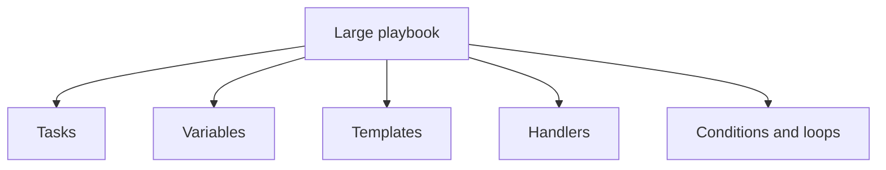
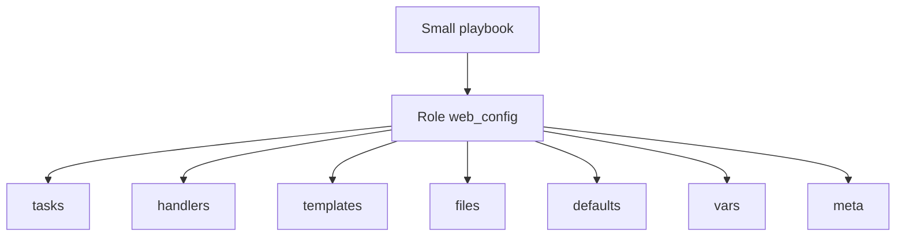
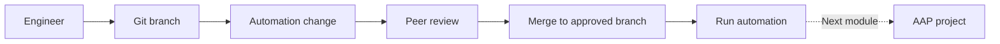

<p align="left">
  <a href="https://github.com/Ansible-workshop-ch/bootcamp/blob/main/module05/conditions-loops-handlers-templates.md" target="_blank">
    
  </a>
</p>

<p align="right">
  <a href="https://github.com/Ansible-workshop-ch/bootcamp/blob/main/module07/aap-workflow.md" target="_blank">
    
  </a>
</p>

# Module 6: Roles and Code-First Repository Structure

> 🧪 Lab commands run from [`bootcamp/lab/`](../lab/)
> Run `cd bootcamp/lab` before beginning.

**Day 2 - Core Skills**

In Module 5, the conditions, loops, templates, variables, and handlers were stored in one playbook.

That structure works for small examples, but it becomes difficult to maintain as automation grows.

In this module, you will convert the Module 5 automation into an Ansible role named `web_config`.

---

## Learning Objectives

By the end of this module, you will be able to:

* Explain what an Ansible role is.
* Explain why teams use roles.
* Understand the standard role directory structure.
* Create a role using `ansible-galaxy`.
* Move tasks, templates, handlers, defaults, and variables into a role.
* Call a role from a small playbook.
* Override role defaults from inventory variables.
* Validate that the role remains idempotent.
* Explain how a code-first repository supports review, reuse, and AAP execution.

---

# 1. What Is an Ansible Role?

## Definition

An Ansible **role** is a standard directory structure used to organize related automation.

Instead of placing everything inside one large playbook, a role separates content into dedicated directories:

* Tasks
* Handlers
* Templates
* Static files
* Default variables
* Internal variables
* Metadata

A role represents a reusable automation capability.

Examples include:

* Configuring a web server
* Creating users
* Applying security settings
* Installing monitoring agents
* Managing operating system packages
* Configuring an application
* Performing compliance remediation

---

## Playbook Without a Role



Everything is defined in or referenced directly by one playbook.

This works for small automation, but it becomes harder to:

* Read
* Test
* Review
* Reuse
* Assign ownership
* Maintain across teams

---

## Playbook With a Role



The playbook defines:

* Which hosts are targeted
* Whether privilege escalation is required
* Which roles should run

The role contains the implementation.

---

# 2. Why Roles Matter

Roles provide several benefits.

## Reusability

The same role can be called from multiple playbooks.

```text
playbooks/development.yml
playbooks/testing.yml
playbooks/production.yml
```

All three playbooks can call:

```yaml
roles:
  - web_config
```

The environment-specific behavior can be controlled through variables.

---

## Organization

A role separates different types of content.

Tasks are not mixed with:

* Templates
* Handlers
* Static files
* Default values
* Metadata

This makes the repository easier to understand.

---

## Team Ownership

A role can represent a service or capability owned by a specific team.

For example:

```text
roles/
├── web_config/
├── monitoring_agent/
├── security_baseline/
├── user_management/
└── application_deploy/
```

Each role has a clear responsibility.

---

## Testing

A role can be tested independently before it is included in larger automation workflows.

At minimum, teams can test:

* YAML syntax
* Variable availability
* Task execution
* Idempotency
* Expected configuration
* Handler behavior

---

## Code Review

Role changes can be committed to Git and reviewed before execution.

A reviewer can clearly identify whether a change affects:

* Tasks
* Variables
* Templates
* Handlers
* Metadata

---

# 3. Code-First Automation

## Definition

**Code-first automation** means that automation is created, reviewed, tested, and versioned as code before it is executed through a platform.

The Git repository becomes the source of truth.



A code-first workflow provides:

* Version history
* Peer review
* Change tracking
* Rollback capability
* Reusable automation
* Consistent execution
* Clear ownership

AAP does not replace the repository.

AAP consumes and executes the approved automation stored in the repository.

---

# 4. Standard Role Structure

A standard role can contain the following directories:

```text
roles/
└── web_config/
    ├── README.md
    ├── defaults/
    │   └── main.yml
    ├── files/
    ├── handlers/
    │   └── main.yml
    ├── meta/
    │   └── main.yml
    ├── tasks/
    │   └── main.yml
    ├── templates/
    │   ├── apache-hardening.conf.j2
    │   └── index.html.j2
    └── vars/
        └── main.yml
```

Not every role must use every directory.

Ansible loads the `main.yml` file from the directories that are present and used by the role.

---

## Role Directory Reference

| Directory    | Purpose                                        |
| ------------ | ---------------------------------------------- |
| `tasks/`     | Tasks performed by the role                    |
| `handlers/`  | Handlers notified by changed tasks             |
| `templates/` | Jinja2 templates                               |
| `files/`     | Static files copied by the role                |
| `defaults/`  | Default variables that are easy to override    |
| `vars/`      | Internal role variables with higher precedence |
| `meta/`      | Role metadata and dependencies                 |
| `README.md`  | Documentation for users of the role            |

---

# 5. Role Tasks

Role tasks normally begin in:

```text
roles/web_config/tasks/main.yml
```

Example:

```yaml
---
- name: Install the web server
  ansible.builtin.package:
    name: "{{ web_package }}"
    state: present

- name: Deploy the web page
  ansible.builtin.template:
    src: index.html.j2
    dest: /var/www/html/index.html
    owner: root
    group: root
    mode: "0644"
```

The role task file does not need to define:

```yaml
hosts:
become:
gather_facts:
```

Those settings normally remain in the calling playbook.

---

# 6. Role Templates

Role templates are stored in:

```text
roles/web_config/templates/
```

Example:

```text
roles/web_config/templates/index.html.j2
```

Inside the role task, reference only the template filename:

```yaml
- name: Deploy the website
  ansible.builtin.template:
    src: index.html.j2
    dest: /var/www/html/index.html
```

Do not use the Module 5 path:

```yaml
src: ../templates/index.html.j2
```

That path is no longer required because Ansible searches the role's `templates/` directory.

---

# 7. Role Handlers

Role handlers normally begin in:

```text
roles/web_config/handlers/main.yml
```

Example:

```yaml
---
- name: Restart web service
  ansible.builtin.service:
    name: "{{ web_service_name }}"
    state: restarted
```

Tasks inside the role can notify the handler:

```yaml
notify: Restart web service
```

The notification name must match the handler name.

---

# 8. Role Defaults

Role defaults are stored in:

```text
roles/web_config/defaults/main.yml
```

Defaults contain values that users are expected to override.

Example:

```yaml
---
web_message: "Managed by Ansible"
web_environment: "default"
web_owner: "Platform Engineering"

common_packages:
  - vim
  - git
  - curl
```

Role defaults have low variable precedence.

That means another variable source can replace them, including:

* `group_vars`
* `host_vars`
* Play variables
* Variables passed when calling the role
* Extra variables

---

## Default Override Example

Role default:

```yaml
web_environment: "default"
```

Inventory group variable:

```yaml
web_environment: "training"
```

The value from the inventory group is used:

```text
training
```

This is why configurable values should normally be stored in `defaults/main.yml`.

---

# 9. Role Variables

Role variables are stored in:

```text
roles/web_config/vars/main.yml
```

Role variables have higher precedence than role defaults.

They should be used carefully.

Good examples include internal mappings that users normally should not need to change:

```yaml
---
web_package_map:
  Debian: apache2
  RedHat: httpd

web_service_map:
  Debian: apache2
  RedHat: httpd

web_config_path_map:
  Debian: /etc/apache2/conf-available/charter-module6.conf
  RedHat: /etc/httpd/conf.d/charter-module6.conf
```

Do not put every variable in `vars/main.yml`.

Values that users are expected to configure belong in:

```text
defaults/main.yml
```

---

## Defaults Versus Vars

| Location            | Purpose                            | Easy to override? |
| ------------------- | ---------------------------------- | ----------------- |
| `defaults/main.yml` | User-configurable defaults         | Yes               |
| `vars/main.yml`     | Internal role values and constants | No, not easily    |
| `group_vars/`       | Values for an inventory group      | Yes               |
| `host_vars/`        | Values for a specific host         | Yes               |

A strong role exposes configurable behavior through defaults and keeps internal implementation values limited.

---

# 10. Role Metadata

Role metadata is stored in:

```text
roles/web_config/meta/main.yml
```

Metadata can describe:

* Author
* Description
* License
* Supported platforms
* Role dependencies
* Galaxy information

A simple lab example:

```yaml
---
galaxy_info:
  author: Charter Ansible Training
  description: Configure a basic Apache web server
  license: MIT
  min_ansible_version: "2.15"

dependencies: []
```

The metadata file does not execute tasks.

It documents the role and can define dependencies on other roles.

---

# 11. Complete Repository Structure

After converting Module 5 into a role, the lab structure should look similar to this:

```text
bootcamp/
└── lab/
    ├── ansible.cfg
    ├── inventories/
    │   └── inventory.ini
    ├── group_vars/
    │   └── linux.yml
    ├── playbooks/
    │   ├── module5_template_deploy.yml
    │   └── module6_role_apply.yml
    └── roles/
        └── web_config/
            ├── README.md
            ├── defaults/
            │   └── main.yml
            ├── files/
            ├── handlers/
            │   └── main.yml
            ├── meta/
            │   └── main.yml
            ├── tasks/
            │   └── main.yml
            ├── templates/
            │   ├── apache-hardening.conf.j2
            │   └── index.html.j2
            └── vars/
                └── main.yml
```

Module 5 remains available for comparison.

Module 6 calls the role instead of repeating all the implementation tasks.

---

# 12. Role Search Path

Because this lab stores playbooks and roles in separate directories, Ansible must know where to find the roles.

The course commands run from:

```text
bootcamp/lab/
```

Verify that `ansible.cfg` contains:

```ini
[defaults]
roles_path = ./roles
```

A fuller lab configuration might look like:

```ini
[defaults]
inventory = ./inventories/inventory.ini
roles_path = ./roles
host_key_checking = False
retry_files_enabled = False
```

The important Module 6 setting is:

```ini
roles_path = ./roles
```

Without the correct role path, Ansible may report:

```text
ERROR! the role 'web_config' was not found
```

---

# 13. Hands-On Walkthrough

## Goal

Convert the Module 5 playbook into the following role:

```text
roles/web_config/
```

The original Module 5 playbook will not be deleted.

It will remain available so students can compare:

* A large playbook
* A small playbook calling a role

---

## Step 1: Verify the Lab Directory

From the repository root:

```bash
cd bootcamp/lab
pwd
```

Expected path:

```text
bootcamp/lab
```

Verify the current files:

```bash
find . -maxdepth 3 -type f | sort
```

---

## Step 2: Create the Role Skeleton

Use `ansible-galaxy` to create the standard directory structure:

```bash
ansible-galaxy role init web_config --init-path roles
```

Expected result:

```text
- Role web_config was created successfully
```

Inspect the generated structure:

```bash
find roles/web_config -maxdepth 2 -type f | sort
```

Expected files include:

```text
roles/web_config/README.md
roles/web_config/defaults/main.yml
roles/web_config/handlers/main.yml
roles/web_config/meta/main.yml
roles/web_config/tasks/main.yml
roles/web_config/vars/main.yml
```

The command also creates empty directories such as:

```text
roles/web_config/files/
roles/web_config/templates/
```

Do not run the initialization command again if the role already exists.

---

## Step 3: Configure the Role Search Path

Open:

```text
ansible.cfg
```

Confirm it contains:

```ini
[defaults]
inventory = ./inventories/inventory.ini
roles_path = ./roles
host_key_checking = False
retry_files_enabled = False
```

Verify the active configuration:

```bash
ansible-config dump --only-changed
```

Look for a role path that points to:

```text
bootcamp/lab/roles
```

---

## Step 4: Create Role Defaults

Edit:

```text
roles/web_config/defaults/main.yml
```

Add:

```yaml
---
web_message: "Managed by the web_config role"
web_environment: "default"
web_owner: "Platform Engineering"

common_packages:
  - vim
  - git
  - curl

web_document_root: /var/www/html
web_index_file: index.html
```

These values define the default behavior of the role.

They can be overridden without changing the role tasks.

---

## Step 5: Create Internal Role Variables

Edit:

```text
roles/web_config/vars/main.yml
```

Add:

```yaml
---
web_package_map:
  Debian: apache2
  RedHat: httpd

web_service_map:
  Debian: apache2
  RedHat: httpd

web_config_path_map:
  Debian: /etc/apache2/conf-available/charter-module6.conf
  RedHat: /etc/httpd/conf.d/charter-module6.conf

web_config_enabled_path_map:
  Debian: /etc/apache2/conf-enabled/charter-module6.conf
```

These mappings support both Debian and Red Hat systems.

---

## Step 6: Create the Apache Template

Create:

```text
roles/web_config/templates/apache-hardening.conf.j2
```

Add:

```jinja2
# Managed by Ansible
# Role: web_config
# Host: {{ inventory_hostname }}
# Environment: {{ web_environment }}

ServerTokens Prod
ServerSignature Off
TraceEnable Off
AddDefaultCharset UTF-8
```

The template is now stored inside the role.

---

## Step 7: Create the Website Template

Create:

```text
roles/web_config/templates/index.html.j2
```

Add:

```jinja2
<!DOCTYPE html>
<html lang="en">
<head>
  <meta charset="UTF-8">
  <title>{{ web_message }}</title>
</head>
<body>
  <h1>{{ web_message }}</h1>

  <p><strong>Managed host:</strong> {{ inventory_hostname }}</p>
  <p><strong>Environment:</strong> {{ web_environment }}</p>
  <p><strong>Owner:</strong> {{ web_owner }}</p>
  <p><strong>Operating system:</strong> {{ ansible_facts['distribution'] }}</p>
  <p><strong>OS family:</strong> {{ ansible_facts['os_family'] }}</p>
  <p><strong>Ansible role:</strong> web_config</p>

  
  <p>This system uses the Red Hat web server structure.</p>
  
  <p>This system uses the Debian web server structure.</p>
  
  <p>This operating system family is not supported by this role.</p>
  

  <h2>Common Packages</h2>

  <ul>
  
    <li>{{ package }}</li>
  
  </ul>

  <p>This page was generated by the web_config Ansible role.</p>
</body>
</html>
```

---

## Step 8: Create the Role Handler

Edit:

```text
roles/web_config/handlers/main.yml
```

Add:

```yaml
---
- name: Restart web service
  ansible.builtin.service:
    name: "{{ web_service_map[ansible_facts['os_family']] }}"
    state: restarted
```

The handler will be notified when the Apache configuration changes.

---

## Step 9: Create the Role Tasks

Edit:

```text
roles/web_config/tasks/main.yml
```

Add:

```yaml
---
- name: Verify that the operating system is supported
  ansible.builtin.assert:
    that:
      - ansible_facts['os_family'] in web_package_map
    fail_msg: >-
      The web_config role does not support the
      {{ ansible_facts['os_family'] }} operating system family.
    success_msg: >-
      The web_config role supports the
      {{ ansible_facts['os_family'] }} operating system family.

- name: Display selected web server package
  ansible.builtin.debug:
    msg: >-
      {{ inventory_hostname }} will use the
      {{ web_package_map[ansible_facts['os_family']] }} package.

- name: Install common packages
  ansible.builtin.package:
    name: "{{ item }}"
    state: present
  loop: "{{ common_packages }}"

- name: Install the web server package
  ansible.builtin.package:
    name: "{{ web_package_map[ansible_facts['os_family']] }}"
    state: present

- name: Create the Charter configuration directory
  ansible.builtin.file:
    path: /etc/charter
    state: directory
    owner: root
    group: root
    mode: "0755"

- name: Create the role information file
  ansible.builtin.copy:
    dest: /etc/charter/web_config_role.txt
    content: |
      Managed by Ansible
      Role: web_config
      Host: {{ inventory_hostname }}
      Environment: {{ web_environment }}
      Operating system family: {{ ansible_facts['os_family'] }}
    owner: root
    group: root
    mode: "0644"

- name: Deploy the Apache configuration
  ansible.builtin.template:
    src: apache-hardening.conf.j2
    dest: "{{ web_config_path_map[ansible_facts['os_family']] }}"
    owner: root
    group: root
    mode: "0644"
  notify: Restart web service

- name: Enable the Apache configuration on Debian systems
  ansible.builtin.file:
    src: "{{ web_config_path_map['Debian'] }}"
    dest: "{{ web_config_enabled_path_map['Debian'] }}"
    state: link
  when: ansible_facts['os_family'] == "Debian"
  notify: Restart web service

- name: Deploy the website
  ansible.builtin.template:
    src: index.html.j2
    dest: "{{ web_document_root }}/{{ web_index_file }}"
    owner: root
    group: root
    mode: "0644"

- name: Ensure the web service is enabled and running
  ansible.builtin.service:
    name: "{{ web_service_map[ansible_facts['os_family']] }}"
    state: started
    enabled: true
```

Notice that the role task file does not contain:

```yaml
hosts:
become:
gather_facts:
```

Those settings belong in the calling playbook.

---

## Step 10: Add Role Metadata

Edit:

```text
roles/web_config/meta/main.yml
```

Replace the generated content with:

```yaml
---
galaxy_info:
  author: Charter Ansible Training
  description: Install and configure an Apache web server
  license: MIT
  min_ansible_version: "2.15"

  platforms:
    - name: EL
      versions:
        - "8"
        - "9"

    - name: Debian
      versions:
        - "11"
        - "12"

dependencies: []
```

The metadata does not configure the web server.

It documents the intended purpose and supported platforms of the role.

---

## Step 11: Document the Role

Edit:

```text
roles/web_config/README.md
```

Add:

````markdown
# web_config

The `web_config` role installs and configures an Apache web server on supported Debian and Red Hat systems.

## Requirements

- Ansible facts must be gathered.
- Privilege escalation is required.
- The managed host must belong to the `Debian` or `RedHat` OS family.

## Role Variables

| Variable | Default | Purpose |
|---|---|---|
| `web_message` | `Managed by the web_config role` | Main website heading |
| `web_environment` | `default` | Environment displayed on the website |
| `web_owner` | `Platform Engineering` | Team displayed on the website |
| `common_packages` | `vim`, `git`, `curl` | Packages installed by the role |
| `web_document_root` | `/var/www/html` | Website destination directory |
| `web_index_file` | `index.html` | Website index filename |

## Example Playbook

```yaml
---
- name: Apply the web_config role
  hosts: linux
  become: true
  gather_facts: true

  roles:
    - web_config
````

## Validation

Run the role playbook twice:

```bash
ansible-playbook \
  -i inventories/inventory.ini \
  playbooks/module6_role_apply.yml
```

The second run should not restart the web service unless the configuration changed.

````

Every reusable role should explain:

- What it does
- What it requires
- Which variables users can configure
- How to call it
- How to validate it

---

## Step 12: Override Role Defaults

Edit:

```text
group_vars/linux.yml
````

Use environment-specific values:

```yaml
---
web_message: "Charter Ansible Role Deployment"
web_environment: "training"
web_owner: "Charter Platform Engineering"

common_packages:
  - vim
  - git
  - curl
```

These group variables override values from:

```text
roles/web_config/defaults/main.yml
```

The role implementation does not need to change.

---

## Step 13: Create the Calling Playbook

Create:

```text
playbooks/module6_role_apply.yml
```

Add:

```yaml
---
- name: Module 6 - Apply the reusable web configuration role
  hosts: linux
  become: true
  gather_facts: true

  roles:
    - web_config
```

The playbook is now small.

It defines:

* Target hosts
* Privilege escalation
* Fact gathering
* The role to execute

The implementation lives in:

```text
roles/web_config/
```

---

# 14. Compare Module 5 and Module 6

## Module 5

The playbook contains most of the implementation:

```yaml
---
- name: Configure web servers
  hosts: linux
  become: true

  vars:
    # Variables

  tasks:
    # Conditions
    # Loops
    # File management
    # Templates
    # Service management

  handlers:
    # Restart handler
```

---

## Module 6

The playbook calls the role:

```yaml
---
- name: Apply web role
  hosts: linux
  become: true
  gather_facts: true

  roles:
    - web_config
```

The playbook becomes easier to read because the implementation has been organized into the role.

---

## Comparison

| Module 5                                     | Module 6                                      |
| -------------------------------------------- | --------------------------------------------- |
| Logic is concentrated in one playbook        | Logic is separated into role directories      |
| Templates are outside the playbook directory | Templates belong to the role                  |
| Handlers are defined in the playbook         | Handlers belong to the role                   |
| Variables may be mixed together              | Defaults and internal variables are separated |
| Harder to reuse cleanly                      | Designed for reuse                            |
| Suitable for learning task behavior          | Suitable for team-scale organization          |

Module 5 was not wrong.

Module 6 improves how the same automation is organized.

---

# 15. Validate the Role

## Step 1: Check Inventory

```bash
ansible-inventory \
  -i inventories/inventory.ini \
  --graph
```

Confirm that the inventory contains:

```text
@linux:
```

---

## Step 2: Check Playbook Syntax

```bash
ansible-playbook \
  -i inventories/inventory.ini \
  playbooks/module6_role_apply.yml \
  --syntax-check
```

Expected result:

```text
playbook: playbooks/module6_role_apply.yml
```

---

## Step 3: List the Role Tasks

```bash
ansible-playbook \
  -i inventories/inventory.ini \
  playbooks/module6_role_apply.yml \
  --list-tasks
```

Expected tasks include:

```text
web_config : Verify that the operating system is supported
web_config : Install common packages
web_config : Install the web server package
web_config : Deploy the Apache configuration
web_config : Deploy the website
web_config : Ensure the web service is enabled and running
```

The role name appears before each task name.

This makes it easier to identify where a task came from.

---

## Step 4: Perform the First Run

```bash
ansible-playbook \
  -i inventories/inventory.ini \
  playbooks/module6_role_apply.yml
```

The first run should:

1. Gather facts.
2. Load the role defaults.
3. Apply overrides from `group_vars/linux.yml`.
4. Load the role's internal mappings.
5. Install common packages.
6. Install the correct web server package.
7. Create the Charter directory.
8. Create the role information file.
9. Render the Apache configuration.
10. Enable the Debian configuration when required.
11. Render the website.
12. Start and enable the web service.
13. Run the handler if the configuration changed.

---

## Step 5: Perform the Second Run

Run the playbook again without changing anything:

```bash
ansible-playbook \
  -i inventories/inventory.ini \
  playbooks/module6_role_apply.yml
```

Expected result:

* Most tasks report `ok`.
* No unnecessary files are changed.
* The Apache configuration remains unchanged.
* The handler does not run.
* The web service is not unnecessarily restarted.

This proves that moving the tasks into a role did not remove idempotency.

---

# 16. Test Variable Overrides

Change the following value in:

```text
group_vars/linux.yml
```

From:

```yaml
web_message: "Charter Ansible Role Deployment"
```

To:

```yaml
web_message: "Charter Role Override Successful"
```

Run the playbook:

```bash
ansible-playbook \
  -i inventories/inventory.ini \
  playbooks/module6_role_apply.yml
```

Expected result:

* The website template reports `changed`.
* The generated web page contains the new message.
* The Apache configuration handler does not run because only the HTML page changed.

Validate the page:

```bash
ansible linux \
  -i inventories/inventory.ini \
  -m ansible.builtin.uri \
  -a "url=http://localhost return_content=true"
```

Look for:

```text
Charter Role Override Successful
```

This demonstrates that role defaults can be changed without editing role tasks.

---

# 17. Test the Handler

Edit:

```text
roles/web_config/templates/apache-hardening.conf.j2
```

Add a comment:

```apache
# Module 6 handler validation
```

Run the role playbook:

```bash
ansible-playbook \
  -i inventories/inventory.ini \
  playbooks/module6_role_apply.yml
```

Expected behavior:

1. The Apache configuration task reports `changed`.
2. The task notifies the role handler.
3. Ansible completes the remaining tasks.
4. The handler runs once near the end.
5. The web service restarts.

Run the playbook again without another change:

```bash
ansible-playbook \
  -i inventories/inventory.ini \
  playbooks/module6_role_apply.yml
```

The handler should not run.

---

# 18. Validate Generated Content

## Check the Role Information File

```bash
ansible linux \
  -i inventories/inventory.ini \
  -b \
  -m ansible.builtin.command \
  -a "cat /etc/charter/web_config_role.txt"
```

Expected content includes:

```text
Managed by Ansible
Role: web_config
Environment: training
```

---

## Check the Generated Website

```bash
ansible linux \
  -i inventories/inventory.ini \
  -b \
  -m ansible.builtin.command \
  -a "cat /var/www/html/index.html"
```

---

## Test the Web Server

```bash
ansible linux \
  -i inventories/inventory.ini \
  -m ansible.builtin.uri \
  -a "url=http://localhost status_code=200"
```

Expected result:

```text
status: 200
```

---

# 19. Code-First Git Workflow

After validating the role, inspect the repository changes:

```bash
git status
```

Review the changes:

```bash
git diff
```

Review the new role files:

```bash
find roles/web_config -maxdepth 3 -type f | sort
```

A typical team workflow is:


The important point is not memorizing Git commands.

The important point is that automation changes should be:

* Visible
* Reviewable
* Tested
* Approved
* Versioned

---

# 20. Ansible Vault Mention

Do not store secrets directly in:

* Playbooks
* Role defaults
* Role variables
* Templates
* Inventory files
* Git repositories

Wrong:

```yaml
database_password: SuperSecretPassword123
```

Ansible Vault can encrypt sensitive values before they are committed.

Example encrypted content begins with:

```text
$ANSIBLE_VAULT;1.1;AES256
```

This module does not perform a deep Ansible Vault lab.

The important rule is:

> Secrets must not be committed to Git as readable plain text.

Enterprise secret management integrations such as CyberArk and HashiCorp Vault are outside the scope of this module.

---

# 21. Troubleshooting

## Error: Role Was Not Found

Example:

```text
ERROR! the role 'web_config' was not found
```

Confirm that the role exists:

```bash
find roles/web_config -maxdepth 2 -type f
```

Confirm that `ansible.cfg` contains:

```ini
[defaults]
roles_path = ./roles
```

Confirm you are running the command from:

```text
bootcamp/lab/
```

Check the active role path:

```bash
ansible-config dump | grep -i roles_path
```

---

## Error: Variable Is Undefined

Example:

```text
'web_message' is undefined
```

Check:

```text
roles/web_config/defaults/main.yml
```

Confirm the variable is defined:

```yaml
web_message: "Managed by the web_config role"
```

Also check the YAML indentation.

---

## Error: Template Was Not Found

Confirm that the template exists inside the role:

```text
roles/web_config/templates/index.html.j2
```

The role task should use:

```yaml
src: index.html.j2
```

Do not use:

```yaml
src: ../templates/index.html.j2
```

---

## Error: Handler Was Not Found

Confirm the handler exists in:

```text
roles/web_config/handlers/main.yml
```

Confirm the handler name:

```yaml
- name: Restart web service
```

Confirm the task notification matches exactly:

```yaml
notify: Restart web service
```

---

## Role Variables Do Not Override Correctly

Check where the variable is defined.

User-configurable variables should normally be in:

```text
roles/web_config/defaults/main.yml
```

Do not place user-configurable values in:

```text
roles/web_config/vars/main.yml
```

Role variables have higher precedence and are harder to override.

---

## Playbook Works but Is Not Idempotent

Run the playbook twice:

```bash
ansible-playbook \
  -i inventories/inventory.ini \
  playbooks/module6_role_apply.yml
```

Investigate any task that reports `changed` during every run.

Common causes include:

* Dynamic timestamps inside templates
* Random values
* Shell commands without change detection
* Incorrect file permissions
* Files generated differently during every run
* Tasks using non-idempotent commands

A role is not automatically idempotent simply because it is a role.

The tasks inside the role must still be written correctly.

---

# 22. Talking Points

* A role is an organizational structure, not a replacement for a playbook.
* A playbook decides where and how a role runs.
* A role contains the reusable implementation.
* Role tasks live in `tasks/main.yml`.
* Role handlers live in `handlers/main.yml`.
* Role templates live in `templates/`.
* Static role files live in `files/`.
* Configurable values belong in `defaults/main.yml`.
* Internal mappings can live in `vars/main.yml`.
* Role defaults are designed to be overridden.
* Templates inside roles are referenced by filename.
* Roles should have a clear purpose.
* Roles should be documented.
* Roles should remain idempotent.
* Git provides version history and review.
* AAP later executes the approved automation from Git.

---

# 23. Quiz

## Question 1

Why are Ansible roles used?

* A. To organize and reuse related automation
* B. To replace inventories
* C. To avoid using playbooks
* D. To install AAP

---

## Question 2

Where do the main tasks of a role normally live?

* A. `roles/<role_name>/tasks/main.yml`
* B. `roles/<role_name>/README.md`
* C. `group_vars/main.yml`
* D. `inventories/main.yml`

---

## Question 3

Where should user-configurable default values normally be stored?

* A. `handlers/main.yml`
* B. `defaults/main.yml`
* C. `templates/main.yml`
* D. `meta/main.yml`

---

## Question 4

How should a template inside a role normally be referenced?

* A. By its filename, such as `index.html.j2`
* B. With the absolute path on the managed host
* C. Through the inventory file
* D. Through an AAP credential

---

## Question 5

What is a main benefit of code-first automation?

* A. Changes are versioned, reviewable, and reusable
* B. Git is no longer required
* C. Variables stop working
* D. Every engineer can change production directly

---

# 24. Hands-On Lab

## Lab Goal

Convert the Module 5 web server playbook into a reusable role named:

```text
web_config
```

---

## Required Tasks

1. Run `cd bootcamp/lab`.
2. Create the role with `ansible-galaxy role init`.
3. Configure `roles_path` in `ansible.cfg`.
4. Move configurable variables into `defaults/main.yml`.
5. Move internal operating system mappings into `vars/main.yml`.
6. Move web server tasks into `tasks/main.yml`.
7. Move the restart handler into `handlers/main.yml`.
8. Move the Jinja2 templates into the role's `templates/` directory.
9. Add basic role metadata.
10. Document the role in `README.md`.
11. Create `playbooks/module6_role_apply.yml`.
12. Call the `web_config` role from the playbook.
13. Run a syntax check.
14. List the role tasks.
15. Run the role playbook.
16. Run it again to confirm idempotency.
17. Override `web_message` from `group_vars/linux.yml`.
18. Confirm that the generated website changes.
19. Change the Apache configuration template.
20. Confirm that the restart handler runs once.
21. Run the playbook again without changes.
22. Confirm that the handler does not run.

---

## Success Checklist

* [ ] I can explain what an Ansible role is.
* [ ] I understand the standard role directory structure.
* [ ] I can create a role using `ansible-galaxy`.
* [ ] I know where role tasks are stored.
* [ ] I know where role handlers are stored.
* [ ] I know where role templates are stored.
* [ ] I understand the difference between role defaults and role variables.
* [ ] I can override a role default from `group_vars`.
* [ ] I can call a role from a playbook.
* [ ] I can troubleshoot a missing role.
* [ ] I can validate role idempotency.
* [ ] I can explain why code-first automation matters.

---

<details>
<summary>Instructor Answer Key</summary>

1. **A** - Organize and reuse related automation.
2. **A** - `roles/<role_name>/tasks/main.yml`.
3. **B** - `defaults/main.yml`.
4. **A** - Reference the template by its filename.
5. **A** - Changes are versioned, reviewable, and reusable.

</details>

---

<p align="left">
  <a href="https://github.com/Ansible-workshop-ch/bootcamp/blob/main/module05/conditions-loops-handlers-templates.md" target="_blank">
    
  </a>
</p>

<p align="right">
  <a href="https://github.com/Ansible-workshop-ch/bootcamp/blob/main/module07/aap-workflow.md" target="_blank">
    
  </a>
</p>
