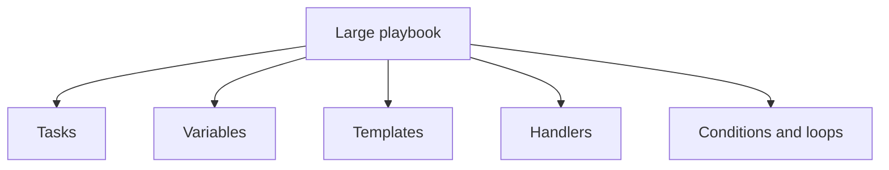
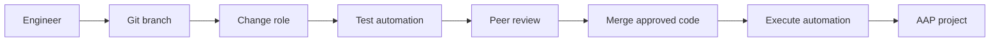
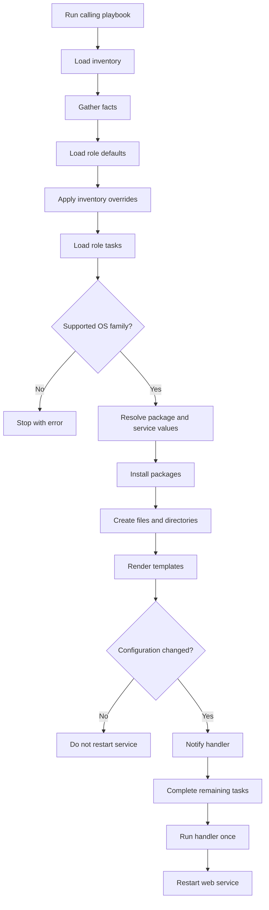

<p align="left">
  <a href="https://github.com/Ansible-workshop-ch/bootcamp/blob/main/module05/conditions-loops-handlers-templates.md" target="_blank">
    
  </a>
</p>

<p align="right">
  <a href="https://github.com/Ansible-workshop-ch/bootcamp/blob/main/module07/aap-workflow.md" target="_blank">
    
  </a>
</p>

# Module 6: Roles and Code-First Repository Structure

> Lab commands run from [`bootcamp/lab/`](../lab/). Run `cd bootcamp/lab` before beginning.

**Day 2 - Core Skills**

In Module 5, the conditions, loops, templates, variables, and handlers were stored in one playbook.

That structure works for small automation, but it becomes difficult to maintain as automation grows.

In this module, you will move the Module 5 implementation into a reusable Ansible role named `web_config`.

---

## Definition

### Learning objectives

By the end of this module, you should be able to:

* Explain what an Ansible role is.
* Explain why teams use roles.
* Understand the standard role directory structure.
* Create a role with `ansible-galaxy`.
* Move tasks, templates, handlers, defaults, and internal variables into a role.
* Call a role from a small playbook.
* Override role defaults using inventory variables.
* Validate role syntax and task loading.
* Confirm that a role remains idempotent.
* Explain how Git supports code-first automation.

---

### What is an Ansible role?

An Ansible role is a standard directory structure used to organize related automation.

Instead of placing everything inside one large playbook, a role separates content into dedicated locations.

A role can contain:

* Tasks
* Handlers
* Templates
* Static files
* Default variables
* Internal variables
* Metadata
* Documentation

A role represents one reusable automation capability.

Examples include:

* Configuring a web server
* Installing a monitoring agent
* Managing user accounts
* Applying security settings
* Deploying an application
* Performing compliance remediation

---

### Playbook without a role

Without a role, most implementation details are kept in one playbook.



This works for small examples, but it becomes harder to:

* Read
* Review
* Test
* Reuse
* Maintain
* Assign ownership
* Share across teams

---

### Playbook with a role

With a role, the calling playbook becomes small.


The playbook defines:

* Which hosts are targeted
* Whether privilege escalation is required
* Whether facts should be gathered
* Which roles should run

The role contains the implementation.

---

### Why roles matter

#### Reusability

The same role can be called from multiple playbooks.

```text
playbooks/development.yml
playbooks/testing.yml
playbooks/production.yml
```

Each playbook can call:

```yaml
roles:
  - web_config
```

Different environments can change the role's behavior through variables.

---

#### Organization

Roles separate different types of content.

Tasks are not mixed with:

* Templates
* Handlers
* Static files
* Defaults
* Metadata
* Documentation

This makes the repository easier to understand.

---

#### Team ownership

A role should have one clear responsibility.

Example:

```text
roles/
|-- web_config/
|-- monitoring_agent/
|-- security_baseline/
|-- user_management/
`-- application_deploy/
```

Each role represents a specific service or automation capability.

---

#### Testing

A role can be validated before it becomes part of a larger workflow.

Teams should test:

* YAML syntax
* Variable availability
* Task loading
* Task execution
* Handler behavior
* Generated content
* Idempotency

---

#### Code review

Role changes can be committed to Git and reviewed before execution.

A reviewer can clearly identify whether a change affects:

* Tasks
* Variables
* Templates
* Handlers
* Metadata
* Documentation

---

### Standard role structure

A standard role may contain:

```text
roles/
`-- web_config/
    |-- README.md
    |-- defaults/
    |   `-- main.yml
    |-- files/
    |-- handlers/
    |   `-- main.yml
    |-- meta/
    |   `-- main.yml
    |-- tasks/
    |   `-- main.yml
    |-- templates/
    |   |-- apache-hardening.conf.j2
    |   `-- index.html.j2
    `-- vars/
        `-- main.yml
```

Not every role must use every directory.

Ansible automatically loads `main.yml` from the standard role directories.

---

### Role directory reference

| Directory | Purpose |
| --- | --- |
| `tasks/` | Tasks performed by the role |
| `handlers/` | Handlers notified by changed tasks |
| `templates/` | Jinja2 templates |
| `files/` | Static files copied by the role |
| `defaults/` | User-configurable default values |
| `vars/` | Internal role values and mappings |
| `meta/` | Role metadata and dependencies |
| `README.md` | Role documentation |

---

### Role tasks

Role tasks normally begin in:

```text
roles/web_config/tasks/main.yml
```

Example:

```yaml
---
- name: Install the web server
  ansible.builtin.package:
    name: "{{ web_package_resolved }}"
    state: present
```

A role task file does not normally contain:

```yaml
hosts:
become:
gather_facts:
```

Those settings belong in the calling playbook.

---

### Role templates

Role templates are stored in:

```text
roles/web_config/templates/
```

Inside a role task, reference a template by filename:

```yaml
- name: Deploy the website
  ansible.builtin.template:
    src: index.html.j2
    dest: /var/www/html/index.html
```

Do not use the Module 5 path:

```yaml
src: ../templates/index.html.j2
```

Ansible automatically searches the role's `templates/` directory.

---

### Role handlers

Role handlers normally begin in:

```text
roles/web_config/handlers/main.yml
```

Example:

```yaml
---
- name: Restart web service
  ansible.builtin.service:
    name: "{{ web_service_resolved }}"
    state: restarted
```

Role tasks can notify this handler:

```yaml
notify: Restart web service
```

The notification name must exactly match the handler name.

---

### Role defaults

Role defaults are stored in:

```text
roles/web_config/defaults/main.yml
```

Defaults contain values that users are expected to override.

Example:

```yaml
---
company: "Example Organization"
environment_name: "default"
web_message: "Managed by the web_config role"
web_owner: "Platform Engineering"
web_port: 80
```

Role defaults have low variable precedence.

They can be overridden by:

* `group_vars`
* `host_vars`
* Play variables
* Variables passed when calling the role
* Extra variables

Your existing inventory variables will override matching role defaults.

---

### Role variables

Internal role variables are stored in:

```text
roles/web_config/vars/main.yml
```

These variables are useful for internal mappings.

Example:

```yaml
---
web_package_map:
  RedHat: httpd
  Debian: apache2

web_service_map:
  RedHat: httpd
  Debian: apache2
```

Role variables have higher precedence than role defaults.

Do not place every variable in `vars/main.yml`.

Values users should configure belong in:

```text
defaults/main.yml
```

Internal implementation values can belong in:

```text
vars/main.yml
```

---

### Defaults versus vars

| Location | Purpose | Easy to override? |
| --- | --- | --- |
| `defaults/main.yml` | User-configurable default values | Yes |
| `vars/main.yml` | Internal mappings and constants | No, not easily |
| `group_vars/` | Values for an inventory group | Yes |
| `host_vars/` | Values for one inventory host | Yes |

A strong role exposes configurable behavior through defaults and keeps internal variables limited.

---

### Role metadata

Role metadata is stored in:

```text
roles/web_config/meta/main.yml
```

Metadata can describe:

* Author
* Description
* License
* Minimum Ansible version
* Supported platforms
* Role dependencies

Metadata documents the role. It does not perform configuration tasks.

---

### Code-first automation

Code-first automation means automation is created, tested, reviewed, and versioned before it is executed.

The Git repository becomes the source of truth.



A code-first workflow provides:

* Version history
* Peer review
* Change tracking
* Rollback capability
* Reusable automation
* Clear ownership
* Consistent execution

AAP does not replace the repository.

AAP consumes and executes approved automation stored in Git.

---

### Security note

Do not store readable secrets directly in:

* Playbooks
* Role defaults
* Role variables
* Templates
* Inventory files
* Git repositories

Wrong:

```yaml
database_password: SuperSecretPassword123
```

Sensitive values should be encrypted with Ansible Vault or retrieved from an approved secret management system.

---

### Module workflow



---

## Hands-On Walkthrough

### Repository structure

This module reuses the inventory and group variables created in Modules 4 and 5.

```text
lab/
|-- ansible.cfg
|-- inventories/
|   |-- inventory.ini
|   `-- group_vars/
|       |-- all.yml
|       |-- web.yml
|       |-- rhel_web.yml
|       `-- ubuntu_web.yml
|-- playbooks/
|   |-- module5_template_deploy.yml
|   `-- module6_role_apply.yml
`-- roles/
    `-- web_config/
        |-- README.md
        |-- defaults/
        |   `-- main.yml
        |-- files/
        |-- handlers/
        |   `-- main.yml
        |-- meta/
        |   `-- main.yml
        |-- tasks/
        |   `-- main.yml
        |-- templates/
        |   |-- apache-hardening.conf.j2
        |   `-- index.html.j2
        `-- vars/
            `-- main.yml
```

Module 5 remains available for comparison.

Module 6 calls the role instead of repeating the complete implementation in the playbook.

---

### Step 1: Verify the existing inventory variables

Verify:

```text
inventories/group_vars/all.yml
```

```yaml
---
company: "Charter"
environment_name: "training"
```

Verify:

```text
inventories/group_vars/web.yml
```

```yaml
---
web_port: 80
web_message: "Hello from Ansible - {{ company }} {{ environment_name }}"
```

Verify:

```text
inventories/group_vars/rhel_web.yml
```

```yaml
---
package_name: httpd
service_name: httpd

common_packages:
  - vim
  - git
  - curl-minimal
  - httpd
```

Verify:

```text
inventories/group_vars/ubuntu_web.yml
```

```yaml
---
package_name: apache2
service_name: apache2

common_packages:
  - vim
  - git
  - curl
  - apache2
```

The role will use these values when they are available.

It will also contain fallback mappings so it can still resolve operating-system-specific values.

---

### Step 2: Verify the inventory groups

Run:

```bash
ansible-inventory -i inventories/inventory.ini --graph
```

Confirm that:

```text
RHEL hosts belong to rhel_web and web
Ubuntu hosts belong to ubuntu_web and web
```

Example:

```text
@all:
  |--@web:
  |  |--server1
  |  |--server2
  |--@rhel_web:
  |  |--server1
  |--@ubuntu_web:
     |--server2
```

The calling playbook will target:

```yaml
hosts: web
```

---

### Step 3: Create the role skeleton

Run:

```bash
ansible-galaxy role init web_config --init-path roles
```

Expected result:

```text
- Role web_config was created successfully
```

Do not run the command again if the role already exists.

Inspect the generated files:

```bash
find roles/web_config -maxdepth 2 -type f | sort
```

Expected files include:

```text
roles/web_config/README.md
roles/web_config/defaults/main.yml
roles/web_config/handlers/main.yml
roles/web_config/meta/main.yml
roles/web_config/tasks/main.yml
roles/web_config/vars/main.yml
```

The command also creates directories such as:

```text
roles/web_config/files/
roles/web_config/templates/
```

---

### Step 4: Configure the role search path

Open:

```text
ansible.cfg
```

Confirm it contains:

```ini
[defaults]
inventory = ./inventories/inventory.ini
roles_path = ./roles
host_key_checking = False
retry_files_enabled = False
```

The important Module 6 setting is:

```ini
roles_path = ./roles
```

Verify the active configuration:

```bash
ansible-config dump --only-changed
```

Look for a role path pointing to:

```text
bootcamp/lab/roles
```

Without the correct role path, Ansible may report:

```text
ERROR! the role 'web_config' was not found
```

---

### Step 5: Create role defaults

Edit:

```text
roles/web_config/defaults/main.yml
```

Add:

```yaml
---
company: "Example Organization"
environment_name: "default"
web_message: "Managed by the web_config role"
web_owner: "Platform Engineering"
web_port: 80

web_document_root: /var/www/html
web_index_file: index.html
web_config_filename: charter-module6.conf
web_role_info_path: /etc/charter/web_config_role.txt
```

These values define the default role behavior.

Your existing inventory variables override matching defaults.

For example:

```text
roles/web_config/defaults/main.yml
company: "Example Organization"
```

is overridden by:

```text
inventories/group_vars/all.yml
company: "Charter"
```

---

### Step 6: Create internal role variables

Edit:

```text
roles/web_config/vars/main.yml
```

Add:

```yaml
---
web_package_map:
  RedHat: httpd
  Debian: apache2

web_service_map:
  RedHat: httpd
  Debian: apache2

web_common_packages_map:
  RedHat:
    - vim
    - git
    - curl-minimal
    - httpd

  Debian:
    - vim
    - git
    - curl
    - apache2

web_config_directory_map:
  RedHat: /etc/httpd/conf.d
  Debian: /etc/apache2/conf-available

web_config_enabled_directory_map:
  Debian: /etc/apache2/conf-enabled
```

These mappings are internal role implementation values.

The role will prefer existing inventory variables such as:

```yaml
package_name
service_name
common_packages
```

If those variables are missing, it will use the internal maps.

---

### Step 7: Create the Apache configuration template

Create:

```text
roles/web_config/templates/apache-hardening.conf.j2
```

Add:

```jinja2
# Managed by Ansible
# Role: web_config
# Host: {{ inventory_hostname }}
# Company: {{ company }}
# Environment: {{ environment_name }}

ServerTokens Prod
ServerSignature Off
TraceEnable Off
AddDefaultCharset UTF-8
```

Inside the role task, this template will be referenced as:

```yaml
src: apache-hardening.conf.j2
```

---

### Step 8: Create the website template

Create:

```text
roles/web_config/templates/index.html.j2
```

Add:

```jinja2
<!DOCTYPE html>
<html lang="en">
<head>
  <meta charset="UTF-8">
  <title>{{ web_message }}</title>
</head>
<body>
  <h1>{{ web_message }}</h1>

  <p><strong>Managed host:</strong> {{ inventory_hostname }}</p>
  <p><strong>Company:</strong> {{ company }}</p>
  <p><strong>Environment:</strong> {{ environment_name }}</p>
  <p><strong>Owner:</strong> {{ web_owner }}</p>
  <p><strong>Operating system:</strong> {{ ansible_facts['distribution'] }}</p>
  <p><strong>OS family:</strong> {{ ansible_facts['os_family'] }}</p>
  <p><strong>Architecture:</strong> {{ ansible_facts['architecture'] }}</p>
  <p><strong>Package:</strong> {{ web_package_resolved }}</p>
  <p><strong>Service:</strong> {{ web_service_resolved }}</p>
  <p><strong>Web port:</strong> {{ web_port }}</p>
  <p><strong>Ansible role:</strong> web_config</p>

  
  <p>This host uses the Red Hat Apache structure.</p>
  
  <p>This host uses the Debian Apache structure.</p>
  
  <p>This operating system family is not supported.</p>
  

  <h2>Managed Packages</h2>

  <ul>
  
    <li>{{ package }}</li>
  
  </ul>

  <p>This page was generated by the web_config Ansible role.</p>
</body>
</html>
```

The template demonstrates:

* Role defaults
* Inventory overrides
* Gathered facts
* Resolved role variables
* A Jinja2 condition
* A Jinja2 loop

---

### Step 9: Create the role handler

Edit:

```text
roles/web_config/handlers/main.yml
```

Add:

```yaml
---
- name: Restart web service
  ansible.builtin.service:
    name: "{{ web_service_resolved }}"
    state: restarted
```

The handler uses the service name resolved for each managed host.

---

### Step 10: Create the role tasks

Edit:

```text
roles/web_config/tasks/main.yml
```

Add:

```yaml
---
- name: Verify that the operating system is supported
  ansible.builtin.assert:
    that:
      - ansible_facts['os_family'] in web_package_map
      - ansible_facts['os_family'] in web_service_map
      - ansible_facts['os_family'] in web_common_packages_map
      - ansible_facts['os_family'] in web_config_directory_map
    fail_msg: >-
      The web_config role does not support the
      {{ ansible_facts['os_family'] }} operating system family.
    success_msg: >-
      The web_config role supports the
      {{ ansible_facts['os_family'] }} operating system family.

- name: Resolve operating-system-specific values
  ansible.builtin.set_fact:
    web_package_resolved: >-
      {{
        package_name
        | default(web_package_map[ansible_facts['os_family']])
      }}
    web_service_resolved: >-
      {{
        service_name
        | default(web_service_map[ansible_facts['os_family']])
      }}
    web_packages_resolved: >-
      {{
        common_packages
        | default(web_common_packages_map[ansible_facts['os_family']])
      }}

- name: Display resolved role values
  ansible.builtin.debug:
    msg:
      - "Host: {{ inventory_hostname }}"
      - "Package: {{ web_package_resolved }}"
      - "Service: {{ web_service_resolved }}"
      - "Packages: {{ web_packages_resolved }}"
      - "Environment: {{ environment_name }}"

- name: Install managed packages
  ansible.builtin.package:
    name: "{{ item }}"
    state: present
  loop: "{{ web_packages_resolved }}"
  loop_control:
    label: "{{ item }}"

- name: Create the Charter configuration directory
  ansible.builtin.file:
    path: /etc/charter
    state: directory
    owner: root
    group: root
    mode: "0755"

- name: Create the role information file
  ansible.builtin.copy:
    dest: "{{ web_role_info_path }}"
    content: |
      Managed by Ansible
      Role: web_config
      Host: {{ inventory_hostname }}
      Company: {{ company }}
      Environment: {{ environment_name }}
      Owner: {{ web_owner }}
      Operating system: {{ ansible_facts['distribution'] }}
      Operating system family: {{ ansible_facts['os_family'] }}
      Package: {{ web_package_resolved }}
      Service: {{ web_service_resolved }}
      Web port: {{ web_port }}
    owner: root
    group: root
    mode: "0644"

- name: Deploy the Apache configuration
  ansible.builtin.template:
    src: apache-hardening.conf.j2
    dest: >-
      {{
        web_config_directory_map[ansible_facts['os_family']]
      }}/{{ web_config_filename }}
    owner: root
    group: root
    mode: "0644"
  notify: Restart web service

- name: Enable the Apache configuration on Debian systems
  ansible.builtin.file:
    src: >-
      {{
        web_config_directory_map['Debian']
      }}/{{ web_config_filename }}
    dest: >-
      {{
        web_config_enabled_directory_map['Debian']
      }}/{{ web_config_filename }}
    state: link
  when: ansible_facts['os_family'] == "Debian"
  notify: Restart web service

- name: Deploy the website
  ansible.builtin.template:
    src: index.html.j2
    dest: "{{ web_document_root }}/{{ web_index_file }}"
    owner: root
    group: root
    mode: "0644"

- name: Ensure the web service is enabled and running
  ansible.builtin.service:
    name: "{{ web_service_resolved }}"
    state: started
    enabled: true

- name: Verify that the website responds
  ansible.builtin.uri:
    url: "http://localhost:{{ web_port }}"
    status_code: 200
    return_content: false
```

Notice that this role task file does not contain:

```yaml
hosts:
become:
gather_facts:
```

Those values belong in the calling playbook.

The role also avoids installing the web server twice.

The existing `common_packages` lists already contain:

```text
httpd
```

or:

```text
apache2
```

Therefore, a separate web package installation task is unnecessary.

---

### Step 11: Create role metadata

Edit:

```text
roles/web_config/meta/main.yml
```

Replace the generated content with:

```yaml
---
galaxy_info:
  author: Charter Ansible Training
  description: Install and configure an Apache web server
  license: MIT
  min_ansible_version: "2.15"

  platforms:
    - name: EL
      versions:
        - "8"
        - "9"

    - name: Debian
      versions:
        - "11"
        - "12"

dependencies: []
```

The metadata documents the intended role purpose and supported platforms.

It does not configure the managed hosts.

---

### Step 12: Document the role

Edit:

```text
roles/web_config/README.md
```

Add:

```markdown
# web_config

The `web_config` role installs and configures an Apache web server on supported Red Hat and Debian systems.

## Requirements

* Ansible facts must be gathered.
* Privilege escalation is required.
* The managed host must use the `RedHat` or `Debian` operating system family.

## Default Variables

| Variable | Default | Purpose |
| --- | --- | --- |
| `company` | `Example Organization` | Organization displayed in generated files |
| `environment_name` | `default` | Environment displayed in generated files |
| `web_message` | `Managed by the web_config role` | Website heading |
| `web_owner` | `Platform Engineering` | Team displayed on the website |
| `web_port` | `80` | Port used to validate the website |
| `web_document_root` | `/var/www/html` | Website destination directory |
| `web_index_file` | `index.html` | Website index filename |
| `web_config_filename` | `charter-module6.conf` | Apache configuration filename |
| `web_role_info_path` | `/etc/charter/web_config_role.txt` | Role information file |

## Optional Inventory Overrides

The role can use these inventory variables when they are defined:

| Variable | Purpose |
| --- | --- |
| `package_name` | Operating-system-specific Apache package |
| `service_name` | Operating-system-specific Apache service |
| `common_packages` | Packages installed by the role |

## Example Playbook

```yaml
---
- name: Apply the web_config role
  hosts: web
  become: true
  gather_facts: true

  roles:
    - web_config
```

## Validation

Run the role playbook twice:

```bash
ansible-playbook \
  -i inventories/inventory.ini \
  playbooks/module6_role_apply.yml
```

The second run should not restart the web service unless the Apache configuration changed.
```

Every reusable role should explain:

* What it does
* What it requires
* Which variables users can configure
* How inventory variables affect it
* How to call it
* How to validate it

---

### Step 13: Create the calling playbook

Create:

```text
playbooks/module6_role_apply.yml
```

Add:

```yaml
---
- name: Module 6 - Apply the reusable web configuration role
  hosts: web
  become: true
  gather_facts: true

  roles:
    - web_config
```

The playbook is now small.

It defines:

* Target hosts
* Privilege escalation
* Fact gathering
* The role to execute

The implementation lives in:

```text
roles/web_config/
```

---

### Module 5 compared with Module 6

| Module 5 | Module 6 |
| --- | --- |
| Logic is concentrated in one playbook | Logic is separated into role directories |
| Templates are outside the role | Templates belong to the role |
| Handlers are defined in the playbook | Handlers belong to the role |
| Implementation and execution are combined | Implementation and execution are separated |
| Harder to reuse | Designed for reuse |
| Useful for learning task behavior | Better for team-scale organization |

Module 5 was not wrong.

Module 6 improves how the same automation is organized and reused.

---

### Step 14: Validate the inventory

Run:

```bash
ansible-inventory \
  -i inventories/inventory.ini \
  --graph
```

Confirm that the inventory contains:

```text
@web:
```

Confirm that the web hosts also belong to the correct OS-specific groups.

---

### Step 15: Check the role playbook syntax

Run:

```bash
ansible-playbook \
  -i inventories/inventory.ini \
  playbooks/module6_role_apply.yml \
  --syntax-check
```

Expected result:

```text
playbook: playbooks/module6_role_apply.yml
```

---

### Step 16: List the role tasks

Run:

```bash
ansible-playbook \
  -i inventories/inventory.ini \
  playbooks/module6_role_apply.yml \
  --list-tasks
```

Expected tasks include:

```text
web_config : Verify that the operating system is supported
web_config : Resolve operating-system-specific values
web_config : Install managed packages
web_config : Create the Charter configuration directory
web_config : Deploy the Apache configuration
web_config : Deploy the website
web_config : Ensure the web service is enabled and running
```

The role name appears before each task.

This makes it easier to identify where the task is defined.

---

### Step 17: Perform the first run

Run:

```bash
ansible-playbook \
  -i inventories/inventory.ini \
  playbooks/module6_role_apply.yml
```

The first run should:

1. Gather facts.
2. Load role defaults.
3. Apply inventory overrides.
4. Verify the operating system.
5. Resolve package and service values.
6. Install the correct packages.
7. Create `/etc/charter`.
8. Create the role information file.
9. Generate the Apache configuration.
10. Enable the Debian configuration when required.
11. Generate the website.
12. Start and enable the web service.
13. Verify that the website returns status code 200.
14. Run the handler if the configuration changed.

Some tasks should report:

```text
changed
```

---

### Step 18: Perform the second run

Run the same command again without changing anything:

```bash
ansible-playbook \
  -i inventories/inventory.ini \
  playbooks/module6_role_apply.yml
```

Expected behavior:

* Most tasks report `ok`.
* Packages remain installed.
* Files remain unchanged.
* The Apache configuration remains unchanged.
* The handler does not run.
* The web service is not unnecessarily restarted.
* The website still returns status code 200.

This confirms that moving the automation into a role did not break idempotency.

---

### Step 19: Test a role default override

Edit:

```text
inventories/group_vars/web.yml
```

Change:

```yaml
web_message: "Hello from Ansible - {{ company }} {{ environment_name }}"
```

To:

```yaml
web_message: "Charter Role Override Successful"
```

Run:

```bash
ansible-playbook \
  -i inventories/inventory.ini \
  playbooks/module6_role_apply.yml
```

Expected behavior:

* The website template reports `changed`.
* The generated page contains the new message.
* The Apache configuration does not change.
* The restart handler does not run.

Validate the page:

```bash
ansible web \
  -i inventories/inventory.ini \
  -m ansible.builtin.uri \
  -a "url=http://localhost:{{ web_port }} return_content=true"
```

Look for:

```text
Charter Role Override Successful
```

This demonstrates that inventory variables override role defaults without changing role tasks.

---

### Step 20: Test the handler

Edit:

```text
roles/web_config/templates/apache-hardening.conf.j2
```

Add:

```jinja2
# Module 6 handler validation
```

Run:

```bash
ansible-playbook \
  -i inventories/inventory.ini \
  playbooks/module6_role_apply.yml
```

Expected behavior:

1. The Apache configuration task reports `changed`.
2. The task notifies `Restart web service`.
3. Ansible completes the remaining tasks.
4. The role handler runs once near the end.
5. The correct service restarts on each host.

Run the playbook again without another change:

```bash
ansible-playbook \
  -i inventories/inventory.ini \
  playbooks/module6_role_apply.yml
```

The handler should not run again.

---

### Step 21: Validate the generated content

Check the role information file:

```bash
ansible web \
  -i inventories/inventory.ini \
  -b \
  -m ansible.builtin.command \
  -a "cat /etc/charter/web_config_role.txt"
```

Expected content includes:

```text
Managed by Ansible
Role: web_config
Company: Charter
Environment: training
```

Check the generated website:

```bash
ansible web \
  -i inventories/inventory.ini \
  -b \
  -m ansible.builtin.command \
  -a "cat /var/www/html/index.html"
```

Check the service state:

```bash
ansible web \
  -i inventories/inventory.ini \
  -b \
  -m ansible.builtin.command \
  -a "systemctl is-active {{ service_name }}"
```

Test the web server:

```bash
ansible web \
  -i inventories/inventory.ini \
  -m ansible.builtin.uri \
  -a "url=http://localhost:{{ web_port }} status_code=200"
```

Expected result:

```text
status: 200
```

---

### Step 22: Review the Git changes

Check the repository state:

```bash
git status
```

Review tracked changes:

```bash
git diff
```

Review the role files:

```bash
find roles/web_config -maxdepth 3 -type f | sort
```

A typical code-first workflow is:


Automation changes should be:

* Visible
* Reviewable
* Tested
* Approved
* Versioned

---

### Common problems

| Problem | Likely cause | Check |
| --- | --- | --- |
| Role not found | Incorrect `roles_path` or wrong working directory | Check `ansible.cfg` and `pwd` |
| Variable undefined | Missing default or inventory variable | Check `defaults/main.yml` and `group_vars` |
| Template not found | Template is outside the role or filename is wrong | Check `roles/web_config/templates/` |
| Handler not found | Notification and handler names do not match | Compare `notify` and handler `name` |
| Package not found | Wrong package value for the OS | Check resolved variables |
| Service not found | Wrong service value for the OS | Check `web_service_resolved` |
| Role cannot be overridden | Configurable value was placed in `vars/main.yml` | Move it to `defaults/main.yml` |
| Handler runs every time | Notifying task always reports changed | Check template content and permissions |
| Website validation fails | Service is stopped or port is wrong | Check service state and `web_port` |

---

## Quiz

1. Why are Ansible roles used?

   * A. To organize and reuse related automation
   * B. To replace inventories
   * C. To avoid using playbooks
   * D. To install AAP

2. Where do the main role tasks normally live?

   * A. `roles/<role_name>/tasks/main.yml`
   * B. `roles/<role_name>/README.md`
   * C. `group_vars/main.yml`
   * D. `inventories/main.yml`

3. Where do role handlers normally live?

   * A. `roles/<role_name>/handlers/main.yml`
   * B. `roles/<role_name>/tasks/handlers.yml`
   * C. `playbooks/handlers.yml`
   * D. `inventories/handlers.yml`

4. Where should user-configurable defaults normally be stored?

   * A. `handlers/main.yml`
   * B. `defaults/main.yml`
   * C. `templates/main.yml`
   * D. `meta/main.yml`

5. What is an appropriate use for `vars/main.yml`?

   * A. Internal operating-system mappings
   * B. User passwords
   * C. Inventory hostnames
   * D. Playbook output

6. How should a template inside a role normally be referenced?

   * A. By filename, such as `index.html.j2`
   * B. With an absolute path on the managed host
   * C. Through the inventory file
   * D. Through an AAP credential

7. What belongs in the calling playbook?

   * A. Target hosts, privilege escalation, fact gathering, and role names
   * B. Every role template
   * C. Every role handler
   * D. Every internal role mapping

8. Why does `group_vars/web.yml` override a value in `defaults/main.yml`?

   * A. Inventory group variables have higher precedence than role defaults
   * B. Role defaults cannot contain variables
   * C. Templates always override variables
   * D. Handlers change variable precedence

9. What should happen during the second role execution when nothing changed?

   * A. Every task reports changed
   * B. The role is recreated
   * C. Most tasks report ok and the handler does not run
   * D. Every service restarts

10. What is a main benefit of code-first automation?

    * A. Changes are versioned, reviewable, and reusable
    * B. Git is no longer required
    * C. Variables stop working
    * D. Engineers can bypass review

---

## Hands-On Lab - Build a reusable web server role

### Goal

Convert the Module 5 web server automation into a reusable role named:

```text
web_config
```

---

### You will

1. Create a standard role structure.
2. Configure the role search path.
3. Add user-configurable defaults.
4. Add internal operating-system mappings.
5. Move templates into the role.
6. Move the restart handler into the role.
7. Move implementation tasks into the role.
8. Add metadata and documentation.
9. Create a small calling playbook.
10. Validate task loading and syntax.
11. Test inventory variable overrides.
12. Confirm handler behavior.
13. Confirm idempotency.
14. Review the role through Git.

---

### Task 1: Create the role

Run:

```bash
ansible-galaxy role init web_config --init-path roles
```

Do not run the command if:

```text
roles/web_config/
```

already exists.

---

### Task 2: Configure Ansible

Confirm that `ansible.cfg` contains:

```ini
[defaults]
inventory = ./inventories/inventory.ini
roles_path = ./roles
host_key_checking = False
retry_files_enabled = False
```

Verify:

```bash
ansible-config dump --only-changed
```

---

### Task 3: Create role defaults

Add configurable values to:

```text
roles/web_config/defaults/main.yml
```

Include:

```text
company
environment_name
web_message
web_owner
web_port
web_document_root
web_index_file
web_config_filename
web_role_info_path
```

---

### Task 4: Create internal mappings

Add operating-system mappings to:

```text
roles/web_config/vars/main.yml
```

Include maps for:

```text
Package names
Service names
Package lists
Apache configuration directories
Debian enabled configuration directory
```

---

### Task 5: Move the templates

Create:

```text
roles/web_config/templates/apache-hardening.conf.j2
roles/web_config/templates/index.html.j2
```

Reference them inside role tasks by filename only.

Correct:

```yaml
src: index.html.j2
```

Wrong:

```yaml
src: ../templates/index.html.j2
```

---

### Task 6: Create the role handler

Create:

```text
roles/web_config/handlers/main.yml
```

Add a handler named:

```text
Restart web service
```

The handler must restart:

```yaml
web_service_resolved
```

---

### Task 7: Create the role tasks

Create the role implementation in:

```text
roles/web_config/tasks/main.yml
```

The tasks must:

1. Verify the operating system.
2. Resolve package, service, and package list values.
3. Install packages.
4. Create `/etc/charter`.
5. Create a role information file.
6. Deploy the Apache configuration.
7. Enable the configuration on Debian.
8. Generate the website.
9. Start and enable the web service.
10. Validate the website.

Do not add:

```yaml
hosts:
become:
gather_facts:
```

to the role task file.

---

### Task 8: Add metadata and documentation

Create:

```text
roles/web_config/meta/main.yml
```

Document:

* Role author
* Role description
* License
* Minimum Ansible version
* Supported platforms

Update:

```text
roles/web_config/README.md
```

Document:

* Role purpose
* Requirements
* Default variables
* Optional inventory overrides
* Example playbook
* Validation command

---

### Task 9: Create the calling playbook

Create:

```text
playbooks/module6_role_apply.yml
```

Add:

```yaml
---
- name: Module 6 - Apply the reusable web configuration role
  hosts: web
  become: true
  gather_facts: true

  roles:
    - web_config
```

---

### Task 10: Validate the role

Run a syntax check:

```bash
ansible-playbook \
  -i inventories/inventory.ini \
  playbooks/module6_role_apply.yml \
  --syntax-check
```

List the tasks:

```bash
ansible-playbook \
  -i inventories/inventory.ini \
  playbooks/module6_role_apply.yml \
  --list-tasks
```

---

### Task 11: Run the role

Run:

```bash
ansible-playbook \
  -i inventories/inventory.ini \
  playbooks/module6_role_apply.yml
```

Confirm that:

* RHEL hosts use `httpd`.
* Ubuntu hosts use `apache2`.
* Packages install through a loop.
* The role information file is created.
* The Apache configuration is generated.
* The website is generated.
* The service is active.
* The website returns status code 200.

---

### Task 12: Confirm idempotency

Run the same playbook again without changing anything:

```bash
ansible-playbook \
  -i inventories/inventory.ini \
  playbooks/module6_role_apply.yml
```

Confirm that:

* Most tasks report `ok`.
* Packages are not reinstalled.
* Templates remain unchanged.
* The handler does not run.
* The service is not unnecessarily restarted.

---

### Task 13: Test an inventory override

Edit:

```text
inventories/group_vars/web.yml
```

Change `web_message`.

Run the role again.

Confirm that:

* The website changes.
* The Apache configuration does not change.
* The restart handler does not run.

---

### Task 14: Test the handler

Edit:

```text
roles/web_config/templates/apache-hardening.conf.j2
```

Add:

```jinja2
# Handler test
```

Run the role.

Confirm that:

* The configuration task reports `changed`.
* The handler is notified.
* The handler runs once.

Run the role again without another edit.

Confirm that the handler does not run.

---

### Task 15: Review the code-first changes

Run:

```bash
git status
git diff
find roles/web_config -maxdepth 3 -type f | sort
```

Confirm that the role structure is clear and reviewable.

---

### Validation commands

Check the role information file:

```bash
ansible web \
  -i inventories/inventory.ini \
  -b \
  -m ansible.builtin.command \
  -a "cat /etc/charter/web_config_role.txt"
```

Check the website:

```bash
ansible web \
  -i inventories/inventory.ini \
  -b \
  -m ansible.builtin.command \
  -a "cat /var/www/html/index.html"
```

Check the service:

```bash
ansible web \
  -i inventories/inventory.ini \
  -b \
  -m ansible.builtin.command \
  -a "systemctl is-active {{ service_name }}"
```

Test the website:

```bash
ansible web \
  -i inventories/inventory.ini \
  -m ansible.builtin.uri \
  -a "url=http://localhost:{{ web_port }} status_code=200"
```

---

### Success check

* [ ] I can explain what an Ansible role is.
* [ ] I understand the standard role directory structure.
* [ ] I can create a role using `ansible-galaxy`.
* [ ] I know where role tasks are stored.
* [ ] I know where role handlers are stored.
* [ ] I know where role templates are stored.
* [ ] I understand the difference between role defaults and role variables.
* [ ] I can override a role default from `group_vars`.
* [ ] I can call a role from a small playbook.
* [ ] I can troubleshoot a missing role.
* [ ] I can validate role syntax and task loading.
* [ ] I can test role handler behavior.
* [ ] I can confirm role idempotency.
* [ ] I can explain why code-first automation matters.

---

### Key lesson

```text
The playbook decides where automation runs. The role contains the reusable implementation.
```

---

<details>
<summary>Instructor answer key</summary>

1. **A** - Organize and reuse related automation
2. **A** - `roles/<role_name>/tasks/main.yml`
3. **A** - `roles/<role_name>/handlers/main.yml`
4. **B** - `defaults/main.yml`
5. **A** - Internal operating-system mappings
6. **A** - Reference the template by filename
7. **A** - Target hosts, privilege escalation, fact gathering, and role names
8. **A** - Inventory group variables have higher precedence than role defaults
9. **C** - Most tasks report `ok` and the handler does not run
10. **A** - Changes are versioned, reviewable, and reusable

</details>

<p align="left">
  <a href="https://github.com/Ansible-workshop-ch/bootcamp/blob/main/module05/conditions-loops-handlers-templates.md" target="_blank">
    
  </a>
</p>

<p align="right">
  <a href="https://github.com/Ansible-workshop-ch/bootcamp/blob/main/module07/aap-workflow.md" target="_blank">
    
  </a>
</p>