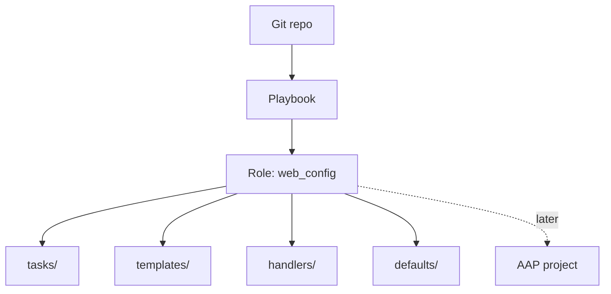

<p align="right">
  <a href="https://github.com/Ansible-workshop-ch/bootcamp/blob/main/module05/conditions-loops-handlers-templates.md" target="_blank">
    
  </a>
</p>

<p align="left">
  <a href="https://github.com/Ansible-workshop-ch/bootcamp/blob/main/module07/aap-workflow.md" target="_blank">
    
  </a>
</p>

# Module 6: Roles and Code-First Repo Structure

> 🧪 Lab commands run from [`bootcamp/lab/`](../lab/) — `cd bootcamp/lab` first. Diagrams render automatically on GitHub.

**Day 2 · Core Skills**

---

## Definition

**Roles** organize automation into reusable units. Instead of one giant playbook, a role splits logic into standard folders.

Roles let teams:
- Reuse automation across playbooks and projects
- Keep repos cleaner
- Separate variables, tasks, templates, and handlers
- Build patterns that later run from AAP

This matches Charter's **code-first** approach: build in Git, then run through AAP.

> **Ansible Vault (light mention):** Vault encrypts secrets so they are not stored as plain text. Deep secrets tooling (CyberArk, HashiCorp Vault) is out of scope here — just know *why* secrets should not be committed in the clear.

---

## Diagram / Workflow



Standard role layout (this repo's `roles/web_config/`):

```text
roles/web_config/
  tasks/main.yml        # what to do
  handlers/main.yml     # restart logic
  templates/index.html.j2
  defaults/main.yml     # overridable defaults
  vars/main.yml         # role-internal constants
  meta/main.yml         # role metadata
```

---

## Hands-On Walkthrough

The instructor converts the Module 5 playbook into the `web_config` role, then calls it (`playbooks/module6_role_apply.yml`):

```yaml
---
- name: Apply web role
  hosts: web
  become: true
  roles:
    - web_config
```

Run it:

```bash
ansible-playbook playbooks/module6_role_apply.yml
```

Talking points:
- The playbook is now tiny — the logic lives in the role.
- Role tasks live in `roles/<name>/tasks/main.yml`.
- `defaults/` values are easy to override from `group_vars`, `host_vars`, or a survey.
- Code-first means changes are **versioned, reviewable, and reusable**.

---

## Quiz

1. Why use roles?
   - A. To organize and reuse automation
   - B. To avoid playbooks
   - C. To replace Git
   - D. To install AAP

2. Where do role tasks usually live?
   - A. `roles/<name>/tasks/main.yml`
   - B. `group_vars` only
   - C. `host_vars` only
   - D. `README` only

3. What is the main benefit of code-first automation?
   - A. Changes are versioned, reviewable, and reusable
   - B. No one needs Git
   - C. AAP is no longer needed
   - D. Variables stop working

---

## Hands-On Lab — *Convert playbook to role*

**You will:**
1. Create a role folder (or inspect `roles/web_config/`).
2. Move tasks into `tasks/main.yml`.
3. Move the template into `templates/`.
4. Move the handler into `handlers/main.yml`.
5. Call the role from a playbook.
6. Run and validate.

```bash
ansible-playbook playbooks/module6_role_apply.yml
```

**Success check:**
- [ ] You understand the standard role structure.
- [ ] You can explain why roles matter for team-scale automation.

<details>
<summary>Instructor answer key</summary>

1. **A** — Organize and reuse automation
2. **A** — `roles/<name>/tasks/main.yml`
3. **A** — Versioned, reviewable, reusable
</details>
