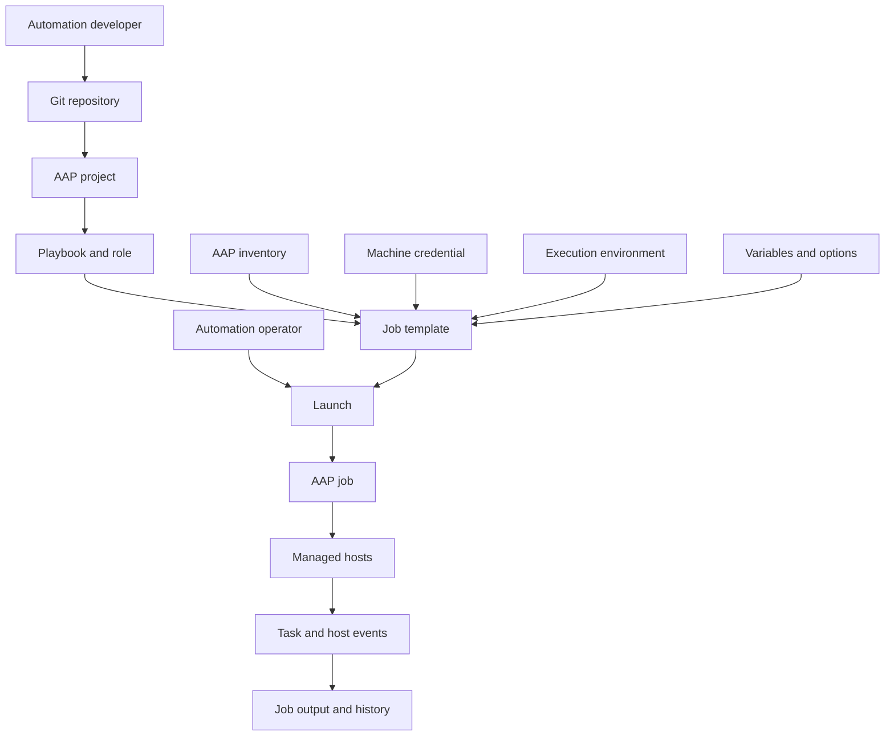
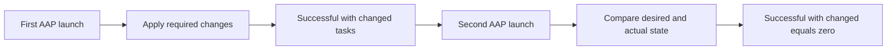
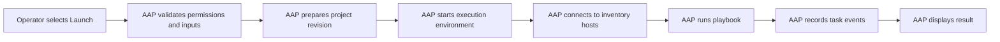

<p align="left">
  <a href="https://github.com/Ansible-workshop-ch/bootcamp/blob/main/module06/roles-and-code-first.md" target="_blank">
    
  </a>
</p>

<p align="right">
  <a href="https://github.com/Ansible-workshop-ch/bootcamp/blob/main/module08/aap-inventories-surveys-troubleshooting.md" target="_blank">
    
  </a>
</p>

# Module 7: AAP Workflow for Operators

> This module uses the AAP 2.6 training environment and the automation created in [`bootcamp/lab/`](../lab/).

**Day 3 - AAP and Applied Workflow**

This module explains how approved automation moves from Git into Ansible Automation Platform and runs as a controlled, repeatable, and auditable job.

The goal is not to make students AAP platform administrators.

The goal is to help operators understand how to synchronize, launch, monitor, validate, and escalate AAP automation jobs.

---

## Definition

### Learning objectives

By the end of this module, you should be able to:

* Explain what Ansible Automation Platform adds to Ansible automation.
* Explain the relationship between Git, projects, playbooks, roles, inventories, credentials, execution environments, job templates, and jobs.
* Locate and inspect an AAP project.
* Synchronize automation content from Git.
* Inspect an existing job template.
* Launch an existing job template.
* Follow a running job.
* Read task and host results.
* Understand `ok`, `changed`, `failed`, `unreachable`, and `skipped`.
* Read the play recap.
* Relaunch a job.
* Confirm idempotency through AAP.
* Compare an AAP project revision with a Git commit.
* Identify the likely owner of a failure.
* Escalate a failed job without exposing secrets.

---

### What is Ansible Automation Platform?

Red Hat Ansible Automation Platform, or AAP, is an enterprise platform for running, controlling, delegating, scheduling, and auditing Ansible automation.

The Ansible code remains in Git.

AAP adds controlled services around that code, including:

* Centralized execution
* Inventories
* Credentials
* Execution environments
* Job templates
* Role-based access control
* Job history
* Job output
* Scheduling
* Surveys
* Notifications
* Workflow automation
* Auditing

Playbooks and roles do not need to be rewritten for AAP.

The same automation tested from the command line can be synchronized from Git and executed through AAP.

---

### Key mental model

```text
Git stores the automation.

AAP controls how, where, and by whom the automation runs.
```

AAP does not replace:

* YAML
* Playbooks
* Roles
* Variables
* Git
* Testing
* Peer review

AAP adds controlled execution around those components.

---

### Operator scope

This module focuses on operator-level work.

Operators commonly work with:

* Projects
* Project synchronization
* Existing inventories
* Existing credentials
* Existing execution environments
* Job templates
* Job launches
* Job output
* Job history
* Relaunching jobs
* Basic failure identification

AAP administrators commonly manage:

* AAP installation and upgrades
* Platform gateway
* Automation mesh
* Execution nodes
* Control nodes
* Execution environment images
* Container registries
* Enterprise credentials
* Authentication
* Role-based access control
* Organizations and teams
* Platform capacity
* Backups and recovery
* Deep platform troubleshooting

Students should not modify platform-level settings during this module.

---

### Responsibility model

| Role | Primary responsibility |
| --- | --- |
| Automation developer | Creates and tests playbooks, roles, templates, and variables |
| Automation operator | Launches approved automation and reviews the result |
| AAP administrator | Maintains the platform, permissions, credentials, and execution infrastructure |

One person may perform more than one role, but the responsibilities remain separate.

---

### AAP project

An AAP project connects automation controller to automation content.

The content normally comes from a Git repository.

A project can contain:

* Playbooks
* Roles
* Templates
* Variable files
* Collection requirements
* Supporting files
* Documentation

This course project connects to the bootcamp repository.

The playbook used in this module is:

```text
lab/playbooks/module6_role_apply.yml
```

AAP synchronizes the repository from its root.

Therefore, the AAP playbook path includes:

```text
lab/
```

This differs from the local command-line path used after running:

```bash
cd bootcamp/lab
```

---

### AAP inventory

An AAP inventory defines the managed hosts available to automation jobs.

An inventory can contain:

* Hosts
* Groups
* Variables
* Static entries
* Dynamic inventory sources
* Constructed inventory rules

Module 7 uses an inventory prepared by the instructor or AAP administrator.

Inventory creation and advanced inventory management are covered in Module 8.

The Module 6 playbook targets:

```yaml
hosts: web
```

The selected AAP inventory must therefore contain a group named:

```text
web
```

The inventory should also contain the operating-system-specific groups used by the role:

```text
rhel_web
ubuntu_web
```

---

### AAP inventory variables

When AAP uses its own inventory, it does not automatically depend on the local static inventory file:

```text
lab/inventories/inventory.ini
```

The required host and group variables must be available through one of these sources:

* AAP inventory variables
* AAP group variables
* AAP host variables
* Role defaults
* Job template extra variables
* Survey variables

For this module, the instructor should prepare the required AAP inventory groups and variables before the lab.

Example variables for all hosts:

```yaml
company: "Charter"
environment_name: "training"
```

Example variables for the `web` group:

```yaml
web_port: 80
web_message: "Hello from Ansible - Charter training"
```

Example variables for the `rhel_web` group:

```yaml
package_name: httpd
service_name: httpd

common_packages:
  - vim
  - git
  - curl-minimal
  - httpd
```

Example variables for the `ubuntu_web` group:

```yaml
package_name: apache2
service_name: apache2

common_packages:
  - vim
  - git
  - curl
  - apache2
```

The role also contains fallback defaults and mappings, but the AAP inventory should provide environment-specific values.

---

### AAP credential

A credential provides protected authentication information.

Different credential types have different purposes.

| Credential type | Purpose |
| --- | --- |
| Source control credential | Allows AAP to access a protected Git repository |
| Machine credential | Allows an automation job to connect to managed hosts |
| Vault credential | Provides an Ansible Vault password |
| Container registry credential | Allows AAP to pull a protected execution environment |
| Cloud credential | Allows automation modules to authenticate to a cloud platform |

Students do not need access to credential secrets.

A credential can be attached to a job template without exposing its protected values.

---

### Execution environment

An execution environment is the container image used to run Ansible automation.

It can contain:

* `ansible-core`
* Ansible Runner
* Ansible collections
* Python libraries
* System packages
* Automation dependencies

Operators inspect or select an existing execution environment.

Building execution environments is outside the scope of this module.

---

### Job template

A job template defines how a playbook runs.

A job template connects:

* Project
* Playbook
* Inventory
* Credential
* Execution environment
* Variables
* Limits
* Tags
* Verbosity
* Other execution settings

A job template makes automation repeatable.

The operator launches a prepared template instead of entering every execution setting manually.

---

### Job

A job is one execution of a job template.

Every launch creates a new job record.

The job record can include:

* Status
* Start time
* Finish time
* User who launched it
* Job template
* Project revision
* Inventory
* Credentials used
* Execution environment
* Playbook
* Task output
* Host results
* Play recap

The job record creates an audit trail for the execution.

---

### AAP object relationship



The inventory, credential, project, and execution environment are separate inputs to the job template.

They do not flow through each other.

---

### Repository compatibility for AAP

Local commands in the previous modules were run from:

```text
bootcamp/lab/
```

AAP synchronizes the complete repository and runs from the project root.

The role is stored under:

```text
lab/roles/web_config/
```

Therefore, the repository root should contain:

```text
bootcamp/ansible.cfg
```

Use:

```ini
[defaults]
roles_path = ./lab/roles
```

This allows AAP to locate:

```text
lab/roles/web_config
```

Without the root-level role path, AAP may report:

```text
ERROR! the role 'web_config' was not found
```

Do not place passwords, private keys, tokens, or credentials inside `ansible.cfg`.

---

### Repository structure

```text
bootcamp/
|-- ansible.cfg
|-- module01/
|-- module02/
|-- module03/
|-- module04/
|-- module05/
|-- module06/
|-- module07/
|-- module08/
`-- lab/
    |-- ansible.cfg
    |-- inventories/
    |   |-- inventory.ini
    |   `-- group_vars/
    |       |-- all.yml
    |       |-- web.yml
    |       |-- rhel_web.yml
    |       `-- ubuntu_web.yml
    |-- playbooks/
    |   `-- module6_role_apply.yml
    `-- roles/
        `-- web_config/
```

The root `ansible.cfg` supports AAP project execution.

The `lab/ansible.cfg` supports local command-line execution from:

```text
bootcamp/lab/
```

---

### Job statuses

AAP jobs move through execution states.

| Status | Meaning |
| --- | --- |
| Pending | The job has been created but has not started |
| Waiting | The job is waiting for a dependency or resource |
| Running | The automation is executing |
| Successful | The job completed successfully |
| Failed | One or more automation tasks failed |
| Canceled | A user or system canceled the job |
| Error | A platform-level problem prevented normal execution |

The expected final status for this lab is:

```text
Successful
```

---

### Task result meanings

#### `ok`

```text
ok: [rhel1]
```

The task completed successfully and did not need to change the host.

Examples:

* A package was already installed.
* A directory already had the correct permissions.
* A service was already running.
* A generated file already matched its template.

---

#### `changed`

```text
changed: [rhel1]
```

The task completed successfully and modified the host.

Examples:

* A package was installed.
* A file was created.
* A template generated new content.
* A service was restarted.
* File permissions were corrected.

`changed` does not mean the task failed.

It means Ansible updated the managed state.

---

#### `failed`

```text
failed: [rhel1]
```

The task could not complete successfully.

Common causes include:

* Invalid module arguments
* Missing package
* Undefined variable
* Permission denied
* Invalid destination path
* Missing service
* Template syntax error

Do not stop at the word `failed`.

Read the detailed result fields, including:

```text
msg
stderr
stdout
exception
```

---

#### `unreachable`

```text
fatal: [rhel1]: UNREACHABLE!
```

AAP could not establish the required connection to the host.

Common causes include:

* Incorrect hostname
* Network failure
* Firewall rule
* Incorrect SSH port
* Invalid machine credential
* SSH key rejection
* Host offline
* DNS failure

An unreachable result normally occurs before the playbook can run normal tasks on that host.

---

#### `skipped`

```text
skipping: [ubuntu1]
```

The task was not executed for that host.

A common reason is a condition:

```yaml
when: ansible_facts['os_family'] == "RedHat"
```

An Ubuntu host should skip a Red Hat-specific task.

`skipped` is not automatically an error.

---

### Play recap

The play recap summarizes the result for every host.

Example:

```text
PLAY RECAP
ubuntu1 : ok=10 changed=2 unreachable=0 failed=0 skipped=1 rescued=0 ignored=0
rhel1   : ok=10 changed=2 unreachable=0 failed=0 skipped=1 rescued=0 ignored=0
```

A healthy result should normally contain:

```text
unreachable=0
failed=0
```

A first run may contain changed tasks.

These results require investigation:

```text
unreachable=1
```

or:

```text
failed=1
```

The recap identifies the affected host.

The task output explains the cause.

---

### Idempotency in AAP

AAP does not change Ansible idempotency behavior.

The first launch may apply required configuration changes.

Example:

```text
changed=4
failed=0
unreachable=0
```

The second launch, without code or host changes, should normally show:

```text
changed=0
failed=0
unreachable=0
```

The exact `ok` and `skipped` values can vary.

The important result is that unchanged automation does not repeatedly modify hosts.

Idempotency workflow:



---

### Failure ownership

| Failure category | Common symptoms | Likely owner |
| --- | --- | --- |
| Project failure | Project sync fails, wrong revision, repository authentication fails | Git owner or AAP project administrator |
| Inventory failure | No hosts matched, expected group missing, wrong hosts targeted | Inventory owner or automation operator |
| Credential failure | Permission denied, authentication failure, privilege escalation failure | Credential or AAP administrator |
| Automation code failure | Undefined variable, invalid module argument, missing role, template error | Automation developer or repository owner |
| Managed host failure | Package repository unavailable, disk full, service missing, host offline | Managed system or infrastructure owner |
| Platform failure | Job stays pending, execution environment cannot start, no capacity | AAP platform administrator |

Operators should identify the category before escalating.

---

### Operator escalation information

When escalating a failed job, provide:

* Job template name
* Job number or job URL
* Date and time
* Final status
* Project revision
* Inventory name
* Failed host
* Failed task
* Exact error message
* Whether the issue is repeatable
* Whether the code worked locally
* Whether the project synchronized successfully

Do not send:

* Passwords
* Private keys
* Tokens
* Vault secrets
* Credential contents

---

## Hands-On Walkthrough

### Lab goal

Run the `web_config` role created in Module 6 through AAP and understand every object involved in the execution.

---

### Required AAP objects

The instructor or AAP administrator should prepare these objects before class.

| Object | Example name |
| --- | --- |
| Organization | `Charter Training` |
| Project | `Charter Ansible Bootcamp` |
| Inventory | `Charter Linux Lab` |
| Machine credential | `Charter Linux SSH` |
| Execution environment | `Default execution environment` |
| Job template | `Module 7 - Apply Web Config Role` |

---

### Required project settings

| Setting | Example |
| --- | --- |
| Name | `Charter Ansible Bootcamp` |
| Organization | `Charter Training` |
| Source control type | `Git` |
| Source control URL | Bootcamp Git repository |
| Source control branch | `main` |
| Source control credential | Required only for a protected repository |

---

### Required inventory structure

The prepared AAP inventory should contain:

```text
web
rhel_web
ubuntu_web
```

Example group relationship:

```text
web
|-- rhel1
`-- ubuntu1

rhel_web
`-- rhel1

ubuntu_web
`-- ubuntu1
```

The `web` group is required because the calling playbook uses:

```yaml
hosts: web
```

---

### Required job template settings

| Setting | Value |
| --- | --- |
| Name | `Module 7 - Apply Web Config Role` |
| Job type | `Run` |
| Inventory | `Charter Linux Lab` |
| Project | `Charter Ansible Bootcamp` |
| Playbook | `lab/playbooks/module6_role_apply.yml` |
| Execution environment | Environment provided by the AAP team |
| Credential | `Charter Linux SSH` |
| Verbosity | `0 - Normal` |

Students need permission to:

* View the project
* View the inventory
* View the job template
* Launch the job template
* View job output
* Relaunch jobs

Students do not need permission to view protected credential values.

---

### Step 1: Verify the root Ansible configuration

From the repository root, verify:

```text
ansible.cfg
```

Content:

```ini
[defaults]
roles_path = ./lab/roles
```

This setting allows AAP to locate:

```text
lab/roles/web_config
```

---

### Step 2: Validate the code locally

From the repository root:

```bash
cd bootcamp/lab
```

Run a syntax check:

```bash
ansible-playbook \
  -i inventories/inventory.ini \
  playbooks/module6_role_apply.yml \
  --syntax-check
```

Expected result:

```text
playbook: playbooks/module6_role_apply.yml
```

Optionally run the playbook locally:

```bash
ansible-playbook \
  -i inventories/inventory.ini \
  playbooks/module6_role_apply.yml
```

This confirms that the automation code works before AAP executes it.

---

### Step 3: Confirm the calling playbook

Review:

```text
lab/playbooks/module6_role_apply.yml
```

It should contain:

```yaml
---
- name: Module 6 - Apply the reusable web configuration role
  hosts: web
  become: true
  gather_facts: true

  roles:
    - web_config
```

The implementation remains inside:

```text
lab/roles/web_config/
```

---

### Step 4: Review the Git revision

Run:

```bash
git status
```

Confirm that the required changes are committed.

Display the latest commit:

```bash
git log -1 --oneline
```

Example:

```text
a82c917 Add reusable web_config role
```

Record the commit identifier.

You will compare it with the AAP project revision.

---

### Step 5: Log in to AAP

Open the AAP 2.6 training environment.

Sign in with the operator account provided by the instructor.

Do not use a shared administrator account.

---

### Step 6: Locate the project

Open:

```text
Automation Execution > Projects
```

Select:

```text
Charter Ansible Bootcamp
```

Review:

* Project name
* Organization
* Source control type
* Source control URL
* Branch, tag, or commit
* Last update status
* Last updated time
* Source control revision
* Execution environment, if configured

Answer these questions:

1. Which Git repository is connected?
2. Which branch is configured?
3. Was the latest project update successful?
4. Does the project revision match the expected Git commit?
5. Is a source control credential attached?

---

### Step 7: Synchronize the project

From:

```text
Automation Execution > Projects
```

Locate:

```text
Charter Ansible Bootcamp
```

Select the synchronization icon.

AAP creates a project update job.

Project synchronization downloads the configured Git revision into AAP.

It does not configure managed hosts.

---

### Step 8: Review the project update

Open the project update output.

Look for:

* Successful repository connection
* Selected branch
* Git revision
* Project update status
* Authentication errors
* Repository access errors
* Branch errors
* TLS errors

Expected final status:

```text
Successful
```

Common project synchronization failures:

| Result | Meaning |
| --- | --- |
| Authentication failed | Source control credential is invalid or missing |
| Repository not found | Source control URL is wrong or inaccessible |
| Branch not found | Configured branch, tag, or commit does not exist |
| TLS error | AAP cannot validate the Git certificate |
| Permission denied | Source control credential cannot access the repository |

---

### Step 9: Confirm the playbook is available

After the successful project sync, confirm that AAP can locate:

```text
lab/playbooks/module6_role_apply.yml
```

If the playbook is missing, verify:

* The file is committed to Git.
* The project synchronized successfully.
* The correct branch is configured.
* The file contains valid playbook YAML.
* The path is inside the repository.
* The job template uses the correct project.

---

### Step 10: Inspect the AAP inventory

Open the inventory attached to the job template.

Confirm that it contains:

```text
web
rhel_web
ubuntu_web
```

Confirm the correct hosts belong to each group.

The `web` group must contain all web server hosts.

The `rhel_web` group should contain Red Hat hosts.

The `ubuntu_web` group should contain Ubuntu hosts.

Do not create or modify the inventory during this module unless the instructor directs you to do so.

---

### Step 11: Inspect the job template

Open:

```text
Automation Execution > Templates
```

Select:

```text
Module 7 - Apply Web Config Role
```

Do not launch it yet.

Confirm:

| Field | Expected value |
| --- | --- |
| Job type | `Run` |
| Inventory | `Charter Linux Lab` |
| Project | `Charter Ansible Bootcamp` |
| Playbook | `lab/playbooks/module6_role_apply.yml` |
| Execution environment | Approved training environment |
| Credential | Approved machine credential |
| Verbosity | Normal |

---

### Step 12: Understand the selected inputs

#### Project

The project provides the synchronized Git content.

#### Playbook

The selected playbook is:

```text
lab/playbooks/module6_role_apply.yml
```

#### Inventory

The inventory provides the hosts, groups, and inventory variables.

#### Machine credential

The machine credential allows AAP to connect to the managed hosts.

It may contain:

* SSH username
* SSH private key
* Password
* Privilege escalation username
* Privilege escalation password

The operator uses the credential without seeing its secret values.

#### Execution environment

The execution environment provides the runtime containing Ansible and its dependencies.

---

### Step 13: Launch the job template

Select:

```text
Launch template
```

If no prompts are configured, the job begins immediately.

If prompts appear:

1. Review the values.
2. Select `Next`.
3. Review the launch summary.
4. Select `Launch`.

AAP opens the job output page.

---

### Step 14: Follow the running job

Watch the job status move through states such as:

```text
Pending
Running
Successful
```

The expected final status is:

```text
Successful
```

Job launch workflow:



---

### Step 15: Review the job details

Identify:

* Job name
* Final status
* Launched by
* Start time
* Finish time
* Elapsed time
* Job template
* Inventory
* Project
* Project revision
* Playbook
* Execution environment
* Credentials
* Limit
* Job tags
* Extra variables

The project revision identifies the exact Git content used for the job.

---

### Step 16: Read the job output

Look for:

```text
PLAY
```

```text
TASK
```

```text
RUNNING HANDLER
```

```text
PLAY RECAP
```

Example:

```text
PLAY [Module 6 - Apply the reusable web configuration role]

TASK [Gathering Facts]
ok: [rhel1]
ok: [ubuntu1]

TASK [web_config : Install managed packages]
ok: [rhel1]
ok: [ubuntu1]

TASK [web_config : Deploy the website]
changed: [rhel1]
changed: [ubuntu1]

RUNNING HANDLER [web_config : Restart web service]
changed: [rhel1]
changed: [ubuntu1]

PLAY RECAP
ubuntu1 : ok=10 changed=2 unreachable=0 failed=0 skipped=1
rhel1   : ok=10 changed=2 unreachable=0 failed=0 skipped=1
```

The exact numbers may differ.

---

### Step 17: Interpret task results

Find at least one example of each result that appears:

```text
ok
changed
skipped
```

Confirm that:

```text
failed=0
unreachable=0
```

If a task failed, open its detailed event and review:

* Task name
* Hostname
* Result
* Message
* Standard output
* Standard error
* Return code
* Duration

---

### Step 18: Read the play recap

Start troubleshooting from the play recap.

Healthy example:

```text
PLAY RECAP
ubuntu1 : ok=10 changed=2 unreachable=0 failed=0 skipped=1
rhel1   : ok=10 changed=2 unreachable=0 failed=0 skipped=1
```

Confirm:

```text
failed=0
unreachable=0
```

Changes are acceptable during the first execution.

---

### Step 19: Prove idempotency

Relaunch the same job without changing Git or the managed hosts.

Use:

```text
Relaunch job
```

Or return to the template and select:

```text
Launch template
```

Expected second-run result:

```text
changed=0
failed=0
unreachable=0
```

Confirm:

* The templates report `ok`.
* The handler does not run.
* The web service is not restarted.
* The job finishes successfully.

The exact `ok` and `skipped` numbers may vary.

---

### Step 20: Update automation through Git

Edit:

```text
lab/inventories/group_vars/web.yml
```

Change:

```yaml
web_message: "Hello from Ansible - {{ company }} {{ environment_name }}"
```

To:

```yaml
web_message: "Charter AAP Deployment Successful"
```

This change demonstrates the code-first workflow.

---

### Step 21: Validate the Git change locally

From:

```bash
cd bootcamp/lab
```

Run:

```bash
ansible-playbook \
  -i inventories/inventory.ini \
  playbooks/module6_role_apply.yml \
  --syntax-check
```

Review the change:

```bash
git diff
```

Confirm that only the intended variable changed.

---

### Step 22: Commit and push the change

From the repository root or with the correct file path, run:

```bash
git add lab/inventories/group_vars/web.yml
git commit -m "Update Module 7 web message"
git push
```

Record the new commit:

```bash
git log -1 --oneline
```

Example:

```text
c7133fa Update Module 7 web message
```

---

### Step 23: Update the AAP inventory variable

The local file:

```text
lab/inventories/group_vars/web.yml
```

is used by the local static inventory.

AAP uses its configured inventory and inventory variables.

For the AAP job to use the same new value, one of these must be true:

* The AAP `web` group variable is updated to the new value.
* The job template provides the value as an extra variable.
* A survey provides the value.
* The role default is changed instead.

For this module, the instructor may update the prepared AAP `web` group variable to:

```yaml
web_message: "Charter AAP Deployment Successful"
```

Creating surveys and editing inventory variables are covered more deeply in Module 8.

---

### Step 24: Synchronize the AAP project

Open:

```text
Automation Execution > Projects
```

Synchronize:

```text
Charter Ansible Bootcamp
```

Wait for the update to complete successfully.

Confirm that the project revision matches the new Git commit.

Remember:

```text
Project sync updates Git content.

Project sync does not update AAP inventory variables.
```

---

### Step 25: Launch the updated job

Open:

```text
Automation Execution > Templates
```

Launch:

```text
Module 7 - Apply Web Config Role
```

Expected behavior:

* The website template reports `changed`.
* The generated website contains the new message.
* The Apache configuration does not change.
* The restart handler does not run.
* The job finishes with `failed=0`.
* The job finishes with `unreachable=0`.

---

### Step 26: Relaunch the updated job

Launch the same job again without another change.

Expected result:

```text
changed=0
failed=0
unreachable=0
```

This completes the workflow:

```text
Edit
Validate
Review
Commit
Push
Sync
Launch
Review
Relaunch
```

---

### Step 27: Search and filter job output

Large AAP jobs can contain many events.

Useful searches include:

```text
failed
```

```text
unreachable
```

```text
changed
```

```text
web_config
```

```text
Restart web service
```

```text
rhel1
```

Use filters to locate:

* Failed events
* Unreachable hosts
* Changed tasks
* Skipped tasks
* Specific hosts
* Specific roles

Do not read a long job only from the top.

Start with:

1. Final job status
2. Play recap
3. Failed or unreachable host
4. Failed task
5. Detailed error message

---

### Step 28: Classify a failure

Use the following guide:

| Symptom | Likely category |
| --- | --- |
| Project sync fails | Project or source control |
| New playbook is missing | Project revision or Git |
| No hosts matched | Inventory |
| SSH authentication fails | Credential |
| Undefined variable | Automation code or inventory variable |
| Role not found | Repository structure or `roles_path` |
| Package repository unavailable | Managed host |
| Job remains pending | AAP platform capacity |
| Execution environment cannot start | Platform or registry |

Identify the likely owner before escalating.

---

### Step 29: Prepare an escalation

For a failed job, record:

```text
Job template:
Job number:
Date and time:
Final status:
Project revision:
Inventory:
Failed host:
Failed task:
Exact error:
Repeatable:
Worked locally:
Project sync successful:
```

Do not include credential secrets.

---

### Common problems

| Problem | Likely cause | Check |
| --- | --- | --- |
| Project synchronization fails | Git URL, branch, credential, or network issue | Project update output |
| Playbook is missing | File not committed or wrong branch | Git commit and project revision |
| Role is not found | Root `roles_path` is missing or wrong | Repository root `ansible.cfg` |
| No hosts matched | AAP inventory does not contain `web` | Inventory groups |
| Variable undefined | Required AAP group or host variable is missing | Inventory variables and role defaults |
| Host is unreachable | Hostname, network, port, or machine credential issue | Detailed host event |
| Privilege escalation fails | Missing or invalid become configuration | Machine credential |
| Package task fails | Package name or repository problem | Task error and host package repositories |
| Job stays pending | No execution capacity | AAP platform team |
| Project revision is old | Project was not synchronized | Project update and revision |

---

## Quiz

1. What does an AAP project normally connect to?

   * A. A source control repository containing automation code
   * B. A managed host service
   * C. A local PDF file
   * D. A user password file

2. What is the purpose of a job template?

   * A. It defines how a playbook runs in AAP
   * B. It replaces the Git repository
   * C. It creates Ansible roles automatically
   * D. It installs operating systems

3. Which objects are normally connected by a job template?

   * A. Project, playbook, inventory, credential, and execution environment
   * B. PDF, browser, keyboard, and Git password
   * C. Source control password and machine password only
   * D. Survey and schedule only

4. What does an AAP inventory provide?

   * A. Managed hosts, groups, and inventory variables
   * B. Git commits
   * C. Execution environment images
   * D. User interface themes

5. What does `ok` mean in job output?

   * A. The task succeeded without changing the host
   * B. The task failed
   * C. The host was unreachable
   * D. The project was deleted

6. What does `changed` mean in job output?

   * A. The task succeeded and modified the host
   * B. The task failed
   * C. The host was unreachable
   * D. The job was canceled

7. What does `unreachable` usually mean?

   * A. AAP could not connect to the managed host
   * B. The task condition was false
   * C. The project synchronized successfully
   * D. The service restarted

8. What does `skipped` commonly mean?

   * A. A task condition evaluated to false
   * B. The entire job failed
   * C. The credential was exposed
   * D. The Git repository was deleted

9. What should normally happen when an idempotent job is launched again without changes?

   * A. Most tasks report `ok`, and unnecessary handlers do not run
   * B. Every task reports `changed`
   * C. Every service restarts
   * D. The project uses another repository

10. What does project synchronization update?

    * A. Git project content available to AAP
    * B. Managed host operating systems
    * C. AAP inventory variables
    * D. Machine credential secrets

11. Why is the project revision important?

    * A. It identifies the exact Git content used by the job
    * B. It reveals the machine credential
    * C. It replaces the playbook
    * D. It changes the inventory automatically

12. Which information should never be included in an escalation?

    * A. Passwords, private keys, tokens, or credential contents
    * B. Failed task name
    * C. Project revision
    * D. Job number

---

## Hands-On Lab - Run approved automation through AAP

### Goal

Run the Module 6 `web_config` role through AAP and understand the complete Git-to-execution workflow.

---

### You will

1. Validate the role playbook locally.
2. Review the latest Git commit.
3. Log in to AAP.
4. Inspect the project.
5. Synchronize the project.
6. Confirm the project revision.
7. Inspect the inventory.
8. Inspect the job template.
9. Launch the job.
10. Follow the job output.
11. Read task results.
12. Read the play recap.
13. Confirm `failed=0`.
14. Confirm `unreachable=0`.
15. Relaunch the job.
16. Confirm idempotency.
17. Change a Git-managed value.
18. Commit and push the change.
19. Synchronize AAP.
20. Launch the updated automation.
21. Relaunch it again.
22. Classify and escalate a failure.

---

### Task 1: Validate locally

Run:

```bash
cd bootcamp/lab

ansible-playbook \
  -i inventories/inventory.ini \
  playbooks/module6_role_apply.yml \
  --syntax-check
```

---

### Task 2: Review Git

Run:

```bash
git status
git log -1 --oneline
```

Record the latest commit identifier.

---

### Task 3: Inspect the AAP project

Open:

```text
Automation Execution > Projects
```

Select:

```text
Charter Ansible Bootcamp
```

Record:

```text
Repository:
Branch:
Last update status:
Project revision:
```

---

### Task 4: Synchronize the project

Select the project synchronization icon.

Confirm:

```text
Status: Successful
```

Confirm that the project revision matches the expected Git commit.

---

### Task 5: Inspect the inventory

Confirm the inventory contains:

```text
web
rhel_web
ubuntu_web
```

Confirm that the correct hosts belong to each group.

---

### Task 6: Inspect the job template

Open:

```text
Automation Execution > Templates
```

Select:

```text
Module 7 - Apply Web Config Role
```

Confirm:

```text
Inventory: Charter Linux Lab
Project: Charter Ansible Bootcamp
Playbook: lab/playbooks/module6_role_apply.yml
Credential: Charter Linux SSH
Execution environment: Approved training environment
```

---

### Task 7: Launch the job

Select:

```text
Launch template
```

Follow the job until it reaches a final status.

Expected:

```text
Successful
```

---

### Task 8: Review the output

Find:

```text
PLAY
TASK
RUNNING HANDLER
PLAY RECAP
```

Identify examples of:

```text
ok
changed
skipped
```

Confirm:

```text
failed=0
unreachable=0
```

---

### Task 9: Confirm idempotency

Relaunch the job without changing anything.

Expected:

```text
changed=0
failed=0
unreachable=0
```

Confirm that the restart handler does not run.

---

### Task 10: Change the web message

Edit:

```text
lab/inventories/group_vars/web.yml
```

Set:

```yaml
web_message: "Charter AAP Deployment Successful"
```

Validate:

```bash
cd bootcamp/lab

ansible-playbook \
  -i inventories/inventory.ini \
  playbooks/module6_role_apply.yml \
  --syntax-check
```

---

### Task 11: Commit and push

From the repository root:

```bash
git add lab/inventories/group_vars/web.yml
git commit -m "Update Module 7 web message"
git push
```

Record:

```bash
git log -1 --oneline
```

---

### Task 12: Update the AAP runtime value

Confirm that the AAP `web` group variable or another approved AAP variable source contains:

```yaml
web_message: "Charter AAP Deployment Successful"
```

Project synchronization alone does not update AAP inventory variables.

---

### Task 13: Synchronize and launch

Synchronize:

```text
Charter Ansible Bootcamp
```

Confirm the new project revision.

Launch:

```text
Module 7 - Apply Web Config Role
```

Confirm:

* The website changes.
* The job succeeds.
* `failed=0`.
* `unreachable=0`.
* The Apache restart handler does not run if only the HTML message changed.

---

### Task 14: Relaunch the updated job

Launch the same job again without changing anything.

Expected:

```text
changed=0
failed=0
unreachable=0
```

---

### Task 15: Practice failure classification

Review a failed job provided by the instructor.

Record:

```text
Failure category:
Failed host:
Failed task:
Exact error:
Likely owner:
Recommended escalation:
```

Do not include secrets.

---

### Success check

* [ ] I can explain what AAP adds to Ansible automation.
* [ ] I understand that Git remains the source of truth.
* [ ] I can explain what an AAP project does.
* [ ] I can synchronize a project.
* [ ] I can explain what a job template does.
* [ ] I understand how the project, playbook, inventory, credential, and execution environment connect.
* [ ] I can launch an existing job template.
* [ ] I can locate the Git project revision used by a job.
* [ ] I can read the play recap.
* [ ] I understand `ok`, `changed`, `failed`, `unreachable`, and `skipped`.
* [ ] I can relaunch a job.
* [ ] I can confirm idempotency through AAP.
* [ ] I understand that project synchronization does not update AAP inventory variables.
* [ ] I can identify the likely owner of a failure.
* [ ] I can escalate a job without exposing secrets.

---

### Key lesson

```text
Git defines the approved automation. AAP provides controlled execution, visibility, history, and accountability.
```

---

<details>
<summary>Instructor answer key</summary>

1. **A** - A source control repository containing automation code
2. **A** - It defines how a playbook runs in AAP
3. **A** - Project, playbook, inventory, credential, and execution environment
4. **A** - Managed hosts, groups, and inventory variables
5. **A** - The task succeeded without changing the host
6. **A** - The task succeeded and modified the host
7. **A** - AAP could not connect to the managed host
8. **A** - A task condition evaluated to false
9. **A** - Most tasks report `ok`, and unnecessary handlers do not run
10. **A** - Git project content available to AAP
11. **A** - It identifies the exact Git content used by the job
12. **A** - Passwords, private keys, tokens, or credential contents

</details>

---

### Instructor preparation checklist

* [ ] Confirm the Git repository is reachable from AAP.
* [ ] Confirm the configured branch exists.
* [ ] Confirm the project synchronizes successfully.
* [ ] Confirm the repository root contains `ansible.cfg`.
* [ ] Confirm the root configuration contains `roles_path = ./lab/roles`.
* [ ] Confirm `lab/playbooks/module6_role_apply.yml` appears in AAP.
* [ ] Confirm the AAP inventory contains the `web` group.
* [ ] Confirm the AAP inventory contains `rhel_web` and `ubuntu_web`.
* [ ] Confirm the required inventory variables exist.
* [ ] Confirm managed hosts are reachable.
* [ ] Confirm the machine credential works.
* [ ] Confirm privilege escalation works.
* [ ] Confirm the execution environment contains the required Ansible modules.
* [ ] Confirm students have view and launch permissions.
* [ ] Run the job template once before class.
* [ ] Prepare one successful job for output review.
* [ ] Prepare one simple failed job for failure classification.
* [ ] Confirm the second successful run is idempotent.

<p align="left">
  <a href="https://github.com/Ansible-workshop-ch/bootcamp/blob/main/module06/roles-and-code-first.md" target="_blank">
    
  </a>
</p>

<p align="right">
  <a href="https://github.com/Ansible-workshop-ch/bootcamp/blob/main/module08/aap-inventories-surveys-troubleshooting.md" target="_blank">
    
  </a>
</p>