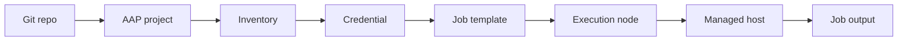

  

  

# Module 7: AAP Workflow for Operators

> 🧪 Lab commands run from [`bootcamp/lab/`](../lab/) — `cd bootcamp/lab` first. Diagrams render automatically on GitHub.

**Day 3 · AAP and Applied Workflow** — Goal: understand how Ansible code moves from Git into AAP and runs through job templates. **Not** about becoming an AAP platform admin.

---

## Definition

**AAP** is the enterprise platform used to run, manage, schedule, and control Ansible automation.

For this audience, focus on **operator-level** usage:
- Projects
- Inventories
- Job templates
- Surveys
- Schedules
- Job output
- Basic troubleshooting

**Out of scope** (stays with the infrastructure team — Toby & Alejandro):
- Installing AAP
- Building execution environments
- Deep credential administration
- Deep platform administration

---

## Diagram / Workflow

---

## Hands-On Walkthrough

The instructor demonstrates in the AAP 2.6 sandbox:
- An AAP **project** connected to this Git repo
- Selecting an **inventory**
- **Job template** settings (which playbook, which inventory, which credential)
- **Launching** a job
- Reading the **output**, finding failure details
- Editing code in Git, then **syncing** the project so AAP sees the change

Credentials, high level only:
- What they are (how AAP logs into hosts)
- Why operators usually don't manage them directly
- How they **attach** to a job template

> Key mental model: **the same playbook you ran from the CLI is what AAP runs** — AAP just adds inventory, credentials, logging, scheduling, and access control around it.

---

## Quiz

1. What does an AAP project usually connect to?
   - A. A source code repo like Git
   - B. A monitor only
   - C. A keyboard shortcut
   - D. A local PDF

2. What does a job template do?
   - A. Defines how a playbook runs in AAP
   - B. Deletes a role
   - C. Replaces YAML
   - D. Creates Linux

3. Why is job output important?
   - A. It shows what ran, what changed, and what failed
   - B. It stores passwords
   - C. It replaces Git history
   - D. It creates inventory automatically every time

---

## Hands-On Lab — *Run Git-based automation through AAP*

**You will:**
1. Review a Git-based playbook (e.g. `module6_role_apply.yml`).
2. Sync or view the AAP **project**.
3. Select an **inventory**.
4. Launch a **job template**.
5. Review the **job output**.
6. Identify which tasks were `changed` and which `failed`.
7. Re-run the job.

**Success check:**
- [ ] You understand the full flow from Git to AAP execution.
- [ ] You can read AAP job output and connect it back to the playbook.

Instructor answer key

1. **A** — A source code repo like Git
2. **A** — Defines how a playbook runs in AAP
3. **A** — Shows what ran, changed, and failed

