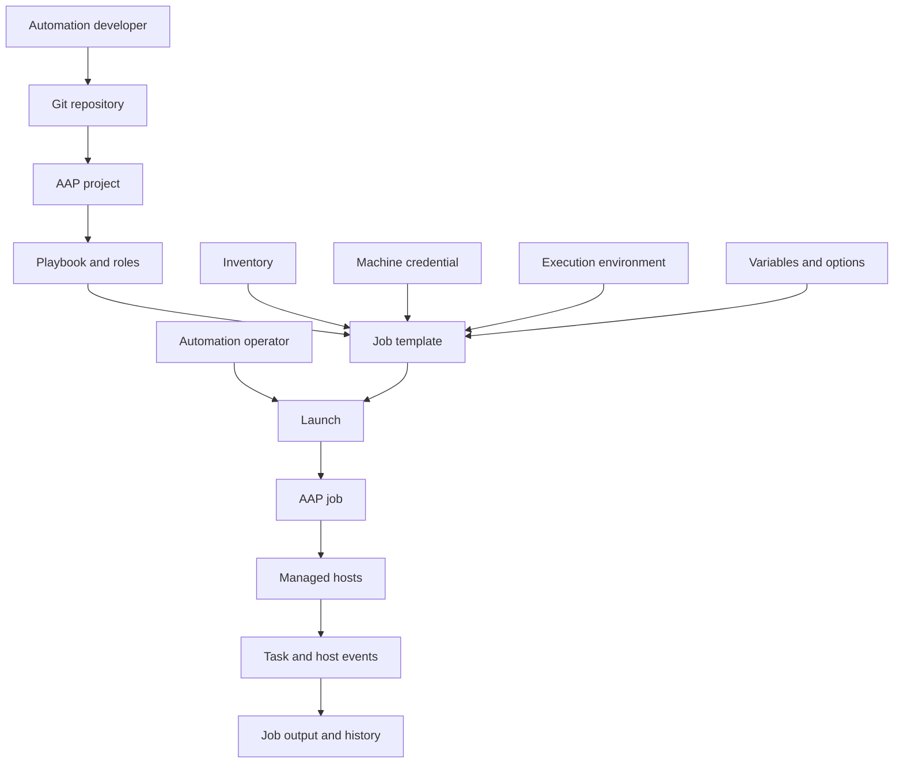
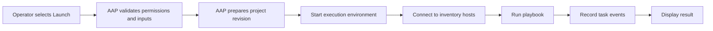
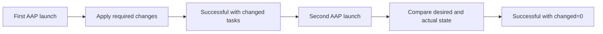

<p align="left">
  <a href="https://github.com/Ansible-workshop-ch/bootcamp/blob/main/module06/roles-and-code-first.md" target="_blank">
    
  </a>
</p>

<p align="right">
  <a href="https://github.com/Ansible-workshop-ch/bootcamp/blob/main/module08/aap-inventories-surveys-troubleshooting.md" target="_blank">
    
  </a>
</p>

# Module 7: AAP Workflow for Operators

> 🧪 This module uses the AAP 2.6 training environment and the automation created in [`bootcamp/lab/`](../lab/).

**Day 3 - AAP and Applied Workflow**

The goal of this module is to understand how automation moves from Git into Ansible Automation Platform and runs as a controlled job.

This module is not intended to turn students into AAP platform administrators.

---

## Learning Objectives

By the end of this module, you will be able to:

* Explain what Ansible Automation Platform adds to Ansible automation.
* Explain the relationship between Git, projects, playbooks, roles, inventories, credentials, execution environments, and job templates.
* Locate and inspect an AAP project.
* Synchronize automation content from Git.
* Inspect the settings of a job template.
* Launch an existing job template.
* Follow a running job.
* Read task and host results.
* Distinguish between `ok`, `changed`, `failed`, `unreachable`, and `skipped`.
* Relaunch an automation job.
* Confirm idempotency through AAP.
* Identify whether a failure belongs to the automation code, inventory, credential, or platform team.

---

# 1. What Is Ansible Automation Platform?

## Definition

Red Hat Ansible Automation Platform, or **AAP**, is an enterprise platform for running, controlling, delegating, scheduling, and auditing Ansible automation.

The Ansible code remains in Git.

AAP provides controlled services around that code, including:

* Centralized execution
* Inventories
* Credentials
* Execution environments
* Job templates
* Role-based access control
* Job history
* Job output
* Scheduling
* Surveys
* Notifications
* Workflow automation
* Auditing

The playbooks and roles do not need to be rewritten for AAP.

The same automation tested from the command line can be synchronized from Git and executed through AAP.

---

## Key Mental Model

> Git stores the automation. AAP controls how, where, and by whom it runs.

AAP is not a replacement for:

* YAML
* Playbooks
* Roles
* Variables
* Git
* Testing
* Code review

AAP adds enterprise execution and control around those components.

---

# 2. Operator Scope

This module focuses on operator-level AAP usage.

## Operators Usually Work With

* Projects
* Project synchronization
* Existing inventories
* Existing credentials attached to templates
* Job templates
* Job launches
* Job output
* Job history
* Relaunching jobs
* Basic failure identification

---

## Platform Administrators Usually Manage

The following responsibilities remain with the AAP platform or infrastructure team:

* Installing AAP
* Upgrading AAP
* Configuring platform gateway
* Managing automation mesh
* Managing execution and control nodes
* Building execution environments
* Managing container registries
* Creating enterprise credentials
* Configuring authentication
* Configuring role-based access control
* Configuring organizations and teams
* Managing capacity
* Backing up and restoring AAP
* Deep platform troubleshooting

For the Charter environment, these responsibilities remain with the designated AAP infrastructure team.

---

## Developer, Operator, and Administrator Responsibilities

| Role                 | Primary responsibility                                                         |
| -------------------- | ------------------------------------------------------------------------------ |
| Automation developer | Creates and tests playbooks, roles, templates, and variables                   |
| Automation operator  | Launches approved automation and reviews the result                            |
| AAP administrator    | Maintains the platform, permissions, credentials, and execution infrastructure |

One person can hold multiple responsibilities, but the responsibilities should still be understood separately.

---

# 3. AAP Core Objects

Operators must understand how the main AAP objects connect.

---

## Project

An AAP **project** connects automation controller to automation content.

The content commonly comes from a Git repository.

A project can contain:

* Playbooks
* Roles
* Templates
* Variable files
* Collection requirements
* Supporting files
* Documentation

In this course, the project connects to:

```text
Ansible-workshop-ch/bootcamp
```

The playbook used in this module is:

```text
lab/playbooks/module6_role_apply.yml
```

Because AAP synchronizes the repository from its root, the playbook path includes:

```text
lab/
```

This differs from the local command-line path used after running:

```bash
cd bootcamp/lab
```

---

## Inventory

An AAP **inventory** defines the managed hosts targeted by automation.

An inventory can contain:

* Hosts
* Groups
* Variables
* Static entries
* Dynamic inventory sources
* Constructed inventory rules

Module 7 uses an inventory that has already been created.

Inventory creation and synchronization are covered in Module 8.

---

## Credential

A **credential** provides protected authentication information.

Different credentials have different purposes.

| Credential type               | Purpose                                                       |
| ----------------------------- | ------------------------------------------------------------- |
| Source control credential     | Allows an AAP project to access a protected Git repository    |
| Machine credential            | Allows an automation job to connect to Linux or Windows hosts |
| Vault credential              | Provides an Ansible Vault password                            |
| Container registry credential | Allows AAP to pull a protected execution environment image    |
| Cloud credential              | Allows modules to authenticate to a cloud provider            |

Students do not need to see or manage credential secrets.

A credential can be attached to a job template without exposing the secret value to the operator.

---

## Execution Environment

An **execution environment** is the container image used to run Ansible automation.

It can contain:

* `ansible-core`
* Ansible Runner
* Collections
* Python libraries
* System packages
* Other automation dependencies

In this module, students select or inspect an existing execution environment.

Building execution environments is outside the scope of this course.

---

## Job Template

A **job template** defines how a playbook runs.

A job template connects the required execution inputs:

* Project
* Playbook
* Inventory
* Credential
* Execution environment
* Variables
* Limits
* Tags
* Verbosity
* Other execution settings

A job template makes the automation repeatable.

Instead of entering all execution options manually, the operator launches a prepared template.

---

## Job

A **job** is one execution of a job template.

Each launch creates a new job record.

The job record includes:

* Status
* Start time
* Finish time
* User who launched it
* Job template
* Project revision
* Inventory
* Credentials used
* Execution environment
* Task output
* Host results
* Play recap

---

# 4. Correct AAP Workflow



The inventory and credential do not flow through each other.

They are separate inputs attached to the job template.

---

# 5. Module 6 to Module 7

Module 6 created the following code-first structure:

```text
bootcamp/
└── lab/
    ├── group_vars/
    │   └── linux.yml
    ├── inventories/
    │   └── inventory.ini
    ├── playbooks/
    │   └── module6_role_apply.yml
    └── roles/
        └── web_config/
            ├── defaults/
            │   └── main.yml
            ├── handlers/
            │   └── main.yml
            ├── meta/
            │   └── main.yml
            ├── tasks/
            │   └── main.yml
            ├── templates/
            │   ├── apache-hardening.conf.j2
            │   └── index.html.j2
            └── vars/
                └── main.yml
```

Module 7 does not rewrite this automation in the AAP interface.

AAP synchronizes and runs it from Git.

---

## Calling Playbook

AAP runs:

```text
lab/playbooks/module6_role_apply.yml
```

The playbook remains small:

```yaml
---
- name: Module 6 - Apply the reusable web configuration role
  hosts: linux
  become: true
  gather_facts: true

  roles:
    - web_config
```

The implementation remains inside:

```text
lab/roles/web_config/
```

---

# 6. Repository Compatibility for AAP

Local commands in previous modules were run from:

```text
bootcamp/lab/
```

AAP synchronizes the complete repository and normally executes from the project root.

Because the role is stored under:

```text
lab/roles/
```

The repository should include an `ansible.cfg` at the repository root.

Create or verify:

```text
bootcamp/ansible.cfg
```

Add:

```ini
[defaults]
roles_path = ./lab/roles
```

This allows the AAP project to locate:

```text
lab/roles/web_config
```

Do not place inventory credentials, passwords, or private keys in this file.

---

## Why This Is Required

From the local lab directory, the course can use:

```text
lab/ansible.cfg
```

AAP starts from the synchronized project root.

A root-level configuration prevents this error:

```text
ERROR! the role 'web_config' was not found
```

---

## Repository Structure for Both CLI and AAP

```text
bootcamp/
├── ansible.cfg
├── module01/
├── module02/
├── module03/
├── module04/
├── module05/
├── module06/
├── module07/
└── lab/
    ├── ansible.cfg
    ├── group_vars/
    ├── inventories/
    ├── playbooks/
    └── roles/
```

The root `ansible.cfg` supports AAP project execution.

The `lab/ansible.cfg` supports local command-line execution from `bootcamp/lab/`.

---

# 7. Pre-Lab Requirements

The instructor or AAP administrator should prepare the following objects before the operator lab.

## Required AAP Objects

| Object                | Example name                       |
| --------------------- | ---------------------------------- |
| Organization          | `Charter Training`                 |
| Project               | `Charter Ansible Bootcamp`         |
| Inventory             | `Charter Linux Lab`                |
| Machine credential    | `Charter Linux SSH`                |
| Execution environment | `Default execution environment`    |
| Job template          | `Module 7 - Apply Web Config Role` |

---

## Required Project Settings

| Setting                   | Example                                  |
| ------------------------- | ---------------------------------------- |
| Name                      | `Charter Ansible Bootcamp`               |
| Organization              | `Charter Training`                       |
| Source control type       | `Git`                                    |
| Source control URL        | Bootcamp Git repository                  |
| Source control branch     | `main`                                   |
| Source control credential | Only required for a protected repository |

---

## Required Job Template Settings

| Setting               | Value                                  |
| --------------------- | -------------------------------------- |
| Name                  | `Module 7 - Apply Web Config Role`     |
| Job type              | `Run`                                  |
| Inventory             | `Charter Linux Lab`                    |
| Project               | `Charter Ansible Bootcamp`             |
| Playbook              | `lab/playbooks/module6_role_apply.yml` |
| Execution environment | Environment provided by the AAP team   |
| Credentials           | `Charter Linux SSH`                    |
| Verbosity             | `0 - Normal`                           |

Students need permission to:

* View the project
* View the inventory
* View the job template
* Launch the job template
* View job output
* Relaunch jobs

Students do not need permission to inspect credential secrets.

---

# 8. Hands-On Walkthrough

## Lab Goal

Run the role created in Module 6 through AAP and understand every object involved in the execution.

---

## Step 1: Validate the Code Before AAP

Before using AAP, validate the code locally from:

```bash
cd bootcamp/lab
```

Run a syntax check:

```bash
ansible-playbook \
  -i inventories/inventory.ini \
  playbooks/module6_role_apply.yml \
  --syntax-check
```

Expected result:

```text
playbook: playbooks/module6_role_apply.yml
```

Optionally run the playbook locally:

```bash
ansible-playbook \
  -i inventories/inventory.ini \
  playbooks/module6_role_apply.yml
```

This confirms that the automation code works before AAP executes it.

---

## Step 2: Review the Git Revision

From the repository:

```bash
git status
```

Confirm that the required changes are committed.

Display the latest commit:

```bash
git log -1 --oneline
```

Example:

```text
a82c917 Add reusable web_config role
```

Record the commit identifier.

This makes it possible to compare Git with the AAP project revision.

---

## Step 3: Log In to AAP

Open the AAP 2.6 training environment.

Sign in using the operator account provided by the instructor.

Operators should not use shared administrator accounts.

---

## Step 4: Locate the Project

From the navigation panel, open:

```text
Automation Execution > Projects
```

Select:

```text
Charter Ansible Bootcamp
```

Review:

* Project name
* Organization
* Source control type
* Source control URL
* Branch, tag, or commit
* Last update status
* Last updated time
* Source control revision
* Execution environment, if configured at the project level

---

## Project Questions

Before continuing, answer:

1. Which Git repository is connected?
2. Which branch is configured?
3. Was the most recent project update successful?
4. Does the project revision match the latest expected Git commit?
5. Is the project using a source control credential?

---

# 9. Synchronize the Project

## Definition

A **project synchronization** downloads the configured revision of the Git repository into AAP.

It makes the current playbooks, roles, and related content available for execution.

---

## Start a Project Sync

From:

```text
Automation Execution > Projects
```

Locate:

```text
Charter Ansible Bootcamp
```

Select the sync icon.

AAP creates a project update job.

---

## Review the Project Update

Open the project update output.

Look for:

* Successful repository connection
* Selected Git branch
* Revision or commit
* Updated files
* Project update status
* Authentication errors
* Repository access errors

Expected final status:

```text
Successful
```

---

## Common Project Sync Results

| Result                   | Meaning                                              |
| ------------------------ | ---------------------------------------------------- |
| Successful               | AAP downloaded the project content                   |
| Failed authentication    | The source control credential is invalid or missing  |
| Repository not found     | The source control URL is wrong or inaccessible      |
| Branch not found         | The configured branch, tag, or commit does not exist |
| TLS or certificate error | AAP cannot validate the Git server certificate       |
| Permission denied        | The project credential cannot access the repository  |

Project synchronization does not configure managed hosts.

It only updates the automation content available to AAP.

---

# 10. Confirm the Playbook Is Available

After a successful project sync, confirm that AAP can locate:

```text
lab/playbooks/module6_role_apply.yml
```

If the playbook is missing from a job template selection list, check:

* The project sync completed successfully.
* The file is committed to Git.
* The correct branch is configured.
* The YAML file has a valid playbook structure.
* The path is inside the synchronized repository.
* The job template is using the correct project.

---

# 11. Inspect the Job Template

From the navigation panel, open:

```text
Automation Execution > Templates
```

Select:

```text
Module 7 - Apply Web Config Role
```

Do not launch it immediately.

First inspect its configuration.

---

## Required Fields

Confirm the following:

| Field                 | Expected value                         |
| --------------------- | -------------------------------------- |
| Job type              | `Run`                                  |
| Inventory             | `Charter Linux Lab`                    |
| Project               | `Charter Ansible Bootcamp`             |
| Playbook              | `lab/playbooks/module6_role_apply.yml` |
| Execution environment | Approved training environment          |
| Credential            | Approved machine credential            |
| Verbosity             | Normal                                 |

---

## Job Type

For this lab, the job type should be:

```text
Run
```

A run job applies the playbook normally.

A check job attempts to predict changes without applying them.

Check mode behavior depends on module support and is not a replacement for testing.

---

## Inventory

The inventory determines which hosts and groups are available to the playbook.

The playbook targets:

```yaml
hosts: linux
```

The selected AAP inventory must therefore include a group named:

```text
linux
```

Otherwise, the job may report:

```text
skipping: no hosts matched
```

---

## Project and Playbook

The project supplies the Git content.

The playbook field selects:

```text
lab/playbooks/module6_role_apply.yml
```

The job template does not copy the playbook.

It references the playbook supplied by the project.

---

## Machine Credential

The machine credential allows AAP to connect to managed hosts.

It may include:

* SSH username
* SSH private key
* Password
* Privilege escalation username
* Privilege escalation password

The operator uses the credential without viewing its protected values.

---

## Execution Environment

The execution environment supplies the runtime used for the job.

The operator should verify which environment is selected but does not build or modify it in this module.

---

# 12. Launch the Job Template

Select:

```text
Launch template
```

If the template does not request additional information, the job starts immediately.

If prompts appear, review them before selecting:

```text
Next
```

Then select:

```text
Launch
```

AAP opens the job output page.

---

## Job Launch Workflow



---

# 13. Follow the Running Job

The job progresses through execution states.

Common states include:

| Status     | Meaning                                              |
| ---------- | ---------------------------------------------------- |
| Pending    | Job has been created but has not started             |
| Waiting    | Job is waiting for a required dependency or resource |
| Running    | Automation is executing                              |
| Successful | Job completed successfully                           |
| Failed     | One or more failures caused the job to fail          |
| Canceled   | A user or system canceled the job                    |
| Error      | A platform-level problem prevented normal execution  |

For this lab, the expected final status is:

```text
Successful
```

---

# 14. Read Job Details

Open the job's details and identify:

* Job name
* Status
* Launched by
* Start time
* Finish time
* Elapsed time
* Job template
* Inventory
* Project
* Project revision
* Playbook
* Execution environment
* Credentials
* Limit
* Job tags
* Extra variables

The project revision is important.

It identifies the Git content used for that specific execution.

---

# 15. Read Job Output

The output view displays the playbook execution events.

Look for the following sections:

```text
PLAY
```

```text
TASK
```

```text
RUNNING HANDLER
```

```text
PLAY RECAP
```

---

## Example Output

```text
PLAY [Module 6 - Apply the reusable web configuration role]

TASK [Gathering Facts]
ok: [rhel1]
ok: [container1]

TASK [web_config : Install the web server package]
ok: [rhel1]
ok: [container1]

TASK [web_config : Deploy the website]
changed: [rhel1]
changed: [container1]

RUNNING HANDLER [web_config : Restart web service]
changed: [rhel1]
changed: [container1]

PLAY RECAP
container1 : ok=10 changed=2 unreachable=0 failed=0 skipped=1
rhel1      : ok=10 changed=2 unreachable=0 failed=0 skipped=1
```

---

# 16. Understand Task Results

## `ok`

```text
ok: [rhel1]
```

The task completed successfully and did not need to change the host.

Example:

* A package was already installed.
* A directory already had the correct permissions.
* A service was already running.
* A generated file already matched the template.

---

## `changed`

```text
changed: [rhel1]
```

The task completed successfully and modified the host.

Example:

* A package was installed.
* A file was created.
* A template produced new content.
* A service was restarted.
* A directory permission was corrected.

Changed does not mean failed.

It means the managed state was updated.

---

## `failed`

```text
failed: [rhel1]
```

The task could not complete successfully.

Common causes include:

* Invalid module arguments
* Missing package
* Missing variable
* Permission denied
* Invalid destination path
* Service does not exist
* Template syntax error

Read the failure message attached to the task.

Do not stop at the word `failed`.

The useful information is usually in:

```text
msg
```

```text
stderr
```

```text
stdout
```

```text
exception
```

---

## `unreachable`

```text
fatal: [rhel1]: UNREACHABLE!
```

AAP could not establish the required connection to the host.

Common causes include:

* Incorrect hostname
* Network failure
* Firewall rule
* Incorrect SSH port
* Invalid machine credential
* SSH key rejection
* Host is offline
* DNS failure

An unreachable result usually happens before normal playbook tasks can run on that host.

---

## `skipped`

```text
skipping: [container1]
```

The task was not executed for that host.

A common reason is a condition such as:

```yaml
when: ansible_facts['os_family'] == "RedHat"
```

A Debian host skips that Red Hat-specific task.

Skipped is not automatically an error.

---

# 17. Read the Play Recap

The play recap summarizes each host.

Example:

```text
PLAY RECAP
container1 : ok=10 changed=2 unreachable=0 failed=0 skipped=1 rescued=0 ignored=0
rhel1      : ok=10 changed=2 unreachable=0 failed=0 skipped=1 rescued=0 ignored=0
```

---

## Healthy Result

A healthy result should normally show:

```text
unreachable=0
failed=0
```

Changed values are acceptable during the first run.

---

## Unhealthy Result

These values require investigation:

```text
unreachable=1
```

Or:

```text
failed=1
```

The recap identifies which host had a problem.

The task output explains why.

---

# 18. Inspect a Host Event

Select a task event in the output.

Review the detailed host event information.

Depending on the task, it can include:

* Hostname
* Task name
* Module arguments
* Result
* Message
* Return code
* Standard output
* Standard error
* Start time
* Finish time
* Duration

This helps connect an AAP result back to the playbook task that generated it.

---

# 19. Prove Idempotency Through AAP

## First Run

The first job may report changes because it configures the hosts.

Example:

```text
changed=4
```

---

## Second Run

Relaunch the same job without changing Git or the managed hosts.

Use:

```text
Relaunch job
```

Or return to the job template and select:

```text
Launch template
```

Expected second-run result:

```text
changed=0
unreachable=0
failed=0
```

The exact `ok` and `skipped` numbers may vary.

The important result is that unchanged automation should not repeatedly modify the host.

---

## Idempotency Workflow



---

## Handler Check

On the first run, the web service handler may run if the Apache configuration changes.

On the second unchanged run:

* The template should report `ok`.
* The handler should not be notified.
* The service should not restart.

This is the same handler behavior observed from the command line in Module 5 and Module 6.

AAP does not change Ansible's idempotency behavior.

---

# 20. Git Change to AAP Execution

This exercise demonstrates the complete code-first workflow.

---

## Step 1: Change the Role

Edit:

```text
lab/group_vars/linux.yml
```

Change:

```yaml
web_message: "Charter Ansible Role Deployment"
```

To:

```yaml
web_message: "Charter AAP Deployment Successful"
```

---

## Step 2: Validate Locally

From:

```bash
cd bootcamp/lab
```

Run:

```bash
ansible-playbook \
  -i inventories/inventory.ini \
  playbooks/module6_role_apply.yml \
  --syntax-check
```

---

## Step 3: Review the Change

```bash
git diff
```

Confirm that only the intended variable changed.

---

## Step 4: Commit the Change

```bash
git add group_vars/linux.yml
git commit -m "Update Module 7 web message"
```

Push the approved branch according to the course Git workflow:

```bash
git push
```

---

## Step 5: Record the Commit

```bash
git log -1 --oneline
```

Example:

```text
c7133fa Update Module 7 web message
```

---

## Step 6: Synchronize the AAP Project

In AAP, open:

```text
Automation Execution > Projects
```

Synchronize:

```text
Charter Ansible Bootcamp
```

Wait for the project update to complete successfully.

Confirm that the AAP project revision matches the new Git commit.

---

## Step 7: Launch the Job Template

Open:

```text
Automation Execution > Templates
```

Launch:

```text
Module 7 - Apply Web Config Role
```

---

## Step 8: Review the Result

The website template should report:

```text
changed
```

The Apache configuration handler should not run because the Apache configuration did not change.

The job should complete with:

```text
failed=0
unreachable=0
```

---

## Step 9: Relaunch

Launch the same template again.

Expected result:

```text
changed=0
failed=0
unreachable=0
```

This completes the workflow:

```text
Edit -> Validate -> Commit -> Push -> Sync -> Launch -> Review -> Relaunch
```

---

# 21. Job Output Search and Filters

AAP job output can contain many events.

Use output searching and filtering to locate useful information.

Useful searches include:

```text
failed
```

```text
unreachable
```

```text
changed
```

```text
web_config
```

```text
Restart web service
```

```text
rhel1
```

Use event filters to focus on:

* Failed events
* Host failures
* Unreachable hosts
* Changed tasks
* Skipped tasks

Do not read a long job only from the top.

Start with:

1. Final job status
2. Play recap
3. Failed or unreachable host
4. Failed task
5. Detailed error message

---

# 22. Basic Failure Identification

Module 7 focuses on identifying the failure category.

Module 8 covers deeper troubleshooting.

---

## Project Failure

Symptoms:

* Project sync fails.
* New playbook is missing.
* Old Git revision remains.
* Repository authentication fails.

Likely owner:

```text
Git, project configuration, or AAP platform team
```

---

## Inventory Failure

Symptoms:

* No hosts matched.
* Expected group is missing.
* Host variables are missing.
* Wrong hosts are targeted.

Likely owner:

```text
Inventory owner or automation operator
```

---

## Credential Failure

Symptoms:

* Permission denied
* Authentication failed
* SSH key rejected
* Privilege escalation failed

Likely owner:

```text
Credential or AAP platform administrator
```

Operators should report the error without requesting or exposing the secret.

---

## Automation Code Failure

Symptoms:

* Undefined variable
* Template syntax error
* Invalid module parameter
* Missing role
* Incorrect service name
* Incorrect file path

Likely owner:

```text
Automation developer or repository owner
```

---

## Managed Host Failure

Symptoms:

* Package repository unavailable
* Disk full
* Service missing
* Operating system unsupported
* Host offline
* Firewall blocking access

Likely owner:

```text
Managed system or infrastructure owner
```

---

## Platform Failure

Symptoms:

* Job remains pending.
* Execution environment cannot start.
* Container image cannot be pulled.
* AAP reports no available capacity.
* Platform service errors occur.

Likely owner:

```text
AAP platform administrator
```

---

# 23. Operator Escalation Checklist

When escalating a failed AAP job, provide:

* Job template name
* Job number or job URL
* Date and time
* Final status
* Project revision
* Inventory name
* Failed host
* Failed task
* Exact error message
* Whether the problem is repeatable
* Whether the same code worked locally
* Whether the project synchronized successfully

Do not send:

* Passwords
* Private keys
* Tokens
* Vault secrets
* Full credential contents

---

# 24. What Module 7 Does Not Cover

The following topics are intentionally reserved for Module 8:

* Creating inventories
* Adding inventory hosts and groups
* Dynamic inventory sources
* NetBox inventory synchronization
* Creating surveys
* Prompt-on-launch behavior
* Creating schedules
* Inventory variable troubleshooting
* Credential troubleshooting in depth
* Failed-host relaunch strategies
* Template troubleshooting in depth
* Job limits and variable overrides in depth

This separation keeps Module 7 focused on the basic AAP execution workflow.

---

# 25. Talking Points

* Git remains the source of truth.
* AAP projects synchronize automation from Git.
* A project contains playbooks and supporting automation content.
* A job template defines how a playbook runs.
* Inventory, project, credential, and execution environment are separate job template inputs.
* A credential is used without exposing its secret.
* An execution environment supplies the automation runtime.
* Each job launch creates a new execution record.
* Job output connects directly to playbook tasks.
* `ok` means successful without a change.
* `changed` means successful with a change.
* `failed` means a task could not complete.
* `unreachable` means AAP could not connect to the host.
* `skipped` commonly means a task condition was false.
* The play recap is the fastest place to see host-level results.
* A second unchanged run should normally report no changes.
* AAP does not fix bad automation code.
* AAP makes execution controlled, repeatable, visible, and auditable.

---

# 26. Quiz

## Question 1

What does an AAP project normally connect to?

* A. A source control repository containing automation code
* B. A managed host service
* C. A local PDF
* D. A user password file

---

## Question 2

What is the purpose of a job template?

* A. It defines how a playbook runs in AAP
* B. It replaces the Git repository
* C. It writes Ansible roles automatically
* D. It installs managed operating systems

---

## Question 3

Which objects are normally connected by a job template?

* A. Project, playbook, inventory, credential, and execution environment
* B. Git commit, PDF, keyboard, and browser
* C. Host password and source code password only
* D. Survey and schedule only

---

## Question 4

What does `changed` mean in job output?

* A. The task completed successfully and modified the host
* B. The task failed
* C. The host was unreachable
* D. The project was deleted

---

## Question 5

What should normally happen when an idempotent job is launched again without any changes?

* A. Most tasks report `ok`, and unnecessary handlers do not run
* B. Every task fails
* C. Every service restarts
* D. The project synchronizes a different repository

---

# 27. Hands-On Lab

## Lab Goal

Run the Module 6 `web_config` role through AAP and understand the complete Git-to-execution workflow.

---

## Required Tasks

1. Validate `module6_role_apply.yml` locally.
2. Review the latest Git commit.
3. Log in to the AAP training environment.
4. Locate the `Charter Ansible Bootcamp` project.
5. Identify its Git repository and branch.
6. Synchronize the project.
7. Confirm the project update completed successfully.
8. Confirm the expected Git revision.
9. Locate the `Module 7 - Apply Web Config Role` job template.
10. Inspect the selected project.
11. Inspect the selected playbook.
12. Inspect the selected inventory.
13. Inspect the attached machine credential.
14. Inspect the selected execution environment.
15. Launch the job template.
16. Follow the running job.
17. Review the job details.
18. Find the play recap.
19. Identify `ok` tasks.
20. Identify `changed` tasks.
21. Identify skipped OS-specific tasks.
22. Confirm `failed=0`.
23. Confirm `unreachable=0`.
24. Relaunch the job.
25. Confirm idempotency.
26. Change `web_message` in Git.
27. Validate and commit the change.
28. Push the approved change.
29. Synchronize the AAP project.
30. Confirm the new project revision.
31. Launch the job template again.
32. Confirm that the website changes.
33. Relaunch one final time.
34. Confirm that no unnecessary changes occur.

---

## Success Checklist

* [ ] I can explain what AAP adds to Ansible automation.
* [ ] I understand that Git remains the source of truth.
* [ ] I can explain what an AAP project does.
* [ ] I can synchronize a project.
* [ ] I can explain what a job template does.
* [ ] I understand how inventory, credential, project, playbook, and execution environment connect.
* [ ] I can launch an existing job template.
* [ ] I can locate the project revision used by a job.
* [ ] I can read the play recap.
* [ ] I understand `ok`, `changed`, `failed`, `unreachable`, and `skipped`.
* [ ] I can relaunch a job.
* [ ] I can confirm idempotency in AAP.
* [ ] I can identify the likely owner of a failure.
* [ ] I know not to expose credential secrets.

---

<details>
<summary>Instructor Answer Key</summary>

1. **A** - A source control repository containing automation code.
2. **A** - It defines how a playbook runs in AAP.
3. **A** - Project, playbook, inventory, credential, and execution environment.
4. **A** - The task completed successfully and modified the host.
5. **A** - Most tasks report `ok`, and unnecessary handlers do not run.

</details>

---

# 28. Instructor Demonstration Checklist

Before the class:

* [ ] Confirm the Git repository is reachable from AAP.
* [ ] Confirm the project synchronizes successfully.
* [ ] Confirm the required Git branch exists.
* [ ] Confirm the repository root contains the required role path configuration.
* [ ] Confirm `lab/playbooks/module6_role_apply.yml` appears in AAP.
* [ ] Confirm the inventory contains the `linux` group.
* [ ] Confirm managed hosts are reachable.
* [ ] Confirm the machine credential works.
* [ ] Confirm privilege escalation works.
* [ ] Confirm the execution environment can run the required modules.
* [ ] Confirm students have launch and view permissions.
* [ ] Run the job template once before class.
* [ ] Prepare one successful job for demonstration.
* [ ] Prepare one simple failed job for output review.
* [ ] Confirm the second successful run is idempotent.

---

<p align="left">
  <a href="https://github.com/Ansible-workshop-ch/bootcamp/blob/main/module06/roles-and-code-first.md" target="_blank">
    
  </a>
</p>

<p align="right">
  <a href="https://github.com/Ansible-workshop-ch/bootcamp/blob/main/module08/aap-inventories-surveys-troubleshooting.md" target="_blank">
    
  </a>
</p>
