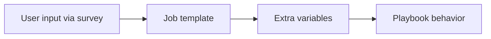
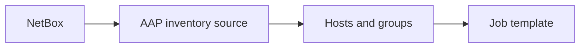

  

  

# Module 8: AAP Inventories, Schedules, Surveys, and Troubleshooting

> 🧪 Lab commands run from [`bootcamp/lab/`](../lab/) — `cd bootcamp/lab` first. Diagrams render automatically on GitHub.

**Day 3 · AAP and Applied Workflow**

---

## Definition

The AAP features operators are most likely to touch:

- **Inventories** define which systems a job targets.
- **Surveys** collect user input at launch time and pass it as extra variables.
- **Schedules** run jobs automatically at a defined time.
- **Troubleshooting** means: read the job output, find the failed task, check variables, check inventory targeting, and confirm credentials/permissions if needed.

**NetBox** can be introduced *conceptually* as a dynamic inventory source — it does not need to become a deep NetBox class.

---

## Diagram / Workflow

Survey input feeding a job:

Dynamic inventory concept:

---

## Hands-On Walkthrough

The instructor demonstrates:
- Launching a job **with survey input**
- Using that survey input as an **extra variable** (e.g. set `web_message` at launch)
- Reviewing **inventory groups**
- How **schedules** work
- Reading a **failed** job
- Fixing a simple variable or inventory issue, then re-running

Troubleshooting order to teach:
1. Open the job output, scroll to the **failed task**.
2. Read the error message literally — it usually names the problem.
3. Check the **variable** values that task used.
4. Check **inventory targeting** — did it hit the right hosts?
5. Check **credentials / permissions** if it's an access error.

---

## Quiz

1. What is an AAP survey used for?
   - A. Collecting user input before a job runs
   - B. Replacing Git
   - C. Installing Ansible
   - D. Creating SSH automatically

2. What is a schedule used for?
   - A. Running a job at a defined time
   - B. Editing YAML automatically
   - C. Creating a managed node
   - D. Deleting inventories

3. When a job fails, what should you check first?
   - A. The failed task and job output
   - B. The company logo
   - C. The browser theme
   - D. The PowerPoint deck

---

## Hands-On Lab — *Add input and troubleshoot a job*

**You will:**
1. Launch a job with **survey input**.
2. Change a variable through the survey (e.g. `web_message`).
3. Run the job and review output.
4. **Break a variable intentionally** (e.g. point to a package that doesn't exist).
5. Troubleshoot using the output, then fix it.

**Success check:**
- [ ] You can use AAP survey input safely.
- [ ] You can troubleshoot a simple failed job and explain the fix.

Instructor answer key

1. **A** — Collecting user input before a job runs
2. **A** — Running a job at a defined time
3. **A** — The failed task and job output

  

  

