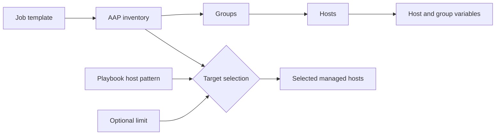
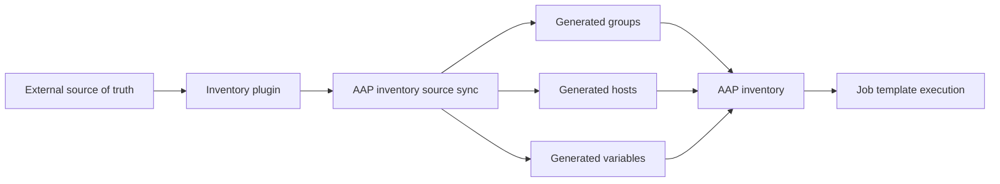
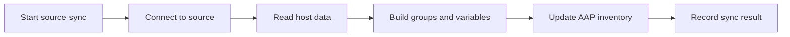
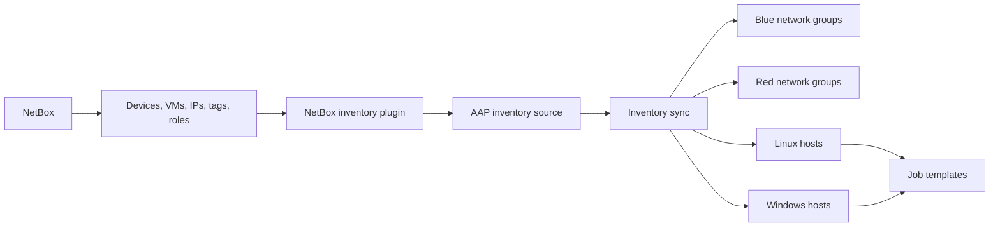
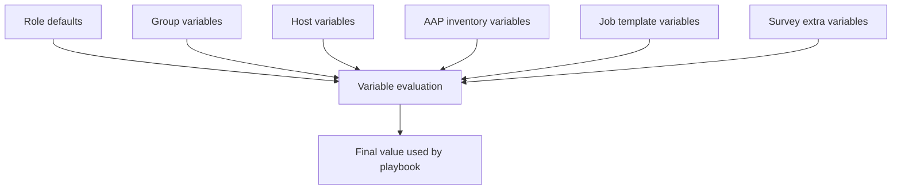
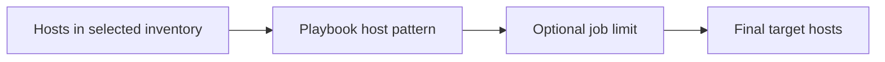
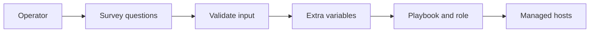
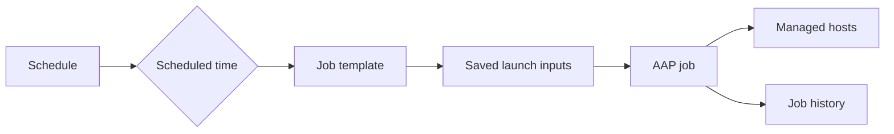
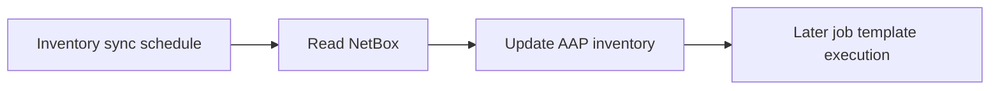
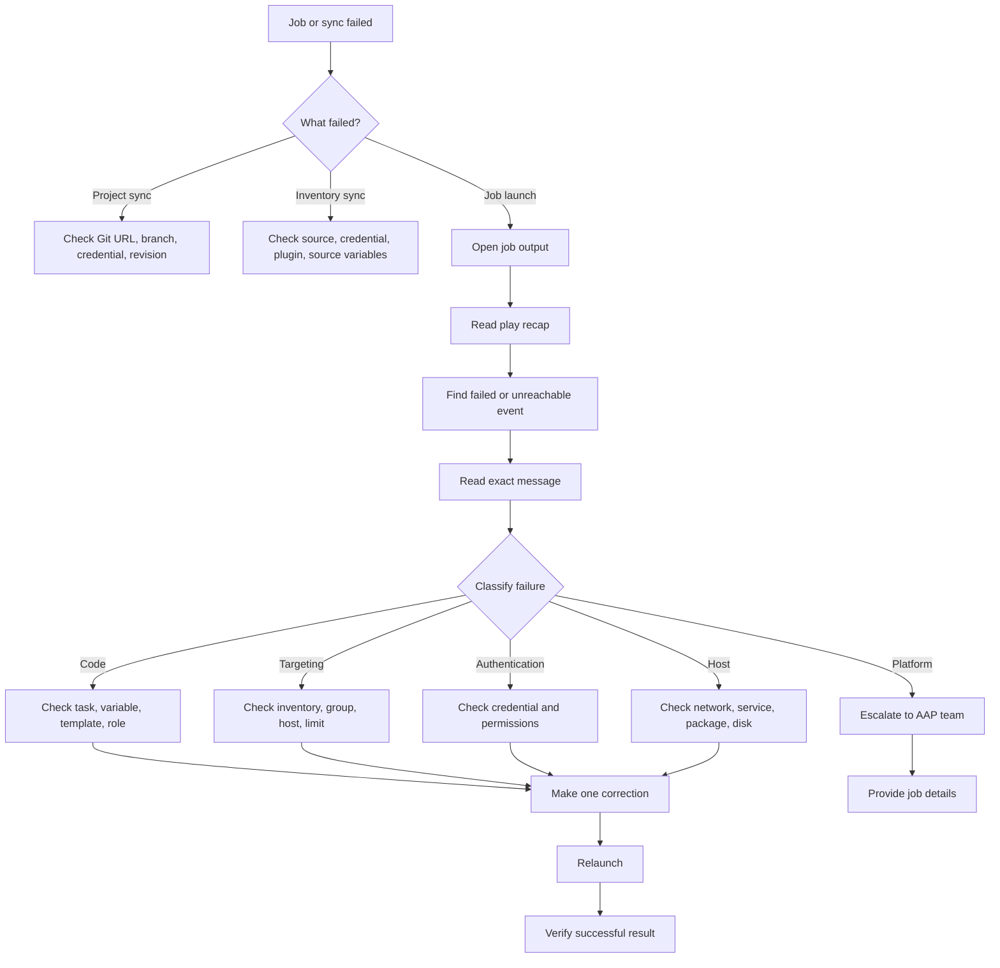

<p align="left">
  <a href="https://github.com/Ansible-workshop-ch/bootcamp/blob/main/module07/aap-workflow.md" target="_blank">
    
  </a>
</p>

<p align="right">
  <a href="https://github.com/Ansible-workshop-ch/bootcamp/blob/main/module09/final-use-case.md" target="_blank">
    
  </a>
</p>

# Module 8: AAP Inventories, Surveys, Schedules, and Troubleshooting

> This module uses the AAP 2.6 training environment and the automation created in the previous modules.

**Day 3 - AAP and Applied Workflow**

Module 7 demonstrated how an operator launches Git-based automation through an AAP job template.

Module 8 goes deeper into the controls surrounding that execution:

* Which hosts are targeted
* Where hosts and groups come from
* Which values users can enter at launch
* When automation runs automatically
* How failures are investigated
* When an issue should be escalated

This module remains operator-focused. It is not a deep AAP administration class.

---

## Learning Objectives

By the end of this module, you will be able to:

* Explain the structure of an AAP inventory.
* Distinguish between static and dynamic inventory.
* Inspect inventory hosts, groups, variables, and sources.
* Explain how NetBox can supply dynamic inventory data.
* Synchronize an existing inventory source.
* Understand safe inventory synchronization behavior.
* Use a survey to collect controlled launch-time input.
* Explain how survey responses become Ansible variables.
* Use Prompt on Launch safely.
* Understand how AAP schedules work.
* Inspect or create a schedule when permissions allow.
* Read failed and unreachable job events.
* Follow a structured troubleshooting process.
* Identify whether a problem belongs to code, inventory, credentials, managed hosts, or the AAP platform.
* Fix a controlled failure and relaunch the job.

---

# 1. Module Scope

## Operator Responsibilities

Operators are expected to understand and use:

* Existing inventories
* Inventory groups and hosts
* Existing inventory sources
* Inventory synchronization
* Job template surveys
* Prompt on Launch options
* Existing schedules
* Job output
* Host events
* Failed and unreachable results
* Relaunching jobs
* Basic escalation

---

## Platform Administrator Responsibilities

The following remain with the AAP platform team:

* Installing AAP
* Upgrading AAP
* Creating organizations
* Managing platform authentication
* Creating credential types
* Managing credential secrets
* Building execution environments
* Configuring automation mesh
* Managing execution capacity
* Configuring enterprise inventory integrations
* Managing permissions and role-based access control
* Deep platform troubleshooting

Students might be able to inspect these resources, but they should not assume they have permission to create or modify all of them.

---

# 2. Inventory Definition

An AAP **inventory** defines the systems available to automation jobs.

An inventory can contain:

* Hosts
* Groups
* Child groups
* Inventory variables
* Group variables
* Host variables
* Inventory sources

A job template selects an inventory.

The playbook then selects hosts or groups from that inventory.

---

## Inventory Targeting Flow



The final target is affected by:

1. The inventory selected by the job template.
2. The host pattern in the playbook.
3. An optional limit.
4. Host availability and permissions.

---

# 3. Inventory Structure

A standard inventory can contain groups and hosts.

Example:

```text id="fzn9dv"
Charter Linux Lab
├── linux
│   ├── rhel
│   │   ├── rhel1
│   │   ├── rhel2
│   │   └── rhel3
│   └── containers
│       ├── container1
│       ├── container2
│       └── container3
```

The playbook can target all Linux hosts:

```yaml id="m60ajv"
hosts: linux
```

It can target only Red Hat systems:

```yaml id="xr8t05"
hosts: rhel
```

It can target one host:

```yaml id="r725wg"
hosts: rhel1
```

---

## Inventory Objects

| Object           | Purpose                                                |
| ---------------- | ------------------------------------------------------ |
| Inventory        | Collection of managed hosts and groups                 |
| Group            | Logical collection of hosts                            |
| Host             | One managed system                                     |
| Group variable   | Variable applied to members of a group                 |
| Host variable    | Variable applied to one host                           |
| Inventory source | External system or file used to populate the inventory |

---

# 4. Inspect an Inventory in AAP

From the navigation panel, open:

```text id="sa0d0s"
Automation Execution > Infrastructure > Inventories
```

Select:

```text id="qgky3z"
Charter Linux Lab
```

Review the available tabs.

Depending on permissions and inventory type, these can include:

* Details
* Access
* Groups
* Hosts
* Sources
* Jobs
* Schedules
* Notifications

---

## Inventory Details

Review:

* Name
* Description
* Organization
* Inventory type
* Inventory variables
* Instance groups, if assigned
* Inventory status

---

## Groups

Open:

```text id="4ltspu"
Groups
```

Confirm that the expected groups exist.

For the Module 6 and Module 7 playbook, confirm:

```text id="trvnjm"
linux
```

Select the group and inspect:

* Child groups
* Hosts
* Group variables
* Recent related jobs

---

## Hosts

Open:

```text id="3zem1u"
Hosts
```

Review:

* Hostname
* Enabled status
* Variables
* Group membership
* Recent job activity

A disabled host remains in the inventory but is not targeted during normal job execution.

---

# 5. Static Inventory

A **static inventory** is managed manually or imported from a version-controlled inventory file.

Example local inventory:

```ini id="n31tsi"
[linux]
rhel1 ansible_host=192.168.50.21
rhel2 ansible_host=192.168.50.22
container1 ansible_host=192.168.50.31
container2 ansible_host=192.168.50.32

[rhel]
rhel1
rhel2

[containers]
container1
container2
```

Static inventory is appropriate when:

* The environment is small.
* Host changes are infrequent.
* The inventory is controlled in Git.
* No reliable external source of truth exists.

Static inventory becomes difficult to maintain when hosts are created, removed, or changed frequently.

---

# 6. Dynamic Inventory

A **dynamic inventory** obtains host information from another system.

Possible inventory sources include:

* NetBox
* Cloud platforms
* VMware
* OpenShift Virtualization
* Terraform state
* Another AAP environment
* A source-controlled inventory plugin configuration

Dynamic inventory can provide:

* Hostnames
* IP addresses
* Operating system metadata
* Environment information
* Site information
* Application ownership
* Device roles
* Tags
* Groups
* Connection variables

---

## Dynamic Inventory Workflow



---

# 7. Inventory Sources

An **inventory source** defines how AAP obtains dynamic inventory data.

To inspect an existing source:

```text id="2c1v3x"
Automation Execution > Infrastructure > Inventories
```

Select the inventory, then open:

```text id="l0kpio"
Sources
```

Select the inventory source.

Review:

* Source name
* Source type
* Project, when project-based
* Inventory file
* Credential
* Execution environment
* Source variables
* Last sync status
* Last sync time
* Update on launch
* Cache timeout
* Overwrite options

---

## Inventory Source Synchronization

A source synchronization retrieves current data from the configured source.



A successful source sync means AAP successfully updated inventory data.

It does not mean every managed host is reachable.

Inventory synchronization and job execution are separate operations.

---

## Synchronize an Existing Source

Open the inventory source and select:

```text id="py18te"
Sync
```

AAP creates an inventory update job.

Review:

* Status
* Start and finish time
* Execution environment
* Source
* Added hosts
* Updated hosts
* Removed hosts
* Generated groups
* Error messages

Expected status:

```text id="7f3e55"
Successful
```

---

## Inventory Source Safety

Before changing source settings, understand their effect.

Important settings can include:

* Update on launch
* Overwrite
* Overwrite variables
* Cache timeout
* Enabled variable
* Enabled value
* Host filters
* Source variables

Incorrect source settings can:

* Remove expected hosts
* Replace manually entered variables
* Create unexpected groups
* Target unintended systems
* Cause jobs to use outdated inventory data

Operators should not change inventory source behavior without approval from the inventory owner.

---

# 8. NetBox Inventory Concept

NetBox can act as a source of truth for infrastructure data.

It can describe information such as:

* Devices
* Virtual machines
* IP addresses
* Sites
* Regions
* Tenants
* Platforms
* Device roles
* Tags
* Status
* Custom fields

AAP can use a NetBox inventory plugin to retrieve selected systems and convert NetBox metadata into Ansible inventory hosts, variables, and groups.

---

## Charter NetBox Conceptual Flow



The exact group names depend on how the inventory plugin is configured.

This course does not teach NetBox administration.

The operator must understand that:

* NetBox is the source of truth.
* AAP imports data from NetBox.
* AAP inventory groups can be generated from NetBox metadata.
* A source sync updates AAP.
* Manual edits to source-managed hosts can be replaced during the next synchronization.

---

# 9. Example NetBox Inventory Plugin Configuration

A project-based inventory source can reference a file such as:

```text id="jv7d19"
inventory/netbox_inventory.yml
```

Conceptual example:

```yaml id="boafbx"
---
plugin: netbox.netbox.nb_inventory
validate_certs: true

query_filters:
  - status: active

group_by:
  - sites
  - device_roles
  - platforms

keyed_groups:
  - prefix: site
    key: site.slug

  - prefix: role
    key: device_role.slug

compose:
  ansible_host: primary_ip4.address | split('/') | first
```

Authentication details should be supplied through a protected AAP credential or injected environment variables.

Do not put a NetBox token in Git:

```yaml id="8i3hin"
token: plain-text-token
```

The NetBox inventory plugin and required collection must already exist in the execution environment used by the inventory synchronization.

Building that execution environment remains outside the scope of this module.

---

# 10. Inventory Variables

Variables can exist at multiple locations:

* Role defaults in Git
* Project `group_vars`
* Project `host_vars`
* AAP inventory variables
* AAP group variables
* AAP host variables
* Job template variables
* Survey responses
* Prompted extra variables

Example AAP group variables:

```yaml id="atbm63"
---
ansible_user: ansible
web_environment: training
```

Example host variables:

```yaml id="8o8nt4"
---
ansible_host: 192.168.50.21
ansible_port: 22
```

---

## Recommended Variable Ownership

| Variable type                           | Recommended location            |
| --------------------------------------- | ------------------------------- |
| Safe reusable defaults                  | Role `defaults/main.yml`        |
| Version-controlled environment settings | Git `group_vars` or `host_vars` |
| Host address and connection metadata    | Inventory or dynamic source     |
| Protected authentication                | AAP credential                  |
| Approved user input                     | Survey                          |
| Internal role mappings                  | Role `vars/main.yml`            |

Avoid defining the same variable in many different places.

That makes troubleshooting harder because one value can override another.

---

## Variable Flow



Survey responses are passed to the job as extra variables.

They should be limited to variables that users are intentionally allowed to change.

---

# 11. Targeting With Limits

A job template inventory can contain many hosts.

The **Limit** field narrows the job target.

Examples:

```text id="jlc6b2"
linux
```

```text id="txfk0s"
rhel
```

```text id="4q1yw3"
rhel1
```

```text id="wz397c"
linux:&production
```

```text id="k8qlmi"
linux:!rhel3
```

A limit cannot add hosts that are not already available to the selected inventory and playbook host pattern.

---

## Target Calculation



Example:

* Inventory contains `linux`, `windows`, and `network`.
* Playbook uses `hosts: linux`.
* Job limit is `rhel1`.

Final target:

```text id="7oxlvn"
rhel1
```

If the limit is:

```text id="dxxcro"
windows
```

The job can report:

```text id="0ygo5f"
skipping: no hosts matched
```

The playbook only targets `linux`.

---

# 12. Surveys

## Definition

An AAP **survey** collects structured user input when a job template is launched.

Survey responses are passed to the playbook as extra variables.

A survey provides a controlled interface so the operator does not need to edit YAML.

---

## Survey Flow



---

## Good Survey Uses

Surveys are useful for:

* Environment selection
* Application version
* Change ticket number
* Maintenance message
* Service name from an approved list
* Deployment region
* Approved feature selection
* Notification address
* Boolean operational choices

---

## Bad Survey Uses

Do not use surveys to collect:

* Passwords
* Private keys
* API tokens
* Vault tokens
* Unrestricted shell commands
* Arbitrary package names
* Arbitrary file paths
* Unvalidated hostnames
* Values that allow users to bypass controls

Sensitive values belong in credentials, not surveys.

---

# 13. Survey Question Types

AAP surveys can provide different question types.

Common examples include:

* Text
* Text area
* Password
* Multiple choice
* Multiple select
* Integer
* Float

Even though a password question type exists, enterprise credentials should normally be used for reusable protected authentication.

---

## Survey Question Fields

A survey question normally includes:

| Field                | Purpose                              |
| -------------------- | ------------------------------------ |
| Question             | Text displayed to the operator       |
| Description          | Additional instructions              |
| Answer variable name | Variable passed to Ansible           |
| Answer type          | Text, choice, integer, and so on     |
| Required             | Whether the user must answer         |
| Default answer       | Starting value                       |
| Minimum length       | Input validation                     |
| Maximum length       | Input validation                     |
| Choices              | Approved values for choice questions |

---

# 14. Module 8 Survey Playbook

Create a playbook specifically for the Module 8 operator workflow.

Create:

```text id="dxkef7"
lab/playbooks/module8_operator_workflow.yml
```

Add:

```yaml id="r0n5z8"
---
- name: Module 8 - AAP operator workflow
  hosts: linux
  become: true
  gather_facts: true

  vars:
    module8_web_message: >-
      {{ survey_web_message |
         default('Charter Module 8 Deployment') }}

    module8_environment: >-
      {{ survey_environment |
         default('training') }}

    module8_change_ticket: >-
      {{ survey_change_ticket |
         default('CHG-1000') }}

  pre_tasks:
    - name: Validate the selected environment
      ansible.builtin.assert:
        that:
          - module8_environment in
            ['training', 'development', 'testing']
        fail_msg: >-
          Invalid environment: {{ module8_environment }}.
          Select training, development, or testing.
        success_msg: >-
          Approved environment selected:
          {{ module8_environment }}.

    - name: Validate the change ticket
      ansible.builtin.assert:
        that:
          - module8_change_ticket is match('^CHG-[0-9]{4,}$')
        fail_msg: >-
          Invalid change ticket: {{ module8_change_ticket }}.
          Use the format CHG- followed by at least four numbers.
        success_msg: >-
          Change ticket {{ module8_change_ticket }} accepted.

    - name: Display AAP job context
      ansible.builtin.debug:
        msg:
          - "Job ID: {{ awx_job_id | default('CLI execution') }}"
          - "Job template: {{ awx_job_template_name | default('CLI execution') }}"
          - "Inventory: {{ awx_inventory_name | default('CLI inventory') }}"
          - "Change ticket: {{ module8_change_ticket }}"

  roles:
    - role: web_config
      vars:
        web_message: "{{ module8_web_message }}"
        web_environment: "{{ module8_environment }}"

  post_tasks:
    - name: Create the Module 8 audit record
      ansible.builtin.copy:
        dest: /etc/charter/module8_audit.txt
        owner: root
        group: root
        mode: "0644"
        content: |
          Managed by Ansible Automation Platform
          Host: {{ inventory_hostname }}
          Environment: {{ module8_environment }}
          Change ticket: {{ module8_change_ticket }}
          Job ID: {{ awx_job_id | default('CLI execution') }}
          Job template: {{ awx_job_template_name | default('CLI execution') }}
          Project revision: {{ awx_project_revision | default('CLI execution') }}
```

The `default` filters allow the playbook to remain testable from the command line.

AAP automatically supplies the `awx_*` job context variables during an AAP execution.

---

# 15. Validate the Module 8 Playbook

From:

```bash id="l0p31f"
cd bootcamp/lab
```

Run a syntax check:

```bash id="xi6u2g"
ansible-playbook \
  -i inventories/inventory.ini \
  playbooks/module8_operator_workflow.yml \
  --syntax-check
```

Test it locally with extra variables:

```bash id="2zwgmr"
ansible-playbook \
  -i inventories/inventory.ini \
  playbooks/module8_operator_workflow.yml \
  -e "survey_web_message=Charter_Module_8" \
  -e "survey_environment=training" \
  -e "survey_change_ticket=CHG-1001"
```

The underscores avoid shell quoting problems in this basic example.

AAP surveys can pass values containing spaces without requiring the operator to construct command-line syntax.

---

# 16. Module 8 Job Template

Create or update the following job template:

```text id="rcp1j3"
Module 8 - Survey and Troubleshooting
```

Recommended settings:

| Setting               | Value                                         |
| --------------------- | --------------------------------------------- |
| Job type              | `Run`                                         |
| Inventory             | `Charter Linux Lab`                           |
| Project               | `Charter Ansible Bootcamp`                    |
| Playbook              | `lab/playbooks/module8_operator_workflow.yml` |
| Execution environment | Approved training environment                 |
| Machine credential    | Approved Linux credential                     |
| Privilege escalation  | Supplied by credential or inventory           |
| Limit                 | Prompt on launch                              |
| Verbosity             | Normal                                        |

The inventory, credential, and execution environment should already be prepared by the instructor or platform team.

---

# 17. Create the Survey

From:

```text id="7r2vf7"
Automation Execution > Templates
```

Select:

```text id="okm8ju"
Module 8 - Survey and Troubleshooting
```

Open:

```text id="fp9byk"
Survey
```

Create the following questions.

---

## Question 1: Website Message

| Field                | Value                                      |
| -------------------- | ------------------------------------------ |
| Question             | `What message should the website display?` |
| Description          | `Enter a short training message.`          |
| Answer variable name | `survey_web_message`                       |
| Answer type          | `Text`                                     |
| Required             | `Yes`                                      |
| Default answer       | `Charter Module 8 Deployment`              |
| Minimum length       | `3`                                        |
| Maximum length       | `80`                                       |

---

## Question 2: Environment

| Field                | Value                                      |
| -------------------- | ------------------------------------------ |
| Question             | `Which environment is being targeted?`     |
| Description          | `Select an approved training environment.` |
| Answer variable name | `survey_environment`                       |
| Answer type          | `Multiple Choice`                          |
| Required             | `Yes`                                      |
| Default answer       | `training`                                 |

Choices:

```text id="j772fh"
training
development
testing
```

A multiple-choice question is safer than unrestricted text because the operator can only select an approved value.

---

## Question 3: Change Ticket

| Field                | Value                                         |
| -------------------- | --------------------------------------------- |
| Question             | `What is the change ticket?`                  |
| Description          | `Use CHG- followed by at least four numbers.` |
| Answer variable name | `survey_change_ticket`                        |
| Answer type          | `Text`                                        |
| Required             | `Yes`                                         |
| Default answer       | `CHG-1001`                                    |
| Minimum length       | `8`                                           |
| Maximum length       | `30`                                          |

The playbook performs additional validation with:

```yaml id="omlfl8"
module8_change_ticket is match('^CHG-[0-9]{4,}$')
```

Survey validation improves user input, but playbook validation is still required.

The playbook must not trust input blindly.

---

## Enable the Survey

After adding the questions:

1. Save the survey.
2. Confirm the survey is enabled.
3. Return to the job template.
4. Confirm that the launch process displays the survey questions.

---

# 18. Launch With Survey Input

Launch:

```text id="y0l1cd"
Module 8 - Survey and Troubleshooting
```

Use:

```text id="yltps0"
Website message: Charter Survey Deployment
Environment: training
Change ticket: CHG-1001
Limit: linux
```

Review the launch summary before starting the job.

Confirm:

* Correct inventory
* Correct limit
* Correct survey responses
* Correct credential
* Correct playbook

Select:

```text id="iirytc"
Launch
```

---

## Expected Results

The job should:

1. Validate the environment.
2. Validate the change ticket.
3. Display the AAP job context.
4. Execute the `web_config` role.
5. Deploy the survey-provided website message.
6. Create `/etc/charter/module8_audit.txt`.
7. Complete successfully.

Expected recap:

```text id="bnhxur"
failed=0
unreachable=0
```

---

## Validate the Survey Result

Review the website task in job output.

Then validate the generated audit record:

```bash id="jbq7hy"
ansible linux \
  -i inventories/inventory.ini \
  -b \
  -m ansible.builtin.command \
  -a "cat /etc/charter/module8_audit.txt"
```

Expected content includes:

```text id="baph0b"
Environment: training
Change ticket: CHG-1001
```

During an AAP run, it should also contain the AAP job and project revision information.

---

# 19. Survey Variable Behavior

The survey answers become extra variables.

The playbook maps them to role variables:

```yaml id="84do4h"
roles:
  - role: web_config
    vars:
      web_message: "{{ module8_web_message }}"
      web_environment: "{{ module8_environment }}"
```

This allows the operator to change approved behavior without modifying Git.

The role remains reusable.

---

## Safe Survey Principle

Expose only the variables that the operator is authorized to change.

Good:

```text id="qeo9b1"
web_message
environment
change_ticket
```

Bad:

```text id="wq0s0u"
ansible_become_password
ansible_ssh_private_key_file
shell_command
destination_path
package_name
```

A survey is an interface to automation.

It is not a replacement for security controls.

---

# 20. Prompt on Launch

A job template can request specific values during launch.

Common Prompt on Launch fields include:

* Inventory
* Credentials
* Execution environment
* Limit
* Job tags
* Skip tags
* Variables
* Verbosity
* Source control branch, when allowed

Prompt on Launch should be enabled only when the operator is intended to control that field.

---

## Prompt on Launch Versus Survey

| Feature           | Purpose                                             |
| ----------------- | --------------------------------------------------- |
| Prompt on Launch  | Allows selection of job template execution settings |
| Survey            | Collects structured variables using questions       |
| Credential prompt | Selects from credentials the user can access        |
| Inventory prompt  | Selects from approved inventories                   |
| Limit prompt      | Narrows the selected inventory                      |
| Variable prompt   | Allows raw extra variables                          |

Prefer surveys over unrestricted raw extra-variable prompts.

Surveys are easier to validate and safer for operators.

---

# 21. Schedules

## Definition

An AAP **schedule** launches an automation resource automatically at a specified time or recurrence.

Schedules can be associated with resources such as:

* Job templates
* Workflow job templates
* Project synchronization
* Inventory source synchronization
* Management jobs

This module focuses on job template and inventory source schedules.

---

## Job Schedule Workflow



A schedule does not wait for a user to answer questions.

All required launch information must already be available.

---

# 22. Schedule Requirements

Before scheduling a job, confirm:

* The job template works manually.
* The inventory is correct.
* The credential does not require unavailable interactive input.
* Survey responses are configured.
* Prompted values have schedule-specific answers.
* The timezone is correct.
* The target limit is correct.
* The recurrence is correct.
* The first run time is correct.
* The schedule owner is known.
* The schedule can be disabled safely.

Never schedule a job that has not been tested manually.

---

# 23. Create a Training Schedule

If the training account has permission, open:

```text id="il3nc2"
Automation Execution > Templates
```

Select:

```text id="lmfexb"
Module 8 - Survey and Troubleshooting
```

Open:

```text id="9m29ru"
Schedules
```

Create:

```text id="g4qn7o"
Module 8 - Weekly Validation
```

Recommended training settings:

| Field               | Value                                   |
| ------------------- | --------------------------------------- |
| Name                | `Module 8 - Weekly Validation`          |
| Start date and time | Instructor-selected future time         |
| Timezone            | Confirm the intended operating timezone |
| Frequency           | Weekly                                  |
| Enabled             | No during initial creation              |
| Limit               | `linux`                                 |
| Website message     | `Scheduled Charter Validation`          |
| Environment         | `training`                              |
| Change ticket       | `CHG-1002`                              |

Create the schedule in a disabled state first.

Review every setting before enabling it.

---

## Schedule Review Checklist

Confirm:

* Resource name
* Schedule name
* Enabled status
* Timezone
* Next run
* Recurrence
* Inventory
* Limit
* Survey answers
* Credential
* Execution environment

If students do not have schedule creation permissions, the instructor should demonstrate these steps while students inspect an existing schedule.

---

# 24. Inventory Source Schedules

Inventory sources can also be synchronized on a schedule.

Example workflow:



A common pattern is:

1. Synchronize inventory.
2. Confirm the source update succeeds.
3. Run automation against the refreshed inventory.

The timing must prevent automation from using stale or partially updated inventory data.

Complex sequencing should use a workflow job template rather than relying only on separate clock times.

Workflow templates are not covered deeply in this module.

---

# 25. Troubleshooting Principles

Troubleshooting should be structured.

Do not randomly change several settings at once.

Use this order:

1. Identify which operation failed.
2. Read the final status.
3. Read the play recap or update summary.
4. Find the first relevant failure.
5. Read the exact error message.
6. Identify the affected host or source.
7. Check the inputs used by the job.
8. Check inventory targeting.
9. Check variable values.
10. Check project and inventory revisions.
11. Check credentials when the error is authentication-related.
12. Check the managed host when the error is host-specific.
13. Make one correction.
14. Relaunch and compare the result.

---

## Troubleshooting Workflow



---

# 26. Start With the Correct Failure Type

AAP runs different types of jobs.

Do not troubleshoot them as if they are the same.

| Failed operation           | First place to investigate              |
| -------------------------- | --------------------------------------- |
| Project update             | Project update output                   |
| Inventory update           | Inventory source update output          |
| Job template               | Automation job output                   |
| Schedule                   | Schedule configuration and launched job |
| Workflow                   | Failed workflow node                    |
| Execution environment pull | Job details and platform logs           |

---

# 27. Common Job Outcomes

## Successful

```text id="rjro20"
Successful
```

The job completed without an unhandled failure.

A successful job can still contain changed or skipped tasks.

---

## Failed

```text id="qmg3ei"
Failed
```

A task, validation, or runtime operation prevented successful completion.

Find the failed task and read its message.

---

## Unreachable

```text id="wgkx0f"
UNREACHABLE
```

AAP could not establish the required connection to the host.

This is usually a host, network, inventory, or credential issue rather than a YAML syntax issue.

---

## No Hosts Matched

```text id="0fzy67"
skipping: no hosts matched
```

Common causes:

* Wrong inventory
* Wrong group name
* Wrong limit
* Disabled hosts
* Dynamic inventory source did not create the expected group
* Playbook host pattern does not match the selected inventory

---

## Pending or Waiting

A job that stays pending or waiting can indicate:

* No execution capacity
* Dependency jobs are still running
* Project update is pending
* Inventory update is pending
* Execution environment is unavailable
* Instance group constraints cannot be satisfied

These problems normally require AAP platform investigation.

---

# 28. Controlled Failure Lab 1: Invalid Survey Value

Launch:

```text id="suw13o"
Module 8 - Survey and Troubleshooting
```

Enter:

```text id="dr2l0e"
Website message: Troubleshooting Test
Environment: training
Change ticket: 1001
Limit: linux
```

The change ticket is intentionally wrong.

Expected failure:

```text id="4f3xtj"
TASK [Validate the change ticket]
failed
```

Expected message:

```text id="cflkhy"
Invalid change ticket: 1001.
Use the format CHG- followed by at least four numbers.
```

---

## Troubleshoot the Failure

1. Open the failed job.
2. Find the play recap.
3. Select the failed task.
4. Read the error message.
5. Review the survey response.
6. Identify the required format.
7. Relaunch the job.

Use:

```text id="pobj4h"
CHG-1001
```

Expected result:

```text id="2pfuxr"
Successful
```

This failure belongs to:

```text id="i4z30g"
User input validation
```

It is not a credential or inventory failure.

---

# 29. Controlled Failure Lab 2: Incorrect Limit

Launch the same template.

Use valid survey answers:

```text id="99r2ks"
Website message: Limit Test
Environment: training
Change ticket: CHG-1002
```

Set the limit to:

```text id="xpwxmb"
does_not_exist
```

Expected result:

```text id="hiydq3"
skipping: no hosts matched
```

---

## Troubleshoot the Limit

1. Confirm the selected inventory.
2. Review the inventory groups.
3. Compare the playbook host pattern.
4. Review the job limit.
5. Relaunch using:

```text id="57179i"
linux
```

Expected result:

```text id="fx08so"
Successful
```

This failure belongs to:

```text id="v0apbe"
Inventory targeting
```

---

# 30. Instructor Failure Demonstration: Unreachable Host

The instructor can demonstrate an unreachable result using a controlled training host or a copied inventory.

Example output:

```text id="7e5pcj"
fatal: [offline-host]: UNREACHABLE! => {
    "changed": false,
    "msg": "Failed to connect to the host via ssh",
    "unreachable": true
}
```

Investigate:

* Hostname
* `ansible_host`
* SSH port
* Host enabled status
* Network path
* Firewall
* Machine credential
* SSH key authorization
* Host availability

Students should not modify production credentials to create this failure.

---

# 31. Instructor Failure Demonstration: Credential Error

Example:

```text id="j1eckq"
Permission denied (publickey,password)
```

Likely causes:

* Incorrect SSH username
* Incorrect private key
* Key not authorized on host
* Incorrect password
* Credential attached to wrong template
* Privilege escalation failure

The operator should:

1. Record the job number.
2. Record the failed host.
3. Record the exact authentication message.
4. Confirm which credential name was attached.
5. Escalate to the credential owner.

The operator should not request the private key or password.

---

# 32. Instructor Failure Demonstration: Undefined Variable

Example:

```text id="eutg72"
The task includes an option with an undefined variable.
The error was: 'web_message' is undefined
```

Investigate:

* Role defaults
* Project `group_vars`
* Inventory group variables
* Host variables
* Survey variable name
* Job template extra variables
* Typographical errors
* Project revision

Common mistake:

Survey variable:

```text id="h5p8sv"
survey_web_messsage
```

Playbook expects:

```text id="cbxyeg"
survey_web_message
```

One extra letter causes a different variable name.

---

# 33. Instructor Failure Demonstration: Missing Role

Example:

```text id="lzh6uk"
ERROR! the role 'web_config' was not found
```

Investigate:

* Project synchronization
* Git branch
* Role committed to Git
* Repository structure
* Root `ansible.cfg`
* `roles_path`
* Playbook role name
* Project revision

Expected role path:

```text id="ce2yl0"
lab/roles/web_config
```

Expected root configuration:

```ini id="o5b91r"
[defaults]
roles_path = ./lab/roles
```

---

# 34. Instructor Failure Demonstration: Inventory Source Sync

Example failure:

```text id="u0mtj7"
Unable to connect to NetBox API
```

Investigate:

* NetBox URL
* DNS
* Network route
* TLS trust
* Inventory source credential
* NetBox token permissions
* Inventory plugin collection
* Python dependencies
* Execution environment
* Source variables
* NetBox availability

This is an inventory update failure.

Do not troubleshoot it by editing the web server role.

---

# 35. Failure Ownership Matrix

| Symptom                           | Likely category                           | Likely owner                       |
| --------------------------------- | ----------------------------------------- | ---------------------------------- |
| Git authentication failed         | Project or credential                     | Git or AAP platform team           |
| Branch not found                  | Project configuration                     | Repository owner                   |
| Inventory source sync failed      | Inventory integration                     | Inventory or AAP team              |
| No hosts matched                  | Targeting                                 | Operator or inventory owner        |
| Host unreachable                  | Network, inventory, or credential         | Infrastructure or credential owner |
| Undefined variable                | Automation code or variable configuration | Automation developer               |
| Template syntax error             | Automation code                           | Automation developer               |
| Permission denied                 | Credential or host permission             | Credential or host owner           |
| Package not found                 | Host repository or automation code        | Linux or automation owner          |
| Job remains pending               | Platform capacity                         | AAP platform team                  |
| Execution environment pull failed | Platform or registry                      | AAP platform team                  |
| Survey validation failed          | User input                                | Operator                           |
| Schedule used wrong inputs        | Schedule configuration                    | Schedule owner                     |

---

# 36. Troubleshooting With Job Details

Before changing anything, record:

* Job template name
* Job number
* Launch type
* User
* Start time
* Inventory
* Limit
* Project
* Project revision
* Playbook
* Execution environment
* Credential names
* Survey responses
* Failed task
* Failed host
* Exact message

This information prevents guesswork.

---

## Useful AAP Job Context

AAP can provide variables such as:

```text id="rxfc7d"
awx_job_id
awx_job_template_name
awx_inventory_name
awx_project_revision
awx_job_launch_type
awx_schedule_name
```

These can help create audit records or troubleshooting messages.

Do not design automation that depends on these variables without providing safe defaults for command-line testing.

---

# 37. Relaunch Behavior

A relaunch starts a new job.

It does not continue the old failed process.

When relaunching, verify the prompts again.

The current job template configuration can affect the relaunched job.

Always review:

* Inventory
* Limit
* Survey answers
* Credential
* Branch
* Variables

Do not assume every relaunch is an exact replay of the old job.

---

# 38. Safe Troubleshooting Rules

* Read the error before changing anything.
* Change one item at a time.
* Do not expose secrets.
* Do not disable TLS verification as a first fix.
* Do not bypass host key checks without understanding the risk.
* Do not switch to an administrator credential just to make a job pass.
* Do not change production inventory for a training test.
* Do not enable a schedule until it has been reviewed.
* Do not use surveys for unrestricted shell commands.
* Do not manually edit source-managed inventory data without understanding synchronization behavior.
* Do not blame AAP when the playbook itself is wrong.
* Do not blame the playbook when AAP cannot connect to the host.

---

# 39. Troubleshooting Escalation Template

When escalation is required, provide:

```text id="p4srju"
Job template:
Job number or URL:
Date and time:
Final status:
Launch type:
Project:
Project revision:
Inventory:
Limit:
Execution environment:
Credential name:
Failed host:
Failed task:
Exact error:
Was the project sync successful?
Was the inventory sync successful?
Did the same code work locally?
Is the failure repeatable?
```

Do not include:

* Passwords
* Tokens
* Private keys
* Vault secrets
* Full credential contents

---

# 40. Talking Points

* Inventories define the systems available to automation.
* Groups organize hosts by purpose or metadata.
* The playbook host pattern and job limit narrow the target.
* Static inventory is maintained manually or in Git.
* Dynamic inventory retrieves data from another source.
* Inventory synchronization and job execution are separate operations.
* NetBox can act as an infrastructure source of truth.
* Source-managed hosts can be replaced during later synchronization.
* Surveys collect approved launch-time variables.
* Survey responses become extra variables.
* Surveys should not collect reusable secrets.
* Multiple-choice surveys are safer than unrestricted text.
* Prompt on Launch controls job template execution settings.
* Schedules launch automation without a user being present.
* Scheduled jobs need complete saved input.
* A job must work manually before it is scheduled.
* Troubleshooting starts with the exact failed operation.
* The play recap shows which hosts failed or were unreachable.
* A failed task and an unreachable host are different problems.
* One correction should be tested at a time.
* Operators should know when to escalate.

---

# 41. Quiz

## Question 1

What does an AAP inventory define?

* A. The systems available to automation jobs
* B. The Git commit message
* C. The execution environment image
* D. The AAP login password

---

## Question 2

What does an inventory source do?

* A. Retrieves host and group data from another system or project
* B. Creates an SSH key for every host
* C. Rewrites the playbook
* D. Replaces the job template

---

## Question 3

What is an AAP survey used for?

* A. Collecting controlled user input before a job runs
* B. Storing private SSH keys
* C. Installing execution nodes
* D. Replacing Git

---

## Question 4

What must be true before a job is scheduled?

* A. The job should work correctly when launched manually
* B. The project must be deleted
* C. All credentials must be entered into the survey
* D. Every host must use the same operating system

---

## Question 5

What should be checked first when an automation job fails?

* A. The failed task and exact error message
* B. The browser theme
* C. The AAP logo
* D. The course presentation

---

# 42. Hands-On Lab

## Lab Goal

Use inventory targeting, survey input, scheduling, and structured troubleshooting to operate the `web_config` role safely through AAP.

---

## Part 1: Inventory

1. Open `Automation Execution > Infrastructure > Inventories`.
2. Select `Charter Linux Lab`.
3. Review inventory details.
4. Open the Groups tab.
5. Confirm the `linux` group exists.
6. Inspect its child groups.
7. Open the Hosts tab.
8. Confirm expected hosts are enabled.
9. Inspect one host's variables.
10. Open the Sources tab.
11. Inspect the configured inventory source.
12. Review its last synchronization status.
13. Synchronize the source if permission is provided.
14. Review the inventory update output.
15. Confirm the expected hosts and groups remain available.

---

## Part 2: Survey

1. Open `Module 8 - Survey and Troubleshooting`.
2. Review the survey questions.
3. Launch with:

   * Website message: `Charter Survey Deployment`
   * Environment: `training`
   * Change ticket: `CHG-1001`
   * Limit: `linux`
4. Confirm the launch summary.
5. Launch the job.
6. Review validation tasks.
7. Review the AAP job context task.
8. Confirm the role runs.
9. Confirm the job succeeds.
10. Review `/etc/charter/module8_audit.txt`.

---

## Part 3: Idempotency

1. Relaunch using the same answers.
2. Review the play recap.
3. Confirm no unnecessary service restart occurs.
4. Confirm unchanged templates report `ok`.
5. Confirm `failed=0`.
6. Confirm `unreachable=0`.

---

## Part 4: Input Failure

1. Relaunch the template.
2. Enter `1001` as the change ticket.
3. Launch the job.
4. Find the failed task.
5. Read the exact validation message.
6. Classify the problem as user input.
7. Relaunch with `CHG-1001`.
8. Confirm success.

---

## Part 5: Targeting Failure

1. Relaunch the template.
2. Use valid survey answers.
3. Enter `does_not_exist` as the limit.
4. Launch the job.
5. Identify the no-hosts-matched result.
6. Inspect the inventory groups.
7. Compare the limit with the playbook host pattern.
8. Relaunch with `linux`.
9. Confirm success.

---

## Part 6: Schedule

1. Open the Schedules tab.
2. Inspect `Module 8 - Weekly Validation`.
3. Confirm its timezone.
4. Confirm its next run.
5. Confirm its recurrence.
6. Confirm its survey answers.
7. Confirm its limit.
8. Confirm whether it is enabled.
9. Leave it disabled unless the instructor approves enabling it.

---

## Part 7: Escalation

Using a failed job selected by the instructor, record:

1. Job template name.
2. Job number.
3. Project revision.
4. Inventory.
5. Limit.
6. Failed host.
7. Failed task.
8. Exact error.
9. Likely failure category.
10. Likely owner.
11. Recommended next action.

Do not record any secret values.

---

# 43. Success Checklist

* [ ] I can explain the purpose of an AAP inventory.
* [ ] I can inspect inventory groups and hosts.
* [ ] I understand static and dynamic inventory.
* [ ] I can explain what an inventory source does.
* [ ] I understand how NetBox can populate AAP inventory.
* [ ] I can review an inventory source synchronization.
* [ ] I understand the risks of inventory overwrite settings.
* [ ] I can explain what a survey does.
* [ ] I can use survey input safely.
* [ ] I understand why secrets do not belong in surveys.
* [ ] I can use a job limit.
* [ ] I understand how a schedule runs without user interaction.
* [ ] I can inspect a schedule before enabling it.
* [ ] I can find a failed task.
* [ ] I can distinguish `failed` from `unreachable`.
* [ ] I can troubleshoot a no-hosts-matched result.
* [ ] I can correct invalid survey input.
* [ ] I can relaunch and verify the result.
* [ ] I can identify the likely owner of a failure.
* [ ] I can create a useful escalation report.

---

<details>
<summary>Instructor Answer Key</summary>

1. **A** - The systems available to automation jobs.
2. **A** - Retrieves host and group data from another system or project.
3. **A** - Collecting controlled user input before a job runs.
4. **A** - The job should work correctly when launched manually.
5. **A** - The failed task and exact error message.

</details>

---

# 44. Instructor Preparation Checklist

Before class:

* [ ] Confirm the AAP inventory exists.
* [ ] Confirm the `linux` group exists.
* [ ] Confirm all required hosts are enabled.
* [ ] Confirm the machine credential works.
* [ ] Confirm privilege escalation works.
* [ ] Confirm the inventory source syncs successfully.
* [ ] Confirm the inventory source cannot remove production systems during the lab.
* [ ] Confirm the required NetBox collection exists if NetBox is demonstrated.
* [ ] Confirm the inventory source execution environment contains required dependencies.
* [ ] Confirm `module8_operator_workflow.yml` is committed to Git.
* [ ] Confirm the AAP project is synchronized.
* [ ] Confirm the Module 8 playbook appears in the job template.
* [ ] Confirm the three survey questions are configured.
* [ ] Confirm Limit is set to Prompt on Launch.
* [ ] Confirm valid survey input produces a successful job.
* [ ] Confirm invalid change ticket input produces the expected failure.
* [ ] Confirm an invalid limit produces no-hosts-matched behavior.
* [ ] Confirm the schedule exists and is disabled.
* [ ] Prepare one unreachable-host example.
* [ ] Prepare one credential-failure example.
* [ ] Prepare one inventory-source-failure example.
* [ ] Confirm students can view all required output.
* [ ] Confirm students cannot view credential secrets.

---


<p align="left">
  <a href="https://github.com/Ansible-workshop-ch/bootcamp/blob/main/module07/aap-workflow.md" target="_blank">
    
  </a>
</p>

<p align="right">
  <a href="https://github.com/Ansible-workshop-ch/bootcamp/blob/main/module09/final-use-case.md" target="_blank">
    
  </a>
</p>
