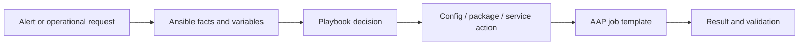

# Module 9: Final Charter-Style Use Case

> 🧪 Lab commands run from [`bootcamp/lab/`](../lab/) — `cd bootcamp/lab` first. Diagrams render automatically on GitHub.

**Day 3 · AAP and Applied Workflow** — bring the whole course together on something that *feels* like Charter work, without going down application-specific rabbit holes.

---

## Definition

The final use case applies every building block — inventory, variables, facts, role, playbook, AAP job template — to a realistic-but-simple workflow.

Pick **one** of these (keep it simple):
1. Linux package and repo configuration
2. Cron job configuration
3. Service remediation from an alert
4. Config file deployment
5. CASI / Kazoo-style config push pattern
6. Splunk or Zabbix alert response pattern

> This repo ships option **3 — service remediation** (`playbooks/module9_final_usecase.yml`) as the worked example.

---

## Diagram / Workflow



Example narrative: a Splunk/Zabbix alert fires → Ansible gathers facts → checks service/package/config state → remediates or reports → AAP shows the job result.

---

## Hands-On Walkthrough

The instructor walks the scenario end to end:
1. Start with a simple request or alert ("web service is down on the web group").
2. Review the inventory.
3. Review variables in `group_vars/web.yml` and `host_vars/server1.yml`.
4. Review the `web_config` role.
5. Run from the CLI:
   ```bash
   ansible-playbook playbooks/module9_final_usecase.yml
   ```
6. Push/sync through AAP.
7. Run the job template (optionally with a survey that sets `web_message` or `target_group`).
8. Review output, modify a variable, re-run, validate.

---

## Quiz

1. What is the main purpose of the final lab?
   - A. Apply the Ansible building blocks to a realistic workflow
   - B. Teach every AAP admin feature
   - C. Replace all Puppet code in one day
   - D. Troubleshoot Windows only

2. Why do we keep the use case simple?
   - A. To focus on the Ansible concept instead of rabbit holes
   - B. Because Ansible cannot do complex work
   - C. Because AAP only supports simple jobs
   - D. Because variables are not allowed

3. What should students be able to do after this lab?
   - A. Read, modify, run, and troubleshoot Ansible automation
   - B. Install AAP from scratch
   - C. Build execution environments from scratch
   - D. Replace NetBox

---

## Hands-On Lab — *Final integrated exercise*

**You will:**
1. Review the final use case.
2. Inspect the inventory.
3. Inspect `group_vars` and `host_vars`.
4. Run the playbook from the CLI.
5. Modify a variable.
6. Call the logic through the role.
7. Run it through an AAP job template.
8. Review output.
9. Troubleshoot a **controlled failure** (instructor breaks one variable).
10. Explain what happened end to end.

```bash
ansible-playbook playbooks/module9_final_usecase.yml
```

**Success check:**
- [ ] You can explain the full flow:
  **Git repo → variables → playbook → role → inventory → AAP job template → target host.**

<details>
<summary>Instructor answer key</summary>

1. **A** — Apply the building blocks to a realistic workflow
2. **A** — Focus on the concept, not rabbit holes
3. **A** — Read, modify, run, and troubleshoot automation
</details>
