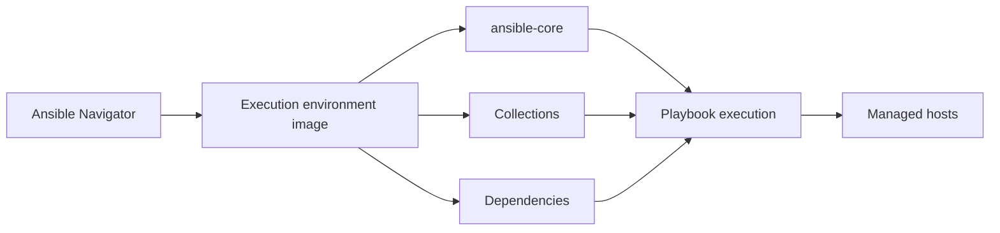

<p align="left">
  <a href="https://github.com/Ansible-workshop-ch/bootcamp/blob/main/module08/aap-inventories-surveys-troubleshooting.md" target="_blank">
    
  </a>
</p>

<p align="right">
  <a href="https://github.com/Ansible-workshop-ch/bootcamp/tree/main/lab/bonus" target="_blank">
    
  </a>
</p>

# Module 9: Final Charter-Style Use Case with Ansible Navigator

> Lab commands run from [`bootcamp/lab/`](../lab/)
> Run `cd bootcamp/lab` before beginning.

**Day 3 - Final Integrated Use Case**

This module brings the entire course together through a realistic Charter-style operational workflow.

The scenario is intentionally focused:

> Splunk or Zabbix reports that a Linux web service is stopped. An operator uses Ansible Navigator to inspect the automation environment, review inventory, execute approved remediation, validate the result, save an execution artifact, and then run the same automation through AAP.

This is the first module where **Ansible Navigator is introduced and used as the primary local Ansible command**.

Do not switch back to `ansible-playbook`, `ansible-inventory`, or `ansible-doc` during this module.

---

# 1. Learning Objectives

By the end of this module, you will be able to:

* Explain what Ansible Navigator is.
* Explain the relationship between Navigator and execution environments.
* Inspect Navigator settings.
* Inspect the active Ansible configuration.
* Inspect an inventory using Navigator.
* Read module documentation through Navigator.
* Validate playbook syntax through Navigator.
* Run playbooks through Navigator.
* Pass limits and variables through Navigator.
* Save a Navigator playbook artifact.
* Replay a previous playbook execution.
* Connect local Navigator testing to AAP execution.
* Respond to a simulated monitoring alert.
* Inspect the current service state.
* Remediate a stopped service.
* Validate the service and HTTP endpoint.
* Prove idempotency.
* Troubleshoot controlled failures.
* Classify issues by likely owner.

---

# 2. What Is Ansible Navigator?

## Definition

**Ansible Navigator** is a command-line and text-based interface for creating, reviewing, running, and troubleshooting Ansible automation.

It can inspect and run:

* Playbooks
* Inventories
* Collections
* Module documentation
* Ansible configuration
* Execution environment images
* Previous playbook artifacts

Navigator provides a consistent command path for local automation development and testing.

---

## Command Mapping

| Traditional command purpose                  | Navigator command             |
| -------------------------------------------- | ----------------------------- |
| Run a playbook                               | `ansible-navigator run`       |
| Inspect inventory                            | `ansible-navigator inventory` |
| Read module documentation                    | `ansible-navigator doc`       |
| Review Ansible configuration                 | `ansible-navigator config`    |
| Run commands inside an execution environment | `ansible-navigator exec`      |
| Inspect execution environment images         | `ansible-navigator images`    |
| Replay a previous execution                  | `ansible-navigator replay`    |
| Review Navigator settings                    | `ansible-navigator settings`  |

Navigator is the required command path for this module.

---

# 3. Why Navigator Is Introduced Here

Modules 1 through 8 used the standard Ansible commands so students could first understand:

* Inventory
* Ad hoc commands
* Playbooks
* Variables
* Facts
* Conditions
* Loops
* Templates
* Handlers
* Roles
* AAP projects
* Job templates
* Surveys
* Schedules
* Troubleshooting

Module 9 introduces Navigator after those fundamentals are understood.

This allows students to focus on what Navigator adds rather than trying to learn Ansible and Navigator at the same time.

---

## Navigator and AAP Mental Model

```mermaid
flowchart LR
    DEV[Automation developer] --> GIT[Git repository]

    GIT --> NAV[Ansible Navigator]
    NAV --> EE[Execution environment]
    EE --> TEST[Local validation]

    TEST --> PROJECT[AAP project]
    PROJECT --> JT[AAP job template]
    JT --> AAPEE[AAP execution environment]
    AAPEE --> HOSTS[Managed hosts]

    HOSTS --> RESULT[Job result]
```



Navigator does not replace AAP.

Navigator helps developers and operators validate automation content before it is synchronized and executed through AAP.

---

# 4. Execution Environments

## Definition

An **execution environment**, or **EE**, is a container image used as an Ansible control node.

An EE can contain:

* `ansible-core`
* Ansible Runner
* Collections
* Python libraries
* System packages
* Automation dependencies

AAP uses execution environments to run automation.

Ansible Navigator can use an execution environment locally.

This helps reduce differences between local testing and AAP execution.

---

## Execution With an EE



---

## Lab Fallback

The preferred Module 9 path uses an execution environment.

If the training workstation cannot use Podman or Docker, add:

```bash
--ee false
```

Example:

```bash
ansible-navigator run \
  playbooks/module9_final_usecase.yml \
  -i inventories/inventory.ini \
  --mode stdout \
  --ee false
```

This still uses Ansible Navigator.

It only disables the containerized execution environment.

---

# 5. Navigator Prerequisites

Confirm the following before starting:

* `ansible-navigator` is installed.
* Podman or Docker is available when using an EE.
* The approved execution environment image is available.
* The inventory is reachable.
* SSH authentication is configured.
* The training repository is checked out.
* The Module 6 `web_config` role has been applied.
* The managed host is an approved lab system.

---

## Check Navigator

```bash
ansible-navigator --version
```

Expected output includes the installed Navigator version.

---

## Check the Container Runtime

```bash
podman --version
```

Or:

```bash
docker --version
```

Only one supported container runtime is required.

---

## Check the Ansible Runtime Inside the EE

```bash
ansible-navigator exec -- ansible --version
```

This runs the command inside the selected execution environment.

---

## Inspect Available Images

```bash
ansible-navigator images --mode stdout
```

Review:

* Image name
* Ansible version
* Python version
* Included collections
* Installed Python packages
* Operating system information

---

# 6. Navigator Settings File

Create:

```text
lab/ansible-navigator.yml
```

Add:

```yaml
---
ansible-navigator:
  mode: stdout

  execution-environment:
    enabled: true

    pull:
      policy: missing

  playbook-artifact:
    enable: true
    save-as: >-
      artifacts/{playbook_name}-
      {playbook_status}-
      {time_stamp}.json

  logging:
    level: warning
```

Create the artifact directory:

```bash
mkdir -p artifacts
```

Navigator checks for a project-level settings file named:

```text
ansible-navigator.yml
```

Do not name the project file:

```text
.ansible-navigator.yml
```

The leading-dot version is used in the user's home directory.

---

## Optional Execution Environment Image

If the instructor provides a specific image, add it under:

```yaml
execution-environment:
```

Example:

```yaml
execution-environment:
  enabled: true
  image: <approved-training-ee-image>
  pull:
    policy: missing
```

Replace the placeholder with the image supplied by the AAP team.

Do not guess the production execution environment image.

---

# 7. Inspect Navigator Settings

Run:

```bash
ansible-navigator settings --mode stdout
```

Review:

* Execution environment enabled status
* Selected image
* Container engine
* Output mode
* Artifact settings
* Logging settings
* Settings file source

---

# 8. Inspect the Ansible Configuration

Run:

```bash
ansible-navigator config \
  --mode stdout \
  --only-changed
```

Review:

* Inventory path
* Role search path
* Host key checking
* Collection paths
* Connection settings
* Callback settings

The repository configuration should make the role directory available.

For local execution from `bootcamp/lab`, verify:

```ini
[defaults]
inventory = ./inventories/inventory.ini
roles_path = ./roles
host_key_checking = False
retry_files_enabled = False
```

For AAP execution from the repository root, verify:

```ini
[defaults]
roles_path = ./lab/roles
```

---

# 9. Navigator Command Reference

Run all commands from:

```bash
cd bootcamp/lab
```

---

## Check Navigator

```bash
ansible-navigator --version
```

---

## Inspect Settings

```bash
ansible-navigator settings --mode stdout
```

---

## Inspect Configuration

```bash
ansible-navigator config \
  --mode stdout \
  --only-changed
```

---

## Inspect the Inventory Graph

```bash
ansible-navigator inventory \
  -i inventories/inventory.ini \
  --graph \
  --mode stdout
```

---

## List Inventory Data

```bash
ansible-navigator inventory \
  -i inventories/inventory.ini \
  --list \
  --mode stdout
```

---

## Read Module Documentation

```bash
ansible-navigator doc \
  ansible.builtin.service_facts \
  --mode stdout
```

```bash
ansible-navigator doc \
  ansible.builtin.service \
  --mode stdout
```

```bash
ansible-navigator doc \
  ansible.builtin.uri \
  --mode stdout
```

```bash
ansible-navigator doc \
  ansible.builtin.assert \
  --mode stdout
```

---

## Validate Playbook Syntax

```bash
ansible-navigator run \
  playbooks/module9_final_usecase.yml \
  -i inventories/inventory.ini \
  --mode stdout \
  --syntax-check
```

---

## List Playbook Tasks

```bash
ansible-navigator run \
  playbooks/module9_final_usecase.yml \
  -i inventories/inventory.ini \
  --mode stdout \
  --list-tasks
```

---

## Run a Playbook

```bash
ansible-navigator run \
  playbooks/module9_final_usecase.yml \
  -i inventories/inventory.ini \
  --mode stdout
```

---

## Run Against One Host

```bash
ansible-navigator run \
  playbooks/module9_final_usecase.yml \
  -i inventories/inventory.ini \
  --mode stdout \
  --limit rhel1
```

---

# 10. Final Charter-Style Scenario

## Operational Request

A monitoring platform reports:

```text
Alert source: Splunk
Alert ID: SPL-1042
Affected service: Web service
Affected host: rhel1
Condition: Service is not running
Required action: Restore service and validate availability
Change ticket: CHG-2042
```

The operator must:

1. Confirm the inventory target.
2. Review the approved remediation role.
3. Review the required module documentation.
4. Run validate-only mode.
5. Confirm that the service is stopped.
6. Run remediation mode.
7. Confirm that the service starts.
8. Confirm that the HTTP endpoint responds.
9. Save the Navigator artifact.
10. Replay the result.
11. Run the automation again.
12. Confirm idempotency.
13. Run the same automation through AAP.
14. Compare local Navigator output with AAP job output.

---

# 11. Final Workflow

```mermaid
flowchart LR
    ALERT[Splunk or Zabbix alert] --> OPERATOR[Operator]

    OPERATOR --> INVENTORY[Navigator inventory review]
    INVENTORY --> DOCS[Navigator documentation review]
    DOCS --> VALIDATE[Navigator validate-only run]

    VALIDATE --> STATE{Service running?}

    STATE -->|No| REMEDIATE[Navigator remediation run]
    STATE -->|Yes| COMPLIANT[No remediation required]

    REMEDIATE --> SERVICE[Start service]
    SERVICE --> HTTP[Validate HTTP]
    COMPLIANT --> HTTP

    HTTP --> ARTIFACT[Navigator artifact]
    ARTIFACT --> REPLAY[Navigator replay]
    REPLAY --> IDEMPOTENT[Second Navigator run]

    IDEMPOTENT --> GIT[Git repository]
    GIT --> AAP[AAP project and job template]
    AAP --> FINAL[Auditable result]
```



---

# 12. Course Concepts Used

| Course concept        | Use in this module                                |
| --------------------- | ------------------------------------------------- |
| Inventory             | Defines available Linux hosts                     |
| Groups                | Organize Linux targets                            |
| Limit                 | Narrows execution to the affected host            |
| Variables             | Supply alert, environment, and change information |
| Facts                 | Identify the operating system and service state   |
| Conditions            | Decide which action runs                          |
| Roles                 | Organize remediation logic                        |
| Templates             | Create audit records                              |
| Handlers              | Record actual remediation changes                 |
| Idempotency           | Prevent unnecessary service changes               |
| Git                   | Stores and versions the automation                |
| Navigator             | Inspects, runs, saves, and replays automation     |
| Execution environment | Supplies a consistent runtime                     |
| AAP project           | Synchronizes the Git repository                   |
| AAP survey            | Collects controlled operator input                |
| Job template          | Defines how AAP runs the remediation              |
| Credential            | Provides protected host authentication            |
| Job output            | Records execution results                         |

---

# 13. Scope and Safety

The final use case supports one approved service profile:

```text
web
```

The role maps that profile to the appropriate service:

| OS family | Package   | Service   | Service fact key  |
| --------- | --------- | --------- | ----------------- |
| Debian    | `apache2` | `apache2` | `apache2.service` |
| Red Hat   | `httpd`   | `httpd`   | `httpd.service`   |

The operator does not enter an arbitrary service name.

The service mapping is controlled in Git.

---

## Supported Actions

| Action     | Behavior                             |
| ---------- | ------------------------------------ |
| `start`    | Starts the service only when needed  |
| `restart`  | Restarts the service every time      |
| `validate` | Checks the state without changing it |

Use:

```text
start
```

For normal incident remediation and idempotency testing.

The `restart` action is intentionally disruptive and normally reports a change on every run.

---

## Target Safety

The playbook targets:

```yaml
hosts: linux
```

Always narrow the final lab to one approved host:

```bash
--limit rhel1
```

Do not run the alert simulation across every host.

---

# 14. Repository Structure

```text
bootcamp/
├── ansible.cfg
└── lab/
    ├── ansible.cfg
    ├── ansible-navigator.yml
    ├── artifacts/
    ├── group_vars/
    │   └── linux.yml
    ├── inventories/
    │   └── inventory.ini
    ├── playbooks/
    │   ├── module6_role_apply.yml
    │   ├── module8_operator_workflow.yml
    │   ├── module9_final_usecase.yml
    │   └── module9_simulate_alert.yml
    └── roles/
        ├── web_config/
        └── service_remediation/
            ├── README.md
            ├── defaults/
            │   └── main.yml
            ├── handlers/
            │   └── main.yml
            ├── meta/
            │   └── main.yml
            ├── tasks/
            │   └── main.yml
            ├── templates/
            │   ├── remediation-audit.j2
            │   └── remediation-change.j2
            └── vars/
                └── main.yml
```

---

# 15. Service Remediation Role Defaults

Create or verify:

```text
roles/service_remediation/defaults/main.yml
```

```yaml
---
remediation_alert_source: Manual
remediation_alert_id: MAN-1000
remediation_change_ticket: CHG-1000
remediation_environment: training
remediation_action: start
remediation_operator_note: "Service remediation requested"

remediation_validate_http: true
remediation_http_url: http://localhost

remediation_expected_status_codes:
  - 200

remediation_audit_directory: /etc/charter
remediation_audit_filename: service-remediation-audit.txt
remediation_change_filename: service-remediation-change.txt
```

---

# 16. Internal Role Variables

Create or verify:

```text
roles/service_remediation/vars/main.yml
```

```yaml
---
remediation_service_name_map:
  Debian: apache2
  RedHat: httpd

remediation_service_unit_map:
  Debian: apache2.service
  RedHat: httpd.service

remediation_supported_alert_sources:
  - Splunk
  - Zabbix
  - Manual

remediation_supported_actions:
  - start
  - restart
  - validate

remediation_supported_environments:
  - training
  - development
  - testing
```

The service mappings remain controlled in Git.

---

# 17. Audit Template

Create:

```text
roles/service_remediation/templates/remediation-audit.j2
```

```jinja2
Managed by Ansible

Alert source: {{ remediation_alert_source }}
Alert ID: {{ remediation_alert_id }}
Change ticket: {{ remediation_change_ticket }}
Environment: {{ remediation_environment }}
Operator note: {{ remediation_operator_note }}

Managed host: {{ inventory_hostname }}
Operating system: {{ ansible_facts['distribution'] }}
Operating system family: {{ ansible_facts['os_family'] }}

Service profile: web
Service name: {{ remediation_service_name }}
Requested action: {{ remediation_action }}
Final service state: {{ remediation_final_state }}

HTTP validation enabled: {{ remediation_validate_http }}
HTTP validation URL: {{ remediation_http_url }}
```

The file contains stable incident information.

The AAP job ID is intentionally excluded because it changes during every launch.

AAP already stores job-level audit information in job history.

---

# 18. Change Record Template

Create:

```text
roles/service_remediation/templates/remediation-change.j2
```

```jinja2
Service remediation was performed.

Alert source: {{ remediation_alert_source }}
Alert ID: {{ remediation_alert_id }}
Change ticket: {{ remediation_change_ticket }}
Managed host: {{ inventory_hostname }}

Service name: {{ remediation_service_name }}
Previous state: {{ remediation_initial_state }}
Requested action: {{ remediation_action }}
```

This file is generated only when the service task reports a real change.

---

# 19. Handler

Create:

```text
roles/service_remediation/handlers/main.yml
```

```yaml
---
- name: Record service remediation change
  ansible.builtin.template:
    src: remediation-change.j2
    dest: >-
      {{ remediation_audit_directory }}/
      {{ remediation_change_filename }}
    owner: root
    group: root
    mode: "0644"
```

---

# 20. Role Tasks

Create:

```text
roles/service_remediation/tasks/main.yml
```

```yaml
---
- name: Validate the operating system family
  ansible.builtin.assert:
    that:
      - ansible_facts['os_family'] in remediation_service_name_map
    fail_msg: >-
      Unsupported operating system family:
      {{ ansible_facts['os_family'] }}.
    success_msg: >-
      Supported operating system family:
      {{ ansible_facts['os_family'] }}.

- name: Validate the alert source
  ansible.builtin.assert:
    that:
      - remediation_alert_source in remediation_supported_alert_sources
    fail_msg: >-
      Invalid alert source: {{ remediation_alert_source }}.
      Select Splunk, Zabbix, or Manual.

- name: Validate the remediation action
  ansible.builtin.assert:
    that:
      - remediation_action in remediation_supported_actions
    fail_msg: >-
      Invalid remediation action: {{ remediation_action }}.
      Select start, restart, or validate.

- name: Validate the environment
  ansible.builtin.assert:
    that:
      - remediation_environment in remediation_supported_environments
    fail_msg: >-
      Invalid environment: {{ remediation_environment }}.
      Select training, development, or testing.

- name: Validate the alert ID
  ansible.builtin.assert:
    that:
      - remediation_alert_id is match('^[A-Z]+-[0-9]{4,}$')
    fail_msg: >-
      Invalid alert ID: {{ remediation_alert_id }}.
      Use a format such as SPL-1042 or ZBX-1042.

- name: Validate the change ticket
  ansible.builtin.assert:
    that:
      - remediation_change_ticket is match('^CHG-[0-9]{4,}$')
    fail_msg: >-
      Invalid change ticket:
      {{ remediation_change_ticket }}.
      Use CHG- followed by at least four numbers.

- name: Select the operating system service
  ansible.builtin.set_fact:
    remediation_service_name: >-
      {{ remediation_service_name_map[
           ansible_facts['os_family']
         ] }}
    remediation_service_unit: >-
      {{ remediation_service_unit_map[
           ansible_facts['os_family']
         ] }}

- name: Gather service facts before remediation
  ansible.builtin.service_facts:

- name: Verify that the expected service exists
  ansible.builtin.assert:
    that:
      - remediation_service_unit in ansible_facts['services']
    fail_msg: >-
      Expected service {{ remediation_service_unit }}
      was not found on {{ inventory_hostname }}.
      Confirm that the web_config role was applied first.
    success_msg: >-
      Found service {{ remediation_service_unit }}
      on {{ inventory_hostname }}.

- name: Record the original service state
  ansible.builtin.set_fact:
    remediation_initial_state: >-
      {{ ansible_facts['services']
         [remediation_service_unit]['state'] }}

- name: Display the remediation request
  ansible.builtin.debug:
    msg:
      - "Host: {{ inventory_hostname }}"
      - "Alert source: {{ remediation_alert_source }}"
      - "Alert ID: {{ remediation_alert_id }}"
      - "Change ticket: {{ remediation_change_ticket }}"
      - "Service: {{ remediation_service_name }}"
      - "Initial state: {{ remediation_initial_state }}"
      - "Requested action: {{ remediation_action }}"
      - >-
        AAP job ID:
        {{ awx_job_id | default('Navigator execution') }}
      - >-
        AAP job template:
        {{ awx_job_template_name |
           default('Navigator execution') }}

- name: Start the service when requested
  ansible.builtin.service:
    name: "{{ remediation_service_name }}"
    state: started
    enabled: true
  when: remediation_action == "start"
  notify: Record service remediation change

- name: Restart the service when requested
  ansible.builtin.service:
    name: "{{ remediation_service_name }}"
    state: restarted
    enabled: true
  when: remediation_action == "restart"
  notify: Record service remediation change

- name: Explain validate-only behavior
  ansible.builtin.debug:
    msg: >-
      Validate-only mode selected.
      Ansible will not change the service state.
  when: remediation_action == "validate"

- name: Gather service facts after remediation
  ansible.builtin.service_facts:

- name: Record the final service state
  ansible.builtin.set_fact:
    remediation_final_state: >-
      {{ ansible_facts['services']
         [remediation_service_unit]['state'] }}

- name: Validate that the service is running
  ansible.builtin.assert:
    that:
      - remediation_final_state == "running"
    fail_msg: >-
      Service {{ remediation_service_name }}
      is {{ remediation_final_state }}
      on {{ inventory_hostname }}.
    success_msg: >-
      Service {{ remediation_service_name }}
      is running on {{ inventory_hostname }}.

- name: Validate the HTTP endpoint
  ansible.builtin.uri:
    url: "{{ remediation_http_url }}"
    status_code: "{{ remediation_expected_status_codes }}"
    return_content: false
  when: remediation_validate_http | bool

- name: Create the audit directory
  ansible.builtin.file:
    path: "{{ remediation_audit_directory }}"
    state: directory
    owner: root
    group: root
    mode: "0755"

- name: Create the stable remediation audit record
  ansible.builtin.template:
    src: remediation-audit.j2
    dest: >-
      {{ remediation_audit_directory }}/
      {{ remediation_audit_filename }}
    owner: root
    group: root
    mode: "0644"

- name: Display the final remediation result
  ansible.builtin.debug:
    msg:
      - "Host: {{ inventory_hostname }}"
      - "Service: {{ remediation_service_name }}"
      - "Original state: {{ remediation_initial_state }}"
      - "Final state: {{ remediation_final_state }}"
      - "Result: remediation workflow completed"
```

---

# 21. Role Metadata

Create:

```text
roles/service_remediation/meta/main.yml
```

```yaml
---
galaxy_info:
  author: Charter Ansible Training
  description: Validate and remediate a Linux web service
  license: MIT
  min_ansible_version: "2.15"

  platforms:
    - name: EL
      versions:
        - "8"
        - "9"

    - name: Debian
      versions:
        - "11"
        - "12"

dependencies: []
```

---

# 22. Final Use Case Playbook

Create:

```text
playbooks/module9_final_usecase.yml
```

```yaml
---
- name: Module 9 - Alert-driven service remediation
  hosts: linux
  become: true
  gather_facts: true

  # Process one host at a time to limit the blast radius.
  serial: 1

  roles:
    - service_remediation
```

The playbook remains small.

The implementation belongs to the role.

---

# 23. Alert Simulation Playbook

Create:

```text
playbooks/module9_simulate_alert.yml
```

```yaml
---
- name: Module 9 - Simulate a stopped web service
  hosts: linux
  become: true
  gather_facts: true

  vars:
    simulation_service_name_map:
      Debian: apache2
      RedHat: httpd

  tasks:
    - name: Validate the operating system
      ansible.builtin.assert:
        that:
          - ansible_facts['os_family']
            in simulation_service_name_map
        fail_msg: >-
          Unsupported operating system family:
          {{ ansible_facts['os_family'] }}.

    - name: Stop the web service for the training simulation
      ansible.builtin.service:
        name: >-
          {{ simulation_service_name_map[
               ansible_facts['os_family']
             ] }}
        state: stopped

    - name: Display the simulated alert
      ansible.builtin.debug:
        msg: >-
          Training alert created.
          The web service is stopped on
          {{ inventory_hostname }}.
```

This playbook intentionally creates a failure condition.

Use it only on approved training hosts.

---

# 24. Inspect the Inventory With Navigator

Run:

```bash
ansible-navigator inventory \
  -i inventories/inventory.ini \
  --graph \
  --mode stdout
```

Confirm:

* The `linux` group exists.
* `rhel1` belongs to the expected group.
* The target is not disabled.
* The inventory path is correct.

List complete inventory data:

```bash
ansible-navigator inventory \
  -i inventories/inventory.ini \
  --list \
  --mode stdout
```

---

# 25. Review Documentation With Navigator

Before running the final use case, inspect the modules used by the role.

## Service Facts

```bash
ansible-navigator doc \
  ansible.builtin.service_facts \
  --mode stdout
```

Review:

* Returned service facts
* Service state values
* Service unit names

---

## Service Management

```bash
ansible-navigator doc \
  ansible.builtin.service \
  --mode stdout
```

Review:

* `name`
* `state`
* `enabled`
* Supported state values

---

## Assertions

```bash
ansible-navigator doc \
  ansible.builtin.assert \
  --mode stdout
```

Review:

* `that`
* `fail_msg`
* `success_msg`

---

## HTTP Validation

```bash
ansible-navigator doc \
  ansible.builtin.uri \
  --mode stdout
```

Review:

* `url`
* `status_code`
* `return_content`

---

# 26. Validate Syntax With Navigator

Validate the simulation playbook:

```bash
ansible-navigator run \
  playbooks/module9_simulate_alert.yml \
  -i inventories/inventory.ini \
  --mode stdout \
  --syntax-check
```

Validate the remediation playbook:

```bash
ansible-navigator run \
  playbooks/module9_final_usecase.yml \
  -i inventories/inventory.ini \
  --mode stdout \
  --syntax-check
```

Expected output:

```text
playbook: playbooks/module9_final_usecase.yml
```

---

# 27. List Tasks With Navigator

```bash
ansible-navigator run \
  playbooks/module9_final_usecase.yml \
  -i inventories/inventory.ini \
  --mode stdout \
  --list-tasks
```

Expected tasks include:

```text
service_remediation : Validate the operating system family
service_remediation : Gather service facts before remediation
service_remediation : Start the service when requested
service_remediation : Validate that the service is running
service_remediation : Validate the HTTP endpoint
service_remediation : Create the stable remediation audit record
```

---

# 28. Prepare the Web Server

Confirm that the Module 6 web role has been applied.

Run it through Navigator:

```bash
ansible-navigator run \
  playbooks/module6_role_apply.yml \
  -i inventories/inventory.ini \
  --mode stdout \
  --limit rhel1
```

Expected result:

```text
failed=0
unreachable=0
```

---

# 29. Simulate the Monitoring Alert

Stop the service on one approved training host:

```bash
ansible-navigator run \
  playbooks/module9_simulate_alert.yml \
  -i inventories/inventory.ini \
  --mode stdout \
  --limit rhel1
```

Expected result:

```text
changed: [rhel1]
```

The service is now stopped.

The simulated monitoring event is:

```text
Splunk Alert SPL-1042:
The web service is down on rhel1.
Change ticket CHG-2042 is approved.
```

---

# 30. Run Validate-Only Mode

Run:

```bash
ansible-navigator run \
  playbooks/module9_final_usecase.yml \
  -i inventories/inventory.ini \
  --mode stdout \
  --limit rhel1 \
  --extra-vars '{
    "remediation_alert_source": "Splunk",
    "remediation_alert_id": "SPL-1042",
    "remediation_change_ticket": "CHG-2042",
    "remediation_environment": "training",
    "remediation_action": "validate",
    "remediation_operator_note": "Confirm the service failure."
  }'
```

Expected result:

```text
Failed
```

The expected failed task is:

```text
Validate that the service is running
```

This is correct behavior.

Validate-only mode inspected the service but did not change it.

---

## Troubleshooting Questions

Students must answer:

1. Which host was targeted?
2. Which service was selected?
3. What was the initial state?
4. Which action was requested?
5. Which task failed?
6. Why did it fail?
7. Did the automation behave correctly?
8. What should the operator do next?

Correct next action:

```text
Relaunch using remediation_action=start
```

---

# 31. Run Remediation Mode

Run:

```bash
ansible-navigator run \
  playbooks/module9_final_usecase.yml \
  -i inventories/inventory.ini \
  --mode stdout \
  --limit rhel1 \
  --extra-vars '{
    "remediation_alert_source": "Splunk",
    "remediation_alert_id": "SPL-1042",
    "remediation_change_ticket": "CHG-2042",
    "remediation_environment": "training",
    "remediation_action": "start",
    "remediation_operator_note": "Restore the monitored web service."
  }'
```

Expected behavior:

1. Navigator starts the execution environment.
2. The playbook gathers facts.
3. The role selects `httpd` for the Red Hat host.
4. Service facts show the service is stopped.
5. The service task reports `changed`.
6. The service starts.
7. New service facts report `running`.
8. The HTTP request returns the expected status.
9. The audit record is generated.
10. The handler records the service-state change.
11. The play completes successfully.
12. Navigator creates a playbook artifact.

Expected recap:

```text
failed=0
unreachable=0
```

---

# 32. Save a Named Navigator Artifact

Run the remediation again with an explicit artifact name:

```bash
ansible-navigator run \
  playbooks/module9_final_usecase.yml \
  -i inventories/inventory.ini \
  --mode stdout \
  --limit rhel1 \
  --playbook-artifact-save-as \
  artifacts/module9-remediation-{playbook_status}-{time_stamp}.json \
  --extra-vars '{
    "remediation_alert_source": "Splunk",
    "remediation_alert_id": "SPL-1042",
    "remediation_change_ticket": "CHG-2042",
    "remediation_environment": "training",
    "remediation_action": "start",
    "remediation_operator_note": "Restore the monitored web service."
  }'
```

List the artifacts:

```bash
ls -1t artifacts/*.json
```

Navigator artifacts contain execution details that can help with:

* Review
* Troubleshooting
* Training
* Change control
* Sharing results
* Comparing runs

Do not commit artifacts containing sensitive output unless the repository and security policy explicitly allow it.

Add the artifact directory to `.gitignore` when appropriate:

```text
artifacts/
```

---

# 33. Replay the Navigator Artifact

Identify the newest artifact:

```bash
ls -1t artifacts/*.json | head -1
```

Replay it in stdout mode:

```bash
ansible-navigator replay \
  "$(ls -1t artifacts/*.json | head -1)" \
  --mode stdout
```

Replay it interactively:

```bash
ansible-navigator replay \
  "$(ls -1t artifacts/*.json | head -1)" \
  --mode interactive
```

During replay, inspect:

* Plays
* Tasks
* Hosts
* Changed events
* Failed events
* Handler execution
* Play recap

Replay does not run the playbook again.

It reviews the previously recorded execution.

---

# 34. Prove Idempotency

Run the same remediation command again:

```bash
ansible-navigator run \
  playbooks/module9_final_usecase.yml \
  -i inventories/inventory.ini \
  --mode stdout \
  --limit rhel1 \
  --extra-vars '{
    "remediation_alert_source": "Splunk",
    "remediation_alert_id": "SPL-1042",
    "remediation_change_ticket": "CHG-2042",
    "remediation_environment": "training",
    "remediation_action": "start",
    "remediation_operator_note": "Restore the monitored web service."
  }'
```

Expected behavior:

* Initial service state is `running`.
* The service task reports `ok`.
* The service is not restarted.
* The change-record handler does not run.
* HTTP validation succeeds.
* The audit record reports `ok`.
* The job completes successfully.

Expected recap:

```text
changed=0
failed=0
unreachable=0
```

The exact `ok` and `skipped` counts can vary.

---

# 35. Validate the Audit Record With Navigator

Use Navigator to run the ad hoc validation command inside the EE:

```bash
ansible-navigator exec -- \
  ansible rhel1 \
  -i inventories/inventory.ini \
  -b \
  -m ansible.builtin.command \
  -a "cat /etc/charter/service-remediation-audit.txt"
```

Expected content includes:

```text
Alert source: Splunk
Alert ID: SPL-1042
Change ticket: CHG-2042
Service name: httpd
Requested action: start
Final service state: running
```

---

## Validate the Change Record

```bash
ansible-navigator exec -- \
  ansible rhel1 \
  -i inventories/inventory.ini \
  -b \
  -m ansible.builtin.command \
  -a "cat /etc/charter/service-remediation-change.txt"
```

The change record should show:

```text
Previous state: stopped
Requested action: start
```

---

## Validate the HTTP Endpoint

```bash
ansible-navigator exec -- \
  ansible rhel1 \
  -i inventories/inventory.ini \
  -m ansible.builtin.uri \
  -a "url=http://localhost status_code=200"
```

Expected result:

```text
status: 200
```

---

# 36. Interactive Navigator Mode

The main course commands use:

```bash
--mode stdout
```

This produces output similar to normal Ansible terminal output and is easier for instruction.

Navigator also provides an interactive text interface.

Run:

```bash
ansible-navigator run \
  playbooks/module9_final_usecase.yml \
  -i inventories/inventory.ini \
  --mode interactive \
  --limit rhel1 \
  --extra-vars '{
    "remediation_alert_source": "Splunk",
    "remediation_alert_id": "SPL-1042",
    "remediation_change_ticket": "CHG-2042",
    "remediation_environment": "training",
    "remediation_action": "start"
  }'
```

Use interactive mode to explore:

* Plays
* Tasks
* Host results
* Changed events
* Failed events
* Detailed task data

Use:

```text
Esc
```

To move back.

Use:

```text
:q
```

To quit.

---

# 37. Navigator Debug Logging

If Navigator itself has a problem, enable debug logging:

```bash
ansible-navigator run \
  playbooks/module9_final_usecase.yml \
  -i inventories/inventory.ini \
  --mode stdout \
  --limit rhel1 \
  --log-level debug
```

Navigator writes its log to:

```text
ansible-navigator.log
```

Use debug logging for problems such as:

* Execution environment image pull failures
* Volume-mount problems
* SSH-agent problems
* Container runtime failures
* Settings-file problems
* Missing project paths

Do not confuse Navigator runtime failures with managed-host playbook failures.

---

# 38. Common Navigator Problems

## Navigator Command Not Found

Example:

```text
ansible-navigator: command not found
```

Check:

```bash
which ansible-navigator
```

Confirm it is installed and available in `PATH`.

---

## Container Runtime Not Available

Example:

```text
Unable to find podman or docker
```

Check:

```bash
podman --version
```

Or:

```bash
docker --version
```

If the training environment cannot run containers, use:

```bash
--ee false
```

Navigator remains the command path.

---

## Execution Environment Pull Failure

Possible causes:

* Registry unavailable
* Incorrect image name
* Authentication failure
* TLS certificate problem
* Network problem
* Pull policy problem

Inspect:

```bash
ansible-navigator images --mode stdout
```

Run with debug logging:

```bash
ansible-navigator images \
  --mode stdout \
  --log-level debug
```

Escalate registry or image-access failures to the AAP or execution-environment owner.

---

## SSH Authentication Failure Inside the EE

Possible causes:

* SSH key was not loaded.
* SSH agent is not running.
* Incorrect key filename.
* Incorrect inventory user.
* Key is not authorized on the host.
* Key path does not exist inside the EE.

Start the SSH agent:

```bash
eval "$(ssh-agent -s)"
```

Load the key:

```bash
ssh-add ~/.ssh/id_ed25519
```

List loaded keys:

```bash
ssh-add -l
```

Re-run the Navigator command.

---

## Role Not Found

Example:

```text
ERROR! the role 'service_remediation' was not found
```

Review:

```bash
ansible-navigator config \
  --mode stdout \
  --only-changed
```

Confirm:

```ini
roles_path = ./roles
```

Confirm the role exists:

```bash
find roles/service_remediation -maxdepth 2 -type f
```

---

## Inventory Not Found Inside the EE

Confirm the command runs from:

```text
bootcamp/lab
```

Confirm:

```text
inventories/inventory.ini
```

Exists.

Inspect it through Navigator:

```bash
ansible-navigator inventory \
  -i inventories/inventory.ini \
  --graph \
  --mode stdout
```

---

## No Hosts Matched

Example:

```text
skipping: no hosts matched
```

Check:

1. Inventory path
2. `linux` group
3. Target host
4. Limit
5. Host enabled state
6. Playbook host pattern

Run:

```bash
ansible-navigator inventory \
  -i inventories/inventory.ini \
  --graph \
  --mode stdout
```

---

# 39. Commit the Final Automation

Review:

```bash
git status
```

Review changes:

```bash
git diff
```

Add:

```bash
git add \
  ansible-navigator.yml \
  playbooks/module9_final_usecase.yml \
  playbooks/module9_simulate_alert.yml \
  roles/service_remediation
```

Commit:

```bash
git commit -m "Add Navigator-based service remediation use case"
```

Push through the approved workflow:

```bash
git push
```

Record the revision:

```bash
git log -1 --oneline
```

Do not add generated Navigator artifacts unless they are intentionally required and approved.

---

# 40. Synchronize the AAP Project

In AAP, open:

```text
Automation Execution > Projects
```

Select:

```text
Charter Ansible Bootcamp
```

Synchronize the project.

Confirm:

* Project synchronization succeeds.
* The correct Git branch is selected.
* The latest revision appears.
* `lab/playbooks/module9_final_usecase.yml` is available.
* `lab/roles/service_remediation/` is present.
* The project uses the expected execution environment.

---

# 41. AAP Job Template

Create or inspect:

```text
Module 9 - Service Remediation
```

Recommended settings:

| Setting               | Value                                     |
| --------------------- | ----------------------------------------- |
| Job type              | `Run`                                     |
| Inventory             | `Charter Linux Lab`                       |
| Project               | `Charter Ansible Bootcamp`                |
| Playbook              | `lab/playbooks/module9_final_usecase.yml` |
| Execution environment | Approved training environment             |
| Machine credential    | Approved Linux credential                 |
| Limit                 | Prompt on launch                          |
| Verbosity             | Normal                                    |

Use the same execution environment image locally and in AAP when practical.

That makes the Navigator test more representative of the AAP job.

---

# 42. AAP Survey

## Alert Source

| Field    | Value                               |
| -------- | ----------------------------------- |
| Question | `Which system generated the alert?` |
| Variable | `remediation_alert_source`          |
| Type     | `Multiple Choice`                   |
| Required | `Yes`                               |
| Default  | `Splunk`                            |

Choices:

```text
Splunk
Zabbix
Manual
```

---

## Alert ID

| Field    | Value                   |
| -------- | ----------------------- |
| Question | `What is the alert ID?` |
| Variable | `remediation_alert_id`  |
| Type     | `Text`                  |
| Required | `Yes`                   |
| Default  | `SPL-1042`              |

---

## Change Ticket

| Field    | Value                        |
| -------- | ---------------------------- |
| Question | `What is the change ticket?` |
| Variable | `remediation_change_ticket`  |
| Type     | `Text`                       |
| Required | `Yes`                        |
| Default  | `CHG-2042`                   |

---

## Environment

| Field    | Value                            |
| -------- | -------------------------------- |
| Question | `Which environment is affected?` |
| Variable | `remediation_environment`        |
| Type     | `Multiple Choice`                |
| Required | `Yes`                            |
| Default  | `training`                       |

Choices:

```text
training
development
testing
```

---

## Remediation Action

| Field    | Value                                  |
| -------- | -------------------------------------- |
| Question | `Which action should Ansible perform?` |
| Variable | `remediation_action`                   |
| Type     | `Multiple Choice`                      |
| Required | `Yes`                                  |
| Default  | `start`                                |

Choices:

```text
start
validate
restart
```

---

## Operator Note

| Field    | Value                                |
| -------- | ------------------------------------ |
| Question | `Add a short operator note.`         |
| Variable | `remediation_operator_note`          |
| Type     | `Text Area`                          |
| Required | `Yes`                                |
| Default  | `Restore the monitored web service.` |

---

# 43. Compare Navigator and AAP

| Navigator                                 | AAP                                |
| ----------------------------------------- | ---------------------------------- |
| Runs automation locally                   | Runs automation centrally          |
| Uses local inventory input                | Uses an AAP inventory              |
| Uses command-line limits                  | Uses job-template limit prompts    |
| Uses `--extra-vars`                       | Uses survey responses              |
| Uses a local EE                           | Uses an AAP EE                     |
| Uses local SSH access                     | Uses protected machine credentials |
| Produces playbook artifacts               | Produces job history and events    |
| Supports artifact replay                  | Supports job review and relaunch   |
| Used by developers and advanced operators | Used by shared operational teams   |

The automation code does not change.

The execution controls change.

---

# 44. Final Integrated Lab

## Part 1: Navigator Environment

1. Run `ansible-navigator --version`.
2. Inspect Navigator settings.
3. Inspect the Ansible configuration.
4. Inspect available execution environment images.
5. Confirm the Ansible version inside the EE.
6. Confirm SSH authentication is available.

---

## Part 2: Inventory and Documentation

1. Inspect the inventory graph.
2. Confirm the `linux` group.
3. Confirm `rhel1`.
4. List inventory details.
5. Review `service_facts` documentation.
6. Review `service` documentation.
7. Review `assert` documentation.
8. Review `uri` documentation.

---

## Part 3: Code Review

1. Review `module9_final_usecase.yml`.
2. Review `serial: 1`.
3. Review the `service_remediation` role.
4. Review service mappings.
5. Review supported actions.
6. Review input validation.
7. Review service facts.
8. Review HTTP validation.
9. Review the handler.
10. Review audit templates.

---

## Part 4: Validation

1. Run a syntax check with Navigator.
2. List playbook tasks with Navigator.
3. Run the Module 6 role with Navigator.
4. Confirm the web service is installed.
5. Confirm the first run succeeds.

---

## Part 5: Simulate the Alert

1. Run `module9_simulate_alert.yml` with Navigator.
2. Limit execution to `rhel1`.
3. Confirm the service task reports `changed`.
4. Confirm the simulated alert message.

---

## Part 6: Validate-Only Run

1. Run the final playbook with Navigator.
2. Use `remediation_action=validate`.
3. Confirm the job fails.
4. Find the failed task.
5. Identify the stopped service.
6. Confirm the automation did not modify it.
7. Classify the failure correctly.

---

## Part 7: Remediation Run

1. Relaunch through Navigator.
2. Use `remediation_action=start`.
3. Confirm the original state is stopped.
4. Confirm the service task reports changed.
5. Confirm the final state is running.
6. Confirm HTTP validation succeeds.
7. Confirm the handler runs.
8. Confirm the audit record is created.
9. Confirm the play succeeds.

---

## Part 8: Artifact and Replay

1. Locate the generated artifact.
2. Replay it in stdout mode.
3. Replay it in interactive mode.
4. Find the changed service event.
5. Find the handler event.
6. Find the play recap.
7. Explain the difference between replay and rerun.

---

## Part 9: Idempotency

1. Run the same remediation again.
2. Confirm the service is already running.
3. Confirm the service task reports `ok`.
4. Confirm the handler does not run.
5. Confirm HTTP validation succeeds.
6. Confirm `changed=0`.
7. Confirm `failed=0`.
8. Confirm `unreachable=0`.

---

## Part 10: AAP

1. Commit and push the automation.
2. Synchronize the AAP project.
3. Confirm the Git revision.
4. Inspect the AAP job template.
5. Confirm the inventory.
6. Confirm the credential.
7. Confirm the execution environment.
8. Launch validate-only mode.
9. Review the expected failure.
10. Relaunch with `start`.
11. Confirm successful remediation.
12. Launch again.
13. Confirm idempotency.
14. Compare AAP output with Navigator output.

---

# 45. Controlled Failure Scenarios

## Invalid Alert ID

Use:

```text
1042
```

Expected failure:

```text
Invalid alert ID: 1042.
Use a format such as SPL-1042 or ZBX-1042.
```

Category:

```text
Input validation
```

---

## Invalid Change Ticket

Use:

```text
2042
```

Expected failure:

```text
Invalid change ticket: 2042.
Use CHG- followed by at least four numbers.
```

Category:

```text
Input validation
```

---

## Wrong Limit

Use:

```bash
--limit does_not_exist
```

Expected result:

```text
skipping: no hosts matched
```

Category:

```text
Inventory targeting
```

---

## Missing Service

Run against a host where the Module 6 role was not applied.

Expected failure:

```text
Expected service httpd.service was not found.
Confirm that the web_config role was applied first.
```

Category:

```text
Host prerequisite
```

---

## Unreachable Host

Expected output:

```text
UNREACHABLE
```

Investigate:

* Inventory address
* DNS
* Network path
* SSH port
* SSH key
* Host status
* Firewall

Category:

```text
Inventory, network, credential, or host
```

---

## Execution Environment Failure

Possible errors:

```text
Unable to pull execution environment image
```

```text
Container runtime unavailable
```

```text
Collection not found inside execution environment
```

Category:

```text
Navigator, execution environment, registry, or platform
```

---

# 46. Troubleshooting Order

1. Determine whether Navigator started.
2. Determine whether the EE started.
3. Confirm the inventory loaded.
4. Confirm the target limit.
5. Confirm the playbook loaded.
6. Read the play recap.
7. Find the first failed or unreachable task.
8. Read the exact error message.
9. Confirm survey or extra-variable values.
10. Confirm the selected service.
11. Confirm the original service state.
12. Determine the failure category.
13. Make one correction.
14. Re-run with Navigator.
15. Save or replay the artifact.
16. Compare the new result.

---

# 47. Failure Ownership

| Failure                    | Likely owner                     |
| -------------------------- | -------------------------------- |
| Navigator missing          | Workstation or lab owner         |
| Container runtime missing  | Workstation or lab owner         |
| EE image pull failure      | Registry or AAP platform team    |
| Collection missing from EE | EE owner                         |
| Invalid input              | Operator                         |
| Incorrect limit            | Operator                         |
| Missing inventory group    | Inventory owner                  |
| Undefined variable         | Automation developer             |
| Missing role               | Repository owner                 |
| SSH failure                | Credential or host owner         |
| Host unreachable           | Network or infrastructure owner  |
| Service missing            | Linux or automation owner        |
| HTTP failure               | Web-service or application owner |
| AAP job pending            | AAP platform team                |

---

# 48. Talking Points

* Navigator is the required local Ansible interface for this module.
* Navigator does not replace Git.
* Navigator does not replace AAP.
* Navigator can run automation inside an execution environment.
* The local EE should resemble the AAP runtime when practical.
* Inventory should be inspected before remediation.
* Module documentation should be reviewed instead of guessed.
* Syntax checks can run inside the selected EE.
* Validate-only mode can detect a problem without correcting it.
* The `start` action is idempotent.
* The `restart` action is intentionally disruptive.
* A running service does not guarantee a working endpoint.
* HTTP validation tests application availability beyond process state.
* Navigator artifacts record local playbook executions.
* Replay reviews an existing artifact without running the playbook again.
* AAP provides centralized credentials, access control, job history, surveys, and schedules.
* The same Git-based role runs locally through Navigator and centrally through AAP.
* Operators must understand whether a failure belongs to Navigator, the EE, inventory, code, credentials, the host, or AAP.

---

# 49. Quiz

## Question 1

What is Ansible Navigator used for?

* A. Running, inspecting, and troubleshooting Ansible content
* B. Replacing Git
* C. Creating network hardware
* D. Replacing AAP inventories

---

## Question 2

What does an execution environment provide?

* A. A containerized Ansible runtime and its dependencies
* B. A managed-host operating system
* C. A monitoring alert
* D. An SSH user account

---

## Question 3

Which Navigator subcommand runs a playbook?

* A. `run`
* B. `doc`
* C. `inventory`
* D. `images`

---

## Question 4

Which Navigator subcommand reviews an earlier playbook artifact?

* A. `replay`
* B. `config`
* C. `settings`
* D. `collections`

---

## Question 5

What should happen during the second `start` remediation run?

* A. The service remains running and no unnecessary change occurs
* B. The service restarts
* C. The inventory is deleted
* D. The execution environment is rebuilt

---

# 50. Success Checklist

* [ ] I can explain what Ansible Navigator is.
* [ ] I can inspect Navigator settings.
* [ ] I can inspect the active Ansible configuration.
* [ ] I can inspect an execution environment image.
* [ ] I can inspect an inventory with Navigator.
* [ ] I can read module documentation with Navigator.
* [ ] I can run a syntax check with Navigator.
* [ ] I can list playbook tasks with Navigator.
* [ ] I can run a playbook with Navigator.
* [ ] I can pass a host limit.
* [ ] I can pass extra variables.
* [ ] I can run in stdout mode.
* [ ] I can run in interactive mode.
* [ ] I can locate a Navigator artifact.
* [ ] I can replay an artifact.
* [ ] I can simulate a service alert.
* [ ] I can detect a stopped service.
* [ ] I can remediate a stopped service.
* [ ] I can validate the HTTP endpoint.
* [ ] I can prove idempotency.
* [ ] I can compare Navigator execution with AAP execution.
* [ ] I can classify common Navigator and AAP failures.
* [ ] I can explain the complete workflow.

---

<details>
<summary>Instructor Answer Key</summary>

1. **A** - Running, inspecting, and troubleshooting Ansible content.
2. **A** - A containerized Ansible runtime and its dependencies.
3. **A** - `run`.
4. **A** - `replay`.
5. **A** - The service remains running and no unnecessary change occurs.

</details>

---

<p align="left">
  <a href="https://github.com/Ansible-workshop-ch/bootcamp/blob/main/module08/aap-inventories-surveys-troubleshooting.md" target="_blank">
    
  </a>
</p>

<p align="right">
  <a href="https://github.com/Ansible-workshop-ch/bootcamp/tree/main/lab/bonus" target="_blank">
    
  </a>
</p>
