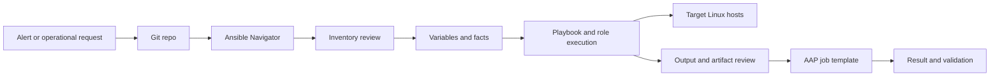

<p align="left">
  <a href="https://github.com/Ansible-workshop-ch/bootcamp/blob/main/module08/aap-inventories-surveys-troubleshooting.md" target="_blank">
    
  </a>
</p>

<p align="right">
  <a href="https://github.com/Ansible-workshop-ch/bootcamp/tree/main/lab/bonus" target="_blank">
    
  </a>
</p>

# Module 9: Final Charter-Style Use Case with Ansible Navigator

> Lab commands run from [`bootcamp/lab/`](../lab/) - `cd bootcamp/lab` first. Diagrams render automatically on GitHub.

**Day 3 - AAP and Applied Workflow** - bring the whole course together on something that feels like Charter work, without going down application-specific rabbit holes.

---

## Why Ansible Navigator Here

Up to this point, the course has used the standard Ansible CLI so students understand the basics first:

```bash
ansible all -m ping
ansible-playbook playbooks/example.yml
```

For the final use case, we switch to **Ansible Navigator**.

Ansible Navigator gives students a more platform-aligned way to inspect inventory, run playbooks, review output, and troubleshoot automation content. This matters because Charter's AAP workflow is closer to:

```text
Git repo -> automation content -> tested locally -> synced into AAP -> executed through job templates
```

This module uses Navigator as the main command path because it connects better to AAP-style execution and configuration-as-code workflows.

For this lab, the main command pattern is:

```bash
ansible-navigator run playbooks/module9_final_usecase.yml -i inventories/inventory.ini --mode stdout
```

If the lab sandbox does not have an execution environment configured, use:

```bash
ansible-navigator run playbooks/module9_final_usecase.yml -i inventories/inventory.ini --mode stdout --ee false
```

---

## Definition

The final use case applies every building block from the course:

| Building block    | How it is used in this lab                                             |
| ----------------- | ---------------------------------------------------------------------- |
| Inventory         | Defines which hosts or groups receive the automation                   |
| Variables         | Controls service names, messages, package choices, and target behavior |
| Facts             | Lets Ansible understand the target system before acting                |
| Role              | Keeps the automation reusable and organized                            |
| Playbook          | Calls the role and controls the workflow                               |
| Ansible Navigator | Runs, inspects, and troubleshoots the automation content               |
| AAP job template  | Runs the same automation through the platform                          |

Pick **one** of these final workflow patterns:

1. Linux package and repo configuration
2. Cron job configuration
3. Service remediation from an alert
4. Config file deployment
5. CASI / Kazoo-style config push pattern
6. Splunk or Zabbix alert response pattern

> This repo ships option 3, service remediation, as the worked example:
>
> `playbooks/module9_final_usecase.yml`

---

## Diagram / Workflow



Example narrative:

A Splunk or Zabbix alert fires because a service is down. The team reviews the automation content from Git, checks the inventory with Ansible Navigator, runs the final use case playbook with Navigator, reviews the output, validates the result, then runs the same logic through an AAP job template.

---

## Navigator Command Reference

Run these from:

```bash
cd ~/bootcamp/lab
```

Check Navigator:

```bash
ansible-navigator --version
```

Inspect the inventory:

```bash
ansible-navigator inventory -i inventories/inventory.ini --graph --mode stdout
```

List inventory details:

```bash
ansible-navigator inventory -i inventories/inventory.ini --list --mode stdout
```

Run the final use case:

```bash
ansible-navigator run playbooks/module9_final_usecase.yml -i inventories/inventory.ini --mode stdout
```

Run without an execution environment if the sandbox requires it:

```bash
ansible-navigator run playbooks/module9_final_usecase.yml -i inventories/inventory.ini --mode stdout --ee false
```

Review module documentation:

```bash
ansible-navigator doc ansible.builtin.service --mode stdout
```

```bash
ansible-navigator doc ansible.builtin.package --mode stdout
```

---

## Hands-On Walkthrough

The instructor walks the scenario end to end.

### Scenario

Operational request:

```text
The web service is down on the web group. Use Ansible to inspect, remediate, and validate the service state.
```

### Step 1 - Move into the lab directory

```bash
cd ~/bootcamp/lab
```

### Step 2 - Confirm Navigator is available

```bash
ansible-navigator --version
```

### Step 3 - Review the inventory with Navigator

```bash
ansible-navigator inventory -i inventories/inventory.ini --graph --mode stdout
```

Talking point:

The target hosts should come from the inventory. We should not hard-code hosts directly inside the playbook.

### Step 4 - Review variables

Review the group variables:

```bash
cat group_vars/web.yml
```

Review the host variables:

```bash
cat host_vars/server1.yml
```

Talking point:

Variables let the same playbook behave differently depending on group, host, environment, or survey input from AAP.

### Step 5 - Review the role

```bash
ls roles/web_config
```

```bash
find roles/web_config -maxdepth 2 -type f
```

Talking point:

The role keeps the automation reusable. The playbook should stay readable. The role should hold the repeated logic.

### Step 6 - Inspect helpful module documentation

```bash
ansible-navigator doc ansible.builtin.service --mode stdout
```

```bash
ansible-navigator doc ansible.builtin.template --mode stdout
```

Talking point:

Navigator is not only for running playbooks. It also helps inspect documentation and troubleshoot content from the terminal.

### Step 7 - Run the final use case with Navigator

Preferred command:

```bash
ansible-navigator run playbooks/module9_final_usecase.yml -i inventories/inventory.ini --mode stdout
```

If the sandbox does not use an execution environment:

```bash
ansible-navigator run playbooks/module9_final_usecase.yml -i inventories/inventory.ini --mode stdout --ee false
```

Talking point:

This replaces the classic command:

```bash
ansible-playbook playbooks/module9_final_usecase.yml
```

For this module, use Navigator as the primary path.

### Step 8 - Review the output

Students should look for:

* Which hosts were targeted
* Which tasks changed something
* Which tasks were already compliant
* Whether the final validation passed
* Whether the result matches the operational request

### Step 9 - Modify a variable and re-run

Example:

```bash
vi group_vars/web.yml
```

Re-run:

```bash
ansible-navigator run playbooks/module9_final_usecase.yml -i inventories/inventory.ini --mode stdout
```

If needed:

```bash
ansible-navigator run playbooks/module9_final_usecase.yml -i inventories/inventory.ini --mode stdout --ee false
```

Talking point:

This is the key lesson: change the data, not the automation logic, when possible.

### Step 10 - Connect it to AAP

After the Navigator run succeeds:

1. Push or sync the repo content.
2. Open the AAP project.
3. Sync the project.
4. Open the related job template.
5. Confirm the inventory.
6. Confirm the playbook.
7. Launch the job template.
8. Review the AAP job output.
9. Compare the AAP output to the Navigator output.

Talking point:

Navigator helps validate the automation content before it is handed off to AAP. AAP then provides shared execution, credentials, RBAC, logging, surveys, schedules, and operational control.

---

## Classic CLI vs Navigator

| Activity              | Classic Ansible CLI                                                                 | Navigator path for this module                                                                         |
| --------------------- | ----------------------------------------------------------------------------------- | ------------------------------------------------------------------------------------------------------ |
| Check inventory graph | `ansible-inventory -i inventories/inventory.ini --graph`                            | `ansible-navigator inventory -i inventories/inventory.ini --graph --mode stdout`                       |
| List inventory        | `ansible-inventory -i inventories/inventory.ini --list`                             | `ansible-navigator inventory -i inventories/inventory.ini --list --mode stdout`                        |
| Run playbook          | `ansible-playbook playbooks/module9_final_usecase.yml -i inventories/inventory.ini` | `ansible-navigator run playbooks/module9_final_usecase.yml -i inventories/inventory.ini --mode stdout` |
| Read module docs      | `ansible-doc ansible.builtin.service`                                               | `ansible-navigator doc ansible.builtin.service --mode stdout`                                          |
| AAP alignment         | Lower                                                                               | Higher                                                                                                 |

For this final module, use the Navigator path.

---

## Quiz

1. Why are we using Ansible Navigator in the final use case?

   * A. To align the local testing workflow more closely with AAP-style execution
   * B. To avoid using inventories
   * C. To replace Git
   * D. To install AAP

2. What is the main purpose of the final lab?

   * A. Apply the Ansible building blocks to a realistic workflow
   * B. Teach every AAP admin feature
   * C. Replace all Puppet code in one day
   * D. Troubleshoot Windows only

3. Why do we keep the use case simple?

   * A. To focus on the Ansible concept instead of rabbit holes
   * B. Because Ansible cannot do complex work
   * C. Because AAP only supports simple jobs
   * D. Because variables are not allowed

4. What should students be able to do after this lab?

   * A. Read, modify, run, and troubleshoot Ansible automation
   * B. Install AAP from scratch
   * C. Build execution environments from scratch
   * D. Replace NetBox

5. What does Navigator help with in this workflow?

   * A. Running, inspecting, and troubleshooting Ansible content
   * B. Replacing SSH entirely
   * C. Removing the need for variables
   * D. Removing the need for Git

---

## Hands-On Lab - Final integrated exercise with Ansible Navigator

**You will:**

1. Review the final use case.
2. Inspect the inventory with Ansible Navigator.
3. Inspect `group_vars` and `host_vars`.
4. Review the role.
5. Run the playbook with Ansible Navigator.
6. Modify a variable.
7. Re-run the playbook with Ansible Navigator.
8. Review output.
9. Run the same logic through an AAP job template.
10. Troubleshoot a controlled failure.
11. Explain what happened end to end.

### Lab commands

Move into the lab directory:

```bash
cd ~/bootcamp/lab
```

Confirm Navigator:

```bash
ansible-navigator --version
```

Inspect the inventory graph:

```bash
ansible-navigator inventory -i inventories/inventory.ini --graph --mode stdout
```

Inspect inventory details:

```bash
ansible-navigator inventory -i inventories/inventory.ini --list --mode stdout
```

Review variables:

```bash
cat group_vars/web.yml
```

```bash
cat host_vars/server1.yml
```

Review the role:

```bash
find roles/web_config -maxdepth 2 -type f
```

Run the final use case:

```bash
ansible-navigator run playbooks/module9_final_usecase.yml -i inventories/inventory.ini --mode stdout
```

If the lab sandbox does not have execution environments configured:

```bash
ansible-navigator run playbooks/module9_final_usecase.yml -i inventories/inventory.ini --mode stdout --ee false
```

Modify a variable:

```bash
vi group_vars/web.yml
```

Re-run:

```bash
ansible-navigator run playbooks/module9_final_usecase.yml -i inventories/inventory.ini --mode stdout
```

If needed:

```bash
ansible-navigator run playbooks/module9_final_usecase.yml -i inventories/inventory.ini --mode stdout --ee false
```

### Controlled failure

The instructor breaks one variable, inventory group, or role input.

Students must identify:

* What failed
* Which task failed
* Whether the issue came from inventory, variables, role logic, or target host state
* How to fix it
* How to re-run and validate

### Success check

* [ ] You inspected the inventory with Ansible Navigator.
* [ ] You ran the final playbook with Ansible Navigator.
* [ ] You modified a variable and re-ran the automation.
* [ ] You connected the Navigator workflow to AAP.
* [ ] You can explain the full flow:

```text
Git repo -> variables -> inventory -> Navigator -> playbook -> role -> target host -> AAP job template -> result
```

<details>
<summary>Instructor answer key</summary>

1. **A** - Align the local testing workflow more closely with AAP-style execution
2. **A** - Apply the building blocks to a realistic workflow
3. **A** - Focus on the concept, not rabbit holes
4. **A** - Read, modify, run, and troubleshoot automation
5. **A** - Running, inspecting, and troubleshooting Ansible content

</details>

<p align="left">
  <a href="https://github.com/Ansible-workshop-ch/bootcamp/blob/main/module08/aap-inventories-surveys-troubleshooting.md" target="_blank">
    
  </a>
</p>

<p align="right">
  <a href="https://github.com/Ansible-workshop-ch/bootcamp/tree/main/lab/bonus" target="_blank">
    
  </a>
</p>
