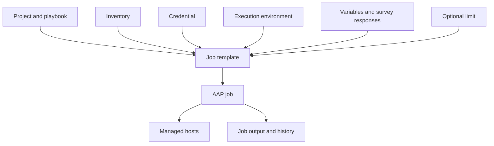

# Pre-Training Orientation

> Light orientation only. Read or skim this before Day 1 so the first morning is not spent resolving basic setup confusion. This is not a full training module.

---

## 1. What Is Ansible?

Ansible is an automation tool that runs tasks across one or many systems.

For Linux systems, Ansible normally connects over SSH. It does not require a permanently installed Ansible agent on each managed Linux host.

Ansible uses:

* **Inventory** to identify managed systems.
* **Modules** to perform specific actions.
* **Tasks** to call modules.
* **Playbooks** to organize tasks into reusable automation.
* **Variables** to make automation flexible.
* **Roles** to organize reusable automation into a standard structure.

In simple terms:

```text
Inventory tells Ansible where to run.
Modules tell Ansible what to do.
Variables control how it behaves.
Playbooks organize the workflow.
Roles make the automation reusable.
```

---

## 2. What Is AAP?

Red Hat Ansible Automation Platform, or **AAP**, is the enterprise platform used to run, control, schedule, and audit Ansible automation.

Instead of every engineer running playbooks independently from a workstation, AAP provides a shared and controlled execution platform.

AAP can:

* Synchronize automation code from Git.
* Use shared inventories.
* Use protected credentials.
* Run job templates.
* Collect approved user input through surveys.
* Schedule automation.
* Show job output.
* Record who launched a job.
* Record which Git revision was used.
* Apply access controls.
* Maintain job history.

Target version for this class:

```text
AAP 2.6 sandbox
```

The automation code remains stored in Git.

AAP controls how the approved automation is executed.

---

## 3. How the Training Builds

The course starts with the standard Ansible command-line tools.

Students first learn:

* Inventory
* Ad hoc commands
* Playbooks
* Variables
* Facts
* Conditions
* Loops
* Files
* Templates
* Handlers
* Roles

The course then moves into AAP:

* Projects
* Inventories
* Credentials
* Execution environments
* Job templates
* Surveys
* Schedules
* Job output
* Troubleshooting

The final module introduces **Ansible Navigator** and uses it to run the integrated service-remediation use case.

```text
Ansible fundamentals
-> Reusable roles
-> Git-based automation
-> AAP execution
-> AAP operational controls
-> Navigator-based final use case
```

---

## 4. How the Git Repository Is Structured

The training repository contains both course documentation and hands-on lab content.

High-level structure:

```text
bootcamp/
├── README.md
├── orientation.md
├── ansible.cfg
│
├── module01/
├── module02/
├── module03/
├── module04/
├── module05/
├── module06/
├── module07/
├── module08/
├── module09/
│
└── lab/
    ├── README.md
    ├── ansible.cfg
    ├── ansible-navigator.yml
    │
    ├── artifacts/
    │
    ├── inventories/
    │   └── inventory.ini
    │
    ├── group_vars/
    │   └── linux.yml
    │
    ├── host_vars/
    │
    ├── playbooks/
    │   ├── module1_ping.yml
    │   ├── module2_service.yml
    │   ├── module3_webserver.yml
    │   ├── module4_variables.yml
    │   ├── module5_template_deploy.yml
    │   ├── module6_role_apply.yml
    │   ├── module8_operator_workflow.yml
    │   ├── module9_simulate_alert.yml
    │   ├── module9_final_usecase.yml
    │   └── ec2_exact_count.yml
    │
    ├── roles/
    │   ├── web_config/
    │   └── service_remediation/
    │
    └── bonus/
        ├── netbox-source-of-truth.md
        └── creating-ec2-with-ansible.md
```

The most important hands-on directory is:

```text
bootcamp/lab/
```

Most local lab commands are run from there:

```bash
cd bootcamp/lab
```

Running commands from the wrong directory can cause:

* Inventory not found
* Role not found
* Template not found
* Configuration not loaded
* Navigator settings not loaded

Always confirm the current directory:

```bash
pwd
```

---

## 5. Inventory Structure

The local lab inventory is located at:

```text
lab/inventories/inventory.ini
```

The inventory contains Linux hosts organized into groups.

Conceptual example:

```text
linux
├── ubuntu_web
│   ├── container1
│   ├── container2
│   └── container3
│
└── rhel_web
    ├── rhel1
    ├── rhel2
    └── rhel3
```

Possible groups include:

| Group        | Purpose                               |
| ------------ | ------------------------------------- |
| `ubuntu_web` | Ubuntu or Debian-based lab systems    |
| `rhel_web`   | Rocky Linux or RHEL-based lab systems |
| `web`        | Web-server systems                    |
| `linux`      | All Linux systems used by the course  |

The updated playbooks commonly target:

```yaml
hosts: linux
```

A job or command can narrow the target to one host:

```text
rhel1
```

This is called a **limit**.

Example with the standard CLI:

```bash
ansible-playbook \
  -i inventories/inventory.ini \
  playbooks/module6_role_apply.yml \
  --limit rhel1
```

Example with Ansible Navigator in Module 9:

```bash
ansible-navigator run \
  playbooks/module9_final_usecase.yml \
  -i inventories/inventory.ini \
  --mode stdout \
  --limit rhel1
```

---

## 6. Variables in This Lab

Course-level inventory variables are stored under:

```text
lab/group_vars/
```

The main file is:

```text
lab/group_vars/linux.yml
```

Example:

```yaml
---
web_message: "Charter Ansible Training"
web_environment: "training"
web_owner: "Platform Engineering"

common_packages:
  - vim
  - git
  - curl
```

Variables that apply to one host can be stored under:

```text
lab/host_vars/
```

Example:

```text
lab/host_vars/rhel1.yml
```

Do not define the same variable in many places unless there is a clear reason.

Too many definitions make it difficult to understand which value Ansible will use.

---

## 7. How Operating System Differences Are Handled

Ubuntu and Red Hat systems use different package and service names.

| OS family              | Package   | Service   |
| ---------------------- | --------- | --------- |
| Debian or Ubuntu       | `apache2` | `apache2` |
| Red Hat or Rocky Linux | `httpd`   | `httpd`   |

The updated course roles use Ansible facts and internal mappings.

Example:

```yaml
web_package_map:
  Debian: apache2
  RedHat: httpd

web_service_map:
  Debian: apache2
  RedHat: httpd
```

The role selects the correct value using:

```yaml
ansible_facts['os_family']
```

Conceptually:

```text
Gather facts
-> Detect operating system family
-> Select the correct package
-> Select the correct service
-> Apply the same role
```

This allows one role to support both operating system families.

Students should not need to manually enter `apache2` or `httpd` during normal execution.

---

## 8. What a Basic Playbook Looks Like

A playbook is a YAML file that describes one or more automation plays.

Example:

```yaml
---
- name: Basic cross-platform web server setup
  hosts: linux
  become: true
  gather_facts: true

  vars:
    package_map:
      Debian: apache2
      RedHat: httpd

    service_map:
      Debian: apache2
      RedHat: httpd

  tasks:
    - name: Install the web package
      ansible.builtin.package:
        name: "{{ package_map[ansible_facts['os_family']] }}"
        state: present

    - name: Start the web service
      ansible.builtin.service:
        name: "{{ service_map[ansible_facts['os_family']] }}"
        state: started
        enabled: true
```

Important sections:

| Section        | Purpose                             |
| -------------- | ----------------------------------- |
| `name`         | Describes the play                  |
| `hosts`        | Selects the inventory target        |
| `become`       | Uses privilege escalation           |
| `gather_facts` | Collects information about the host |
| `vars`         | Defines play-level variables        |
| `tasks`        | Defines the automation steps        |

Later modules move most of this implementation into reusable roles.

---

## 9. What an Ansible Role Is

A role organizes related automation into a standard directory structure.

Example:

```text
roles/web_config/
├── defaults/
│   └── main.yml
├── handlers/
│   └── main.yml
├── meta/
│   └── main.yml
├── tasks/
│   └── main.yml
├── templates/
│   └── index.html.j2
└── vars/
    └── main.yml
```

The calling playbook becomes small:

```yaml
---
- name: Apply the reusable web role
  hosts: linux
  become: true
  gather_facts: true

  roles:
    - web_config
```

Roles make automation:

* Easier to organize
* Easier to review
* Easier to test
* Easier to reuse
* Easier to run through AAP

---

## 10. What an AAP Job Template Looks Like

An AAP job template defines how a playbook runs.

A job template brings together several separate inputs:



A job template can define:

* Project
* Playbook
* Inventory
* Credential
* Execution environment
* Variables
* Limit
* Tags
* Verbosity
* Survey
* Schedule

The correct mental model is:

```text
Project + playbook
Inventory
Credential
Execution environment
Variables
Limit
-> Job template
-> Launch
-> Job output
```

The inventory does not come from the Git project unless a specific inventory-source workflow is configured.

The credential is not stored inside the playbook.

---

## 11. What an AAP Survey Is

An AAP survey collects controlled user input before a job runs.

Example survey values:

* Alert source
* Alert ID
* Change ticket
* Environment
* Deployment message
* Approved action

Survey answers are passed to the playbook as variables.

Example:

```text
Survey question:
Which environment is affected?

Answer variable:
remediation_environment

Approved choices:
training
development
testing
```

Surveys should not collect reusable secrets such as:

* Passwords
* Private keys
* API tokens
* Vault tokens

Secrets belong in AAP credentials.

---

## 12. What NetBox Means in This Course

NetBox is introduced conceptually in Module 8 as an infrastructure source of truth.

NetBox can store:

* Sites
* Regions
* Locations
* Devices
* Virtual machines
* IP addresses
* Platforms
* Roles
* Tags
* Tenants
* Custom fields

NetBox does not run the Ansible automation.

Conceptually:

```text
NetBox stores infrastructure information.
AAP synchronizes that information into inventory.
Ansible runs automation against the selected hosts.
```

Dynamic inventory flow:

```text
NetBox
-> AAP inventory source
-> Inventory synchronization
-> Hosts, groups, and variables
-> Job template
```

The course does not teach NetBox administration.

The bonus document provides additional context:

[NetBox Source of Truth Bonus](https://github.com/Ansible-workshop-ch/bootcamp/blob/main/lab/bonus/netbox-source-of-truth.md)

---

## 13. What Ansible Navigator Is

Ansible Navigator is introduced in Module 9.

Navigator provides a consistent interface for:

* Inspecting inventory
* Reading module documentation
* Reviewing Ansible configuration
* Running playbooks
* Using execution environments
* Saving playbook artifacts
* Replaying previous executions
* Troubleshooting local automation

Examples:

Inspect inventory:

```bash
ansible-navigator inventory \
  -i inventories/inventory.ini \
  --graph \
  --mode stdout
```

Read module documentation:

```bash
ansible-navigator doc \
  ansible.builtin.service \
  --mode stdout
```

Run a playbook:

```bash
ansible-navigator run \
  playbooks/module9_final_usecase.yml \
  -i inventories/inventory.ini \
  --mode stdout \
  --limit rhel1
```

Navigator does not replace AAP.

The relationship is:

```text
Git code
-> Test locally with Navigator
-> Synchronize into AAP
-> Run through an AAP job template
```

---

## 14. What an Execution Environment Is

An execution environment is a container image used as an Ansible control-node runtime.

It can contain:

* `ansible-core`
* Ansible Runner
* Collections
* Python libraries
* System packages
* Automation dependencies

AAP runs jobs inside execution environments.

Ansible Navigator can also use an execution environment locally.

This helps reduce differences between:

```text
Local testing
```

And:

```text
AAP execution
```

The course does not teach students how to build execution environments from scratch.

That remains an AAP platform-team responsibility.

---

## 15. What the Final Use Case Does

Module 9 uses a Charter-style alert-remediation scenario.

Example:

```text
Splunk or Zabbix reports that a web service is stopped.
```

The operator uses Ansible Navigator to:

1. Inspect the inventory.
2. Review module documentation.
3. Validate the playbook.
4. Run a validate-only check.
5. Confirm the service is stopped.
6. Run approved remediation.
7. Start the service.
8. Validate the service.
9. Validate the HTTP endpoint.
10. Save a playbook artifact.
11. Replay the artifact.
12. Run the playbook again.
13. Confirm idempotency.
14. Run the same automation through AAP.

The workflow is:

```text
Monitoring alert
-> Operator review
-> Navigator validation
-> Service remediation
-> Service validation
-> HTTP validation
-> Artifact review
-> Git
-> AAP job template
-> Audited result
```

---

## 16. What EC2 Creation Means in This Course

EC2 creation is an optional bonus cloud-automation topic.

Most main labs use systems that already exist:

```text
Inventory
-> Existing hosts
-> Ansible playbook
-> Configuration
```

The EC2 bonus demonstrates another pattern:

```text
Ansible
-> AWS API
-> Create EC2 instance
-> Configure the instance
```

The EC2 playbook uses:

```yaml
hosts: localhost
connection: local
```

Ansible runs locally and calls the AWS API.

It does not initially connect to a remote managed host because the EC2 instance does not exist yet.

---

## `count` Versus `exact_count`

The bonus lab explains the difference between:

```yaml
count: 1
```

And:

```yaml
exact_count: 1
```

Using `count: 1` carelessly can create additional instances during repeated executions.

Using `exact_count: 1` expresses the desired state:

```text
Make sure exactly one matching instance exists.
```

References:

* [Creating EC2 with Ansible](https://github.com/Ansible-workshop-ch/bootcamp/blob/main/lab/bonus/creating-ec2-with-ansible.md)
* [EC2 exact_count Playbook](https://github.com/Ansible-workshop-ch/bootcamp/blob/main/lab/playbooks/ec2_exact_count.yml)

> Warning: The EC2 bonus can create real AWS resources and costs. Use only in a safe AWS sandbox or instructor-controlled demonstration.

---

## 17. How to Clone the Repository

Clone the training repository:

```bash
git clone <training-repo-url> bootcamp
```

Move into the repository:

```bash
cd bootcamp
```

Confirm the files:

```bash
ls
```

Move into the lab directory:

```bash
cd lab
```

Confirm the current directory:

```bash
pwd
```

---

## 18. Access Checks Before Class

Before Day 1, confirm you can:

* [ ] Open a Linux terminal.
* [ ] Run SSH commands.
* [ ] Run Git commands.
* [ ] Clone the training repository.
* [ ] Change into `bootcamp/lab`.
* [ ] Reach the assigned lab systems.
* [ ] Log into the AAP 2.6 sandbox.
* [ ] Open the required AAP project and job templates.
* [ ] Run basic Ansible commands.
* [ ] Run Ansible Navigator.
* [ ] Access Podman or the approved container runtime.

---

## Required Command Checks

### SSH

```bash
ssh -V
```

### Git

```bash
git --version
```

### Ansible

```bash
ansible --version
```

### Ansible Playbook

```bash
ansible-playbook --version
```

### Ansible Navigator

```bash
ansible-navigator --version
```

### Inventory

From `bootcamp/lab`:

```bash
ansible-inventory \
  -i inventories/inventory.ini \
  --graph
```

### Navigator Inventory

```bash
ansible-navigator inventory \
  -i inventories/inventory.ini \
  --graph \
  --mode stdout
```

---

## 19. Container Runtime Check

If Module 9 uses an execution environment, confirm that Podman is available:

```bash
podman --version
```

Check running containers:

```bash
podman ps
```

Inspect Navigator images:

```bash
ansible-navigator images --mode stdout
```

Confirm Ansible can run inside the selected execution environment:

```bash
ansible-navigator exec -- ansible --version
```

If the workstation cannot run execution environments, the instructor may use:

```bash
--ee false
```

Example:

```bash
ansible-navigator run \
  playbooks/module9_final_usecase.yml \
  -i inventories/inventory.ini \
  --mode stdout \
  --ee false
```

This still uses Navigator, but it uses the locally installed Ansible runtime.

---

## 20. Optional AWS Check

Only perform these checks if the EC2 bonus will be demonstrated.

Confirm the AWS identity:

```bash
aws sts get-caller-identity
```

Confirm the configured region:

```bash
aws configure get region
```

AWS access is not required for the main course.

---

## 21. Basic YAML Expectations

Students do not need previous Ansible experience.

Students should understand that YAML uses indentation.

Example:

```yaml
---
- name: Example play
  hosts: linux

  tasks:
    - name: Display a message
      ansible.builtin.debug:
        msg: "Hello from Ansible"
```

Use spaces, not tabs.

Incorrect indentation can cause syntax errors.

Do not worry if the complete structure is unfamiliar. It will be taught during the course.

---

## 22. Prerequisites Recap

You do not need previous Ansible or AAP experience.

You should be comfortable with basic:

* Linux command-line usage
* SSH
* Git clone
* Changing directories
* Reading simple YAML
* Running commands from a terminal
* Opening a web interface

The instructor and AAP platform team should provide:

* AAP sandbox URL
* AAP user account
* Training repository URL
* Lab host access
* Machine credentials in AAP
* Approved execution environment
* Required inventory
* Required job templates

The EC2 bonus requires AWS access only if the instructor chooses to demonstrate it.

---

## 23. Raise Problems Before Day 1

Report setup problems before the course begins.

Useful information to provide:

```text
Operating system:
Terminal being used:
Command that failed:
Exact error:
Repository cloned successfully:
AAP login successful:
Lab host reachable:
Ansible version:
Navigator version:
Podman version:
```

Do not send:

* Passwords
* Private keys
* API tokens
* AAP credential values
* AWS secret keys

---

<p align="right">
  <a href="https://github.com/Ansible-workshop-ch/bootcamp/blob/main/README.md" target="_blank">
    
  </a>
</p>
